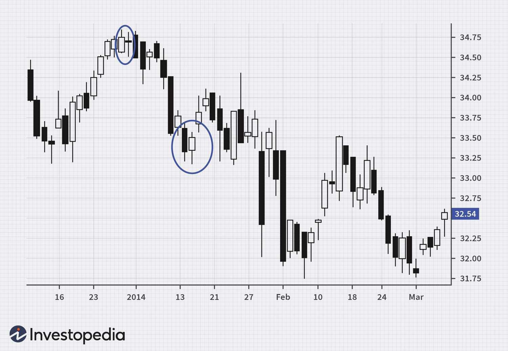

Understanding the complexities of the trading world is essential for both novice and seasoned investors. Successful trading requires a keen grasp of market dynamics and the strategic nuance to navigate through diverse financial instruments. This article examines three prominent trading strategies: tweezers, trend trading, and algorithmic trading. Each strategy caters to unique trading objectives and offers distinct advantages, enabling traders to tailor their approach according to individual preferences and market conditions.

Tweezers trading strategy focuses on discerning specific price action patterns, known for signaling potential market reversals. By identifying tweezers tops and bottoms on price charts, traders can anticipate shifts in market momentum, thereby creating opportunities for strategic entry and exit points. Mastering this strategy involves keen observation and interpretation of market sentiment portrayed on price charts.



Trend trading, on the other hand, capitalizes on the momentum of established market trends. Traders employing this strategy enter the market with an intention to profit from sustained directional movements, maintaining positions until a trend reversal is imminent. This approach necessitates a disciplined patience in analyzing trend indicators and following technical analysis tools such as moving averages and trend lines to gauge market directions accurately.

Algorithmic trading represents the technological evolution in trading strategies, employing sophisticated computer algorithms to facilitate trade execution. This method leverages computational power to process large data sets and execute trades with unparalleled speed and precision, often founded upon strategies such as market making, arbitrage, and trend following. While algos optimize efficiency, their development requires a solid technical understanding and rigorous testing.

Whether you're aiming for quick gains or long-term investments, understanding these strategies is crucial. Learning how to effectively employ them, comprehend their benefits, and seamlessly integrate them into a broader trading plan can significantly enhance your trading acumen, leading to more informed investment decisions.

## Table of Contents

## Exploring Tweezers Trading Strategies

Tweezers trading strategy is a method that relies on price action to identify potential reversal patterns in financial markets. These patterns, known as tweezers tops and bottoms, play a significant role in forecasting possible market reversals. The tweezers pattern is typically observed over two consecutive trading sessions, where almost equal highs or lows suggest a shift in market momentum.

### Tweezers Tops and Bottoms

Tweezer tops form during an uptrend, indicating a potential bearish reversal. They are characterized by two or more candlesticks showing similar highs, signaling resistance and a likely price decline. Conversely, tweezers bottoms emerge in a downtrend and indicate a potential bullish reversal. In this scenario, two or more candlesticks display similar lows, suggesting support and a possible price increase.

#### Implementation of Tweezers Strategy

Successful implementation of the tweezers strategy requires a keen eye for chart patterns and an understanding of market sentiment. Key steps include:

1. **Pattern Recognition**: Identify potential tweezer patterns on the price chart. Use historical data to familiarize yourself with the appearance of tweezers tops and bottoms. An example of such a pattern recognition process in Python may involve using libraries like `pandas` for data manipulation and `matplotlib` for visualizing candlestick patterns.

```python
import pandas as pd
import matplotlib.pyplot as plt

def find_tweezers(df):
    tweezers_tops = []
    tweezers_bottoms = []

    for i in range(1, len(df) - 1):
        if df['High'][i] == df['High'][i+1]:
            tweezers_tops.append(i)
        if df['Low'][i] == df['Low'][i+1]:
            tweezers_bottoms.append(i)

    return tweezers_tops, tweezers_bottoms

# Sample usage with hypothetical data
# df = pd.read_csv('market_data.csv')
# tops, bottoms = find_tweezers(df)
```

2. **Market Sentiment Analysis**: Understand the underlying market sentiment. This involves assessing factors such as economic indicators, geopolitical events, and broader market trends that might influence price action.

3. **Confirmation and Execution**: Seek confirmation from additional technical indicators before executing a trade based on tweezers patterns. These indicators may include moving averages, RSI, or MACD to validate potential reversals.

### Challenges and Considerations

While tweezers trading can be a useful tool for identifying market reversals, traders must be aware of potential false signals. As such, combining tweezers patterns with other technical analysis tools and maintaining a disciplined approach is essential to mitigate risks.

By effectively identifying and acting upon these patterns, traders can potentially improve their trading outcomes. However, the strategy's success largely depends on the trader's skill in interpreting chart patterns and gauging market sentiment accurately.

## The Fundamentals of Trend Trading

Trend trading is a widely employed strategy in financial markets, centered on identifying and exploiting trends to generate profits. The fundamental premise behind trend trading is that markets exhibit tendencies to move in sustained directions, either upward (bullish) or downward (bearish). This strategy seeks to capitalize on these movements by entering trades aligned with the prevailing market trend and maintaining these positions until an indication of reversal emerges.

A major component of successful trend trading is the identification of an established trend. Traders often turn to technical tools and indicators such as moving averages, trend lines, and the Average Directional Index (ADX) to discern the current market direction. Moving averages, for instance, help smooth out price fluctuations and reveal the underlying trend by calculating the average price over a specific time period. Commonly used moving averages include the simple moving average (SMA) and the exponential moving average (EMA).

Trend lines act as visual cues on a price chart, connecting consecutive highs or lows. An upward-sloping trend line, formed by connecting a series of higher lows, indicates an uptrend, while a downward-sloping line, formed by connecting lower highs, signals a downtrend. The ADX, on the other hand, is a more sophisticated tool that quantifies the strength of the trend, allowing traders to determine whether it is worth entering or exiting the market.

Discipline and patience are paramount when employing the trend trading strategy, as premature exits can undermine potential gains. Historically, trends can extend longer than anticipated, and traders must resist the impulse to react to minor counter-trend movements. Additionally, the utilization of a disciplined approach aids in adhering to well-defined entry and [exit](/wiki/exit-strategy) criteria, which are essential components of risk management in trend trading.

Certain tactics can enhance the effectiveness of trend trading. One approach is the "[buy the dip](/wiki/buy-the-dip-strategy), sell the rally" tactic, where traders look to enter long positions during temporary price pullbacks in an uptrend or short positions during brief rallies in a downtrend. This method requires identifying suitable entry points using support and resistance levels alongside technical indicators. Furthermore, the utilization of trailing stop-loss orders helps protect profits as the trend progresses, by shifting the stop price along with the trade's direction.

Effective risk management is vital to safeguarding capital in trend trading. This involves determining an appropriate position size based on the trader's risk tolerance and setting stop-loss orders to cap potential losses. Diversification across multiple securities and sectors can also mitigate exposure to any single market anomaly.

In conclusion, trend trading is an approach that exploits the [momentum](/wiki/momentum) of market movements, requiring traders to integrate technical analysis with prudent risk management. By recognizing trends and maintaining disciplined trading behaviors, practitioners of trend trading can navigate the complexities of financial markets and accomplish their trading objectives.

## Harnessing the Power of Algorithmic Trading

Algorithmic trading, commonly known as algo trading, utilizes advanced computer software to execute trades based on predefined instructions. These algorithms are designed to analyze vast amounts of financial data, identify trading opportunities, and execute trades at a speed and precision that surpass human capabilities. This approach optimizes both efficiency and accuracy, allowing traders to capitalize on minute market fluctuations that might otherwise go unnoticed.

### Mechanisms of Algorithmic Trading

The core advantage of [algorithmic trading](/wiki/algorithmic-trading) lies in its ability to process extensive datasets rapidly. Algorithms can analyze historical and real-time data to identify patterns and make trading decisions within milliseconds. This capability is particularly beneficial in high-frequency trading ([HFT](/wiki/high-frequency-trading-strategies)), where success often depends on executing orders faster than competitors. 

Python is often preferred for developing trading algorithms due to its simplicity and the availability of extensive libraries such as NumPy for numerical computations, pandas for data manipulation, and scikit-learn for [machine learning](/wiki/machine-learning). A basic example of a trading algorithm script might look like this:

```python
import pandas as pd
import numpy as np

# Sample function to generate buy/sell signals
def simple_moving_average(data, short_window=40, long_window=100):
    signals = pd.DataFrame(index=data.index)
    signals['signal'] = 0.0

    # Create short simple moving average
    signals['short_mavg'] = data['Close'].rolling(window=short_window, min_periods=1).mean()

    # Create long simple moving average
    signals['long_mavg'] = data['Close'].rolling(window=long_window, min_periods=1).mean()

    # Generate signals
    signals['signal'][short_window:] = np.where(signals['short_mavg'][short_window:] 
                                                > signals['long_mavg'][short_window:], 1.0, 0.0)

    # Generate trading orders
    signals['positions'] = signals['signal'].diff()

    return signals
```

### Popular Algorithmic Trading Strategies

1. **Market Making:** This approach involves placing limit orders on both sides of the order book (buy and sell) to capture the bid-ask spread. By providing liquidity to the market, market makers aim to secure small but consistent profits.

2. **Arbitrage:** Arbitrage strategies exploit price discrepancies of the same financial instrument in different markets. Algorithms can swiftly detect minute differences and execute trades to lock in risk-free profits.

3. **Trend Following:** These algorithms identify and exploit established market trends. By analyzing indicators such as moving averages and momentum oscillators, trend following algorithms aim to enter trades in the direction of the prevailing market momentum.

### Algorithm Development and Backtesting

Developing effective trading algorithms requires careful design and rigorous testing. Backtesting is a critical phase in this process, involving the simulation of an algorithm's trading on historical data to assess its performance. The objective is to ensure the reliability and profitability of the algorithm before employing it in live markets. 

```python
# Example backtesting routine
def backtest_algorithm(data, signals):
    initial_capital = float(100000.0)
    positions = pd.DataFrame(index=signals.index).fillna(0.0)

    # Simulating buying/selling of stock
    positions['Shares'] = 100 * signals['positions']   # Buying 100 shares per trading signal

    portfolio = positions.multiply(data['Close'], axis=0)

    # Initial capital + positions value (cumulative)
    pos_diff = positions.diff()
    portfolio['holdings'] = positions.multiply(data['Close'], axis=0).sum(axis=1)
    portfolio['cash'] = initial_capital - (pos_diff.multiply(data['Close'], axis=0).sum(axis=1)).cumsum()
    portfolio['total'] = portfolio['cash'] + portfolio['holdings']
    portfolio['returns'] = portfolio['total'].pct_change()

    return portfolio
```

### Challenges in Algorithmic Trading

Despite its advantages, algorithmic trading is not without challenges. Flash crashes, which are rapid, deep market declines, have been partially attributed to algorithmic trading. They highlight the potential for algorithms to contribute to market instability if not properly managed. Moreover, maintaining the effectiveness of trading algorithms requires constant updates and refinements to adapt to evolving market conditions.

The development and deployment of trading algorithms pose technical challenges as well. Traders must ensure robust and reliable algorithms are developed, incorporating sophisticated error-handling protocols to mitigate risks associated with automated execution. 

### Conclusion

Algorithmic trading represents a significant advancement in the trading field, offering precision and speed that manual trading cannot match. Its integration into a trading plan requires careful consideration of strategy, rigorous [backtesting](/wiki/backtesting), and consistent monitoring to adapt to the fluid nature of financial markets.

## Comparing the Strategies: Which to Choose?

Choosing an appropriate trading strategy involves careful consideration of your individual trading style, financial goals, and risk tolerance. Each of the strategies—tweezers, trend trading, and algorithmic trading—presents unique characteristics and caters to different trading objectives.

Tweezers trading is particularly suited for traders who favor short-term engagements and possess a keen eye for chart patterns and market psychology. This strategy hinges on identifying reversal patterns known as tweezers tops and bottoms. When these patterns appear, they can signal potential market reversals. Traders who excel in tweezers trading often rely on quick decision-making and an intuitive grasp of market sentiment to capitalize on these fleeting movements.

Trend trading, on the other hand, is aligned with traders aiming to exploit longer-term market movements by focusing on established trends. The essence of trend trading is to identify a market direction and "ride the trend" until indications of a reversal manifest. This approach requires patience and a disciplined methodology to avoid premature exits. Tools such as moving averages and trend lines are instrumental in determining the prevailing market trend. Success in trend trading largely depends on consistently monitoring these indicators and managing risk effectively.

Algorithmic trading stands out as a favorite among those who have a technical background and seek to automate trading activities. By utilizing computer algorithms, traders can process extensive datasets and execute trades at remarkable speeds, enhancing both efficiency and accuracy. The development or selection of robust algorithms is crucial, with strategies like [market making](/wiki/market-making), [arbitrage](/wiki/arbitrage), and [trend following](/wiki/trend-following) standing out as popular choices within this domain. Backtesting is an essential step to ensure the reliability of these algorithms. However, traders should be mindful of potential challenges such as flash crashes and the necessity for ongoing algorithm updates.

In determining the most suitable strategy, traders should reflect on their trading aspirations, available resources, and risk management preferences. Tweezers trading is ideal for those who thrive in dynamic, short-term environments driven by chart analysis. Conversely, trend trading appeals to those interested in capitalizing on prolonged market trends with the aid of technical indicators. For individuals who possess a strong understanding of data analytics and programming, algorithmic trading provides a pathway to automate trades and leverage data-driven insights.

Integrating these strategies into a diversified portfolio can complement your overall trading plan. Whether you lean towards a hands-on approach with tweezers and trend trading or prefer the automated nature of algorithmic trading, aligning your choice with your trading objectives will enhance your potential for success.

## Conclusion

Trading strategies such as tweezers, trend trading, and algorithmic trading each offer unique opportunities in the financial markets. Understanding these strategies in depth can significantly enhance your ability to make informed and strategic trading decisions. By carefully analyzing the nuances of each strategy, you can tailor your approach to align seamlessly with your personal trading goals.

Effectively managing risks and improving profitability involves selecting a strategy that fits your risk tolerance and desired outcomes. For instance, if you're drawn to quick, short-term profits, you might consider the tweezers trading strategy, which relies on analyzing price patterns for potential reversals. Alternatively, if you prefer to benefit from longer-term market movements, trend trading may suit your interests, providing a structured way to capitalize on prevailing market directions. For those with a technical background who are interested in automation, algorithmic trading offers the potential to leverage data analytics for executing trades efficiently.

The dynamic nature of the trading environment requires continuous learning and adaptation. As market conditions shift, staying on top of emerging trends and technological advancements will be crucial to maintaining a competitive edge. Regularly evaluating and refining your trading strategy can help you respond to market developments effectively.

Throughout this ongoing learning process, it's important to remember that these strategies are not just theoretical concepts but practical tools that, when integrated into your trading activities, can significantly bolster your investment arsenal. As you refine your skills and deepen your understanding of market dynamics, these strategies can help you navigate the complexities of trading with greater confidence and success.

## References & Further Reading

[1]: Nison, S. (1991). ["Japanese Candlestick Charting Techniques: A Contemporary Guide to the Ancient Investment Techniques of the Far East."](https://archive.org/details/japanesecandlest0000niso) Penguin.

[2]: Murphy, J. J. (1999). ["Technical Analysis of the Financial Markets: A Comprehensive Guide to Trading Methods and Applications."](https://archive.org/details/technicalanalysi0000murp) New York Institute of Finance.

[3]: Jagerson, J., & Hansen, S. (2011). ["Profiting with Forex: The Most Effective Tools and Techniques for Trading Currencies."](https://www.amazon.com/Profiting-Forex-Effective-Techniques-Currencies/dp/0071464654) McGraw-Hill.

[4]: Chan, E. P. (2008). ["Quantitative Trading: How to Build Your Own Algorithmic Trading Business."](https://github.com/ftvision/quant_trading_echan_book) Wiley.

[5]: Narang, R. (2009). ["Inside the Black Box: The Simple Truth About Quantitative Trading."](https://onlinelibrary.wiley.com/doi/book/10.1002/9781118267738) Wiley.

[6]: Korajczyk, R. A., & Sadka, R. (2004). ["Are Momentum Strategies Profitable? Evidence and Implications for Hedge Funds."](https://onlinelibrary.wiley.com/doi/abs/10.1111/j.1540-6261.2004.00656.x) The Journal of Finance, 59(5), 1985-2015.

[7]: Hirschey, N. H., & Titman, S. (2007). ["Momentum Profits and Investment Speed of Adjustment."](https://www.researchgate.net/publication/362451689_Momentum_what_do_we_know_30_years_after_Jegadeesh_and_Titman's_seminal_paper) Social Science Research Network.

[8]: Jansen, S. (2020). ["Machine Learning for Algorithmic Trading: Predictive models to extract signals from market and alternative data for systematic trading strategies with Python."](https://www.amazon.com/Machine-Learning-Algorithmic-Trading-alternative/dp/1839217715) Packt Publishing.

[9]: Lopez de Prado, M. (2018). ["Advances in Financial Machine Learning."](https://www.amazon.com/Advances-Financial-Machine-Learning-Marcos/dp/1119482089) Wiley.