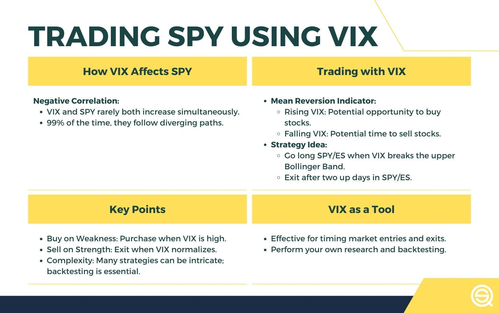

## Table of Contents

## What is the VIX and how does it relate to market volatility?

The VIX, or Volatility Index, is a measure that shows how much the stock market expects prices to change in the future. It's often called the "fear gauge" because it goes up when investors are worried and think the market will move a lot, and it goes down when they feel calm and expect less movement. The VIX is calculated using the prices of options on the S&P 500, which are financial tools that people buy to protect themselves from big price swings.

When the VIX is high, it means that people expect big changes in the stock market, which usually happens during times of uncertainty or bad news. For example, during a financial crisis or a big political event, the VIX might go up a lot. On the other hand, when the VIX is low, it suggests that the market is expected to be stable with smaller price movements. This can happen during good economic times when everything seems to be going well. So, the VIX is a useful tool for investors to understand how nervous or confident the market feels about the future.

## How can the VIX be used as an indicator for trading SPY and the S&P 500?

The VIX can be used as an indicator for trading SPY, which is an ETF that tracks the S&P 500, by helping traders understand the market's expected volatility. When the VIX is high, it means that the market expects big price swings in the S&P 500. This might make traders more cautious, as they might expect more risk and uncertainty. Some traders might see a high VIX as a sign to buy options for protection or to bet on a market drop. On the other hand, if the VIX is low, it suggests that the market expects smaller price movements, which could mean a calmer and more stable period for the S&P 500. Traders might see this as a good time to invest in SPY, expecting steady growth.

Another way to use the VIX is to look for sudden changes in its level. If the VIX suddenly spikes, it could signal that something unexpected has happened, and the market might be about to move a lot. This could be a signal for traders to adjust their positions in SPY quickly. For example, they might sell some of their SPY shares to avoid potential losses or buy more options to protect their investments. Conversely, if the VIX suddenly drops, it might mean that a period of high uncertainty is over, and the market might be returning to normal. This could be a good time for traders to increase their exposure to SPY, expecting the market to stabilize and possibly grow.

## What are the basic steps to start trading SPY using VIX signals?

To start trading SPY using VIX signals, you first need to understand how the VIX works. The VIX shows how much people expect the S&P 500 to move in the future. When the VIX is high, it means people are worried and expect big changes in the market. When it's low, they think the market will be calm. You can look at the VIX every day to see if it's going up or down. If it's going up a lot, it might be a good time to be careful with your SPY trades. If it's going down, you might feel more confident to buy SPY.

Once you understand the VIX, you can use it to make decisions about trading SPY. For example, if the VIX suddenly goes up a lot, you might want to sell some of your SPY shares or buy options to protect your investments. This is because a high VIX suggests the market might be about to have big swings. On the other hand, if the VIX is low and staying low, you might decide to buy more SPY because the market seems stable. Remember, the VIX is just one tool, and it's important to use it along with other information to make smart trading choices.

## How does the VIX influence investor sentiment and market direction?

The VIX, or Volatility Index, is like a thermometer for how nervous or calm investors feel about the stock market. When the VIX goes up, it means people are worried and expect the market to move a lot. This high VIX can make investors feel scared, so they might sell their stocks to avoid losing money. On the other hand, when the VIX is low, it shows that people are feeling more relaxed and think the market will be stable. This can make investors feel more confident and willing to buy stocks.

The VIX can also give clues about which way the market might go. If the VIX suddenly jumps up a lot, it might mean something big and unexpected has happened, and the market could go down because people are selling their stocks. But if the VIX starts to go down after being high for a while, it might mean that the scary times are over, and the market could start to go up again as people feel safer and start buying stocks. So, by watching the VIX, investors can get a sense of how other people are feeling and what might happen next in the market.

## What are the key technical analysis tools used with VIX to predict SPY movements?

When trying to predict how SPY might move, traders often use technical analysis tools along with the VIX. One common tool is the moving average. Traders look at the VIX's moving average to see if it's going up or down over time. If the VIX's moving average is going up, it might mean that the market is getting more nervous, and SPY could go down. If the moving average is going down, it might mean the market is calming down, and SPY could go up. Another tool is the Relative Strength Index (RSI), which shows if the VIX is overbought or oversold. If the VIX's RSI is very high, it might mean the market is too scared, and SPY might soon go up. If the RSI is very low, it might mean the market is too calm, and SPY might go down.

Another important tool is the Bollinger Bands, which show how much the VIX is moving around its average. If the VIX is touching the upper Bollinger Band, it means it's very high and the market might be too worried, so SPY could go up soon. If the VIX is touching the lower Bollinger Band, it means it's very low and the market might be too calm, so SPY could go down. Traders also use chart patterns, like head and shoulders or double tops and bottoms, to see if the VIX is about to change direction. If these patterns show up on the VIX chart, it can give traders a hint about what SPY might do next. By combining these tools with the VIX, traders can get a better idea of how SPY might move.

## Can you explain the concept of 'fear index' in relation to VIX and its impact on S&P 500 trading?

The VIX is often called the 'fear index' because it measures how scared or worried people are about the stock market. It does this by looking at how much people are willing to pay for options on the S&P 500. When people are really worried, they pay more for these options to protect their investments, which makes the VIX go up. On the other hand, when people are feeling calm and not worried, they don't pay as much for these options, and the VIX goes down. So, the VIX is like a thermometer that shows how much fear or calm is in the market.

When the VIX is high, it means a lot of people are scared and expect the S&P 500 to move a lot, maybe even go down. This can make traders nervous, and they might decide to sell their S&P 500 shares or buy options to protect themselves. But when the VIX is low, it means people are feeling more relaxed and think the S&P 500 will be stable or go up. This can make traders feel more confident, and they might decide to buy more S&P 500 shares. So, by watching the VIX, traders can get a sense of how other people are feeling and make better decisions about trading the S&P 500.

## How do historical VIX levels correlate with S&P 500 performance?

Historical VIX levels can give us clues about how the S&P 500 has performed in the past. When the VIX is high, it usually means people are scared and expect the market to move a lot. This often happens when the S&P 500 goes down because people are selling their stocks to avoid losing money. For example, during big events like the 2008 financial crisis, the VIX went up a lot, and the S&P 500 dropped a lot too. So, a high VIX can be a warning sign that the S&P 500 might go down.

On the other hand, when the VIX is low, it means people are feeling more relaxed and think the market will be stable or go up. This can happen when the S&P 500 is doing well and people are buying more stocks. For instance, during good economic times, the VIX might stay low, and the S&P 500 might keep going up. So, a low VIX can be a sign that the S&P 500 might keep doing well or at least stay stable. By looking at how the VIX has moved in the past, traders can get a better idea of what might happen to the S&P 500 in the future.

## What are some common strategies for trading SPY based on VIX spikes and drops?

When the VIX suddenly goes up a lot, it means people are getting scared and expect big changes in the market. One common strategy for trading SPY during a VIX spike is to sell some of your SPY shares. This can help you avoid losing money if the S&P 500 goes down because of all the fear. Another strategy is to buy options that will make money if the S&P 500 goes down. This can protect your investments and even make you some money if the market drops. Some traders also see a VIX spike as a chance to buy SPY at a lower price later, expecting that the fear will go away and the market will go back up.

When the VIX goes down a lot, it means people are feeling more relaxed and expect the market to be stable or go up. A common strategy during a VIX drop is to buy more SPY shares. This can be a good time to invest because the market seems calm and might keep going up. Another strategy is to sell options that you think won't be worth much if the S&P 500 stays stable or goes up. This can make you some extra money. Some traders also use a VIX drop as a sign to hold onto their SPY shares longer, expecting the good times to continue and the market to keep growing.

## How can options on the VIX be used to hedge positions in SPY and the S&P 500?

Options on the VIX can be a helpful tool for people who own SPY or S&P 500 shares and want to protect their investments. When the VIX goes up, it means the market is getting scared and might go down. By buying options on the VIX, like VIX call options, you can make money if the VIX goes up a lot. This can help cover any losses you might have if the S&P 500 goes down because of all the fear in the market. So, if you own SPY shares and are worried about a big drop, you can use VIX options to feel safer.

Another way to use VIX options is to sell them when the VIX is really high and you think it will go back down. If you think the market's fear is too much and will calm down soon, you can sell VIX call options. If the VIX does go down, the options you sold will lose value, and you can keep the money you got from selling them. This can be a good way to make some extra money while you're waiting for the S&P 500 to go back up. So, by using VIX options smartly, you can protect your SPY and S&P 500 investments and maybe even make some extra money.

## What are the limitations and risks of using VIX as a trading signal for SPY?

Using the VIX as a trading signal for SPY can be tricky because it's not always right. The VIX shows how scared or calm people are about the market, but it doesn't always mean the S&P 500 will go up or down right away. Sometimes, the VIX can be high because of a big event, but the S&P 500 might not drop as much as people expect. Other times, the VIX can be low, but the market can still have big swings. So, relying only on the VIX can lead to bad trades if you don't look at other things too.

Another risk is that the VIX can be hard to predict. It can change a lot and very quickly, which can make it hard to know when to buy or sell SPY. If you trade based on the VIX and it suddenly changes direction, you could lose money. Also, using options on the VIX to protect your SPY investments can be expensive. Options can cost a lot, and if the VIX doesn't move the way you expect, you might lose the money you spent on them. So, it's important to use the VIX carefully and with other information to make smart trading choices.

## How do professional traders integrate VIX data into algorithmic trading models for SPY?

Professional traders use VIX data in their computer programs, called algorithmic trading models, to help them make smart choices about buying and selling SPY. They look at how the VIX is moving and use that information to decide when to trade. For example, if the VIX goes up a lot, their program might tell them to sell some SPY shares or buy options to protect their investments. They also use other information, like how the S&P 500 is doing and what's happening in the news, to make their trading decisions. By combining all this information, their models can make better guesses about what the market might do next.

These traders also use special math formulas to figure out how the VIX and SPY are connected. They might look at how the VIX has moved in the past compared to the S&P 500 and use that to predict what might happen in the future. Their programs can run these calculations very quickly and trade automatically based on the results. But they know that the VIX isn't perfect, so they always keep an eye on their trades and make sure their models are working well. By using the VIX smartly and with other tools, they can try to make money even when the market is moving a lot.

## What advanced statistical methods can be applied to analyze the relationship between VIX and S&P 500 for more precise trading?

To understand how the VIX and S&P 500 are connected in a more detailed way, professional traders use fancy math called advanced statistical methods. One popular method is called regression analysis. This is where traders use past data to see how changes in the VIX affect the S&P 500. They can figure out if a big jump in the VIX usually means the S&P 500 will go down and by how much. Another method is called time series analysis, which looks at how the VIX and S&P 500 change over time. This can help traders see if there are patterns in how the VIX moves before the S&P 500 does something big.

Another useful method is called volatility modeling, which helps traders predict how much the S&P 500 might move based on the VIX. They use models like GARCH (Generalized Autoregressive Conditional Heteroskedasticity) to guess future volatility. This can be really helpful for deciding when to buy or sell SPY. Traders also use machine learning to find hidden patterns between the VIX and S&P 500 that might be hard to see with just regular math. By combining all these methods, traders can make more precise guesses about what the market might do next and make smarter trading choices.

## What are the results of backtesting VIX and SPY strategies?

Backtesting is a crucial process in [algorithmic trading](/wiki/algorithmic-trading), enabling traders to evaluate the effectiveness of their strategies using historical data. When dealing with VIX and SPY, backtesting provides insights into how these instruments perform and interact under various market conditions.

The primary step in backtesting involves the collection of historical data for both VIX and SPY. This data serves as the foundation for simulating trades and analyzing outcomes. Traders usually employ software that can handle large datasets and perform computations efficiently.

Key tools employed during backtesting include moving averages, standard deviations, and statistical analysis. Moving averages, calculated over a specific period, help in identifying trends and mean-reversion signals. For instance, a simple moving average (SMA) can be computed using:

$$

SMA(t) = \frac{1}{n} \sum_{i=t-n+1}^{t} P_i 
$$

where $P_i$ is the price at time $i$, and $n$ is the number of periods.

Standard deviation is another vital tool used to quantify the amount of variation or [dispersion](/wiki/dispersion-trading) in a set of prices. In the context of VIX and SPY, traders leverage standard deviation to understand the volatility of returns, guiding entry and exit points.

During the simulation, traders apply these tools to develop algorithms that can predict potential market movements and optimize trading signals. Each strategy is tested over an extensive period to ensure it accounts for various market cycles, enhancing its robustness.

Successful backtesting provides traders with confidence in their strategies. A well-developed backtesting framework will yield metrics such as the Sharpe ratio, a measure of risk-adjusted return:

$$

\text{Sharpe Ratio} = \frac{E[R_p - R_f]}{\sigma_p} 
$$

where $E[R_p - R_f]$ is the expected return of the portfolio minus the risk-free rate, and $\sigma_p$ is the standard deviation of the portfolio's excess return.

Python is a popular language for backtesting due to its comprehensive set of libraries for data analysis. A basic Python backtesting script might look like this:

```python
import pandas as pd
import numpy as np

# Fetch historical data for VIX and SPY
vix_data = pd.read_csv('vix_data.csv')
spy_data = pd.read_csv('spy_data.csv')

# Calculate moving averages
vix_data['SMA'] = vix_data['Close'].rolling(window=20).mean()

# Simulate a basic trading strategy
def backtest_strategy(data):
    signals = pd.DataFrame(index=data.index)
    signals['signal'] = 0.0

    # Generate signals
    signals['signal'][20:] = np.where(data['Close'][20:] > data['SMA'][20:], 1.0, 0.0)

    # Positions
    signals['positions'] = signals['signal'].diff()

    return signals

signals = backtest_strategy(vix_data)

# Evaluate the strategy
strategy_returns = (spy_data['Close'].pct_change() * signals['signal'].shift(1)).cumsum()
sharpe_ratio = strategy_returns.mean() / strategy_returns.std()

print(f'Sharpe Ratio: {sharpe_ratio}')
```

This script is a simplified example, focusing on applying a moving average strategy. In practice, traders would refine their strategies to account for diverse factors and environments.

Backtesting helps in uncovering strengths and weaknesses within a strategy, providing a level of assurance before deployment. As markets evolve, continuous backtesting and strategy adaptation remain integral to successful algorithmic trading with VIX and SPY.

## References & Further Reading

[1]: Whaley, R. E. (2009). ["Understanding the VIX"](https://www.researchgate.net/publication/277429711_Understanding_the_VIX). The Journal of Portfolio Management.

[2]: Bali, T. G., & Zhou, H. (2006). ["The Predictive Power of the VIX Index for Stock Market Returns."](https://books.google.com/books/about/Empirical_Asset_Pricing.html?id=svKlCgAAQBAJ) The Journal of Futures Markets, 26(3), 217-278.

[3]: ["Mean Reversion Trading Systems: Practical Methods for Swing Trading"](https://www.amazon.com/Reversion-Trading-Systems-Howard-Bandy/dp/0979183847) by Howard B. Bandy

[4]: CBOE. ["CBOE Volatility Index (VIX) White Paper."](https://cdn.cboe.com/api/global/us_indices/governance/Volatility_Index_Methodology_Cboe_Volatility_Index.pdf)

[5]: ["Quantitative Technical Analysis: An integrated approach to trading system development and trading management"](https://www.amazon.com/Quantitative-Technical-Analysis-integrated-development/dp/0979183855) by Dr. Howard B. Bandy