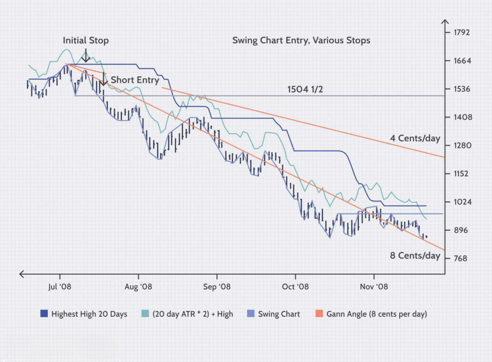

## Table of Contents

## What is a volatility stop and how does it work?

A volatility stop is a type of stop-loss order used in trading to manage risk. It helps traders exit a trade when the price of an asset becomes too volatile or moves against their position more than they are comfortable with. Instead of setting a fixed price to sell, a volatility stop uses the asset's historical price movements to determine when to exit the trade. This means the stop level adjusts based on how much the price typically fluctuates, making it more dynamic than a traditional stop-loss.

To set up a volatility stop, traders usually look at the average true range (ATR) of the asset, which measures how much the price has moved over a certain period. If the price moves beyond a multiple of the ATR from the entry point, the volatility stop triggers, and the trade is closed. This method can help protect profits and limit losses by reacting to changes in market conditions. It's particularly useful in markets that can experience sudden, sharp movements, allowing traders to adapt their risk management strategies to the current volatility of the market.

## How can volatility stops help in managing risk in trading?

Volatility stops help manage risk in trading by allowing traders to set stop-loss orders that adjust based on how much the price of an asset typically moves. Instead of using a fixed price to exit a trade, a volatility stop uses the average true range (ATR) to decide when it's time to sell. This means if the price moves too far or too fast against the trader's position, the stop will trigger and close the trade, helping to limit losses.

This approach is especially useful in markets that can have big, sudden price swings. By using a volatility stop, traders can better protect their profits and manage their risk. The stop adjusts to the current market conditions, so it's more flexible than a regular stop-loss. This can help traders stay in trades longer when the market is calm, but quickly [exit](/wiki/exit-strategy) when things get too risky.

## What are the key differences between volatility stops and traditional stop losses?

Volatility stops and traditional stop losses are both used to manage risk in trading, but they work differently. A traditional stop loss is set at a fixed price level. If the price of the asset reaches this level, the trade is automatically closed. This means the trader decides on the stop price before entering the trade and it does not change, no matter how the market moves.

On the other hand, a volatility stop uses the average true range (ATR) to set the stop level. The ATR measures how much the price typically moves over a period of time. If the price moves beyond a multiple of the ATR from the entry point, the volatility stop triggers. This means the stop level can change based on the market's current volatility, making it more flexible than a traditional stop loss.

Using a volatility stop can help traders stay in a trade longer during calm market conditions, but it will quickly close the trade if the market becomes too volatile. This can be helpful in markets that have sudden price swings. A traditional stop loss, while simpler to set up, might close a trade too early in a volatile market or too late if the market moves too fast.

## Can you explain the calculation methods for setting volatility stops?

To set a volatility stop, traders usually use the average true range (ATR) to figure out how much the price of an asset typically moves. The ATR is calculated over a certain number of periods, like 14 days. It measures the difference between the current high and low prices, and also takes into account any gaps from the previous close to the current open. Once the ATR is calculated, traders multiply it by a number they choose, like 2 or 3, to set the stop level. This number is called the "multiplier" and it depends on how much risk the trader wants to take.

For example, if the ATR of a stock is $1 and the trader chooses a multiplier of 2, the stop would be set $2 away from the entry price. If the trader bought the stock at $50, the stop would be at $48 if they are long, or $52 if they are short. The stop level can move as the ATR changes, keeping the distance from the current price at two times the ATR. This way, the stop adjusts to the market's volatility, helping the trader stay in the trade during calm periods but quickly exit if the market gets too wild.

## How do volatility stops adapt to different market conditions?

Volatility stops adapt to different market conditions by using the average true range (ATR) to set the stop level. The ATR measures how much the price of an asset typically moves over a period of time. If the market is calm and the price moves less, the ATR will be smaller, and the stop level will be closer to the current price. This allows traders to stay in their trades longer when the market is not moving much.

When the market gets more volatile and the price starts to move a lot, the ATR will get bigger. This means the stop level will move farther away from the current price. If the price moves beyond the new stop level, the trade will close. This helps traders quickly exit their trades when the market gets too wild, protecting their profits and limiting their losses.

## What are the best practices for implementing volatility stops in a trading strategy?

When implementing volatility stops in a trading strategy, it's important to first understand the asset you are trading. Different assets have different levels of volatility, so you should calculate the average true range (ATR) over a period that makes sense for the asset. For example, if you're trading stocks, a 14-day period is common, but for more volatile assets like cryptocurrencies, you might want to use a shorter period. Once you have the ATR, choose a multiplier that fits your risk tolerance. A higher multiplier means a wider stop, which can keep you in the trade longer but also means bigger potential losses if the market moves against you.

After setting your volatility stop, keep an eye on market conditions. The stop will adjust as the ATR changes, so you need to stay aware of how the market is behaving. If the market gets very volatile, your stop might move farther away from your entry price, which could lead to bigger losses if the price keeps moving against you. On the other hand, if the market is calm, your stop will be closer, letting you stay in the trade longer. Always be ready to adjust your strategy if the market changes a lot, and remember that using a volatility stop is just one part of managing risk in trading.

## How can volatility stops be used to enhance profitability in various asset classes?

Volatility stops can help make trading more profitable by keeping you in trades longer when the market is calm, but quickly getting you out when it gets too wild. For example, if you're trading stocks, a volatility stop can let you stay in a position as long as the stock's price isn't moving too much. But if the stock starts to swing a lot, the stop will kick in and close your trade, helping you avoid big losses. This can lead to more profits because you can hold onto winners longer and cut losers short.

This approach works well with different types of assets, like stocks, [forex](/wiki/forex-system), and even cryptocurrencies. Each asset has its own way of moving, so you need to set your volatility stop based on how much that asset typically moves. For stocks, you might use a 14-day average true range (ATR), but for something more volatile like crypto, you might use a shorter period. By adjusting your stop to match the asset's volatility, you can better manage your risk and potentially increase your profits across different markets.

## What are the common pitfalls to avoid when using volatility stops?

One common pitfall when using volatility stops is setting the multiplier too high or too low. If you set it too high, your stop will be too far from your entry price, which might let you stay in a trade longer but could also lead to bigger losses if the market moves against you. On the other hand, if you set it too low, your stop might be too close, causing you to get out of trades too early and miss out on potential profits.

Another mistake is not adjusting the volatility stop as market conditions change. Markets can go from calm to wild quickly, so you need to keep an eye on how the average true range (ATR) is changing. If you don't update your stop, you might find yourself stuck in a trade that's getting too risky or out of a trade that could have been profitable if you had stayed in a bit longer.

## How do volatility stops integrate with other risk management techniques?

Volatility stops work well with other ways to manage risk in trading. For example, you can use them along with position sizing, which means deciding how much of your money to put into each trade. If you know your stop level from the volatility stop, you can figure out how big your position should be to keep your risk at a level you're comfortable with. This can help you avoid losing too much money on any one trade.

Another way to use volatility stops is with trailing stops. A trailing stop moves up as the price goes up, locking in profits. You can set your volatility stop to move with the price, but it will also adjust based on how much the price is moving around. This way, you can stay in a trade longer if the market is calm, but quickly get out if it gets too wild. By combining these methods, you can better manage your risk and potentially make more money from your trades.

## Can you provide examples of successful trades using volatility stops?

Let's say you're trading a stock that usually moves $1 a day, so you set your volatility stop at $2 away from your entry price. You buy the stock at $50, so your stop is at $48. The stock goes up to $55 over the next few weeks, and the market stays calm. Because your stop is based on the stock's usual movement, it stays at $2 away from the current price, now at $53. You get to keep your profits because the stop didn't kick in too early. But then the stock suddenly drops to $52 due to some bad news. Your stop triggers at $53, and you sell, locking in a profit of $3 per share. Without the volatility stop, you might have held on longer and lost some of those profits.

In another example, you're trading a [cryptocurrency](/wiki/cryptocurrency) that's known for big price swings. You set your stop at three times the average true range (ATR), which is $300 for this crypto. You buy at $10,000, so your stop is at $9,700. The crypto goes up to $11,000 over a few days, but then the market gets really volatile. The ATR goes up to $400, so your stop moves to $10,200. The price drops to $10,100, and your stop triggers, closing your trade. You make a profit of $100 per coin. If you had used a regular stop loss, it might have been too close and kicked in too early, or too far and let you lose more money. The volatility stop helped you adapt to the market's wild moves and still come out ahead.

## What advanced techniques can traders use to optimize volatility stops?

Traders can use a technique called dynamic ATR multipliers to make their volatility stops even better. Instead of using a fixed multiplier for the average true range (ATR), they can change it based on how the market is acting. For example, if the market is calm, they might use a smaller multiplier to keep their stop closer to the current price. But if the market starts to get wild, they can use a bigger multiplier to give the price more room to move. This way, they can stay in trades longer when things are calm but still get out quickly if things get too risky.

Another advanced technique is to combine volatility stops with other indicators like moving averages or Bollinger Bands. For instance, a trader might set their stop based on the ATR, but also use a moving average to see the overall trend. If the price is above the moving average, they might feel more confident in using a wider stop. Or they could use Bollinger Bands to see how much the price is moving around the average. If the price is close to the upper or lower band, it might be a sign that the market is getting too volatile, and they could adjust their stop accordingly. By using these extra tools, traders can make smarter decisions about when to get out of a trade.

## How do volatility stops perform during high volatility events like market crashes?

During high volatility events like market crashes, volatility stops can be really helpful. They are set up to move based on how much the price usually changes, so if the market starts to swing a lot, the stop will move farther away from your entry price. This means you might stay in your trade a bit longer than if you used a regular stop loss, which could be too close and kick you out of the trade too early. But if the price moves beyond the new stop level, the trade will close, helping you avoid even bigger losses.

However, there's a downside to using volatility stops during these wild times. If the market crashes really fast, the stop might not be wide enough to protect you from big losses. Also, if everyone is trying to sell at the same time, there might not be enough buyers, and you could end up selling at a worse price than you expected. So, while volatility stops can help manage risk during high volatility events, they're not perfect, and you need to keep an eye on the market and be ready to adjust your strategy.

## What are volatility stops?

Volatility stops are dynamic stop-loss levels that adjust in response to market volatility, providing traders with a flexible approach to risk management. Unlike traditional static stop-loss orders, which are often set at fixed price levels, volatility stops move to accommodate fluctuations in market conditions. This adaptability helps prevent premature trade exits by filtering out market "noise," which refers to insignificant price movements that do not indicate a genuine change in market direction.

The calculation of volatility stops often involves volatility indicators, with the Average True Range (ATR) being one of the most commonly used. The ATR provides a measure of market volatility by analyzing the range of price movements over a specific period. Typically, the volatility stop is set at a multiple of the ATR value, adjusted from the closing price. For instance, a common approach might be to place a stop-loss order at 1.5 times the ATR below (for long positions) or above (for short positions) the closing price. Mathematically, this can be represented as:

$$
\text{Volatility Stop} = \text{Closing Price} \pm (k \times \text{ATR})
$$

where $k$ is a constant that reflects the trader’s risk tolerance and market position direction.

Volatility stops aim to capture significant market movements by allowing for a wider stop that accommodates typical price variations. This ensures that the stop-loss level is not too tight, helping to sustain potentially profitable trades during periods of higher [volatility](/wiki/volatility-trading-strategies) and only exiting when the price movement indicates a meaningful change in market dynamics. By employing volatility stops, traders can effectively manage risk, as these dynamic levels reduce the likelihood of exiting a position too early due to temporary price fluctuations or noise, thereby optimizing trading outcomes.

## What are Technical Indicators for Setting Volatility Stops?

Volatility stops serve as an essential component in many trading strategies by dynamically adapting stop-loss levels according to market volatility. One of the most prominent indicators used in setting volatility stops is the Average True Range (ATR). Developed by J. Welles Wilder, the ATR provides a measure of market volatility by decomposing the entire range of an asset price for a given period. It is not a directional indicator but rather an indicator of the degree of price volatility. The ATR is computed as follows:

$$
\text{ATR}_{t} = \frac{1}{n} \sum_{i=0}^{n-1} \text{TR}_{t-i}
$$

where $\text{TR}$ is the True Range, defined as:

$$
\text{TR}_{t} = \max(\text{High}_{t} - \text{Low}_{t}, |\text{High}_{t} - \text{Close}_{t-1}|, |\text{Low}_{t} - \text{Close}_{t-1}|)
$$

By applying the ATR in setting trade stops, traders can develop a stop-loss level that expands and contracts with market volatility, offering a guard against unnecessary stop-outs during volatile conditions.

Another popular technical indicator utilized for establishing volatility stops is Bollinger Bands. Bollinger Bands consist of a middle band (a simple moving average), and two outer bands set at $\pm k$ standard deviations of the price. The choice of $k$ typically reflects a measure of market volatility, allowing the bands to widen during periods of high volatility and contract when volatility is low. Here is a basic representation of Bollinger Bands:

$$
\text{Upper Band} = \text{SMA}(p) + k \cdot \sigma
$$
$$
\text{Lower Band} = \text{SMA}(p) - k \cdot \sigma
$$

where $\text{SMA}(p)$ is the $p$-period simple moving average, and $\sigma$ represents the standard deviation over that period.

Furthermore, historical price data evaluation offers an additional perspective in setting volatility stops. By analyzing past price movements and volatility patterns, traders can ascertain levels where price movements tend to stabilize or reverse. Such historical insights allow the establishment of volatility stops that better align with observed market behaviors.

Selecting the most suitable volatility indicator necessitates a comprehensive understanding of both the intrinsic characteristics of the chosen market and the specific objectives of the trader. This involves consideration of the trader's risk tolerance, investment horizon, and overall strategy. Each indicator has its strengths and limitations, and the decision should be based on how well it can meet the developmental goals of the given trading strategy.

## References & Further Reading

[1]: Wilder, J. W. (1978). ["New Concepts in Technical Trading Systems."](https://archive.org/details/newconceptsintec00wild) Trend Research.

[2]: Bollinger, J. (2001). ["Bollinger on Bollinger Bands."](https://www.amazon.com/Bollinger-Bands-John/dp/0071373683) McGraw-Hill.

[3]: Chan, E. P. (2009). ["Quantitative Trading: How to Build Your Own Algorithmic Trading Business."](https://github.com/ftvision/quant_trading_echan_book) Wiley.

[4]: Prado, M. L. de. (2018). ["Advances in Financial Machine Learning."](https://www.amazon.com/Advances-Financial-Machine-Learning-Marcos/dp/1119482089) Wiley.

[5]: Aronson, D. R. (2007). ["Evidence-Based Technical Analysis: Applying the Scientific Method and Statistical Inference to Trading Signals."](https://onlinelibrary.wiley.com/doi/book/10.1002/9781118268315) Wiley.

[6]: Jansen, S. (2020). ["Machine Learning for Algorithmic Trading - Second Edition."](https://www.amazon.com/Machine-Learning-Algorithmic-Trading-alternative/dp/1839217715) Packt Publishing.

[7]: Murphy, J. J. (1999). ["Technical Analysis of the Financial Markets: A Comprehensive Guide to Trading Methods and Applications."](https://archive.org/details/technicalanalysi0000murp) New York Institute of Finance.