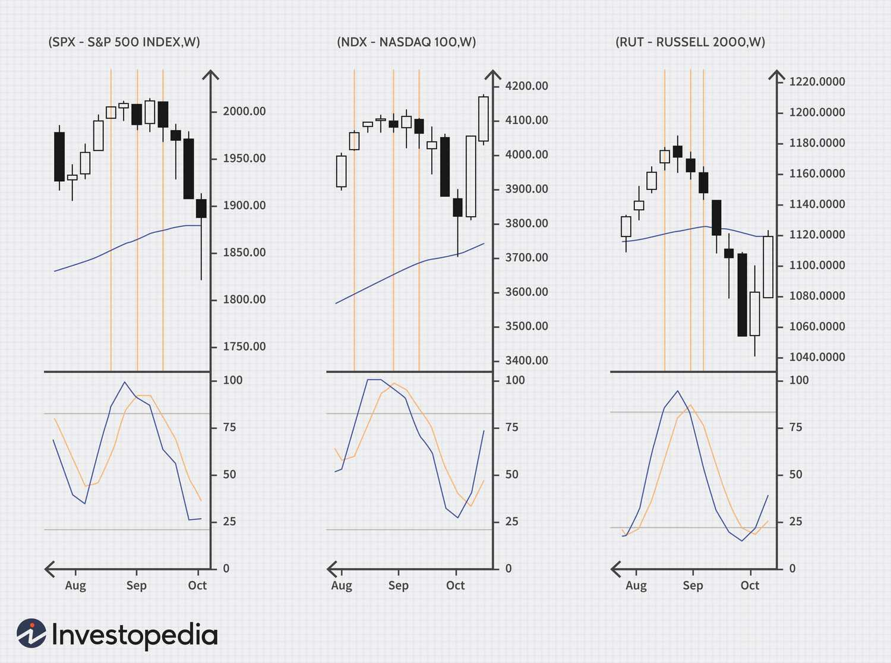

The world of trading and investing presents traders and investors with intricate decisions and strategies essential for navigating financial markets. Among these, market timing and technical analysis are crucial for crafting successful trades. Market timing involves making buy or sell decisions based on predictions about future market price movements. Accurate market timing can significantly enhance investment returns, making it a key focus for traders.

Technical analysis aids in market timing by using historical price and volume data to predict future price movements. Within this framework, stochastic indicators play an essential role. Developed by George Lane in the late 1950s, stochastic indicators are momentum oscillators used to evaluate an asset's closing price relative to its price range over a specified period. By predicting potential reversal points, these indicators assist traders in determining when a market is overbought or oversold, helping them make informed trading decisions.



In recent years, the relevance of stochastic indicators has amplified with the advent of algorithmic trading. This form of trading uses computer algorithms to execute complex strategies at speeds and frequencies far beyond human capabilities. Integrating stochastic indicators into algorithmic trading systems allows for real-time decision-making, optimizing entry and exit points in trades across various markets.

This article explores the significance of stochastic indicators in market timing and highlights their application in algorithmic trading. Understanding both their utility and limitations is vital for traders seeking to enhance their strategies and achieve superior performance in an ever-evolving financial landscape.

## Table of Contents

## Understanding Stochastic Indicators

Stochastic indicators are pivotal tools in technical analysis, primarily functioning as momentum oscillators. They were developed by George Lane to assess the speed or velocity of price movements, aiming to predict potential reversal points. By comparing a stock's closing price to its price range over a specified period, stochastic indicators offer insights into the buying and selling momentum of an asset.

The stochastic oscillator consists of two main components: the %K line and the %D line. The %K line is crucial as it reflects the current position of the asset's price in relation to its high-low range over a predetermined period, often 14 days. This is mathematically represented by the formula:

$$

\%K = \frac{(C - L_{n})(100)}{H_{n} - L_{n}} 
$$

where $C$ is the most recent closing price, $L_{n}$ is the lowest low over the past $n$ periods, and $H_{n}$ is the highest high over the past $n$ periods.

The %D line acts as a signal line and is typically a three-period simple moving average of the %K line. It helps smooth out the %K values to provide a clearer signal of potential market turns. A common setting for the %D line is:

$$

\%D = \frac{\text{Sum of last 3 %K}}{3} 
$$

Traders often pay attention to the crossings of these lines. A cross above the %D line by the %K line is often interpreted as a bullish signal, suggesting a potential buying opportunity. Conversely, a cross below the %D line is seen as a bearish signal, indicating a possible selling point.

Stochastic indicators are valuable for identifying overbought or oversold conditions in the market. Typically, a %K value over 80 signifies an overbought condition, while a value below 20 indicates an oversold condition. These values suggest the market might be ripe for a reversal or a pullback.

Despite its usefulness, the stochastic oscillator is best used in conjunction with other technical analysis tools to confirm signals and enhance decision-making in trading strategies.

## How Stochastic Indicators Aid Market Timing

Market timing is an essential aspect of trading that aims to optimize returns by accurately predicting market entry and [exit](/wiki/exit-strategy) points. Stochastic indicators, widely recognized for their effectiveness in identifying market cycles, play a significant role in this process. These indicators specialize in pinpointing overbought and oversold conditions through numerical values, enhancing traders' ability to make informed decisions.

When the stochastic oscillator exceeds a value of 80, an asset is typically considered overbought. This condition suggests that a price correction or downward trend may be imminent, prompting traders to potentially consider selling positions. Conversely, values falling below 20 indicate an oversold condition, signaling a possible upward price movement and a buying opportunity for traders.

The reliability of stochastic indicators is further enhanced when used in conjunction with other technical analysis tools such as price patterns or moving averages. This multifaceted approach reduces the probability of false signals and provides a more comprehensive market overview. For instance, a common technique involves using the stochastic oscillator with moving averages to confirm trends. A scenario where the stochastic indicator is below 20 (oversold), and a moving average crossover occurs, might reinforce a buy signal, offering traders more confidence in timing their market entry.

Additionally, traders often look for divergences between the stochastic indicator and price action, which can serve as early warning signals for potential market reversals. A bullish divergence occurs when the price registers lower lows, but the stochastic indicator shows higher lows, suggesting a possible upward reversal. Conversely, a bearish divergence, where price makes higher highs but the stochastic shows lower highs, may indicate a forthcoming downward correction.

Here is a simple Python script to calculate a stochastic oscillator, which can be integrated into [algorithmic trading](/wiki/algorithmic-trading) systems for real-time market analysis:

```python
import pandas as pd

def stochastic_oscillator(data, period=14):
    """
    Calculate the stochastic oscillator for a given dataset.

    Parameters:
    data (pd.DataFrame): A dataframe containing 'High', 'Low', 'Close' prices.
    period (int): The period over which the stochastic is calculated.

    Returns:
    pd.DataFrame: Contains the %K and %D lines.
    """
    data['L14'] = data['Low'].rolling(window=period).min()
    data['H14'] = data['High'].rolling(window=period).max()
    data['%K'] = 100 * ((data['Close'] - data['L14']) / (data['H14'] - data['L14']))
    data['%D'] = data['%K'].rolling(window=3).mean()

    return data[['%K', '%D']]

# Example usage with historical data
# Assuming 'df' is a DataFrame with 'High', 'Low', 'Close' columns
stochastic_values = stochastic_oscillator(df)
print(stochastic_values.tail())
```
This script calculates the %K and %D lines, facilitating their integration with other technical indicators within trading algorithms to enhance market timing precision. By combining stochastic readings with additional analysis tools, traders can improve their strategic decisions, aiming for better performance in both volatile and stable market conditions.

## Algorithmic Trading and Stochastic Indicators

With the rise of algorithmic trading, stochastic indicators have become integral to automated trading systems. These [momentum](/wiki/momentum) oscillators facilitate real-time decision-making by quantitatively analyzing price movements, making them a vital component of algorithmic strategies. The adaptability and precision offered by algorithmic trading systems allow traders to analyze and execute trades with speeds and accuracy far surpassing traditional methods.

Algorithms employ stochastic indicators to detect overbought and oversold conditions by using specific parameters like the %K and %D lines, which represent the current price relative to its recent range and its moving average, respectively. When the stochastic values reach predefined thresholds, algorithms can trigger a range of trading actions, enhancing both short-term and long-term strategies. 

For example, consider a Python algorithm that utilizes a stochastic oscillator to execute trades:

```python
def stochastic_oscillator(data, k_window=14, d_window=3):
    low_min = data['Low'].rolling(window=k_window).min()
    high_max = data['High'].rolling(window=k_window).max()
    data['%K'] = 100 * ((data['Close'] - low_min) / (high_max - low_min))
    data['%D'] = data['%K'].rolling(window=d_window).mean()
    return data

def trading_strategy(data, k_threshold=80, d_threshold=20):
    data = stochastic_oscillator(data)
    for i in range(1, len(data)):
        if data['%K'].iloc[i] < d_threshold and data['%D'].iloc[i] < d_threshold:
            print("Buy Signal")
        elif data['%K'].iloc[i] > k_threshold and data['%D'].iloc[i] > k_threshold:
            print("Sell Signal")

# Sample usage with market data
import pandas as pd

# Example data; in a real scenario, this would be replaced with market data
market_data = pd.DataFrame({
    'Close': [...],  # Closing prices
    'Low': [...],    # Low prices
    'High': [...]    # High prices
})

trading_strategy(market_data)
```

This sample code defines a stochastic oscillator function and a basic trading strategy. The algorithm evaluates the rolling high and low prices over a specified window to compute %K and %D values. When these values suggest that the market is overbought or oversold, corresponding buy or sell signals are generated.

The flexibility in defining heuristic conditions tailored to specific market conditions allows traders to optimize algorithmic strategies. By leveraging stochastic indicators, algorithms can adapt to varying market conditions, making informed decisions that optimize returns while mitigating risk. This reinforces their application not only in short-term trades but also in crafting robust long-term trading frameworks.

## Optimizing Stochastic Settings Across Markets

Different markets exhibit distinct levels of [volatility](/wiki/volatility-trading-strategies) and [liquidity](/wiki/liquidity-risk-premium), necessitating tailored stochastic settings for effective analysis and decision-making. The stochastic oscillator, with its %K and %D lines, requires adjustments to align with the specific market dynamics, mainly due to the inherent volatility characteristics of each market type.

In the [forex](/wiki/forex-system) market, known for its high liquidity and rapid price swings, shorter stochastic periods are commonly recommended. Shorter periods allow traders to capture the swift fluctuations characteristic of currency pairs, helping to identify potential reversal points more effectively. For instance, a 5-period stochastic setting may be advantageous as it provides a more responsive assessment of momentum shifts, capturing timely buy or sell signals without excessive lag. Given the 24-hour nature of forex trading, this responsiveness aids in capitalizing on market movements driven by global events and macroeconomic announcements.

Conversely, equity markets, which may experience less frequent price shifts compared to forex, often benefit from employing longer stochastic periods. Longer periods, such as 14 or 21, help smooth out the noise caused by random daily fluctuations, providing a clearer view of the overarching trend. This approach aids traders in avoiding false signals during minor market hiccups and maintaining positions in line with the more sustained stock trends.

To effectively optimize stochastic settings across various markets, traders must engage in extensive experimentation and rigorous [backtesting](/wiki/backtesting). This process involves adjusting both the length of the stochastic periods and the overbought/oversold thresholds. Backtesting enables traders to evaluate how different settings would have performed historically, thereby identifying the most appropriate parameters for capturing profitable signals in their chosen market segment. 

Python, with libraries such as Pandas and Backtrader, provides robust tools for conducting such backtests. A sample code snippet for backtesting stochastic settings in Python might look like the following:

```python
import pandas as pd
import backtrader as bt

# Define a simple strategy using stochastic indicators
class StochasticStrategy(bt.Strategy):
    params = (
        ('period', 14),
        ('overbought', 80),
        ('oversold', 20),
    )

    def __init__(self):
        self.stochastic = bt.indicators.Stochastic(self.data, period=self.params.period)

    def next(self):
        if not self.position:
            if self.stochastic.percK[-1] < self.params.oversold:
                self.buy()
        else:
            if self.stochastic.percK[-1] > self.params.overbought:
                self.sell()

# Load data and set up backtest
data = bt.feeds.PandasData(dataname=pd.read_csv('market_data.csv'))
cerebro = bt.Cerebro()
cerebro.adddata(data)
cerebro.addstrategy(StochasticStrategy, period=14)

# Run backtest
cerebro.run()
```

This Python code snippet simplifies the process of testing how different stochastic settings would perform over historical data. Traders can modify parameters such as `period`, `overbought`, and `oversold` to refine the strategy to better fit specific market conditions. Repeated chronological simulation of this setup over large datasets helps ascertain the setup's efficacy, ultimately leading to more informed and strategic decision-making in live markets.

## Risks and Limitations

Stochastic indicators, while valuable in analyzing markets, are not without their drawbacks. A primary concern is the generation of false signals, which can occur especially during strong market trends. In these scenarios, prices may remain in overbought or oversold conditions for extended durations, leading traders to premature conclusions about potential market reversals.

The stochastic oscillator's tendency to produce misleading signals arises from its design. In a trending market, prices can repeatedly touch or exceed the set thresholds (commonly, levels above 80 indicate overbought, and levels below 20 suggest oversold conditions), without resulting in an immediate reversal. This can encourage traders to enter or exit positions based on these signals, potentially at inopportune times.

To mitigate these risks, market participants are advised to confirm stochastic signals with additional technical tools. For instance, integrating stochastic indicators with moving averages or trend lines can provide a more comprehensive market analysis. Moving averages can help identify the overall trend direction, adding context to stochastic signals. A trader might refrain from acting on a stochastic signal unless it aligns with the direction suggested by a moving average.

Furthermore, an effective risk management strategy is paramount. Incorporating stop-loss orders is one such strategy that can protect against significant losses. A stop-loss order automates the sale of a security once it reaches a predetermined price, thus minimizing potential downside.

Additionally, traders might consider customizing stochastic settings according to the specific market they are dealing with. Different markets exhibit varying volatilities and trends, necessitating tailored approaches. Backtesting these settings across historical data can also be beneficial in understanding how the stochastic indicator performs in various market environments.

In conclusion, while stochastic indicators are a powerful tool for traders, caution must be exercised in their use. By complementing them with other analytical techniques and adhering to sound risk management practices, traders can better navigate the complexities of market movements and reduce the likelihood of adverse outcomes.

## Conclusion

Stochastic indicators are essential components in technical analysis and algorithmic trading, providing valuable insights into market momentum and assisting traders in determining optimal entry and exit points. These indicators, developed by George Lane, are particularly useful in identifying overbought and oversold conditions, where prices may be poised to reverse direction. 

Understanding the strengths of stochastic indicators allows traders to capitalize on these momentum signals. By comparing the closing price of a security to its price range over a set period, traders can gauge momentum shifts that are often precursors to price reversals. As a momentum oscillator, the stochastic indicator enables traders to make more informed decisions regarding market timing.

Despite their strengths, stochastic indicators have limitations and are prone to generating false signals, particularly during strong, sustained market trends. This necessitates a judicious approach, where traders corroborate stochastic readings with other technical tools. Integrating stochastic indicators with, for instance, moving averages or trend lines can provide a more robust analysis framework, reducing the reliance on a single form of indicator.

For those engaged in algorithmic trading, stochastic indicators can be programmed into automated systems to execute trades based on predefined conditions. This capability enhances the speed and efficiency of trade execution, minimizing human emotion and error. Consideration of market volatility and customizing stochastic settings for different market segments can further optimize trading performance.

In summary, while stochastic indicators are powerful tools for identifying market momentum, their effectiveness is maximized when used as part of a broader analytical framework. By recognizing both their strengths and their limitations, traders can better navigate the complexities of market behavior, improving their strategy and overall trading performance.

## References & Further Reading

[1]: Lane, G. (1984). "Lane's Stochastics." Commodities Magazine (now known as Futures Magazine).

[2]: Perlin, M. (2007). ["Evaluation of stochastic models in the foreign exchange market."](https://www.eng-tips.com/threads/re-entrant-corner-drag-strut-offset-from-corner.376485/) Social Science Research Network.

[3]: "Technical Analysis of the Financial Markets: A Comprehensive Guide to Trading Methods and Applications" by John J. Murphy

[4]: "Quantitative Technical Analysis: An integrated approach to trading system development and trading management" by Howard B. Bandy

[5]: Malkiel, B. G. (1973). ["A Random Walk Down Wall Street"](https://yourknowledgedigest.org/wp-content/uploads/2020/04/a-random-walk-down-wall-street.pdf) - offers insights into market timing and technical analysis.