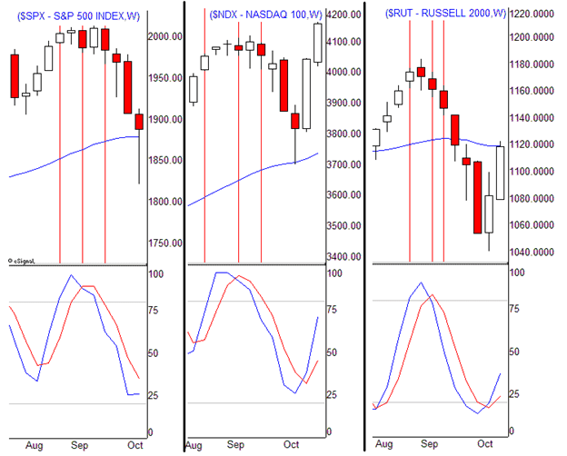

## Table of Contents

## What is a stochastic indicator and how does it work?

A stochastic indicator is a tool used in trading to help predict where the price of something, like a stock or a currency, might go next. It does this by comparing the closing price of an asset to its price range over a certain period of time. The main idea behind it is that in a strong upward trend, prices tend to close near the high of the period, and in a strong downward trend, prices tend to close near the low of the period.

The stochastic indicator gives you two lines, called %K and %D, which move between 0 and 100. When these lines are above 80, it suggests that the asset might be overbought, meaning it could be a good time to sell. When the lines are below 20, it suggests the asset might be oversold, meaning it could be a good time to buy. Traders watch these lines to see when they cross these levels and also look for when the lines cross each other, as this can signal potential changes in the price direction.

## How does the weekly stochastic indicator differ from the daily one?

The weekly stochastic indicator and the daily stochastic indicator both measure the momentum of price movements, but they do so over different time frames. The daily stochastic indicator looks at price data from day to day, giving traders insights into short-term trends. It's useful for people who make quick trading decisions and want to catch smaller price movements. On the other hand, the weekly stochastic indicator looks at price data over entire weeks, providing a broader view of the market's momentum. This makes it more suitable for traders who are interested in longer-term trends and are less concerned with daily fluctuations.

The key difference between the two lies in their sensitivity and the kind of signals they generate. Because the daily stochastic indicator updates every day, it can be more sensitive to price changes and might give more frequent buy or sell signals. This can be helpful for those who trade often but can also lead to more false signals. In contrast, the weekly stochastic indicator updates less often, which means it's less sensitive to short-term price swings. This can result in fewer, but potentially more reliable, signals for traders who are looking to hold onto their investments for longer periods.

## What are the key components of a stochastic oscillator?

A stochastic oscillator has two main parts: the %K line and the %D line. The %K line is the main line that shows where the current closing price is compared to the high and low prices over a certain time. It's a bit like a percentage that tells you if the price is near the top, middle, or bottom of its recent range. The %D line is a smoother version of the %K line. It's made by taking an average of the %K line over a few periods, usually three. This helps to make the signals clearer and less jumpy.

These two lines move between 0 and 100. When they get above 80, it might mean the price is too high and could go down soon. When they drop below 20, it might mean the price is too low and could go up. Traders watch for when these lines cross these levels and also when the %K line crosses the %D line. These moments can tell traders when it might be a good time to buy or sell.

## How do you calculate the %K and %D lines in a stochastic indicator?

To calculate the %K line in a stochastic indicator, you need to know the highest high and the lowest low of the price over a certain number of periods, usually 14 days. You also need the most recent closing price. The formula for %K is: %K = (Current Close - Lowest Low) / (Highest High - Lowest Low) * 100. This formula shows you where the current closing price is in relation to the recent price range. If the %K value is high, it means the closing price is near the top of the range, and if it's low, it means the closing price is near the bottom.

The %D line is a bit simpler to calculate. It's just a 3-period moving average of the %K line. This means you take the %K value from the current period, the one before it, and the one before that, add them up, and then divide by 3. The %D line helps smooth out the %K line, making it easier to spot trends and less likely to give false signals. When the %K line crosses above or below the %D line, it can be a signal for traders to buy or sell.

## What are the common settings for a weekly stochastic indicator?

The common settings for a weekly stochastic indicator usually include a look-back period of 14 weeks, which means it looks at the price data from the last 14 weeks. This setting helps to give a good balance between being sensitive to price changes and not reacting too much to small, unimportant movements. Traders often use this setting because it works well for seeing longer-term trends without getting too many false signals.

For the %K and %D lines, the standard settings are usually 14 for the %K period, 3 for the %D period, and 3 for the smoothing period. This means the %K line is calculated based on the highest high and lowest low over the last 14 weeks, and the %D line is a 3-period moving average of the %K line. These settings help traders see clear signals about when a market might be overbought or oversold, making it easier to decide when to buy or sell.

## How can the weekly stochastic indicator be used to identify overbought and oversold conditions?

The weekly stochastic indicator helps traders see when a market might be overbought or oversold. Overbought means the price is too high and might go down soon, and oversold means the price is too low and might go up soon. The indicator uses two lines, called %K and %D, which move between 0 and 100. When these lines go above 80, it suggests the market is overbought. Traders might think about selling at this point. When the lines go below 20, it suggests the market is oversold, and traders might think about buying.

Using the weekly stochastic indicator is good for looking at longer-term trends. Because it looks at price data over weeks, it doesn't get too excited about small daily changes. This makes it easier to see big moves in the market. Traders watch for when the %K and %D lines cross the 80 and 20 levels. They also look for when the %K line crosses the %D line. If the %K line crosses above the %D line when both are below 20, it might be a strong signal to buy. If the %K line crosses below the %D line when both are above 80, it might be a strong signal to sell.

## What are the typical buy and sell signals generated by the weekly stochastic indicator?

The weekly stochastic indicator gives traders signals to buy or sell based on where its lines are. The indicator has two lines, %K and %D, that move between 0 and 100. When these lines go below 20, it means the market might be oversold, and it could be a good time to buy. Traders look for when the %K line crosses above the %D line while both are below 20. This is a strong buy signal because it shows that the price might start going up soon.

On the other hand, when the %K and %D lines go above 80, it means the market might be overbought, and it could be a good time to sell. Traders watch for when the %K line crosses below the %D line while both are above 80. This is a strong sell signal because it suggests that the price might start going down soon. By using these signals, traders can make decisions about when to enter or exit the market based on longer-term trends.

## How can divergences between the weekly stochastic indicator and price action be used for market timing?

Divergences between the weekly stochastic indicator and price action can help traders figure out when the market might change direction. A divergence happens when the price of something goes up, but the stochastic indicator goes down, or when the price goes down, but the stochastic indicator goes up. This mismatch can be a warning sign that the current trend might be getting weak. For example, if the price keeps going up to new highs but the stochastic indicator is making lower highs, it's called a bearish divergence. This might mean that the price could start going down soon, so traders might think about selling.

On the other hand, if the price keeps going down to new lows but the stochastic indicator is making higher lows, it's called a bullish divergence. This might mean that the price could start going up soon, so traders might think about buying. By watching for these divergences on the weekly stochastic indicator, traders can get a heads-up about possible changes in the market's direction. This can help them time their trades better, making decisions based on longer-term trends rather than just daily price movements.

## What are the limitations and potential pitfalls of using the weekly stochastic indicator for market timing?

Using the weekly stochastic indicator for market timing can be tricky because it's not perfect. One big problem is that it can give false signals. This means it might tell you to buy or sell when it's not actually a good time. For example, the market might look overbought or oversold for a long time before it actually changes direction. This can make traders jump in or out of the market too early or too late, which can lead to losses. Also, the weekly stochastic indicator is based on past price data, so it can be slow to react to new market conditions. If something big happens in the market, like a sudden news event, the indicator might not catch it right away.

Another issue is that the weekly stochastic indicator works best when used with other tools. By itself, it might not give you a full picture of what's happening in the market. Traders often use it along with other indicators or chart patterns to make better decisions. If you rely only on the weekly stochastic indicator, you might miss important signals from other parts of the market. It's also important to remember that no indicator can predict the future perfectly. The market can be unpredictable, and even the best tools can fail sometimes. So, it's good to use the weekly stochastic indicator as one part of a bigger trading plan, not the whole thing.

## How can the weekly stochastic indicator be combined with other technical indicators to improve market timing decisions?

Combining the weekly stochastic indicator with other technical indicators can help traders make better market timing decisions. One common way to do this is by using the weekly stochastic indicator along with moving averages. For example, a trader might use a 50-week moving average to see the general trend of the market. If the stochastic indicator shows an oversold condition and the price is above the 50-week moving average, it might be a good time to buy because the long-term trend is still up. On the other hand, if the stochastic indicator shows an overbought condition and the price is below the 50-week moving average, it might be a good time to sell because the long-term trend is down.

Another useful combination is using the weekly stochastic indicator with the Relative Strength Index (RSI). The RSI also measures momentum, but it uses a different way to calculate it. By looking at both the stochastic indicator and the RSI, traders can get a clearer picture of whether the market is really overbought or oversold. If both indicators show the same thing, like both being in overbought territory, it can make the signal stronger. This can help traders feel more confident in their decisions. Combining these indicators helps traders see the market from different angles, which can lead to better timing for buying and selling.

## Can you provide case studies or examples of successful market timing using the weekly stochastic indicator?

In early 2020, a trader noticed a bullish divergence on the weekly stochastic indicator for a tech stock. The stock's price was making lower lows, but the stochastic indicator was making higher lows. This suggested that the downward momentum was weakening. At the same time, the stock was above its 50-week moving average, indicating a long-term uptrend. The trader decided to buy the stock when the %K line crossed above the %D line in oversold territory, around the 20 level. Over the next few months, the stock price rose significantly, and the trader was able to sell at a profit when the stochastic indicator moved back into overbought territory, above the 80 level.

Another example happened in late 2021 with a commodity. A trader saw a bearish divergence on the weekly stochastic indicator. The commodity's price was hitting new highs, but the stochastic indicator was making lower highs, signaling that the upward momentum was fading. The trader waited for the %K line to cross below the %D line while both were in overbought territory, above the 80 level. This confirmed the sell signal. The trader sold the commodity and it started to decline in price over the next few weeks. By combining the weekly stochastic indicator with other tools like the RSI, which also showed overbought conditions, the trader made a well-timed exit and avoided a significant drop in the commodity's value.

## What advanced techniques can be used to refine the signals from the weekly stochastic indicator for expert traders?

Expert traders can use a few advanced techniques to make the signals from the weekly stochastic indicator even better. One way is to use multiple time frames. For example, they might look at the daily stochastic indicator along with the weekly one. If both show the same thing, like both being oversold, it can make the signal stronger. This helps traders feel more sure about when to buy or sell. Another technique is to adjust the settings of the stochastic indicator. Instead of using the standard 14, 3, 3 settings, traders might try different numbers to see what works best for the market they are trading. This can help them catch signals that fit their trading style better.

Another advanced technique is to use the stochastic indicator with other tools like the MACD (Moving Average Convergence Divergence) or Bollinger Bands. The MACD can help show if the trend is strong, and Bollinger Bands can show if the price is moving a lot. If the stochastic indicator shows an overbought or oversold condition and the MACD or Bollinger Bands confirm it, the signal can be more reliable. Expert traders might also use something called "stochastic pop and drop." This happens when the stochastic indicator quickly moves into overbought or oversold territory and then quickly moves back out. This can be a sign that the price might change direction soon, so traders can use it to time their trades better.

## What are Stochastic Indicators and How Do They Work?

Stochastic indicators are pivotal tools in technical analysis, primarily functioning as momentum oscillators. They were developed by George Lane to assess the speed or velocity of price movements, aiming to predict potential reversal points. By comparing a stock's closing price to its price range over a specified period, stochastic indicators offer insights into the buying and selling momentum of an asset.

The stochastic oscillator consists of two main components: the %K line and the %D line. The %K line is crucial as it reflects the current position of the asset's price in relation to its high-low range over a predetermined period, often 14 days. This is mathematically represented by the formula:

$$

\%K = \frac{(C - L_{n})(100)}{H_{n} - L_{n}} 
$$

where $C$ is the most recent closing price, $L_{n}$ is the lowest low over the past $n$ periods, and $H_{n}$ is the highest high over the past $n$ periods.

The %D line acts as a signal line and is typically a three-period simple moving average of the %K line. It helps smooth out the %K values to provide a clearer signal of potential market turns. A common setting for the %D line is:

$$

\%D = \frac{\text{Sum of last 3 %K}}{3} 
$$

Traders often pay attention to the crossings of these lines. A cross above the %D line by the %K line is often interpreted as a bullish signal, suggesting a potential buying opportunity. Conversely, a cross below the %D line is seen as a bearish signal, indicating a possible selling point.

Stochastic indicators are valuable for identifying overbought or oversold conditions in the market. Typically, a %K value over 80 signifies an overbought condition, while a value below 20 indicates an oversold condition. These values suggest the market might be ripe for a reversal or a pullback.

Despite its usefulness, the stochastic oscillator is best used in conjunction with other technical analysis tools to confirm signals and enhance decision-making in trading strategies.

## References & Further Reading

[1]: Lane, G. (1984). "Lane's Stochastics." Commodities Magazine (now known as Futures Magazine).

[2]: Perlin, M. (2007). ["Evaluation of stochastic models in the foreign exchange market."](https://www.eng-tips.com/threads/re-entrant-corner-drag-strut-offset-from-corner.376485/) Social Science Research Network.

[3]: "Technical Analysis of the Financial Markets: A Comprehensive Guide to Trading Methods and Applications" by John J. Murphy

[4]: "Quantitative Technical Analysis: An integrated approach to trading system development and trading management" by Howard B. Bandy

[5]: Malkiel, B. G. (1973). ["A Random Walk Down Wall Street"](https://yourknowledgedigest.org/wp-content/uploads/2020/04/a-random-walk-down-wall-street.pdf) - offers insights into market timing and technical analysis.