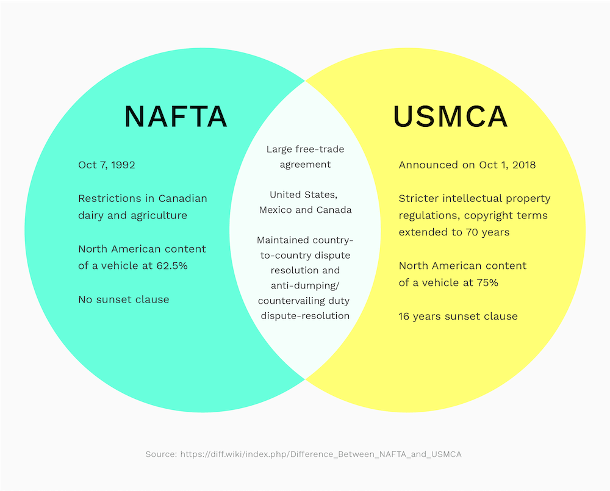

## Table of Contents

## What is the USMCA?

The USMCA, or United States-Mexico-Canada Agreement, is a trade deal between the United States, Mexico, and Canada. It replaced the old NAFTA, or North American Free Trade Agreement, in 2020. The main goal of the USMCA is to make trade between these three countries easier and fairer. It helps businesses in these countries sell their products to each other more easily by lowering taxes on goods and setting clear rules for trade.

The USMCA covers many areas, like cars, farming, and digital trade. For example, it has rules that say a certain part of a car must be made in one of the three countries to avoid taxes. It also helps farmers by making it easier to sell their products across borders. The agreement also includes new rules for the internet and data, which are important for modern businesses. Overall, the USMCA aims to help the economies of the United States, Mexico, and Canada grow by working together.

## What is NAFTA?

NAFTA, or the North American Free Trade Agreement, was a deal between the United States, Canada, and Mexico. It started in 1994 and its main goal was to make it easier for these countries to trade with each other. NAFTA did this by getting rid of most of the taxes on goods that were traded between the three countries. This meant that businesses could sell their products more easily across borders, which helped them grow and create more jobs.

The agreement covered many different areas, like cars, farming, and services. For example, it made it easier for car companies to sell cars in all three countries without paying high taxes. Farmers also benefited because they could sell their crops and other products more easily to their neighbors. However, NAFTA also had some challenges. Some people worried that it led to job losses in certain industries, especially in the United States, because companies moved their factories to Mexico where labor was cheaper. In 2020, NAFTA was replaced by a new agreement called the USMCA, which aimed to address some of these issues while keeping the benefits of free trade.

## What was the main purpose of NAFTA?

The main purpose of NAFTA was to make trade easier between the United States, Canada, and Mexico. It did this by removing most of the taxes on goods that were traded between these countries. This meant that businesses could sell their products more easily across borders, which helped them grow and create more jobs.

NAFTA covered many areas like cars, farming, and services. For example, it made it easier for car companies to sell cars in all three countries without paying high taxes. Farmers also benefited because they could sell their crops and other products more easily to their neighbors. The idea was to help the economies of these three countries grow by working together.

## How does the USMCA differ from NAFTA?

The USMCA, or United States-Mexico-Canada Agreement, is a newer trade deal that replaced NAFTA in 2020. One big difference is that the USMCA has stricter rules about where products, especially cars, need to be made. For cars, a bigger part of them must be made in the US, Mexico, or Canada to avoid taxes. This is meant to help keep more jobs in these countries. The USMCA also has new rules for the internet and data, which are important for today's businesses. These rules help protect digital trade and make it easier for companies to do business online across borders.

Another difference is that the USMCA tries to make sure workers in all three countries are treated fairly. It has rules to help workers get better pay and working conditions. This was a big concern with NAFTA, where some people worried that jobs were moving to places with cheaper labor. The USMCA also has stronger protections for the environment. It aims to make sure that trade doesn't harm the planet. Overall, the USMCA keeps many of the good things from NAFTA, like making trade easier, but it also tries to fix some of the problems people had with the old agreement.

## What are the key provisions of NAFTA?

NAFTA, or the North American Free Trade Agreement, had several key provisions that aimed to make trade easier between the United States, Canada, and Mexico. One of the main provisions was the elimination of most tariffs on goods traded between these countries. This meant that businesses could sell their products across borders without paying high taxes, which helped them grow and create more jobs. NAFTA also included rules to make it easier for services, like banking and transportation, to be provided across the three countries. This helped service companies expand their businesses and reach more customers.

Another important part of NAFTA was the protection of intellectual property rights, like patents and trademarks. This was meant to encourage innovation by making sure that creators and inventors could benefit from their work. NAFTA also had provisions to help resolve trade disputes between the countries. If there was a disagreement about trade rules, there was a process to help solve it fairly. Overall, these provisions were designed to help the economies of the United States, Canada, and Mexico grow by working together and making trade easier.

## What are the major provisions introduced in the USMCA?

The USMCA introduced several important changes compared to NAFTA. One major provision is stricter rules for where products, especially cars, need to be made. For cars, a larger part of them must be made in the US, Mexico, or Canada to avoid taxes. This is meant to help keep more jobs in these countries. The USMCA also has new rules for the internet and data, which are important for today's businesses. These rules help protect digital trade and make it easier for companies to do business online across borders.

Another key provision in the USMCA is focused on making sure workers in all three countries are treated fairly. It has rules to help workers get better pay and working conditions. This was a big concern with NAFTA, where some people worried that jobs were moving to places with cheaper labor. The USMCA also includes stronger protections for the environment. It aims to make sure that trade doesn't harm the planet. Overall, these provisions keep many of the good things from NAFTA, like making trade easier, but also try to fix some of the problems people had with the old agreement.

## How have labor standards changed from NAFTA to USMCA?

The USMCA made big changes to labor standards compared to NAFTA. One of the main changes is that the USMCA has stronger rules to make sure workers in the US, Mexico, and Canada are treated fairly. It includes rules that help workers get better pay and working conditions. This was a big problem with NAFTA because some people worried that jobs were moving to places where workers were paid less and had worse conditions. The USMCA tries to fix this by making sure all three countries follow better labor rules.

Another change is that the USMCA has a special way to make sure these labor rules are followed. If a country doesn't follow the rules, there is a process to help solve the problem. This is different from NAFTA, where it was harder to make sure labor standards were being met. The USMCA also makes it easier for workers to join unions and have a say in their workplaces. Overall, these changes aim to make sure that trade between the US, Mexico, and Canada helps workers, not just businesses.

## What impact has the USMCA had on environmental regulations?

The USMCA has made environmental rules stronger than they were under NAFTA. It has rules to make sure that trade between the US, Mexico, and Canada doesn't harm the environment. For example, the USMCA has rules to stop illegal fishing and protect endangered species. It also makes sure that countries follow their own environmental laws and don't lower them just to attract more business. This is important because it helps keep the environment safe while still allowing trade to grow.

Another big change is that the USMCA has a special way to make sure these environmental rules are followed. If a country doesn't follow the rules, there is a process to help solve the problem. This is different from NAFTA, where it was harder to make sure environmental standards were being met. The USMCA also encourages countries to work together on environmental issues, like fighting climate change. Overall, these changes aim to make sure that trade between the US, Mexico, and Canada helps protect the environment, not just the economy.

## How do the rules of origin differ between NAFTA and USMCA?

The rules of origin in the USMCA are stricter than they were in NAFTA. These rules decide if a product can be traded without paying taxes between the US, Mexico, and Canada. In the USMCA, more of a product, especially cars, needs to be made in one of these three countries to avoid taxes. For cars, at least 75% of the parts need to come from the US, Mexico, or Canada, which is higher than the 62.5% required under NAFTA. This change is meant to make sure more jobs stay in these countries.

The USMCA also has new rules for car parts, like engines and transmissions. At least 70% of these parts need to be made by workers who earn at least $16 an hour. This is to help make sure workers get paid fairly. These rules are different from NAFTA, which didn't have these specific requirements for car parts. Overall, the USMCA's rules of origin are designed to keep more of the production and jobs in the US, Mexico, and Canada, and to make sure workers are treated well.

## What are the dispute resolution mechanisms in USMCA compared to NAFTA?

The USMCA has changed the way disputes are handled compared to NAFTA. In the USMCA, there is a new way to solve disagreements about labor and environmental rules. If a country thinks another country is not following these rules, they can start a special process to fix the problem. This process is faster and more focused on making sure the rules are followed than the one in NAFTA. The USMCA also makes it easier to solve disagreements about how much of a product needs to be made in the US, Mexico, or Canada to avoid taxes.

Another big change is that the USMCA got rid of the old way of solving disagreements about investments, which was called the Investor-State Dispute Settlement (ISDS). Under NAFTA, companies could sue countries if they thought the country's rules hurt their investments. The USMCA keeps this system only between the US and Mexico for certain industries, like oil and gas. For disputes between the US and Canada, and for most industries between the US and Mexico, companies have to use the country's own courts. This change makes the dispute resolution process simpler and more like what countries usually do.

## How has the intellectual property section evolved from NAFTA to USMCA?

The USMCA made some big changes to the rules about intellectual property compared to NAFTA. Intellectual property includes things like inventions, [books](/wiki/algo-trading-books), and music. One big change is that the USMCA makes copyrights last longer. Under NAFTA, copyrights lasted for the life of the creator plus 50 years. The USMCA changed this to the life of the creator plus 70 years. This means that people who create things get to keep control of them for a longer time. The USMCA also has new rules to stop people from stealing and selling fake products. This helps protect businesses and creators from losing money because of fakes.

Another change is that the USMCA has stronger rules to protect trade secrets. Trade secrets are important information that businesses keep secret to stay ahead of their competition. The USMCA makes it harder for people to steal these secrets and use them unfairly. It also has new rules to make sure that new medicines can be protected for a longer time. This is important for companies that spend a lot of money to create new drugs. Overall, the USMCA tries to make sure that people who create things and businesses that invest in new ideas are protected better than they were under NAFTA.

## What are the economic implications of transitioning from NAFTA to USMCA for the member countries?

The transition from NAFTA to USMCA has had several economic effects on the United States, Mexico, and Canada. One big change is that the USMCA has stricter rules about where products, especially cars, need to be made. This means more parts of cars have to come from these three countries, which can help keep more jobs in the US, Mexico, and Canada. It also means that car companies might have to pay more if they can't meet these new rules, which could make cars a bit more expensive. The USMCA also has new rules to make sure workers get better pay and working conditions, which can help workers but might also make it more expensive for businesses to operate.

Another important effect is that the USMCA has stronger rules to protect the environment and stop illegal activities like fishing. This can help make sure that trade doesn't harm the planet, but it might also mean that some businesses have to spend more money to follow these new rules. The USMCA also changed how disagreements between countries are solved, making it easier and faster to fix problems about labor and environmental rules. Overall, the USMCA aims to keep the good things about free trade from NAFTA, like making it easier to sell products across borders, while also trying to fix some of the problems people had with the old agreement.

## References & Further Reading

[1]: ["Digital Trade in the U.S.-Mexico-Canada Agreement,"](https://www.jec.senate.gov/public/_cache/files/7ba61fd0-19c2-42d3-b32c-960497f486dd/usmca-digital-trade-provisions-.pdf) U.S. Customs and Border Protection

[2]: Ciuriak, D., & Lisenkova, K. (2019). ["The effect of the United States-Mexico-Canada Agreement on Canada's economy."](https://www.semanticscholar.org/paper/Quantifying-CUSMA%3A-The-Economic-Consequences-of-the-Ciuriak-Dadkhah/84e70204d9d0b13ce391f2b4d37880c04b9f1231) C.D. Howe Institute

[3]: ["Algorithmic Trading and the USMCA: Analyzing Dependencies and Opportunities,"](https://www.investopedia.com/articles/active-trading/101014/basics-algorithmic-trading-concepts-and-examples.asp) NYU Stern

[4]: ["Explaining the USMCA: Trade and more security for data transfers"](https://www.wilsoncenter.org/article/three-years-us-mexico-canada-agreement-has-proven-its-worth), Information Technology and Innovation Foundation

[5]: Kennedy, M. (2018). ["How the USMCA differs from NAFTA,"](https://mocostudent.org/2018/10/how-the-usmca-differs-from-nafta/) CBC News

[6]: ["Intellectual Property in the USMCA: Overview,"](https://ustr.gov/sites/default/files/files/Press/fs/USMCA/USMCA_IP.pdf) United States House of Representatives, Congress Report

[7]: ["Developments in the USMCA Affecting High-Tech Trade"](https://www.brookings.edu/articles/usmca-forward-building-a-more-competitive-inclusive-and-sustainable-north-american-economy-digital/), Congressional Research Service

[8]: ["Algorithmic Trading and Financial Regulation,"](https://thefranklinlaw.com/legal-implications-of-algorithmic-trading-and-financial-regulation/) by Michael McNamara, SSRN