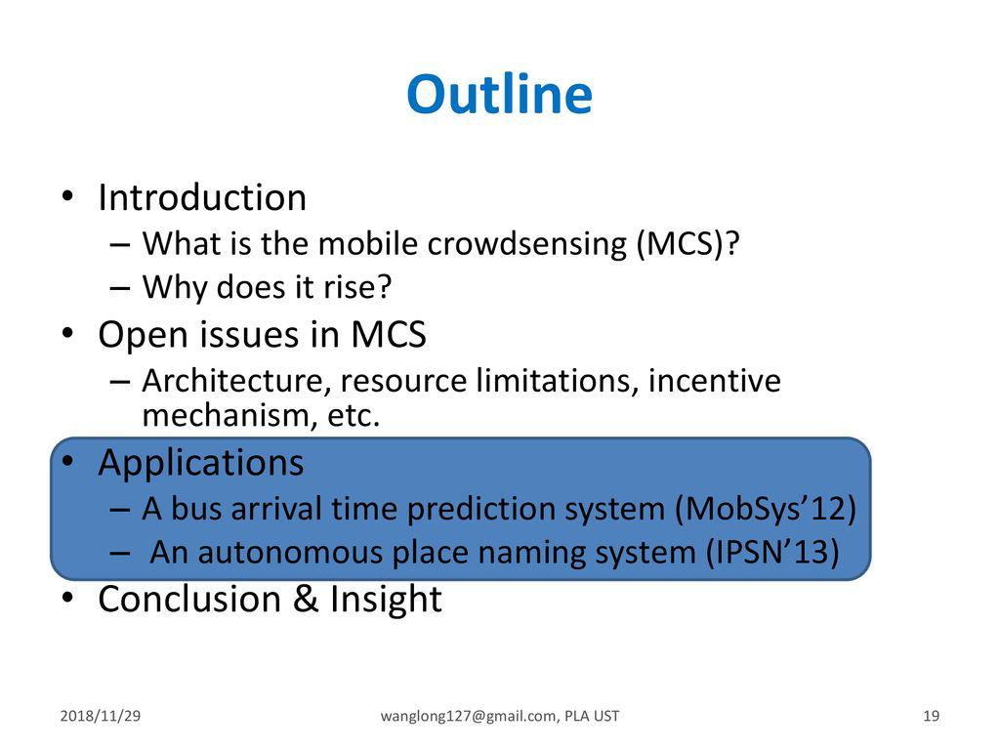

## Table of Contents

## What is UST?

UST is a type of digital money called a stablecoin. It is made by a company called Terraform Labs. The special thing about UST is that it is supposed to always be worth about the same as one US dollar. This is different from other digital money like Bitcoin, which can go up and down a lot in value. People use UST because they want a digital money that is more stable and easier to use for buying things or saving money.

UST works by being connected to another digital money called LUNA. When people want to buy or sell UST, it uses LUNA to keep the price steady. If the price of UST starts to go up or down too much, the system automatically buys or sells LUNA to bring the price back to around one US dollar. This makes UST a good choice for people who want to use digital money without worrying about big changes in value.

## How does UST differ from traditional stablecoins?

UST is different from traditional stablecoins because it uses a special way to keep its value steady. Traditional stablecoins, like USDT or USDC, are usually backed by real money or other safe assets like US dollars or government bonds. This means they have actual money or assets stored somewhere to make sure their value stays the same. UST, on the other hand, doesn't use real money or assets to back it up. Instead, it uses another digital money called LUNA to control its price. When the price of UST goes up or down, the system automatically buys or sells LUNA to bring the price back to around one US dollar.

Another way UST differs from traditional stablecoins is in how it is managed. Traditional stablecoins are often controlled by a central company or group that decides how the stablecoin works and what to do if something goes wrong. UST, however, is part of a bigger system called the Terra network, which is run by many people and computers working together. This means that no single person or company is in charge of UST, and decisions about it are made by the whole community. This can make UST more open and fair, but it also means it can be harder to fix problems if they come up.

## What is the mechanism behind UST's stability?

UST keeps its value steady by using another digital money called LUNA. When the price of UST starts to go up or down too much, the system automatically buys or sells LUNA to bring the price back to around one US dollar. For example, if UST's price goes above one dollar, people can trade their UST for LUNA, which makes more UST available and brings the price down. If the price goes below one dollar, people can trade their LUNA for UST, which takes some UST out of circulation and brings the price up. This way, the system always works to keep UST's value close to one US dollar.

This mechanism is different from traditional stablecoins because it doesn't use real money or assets to back up UST. Instead, it relies on the balance between UST and LUNA to keep the price stable. This makes UST a part of a bigger system called the Terra network, where many people and computers work together to manage it. Because of this, UST can be more open and fair, but it also means that fixing problems can be harder if something goes wrong.

## How is UST minted and burned?

UST is made, or minted, when people want to trade their LUNA for UST. If someone thinks UST is a good deal, they can give their LUNA to the Terra network and get UST in return. This makes more UST available, which helps keep its price close to one US dollar. When the price of UST goes above one dollar, more people want to trade their LUNA for UST, so more UST gets minted.

UST is taken away, or burned, when people want to trade their UST for LUNA. If someone thinks LUNA is a better deal, they can give their UST to the Terra network and get LUNA instead. This takes some UST out of circulation, which helps keep its price close to one US dollar. When the price of UST goes below one dollar, more people want to trade their UST for LUNA, so more UST gets burned. This balance between minting and burning UST helps keep its value steady.

## What role does the Terra protocol play in UST's ecosystem?

The Terra protocol is like the boss of UST's world. It's a set of rules that helps keep UST's price steady at around one US dollar. The Terra protocol does this by using another digital money called LUNA. When UST's price goes up or down too much, the Terra protocol makes sure people can trade UST and LUNA to bring the price back to where it should be. This way, UST stays a good choice for people who want a digital money that doesn't change value a lot.

The Terra protocol also makes sure that UST can be used easily and safely. It's part of a bigger system called the Terra network, where many people and computers work together to manage UST. This means that no single person or company is in charge, and everyone can help make decisions about how UST works. Because of this, UST can be more open and fair, but it also means that fixing problems can be harder if something goes wrong.

## What are the benefits of using UST over other cryptocurrencies?

UST is different from other cryptocurrencies because it's designed to always be worth about one US dollar. This makes it a lot less risky than other digital money like Bitcoin, which can go up and down a lot in value. When you use UST, you don't have to worry about big changes in price, which makes it easier to use for buying things or saving money. This stability is a big benefit for people who want to use digital money without the stress of sudden value changes.

Another benefit of using UST is that it's part of a bigger system called the Terra network, which is run by many people and computers working together. This means that UST can be more open and fair because no single person or company is in charge. It also means that UST can be used in many different places and for many different things, making it very useful. While this system can make it harder to fix problems if they come up, it also gives people more control and trust in the digital money they use.

## How can UST be used in everyday transactions?

UST can be used in everyday transactions just like regular money. You can use it to buy things online or in stores that accept it. For example, if you want to buy a new video game, you can pay with UST instead of using dollars or a credit card. Because UST is always worth about one US dollar, you don't have to worry about the price changing while you're trying to buy something. This makes it easy and safe to use for everyday purchases.

UST can also be used to send money to friends or family. If you want to help your friend pay for dinner, you can send them UST quickly and easily. Since UST works on the Terra network, which is used by many people around the world, it's easy to send UST to anyone who also uses the network. This makes it a good choice for everyday transactions because it's fast, reliable, and doesn't change value suddenly.

## What are some of the major applications of UST?

UST is used in many ways because it's a stablecoin that stays close to the value of one US dollar. One major way people use UST is for buying things online or in stores. Since UST doesn't change value much, it's a safe choice for shopping. You can use it to buy things like clothes, food, or even video games. Many online shops and some physical stores accept UST, making it easy to use in everyday life.

Another big use of UST is for sending money to other people. If you want to send money to a friend or family member, you can use UST. It's fast and reliable, and because it's part of the Terra network, it can be sent to anyone who also uses the network. This makes it a good choice for things like paying back a friend for dinner or sending money to family in another country.

UST is also used in the world of finance and investing. People can use UST to save money or as a safe place to keep their money while they decide what to do next. Because UST stays stable, it's a good choice for people who want to avoid the ups and downs of other cryptocurrencies. It can also be used in more complex financial products, like lending and borrowing, where having a stable value is important.

## How does UST integrate with DeFi platforms?

UST is a big part of the world of decentralized finance, or DeFi. DeFi platforms are like online banks and financial services that work without a central boss. UST is used on these platforms because it's a stablecoin that stays close to the value of one US dollar. This makes it a safe choice for people who want to use DeFi services without worrying about big changes in value. For example, people can use UST to lend money to others and earn interest, or they can borrow UST if they need money quickly. Because UST is stable, it's a good choice for these kinds of financial activities.

UST also helps make DeFi platforms work better. Since UST is part of the Terra network, it can be used easily with other parts of the network. This means that people can use UST to do things like trade other cryptocurrencies, invest in different financial products, or even create new financial tools. The stability of UST makes it a key part of many DeFi platforms, helping them run smoothly and safely. This way, UST helps make DeFi more useful and easier to use for everyone.

## What are the risks associated with using UST?

Using UST can be risky because it's a digital money that depends on another digital money called LUNA to keep its value steady. If something goes wrong with LUNA or the Terra network, UST's price might not stay close to one US dollar. This could happen if a lot of people suddenly want to trade their UST for LUNA, or if there's a problem with the system that makes it hard to keep the price stable. If UST's price changes a lot, people who use it for buying things or saving money could lose money.

Another risk is that UST is part of a system called the Terra network, which is run by many people and computers working together. This means that no single person or company is in charge, which can be good because it's more open and fair. But it also means that if something goes wrong, it can be harder to fix the problem quickly. If there's a big problem with the Terra network, it could affect UST and make it less safe to use. So, while UST can be a good choice for some people, it's important to understand these risks before using it.

## How has UST's performance been in the market?

UST has had its ups and downs in the market. At first, it did well because it was a stablecoin that stayed close to the value of one US dollar. People liked using it for buying things and sending money because it was safe and easy. But then, in May 2022, something big happened. The price of UST suddenly dropped a lot, and it didn't stay close to one US dollar anymore. This was a big problem for people who were using UST, and many of them lost money.

After the big drop in May 2022, UST has not been the same. It's been hard for UST to get back to being a stablecoin that people trust. The Terra network, which is the system that UST is a part of, has been working to fix things, but it's been a slow process. Now, people are more careful about using UST because they remember what happened. Even though UST is trying to get better, it's still seen as risky by many people in the market.

## What future developments are expected for UST and the Terra ecosystem?

The Terra ecosystem, which includes UST, is working hard to make things better after the big problem in May 2022. They are trying to make UST stable again by changing how it works. One idea is to use real money or other safe things to back up UST, instead of just using LUNA. This could make UST more like other stablecoins and help people trust it more. The Terra team is also talking to other companies and groups to find new ways to use UST and make it more useful for people.

Another big plan for the Terra ecosystem is to make it easier for people to use UST in everyday life. They want to work with more stores and online shops so that people can use UST to buy things easily. They are also thinking about new ways to use UST in the world of finance, like lending and borrowing. By making UST more useful and trusted, the Terra team hopes to bring more people into the ecosystem and help it grow. But it will take time and a lot of work to make these changes happen.

## References & Further Reading

[1]: Bergstra, J., Bardenet, R., Bengio, Y., & Kégl, B. (2011). ["Algorithms for Hyper-Parameter Optimization."](https://dl.acm.org/doi/10.5555/2986459.2986743) Advances in Neural Information Processing Systems 24.

[2]: ["Advances in Financial Machine Learning"](https://www.amazon.com/Advances-Financial-Machine-Learning-Marcos/dp/1119482089) by Marcos Lopez de Prado

[3]: ["Evidence-Based Technical Analysis: Applying the Scientific Method and Statistical Inference to Trading Signals"](https://www.amazon.com/Evidence-Based-Technical-Analysis-Scientific-Statistical/dp/0470008741) by David Aronson

[4]: ["Machine Learning for Algorithmic Trading"](https://github.com/stefan-jansen/machine-learning-for-trading) by Stefan Jansen

[5]: ["Quantitative Trading: How to Build Your Own Algorithmic Trading Business"](https://www.amazon.com/Quantitative-Trading-Build-Algorithmic-Business/dp/1119800064) by Ernest P. Chan