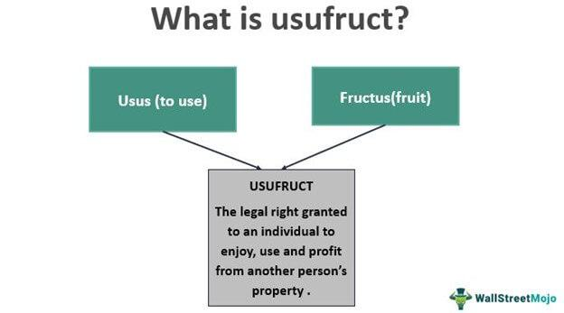

Property rights, legal property use, and usufruct are foundational elements of legal and economic systems worldwide. These concepts delineate the parameters of ownership, utilization, and benefit from resources, both tangible and intangible. Property rights fundamentally establish who has control over resources, thereby providing a framework that ensures stability and predictability in both personal and commercial transactions. This stability is crucial for fostering an environment conducive to investment, economic planning, and innovation. 

Legal property use, encompassing doctrines such as usufruct, allows entities to utilize and gain benefits from a property they do not own, without altering or destroying its substance. This arrangement is essential in systems where full ownership and immediate resource exploitation are not feasible or desirable. Usufruct balances the interests of property holders and users, thus contributing to a flexible legal structure that supports various economic activities and social functions.

Understanding these concepts is crucial for investors, legal professionals, and policymakers. Investors rely on strong property rights and clear legal frameworks to make informed decisions about asset allocation and risk management. Legal professionals must navigate these frameworks to advise clients accurately and resolve disputes. Policymakers need to consider these principles to devise regulations that safeguard property rights while enabling economic development.

In the rapidly evolving field of algorithmic trading, these concepts gain additional relevance. Algorithmic trading, characterized by the use of computer algorithms to automate trading decisions, operates within a complex legal landscape where ownership and intellectual property rights of trading algorithms come into play. As financial markets continue to advance technologically, existing legal frameworks may need adaptation to address new challenges, ensuring that property rights evolve to support innovation and economic growth.

The significance of property rights and their effective legal enforcement cannot be overstated. They form the backbone of economic systems, ensuring resource allocation efficiency, reducing disputes, and lowering transaction costs. As technology and markets evolve, continuous dialogue among stakeholders will be necessary to adapt legal frameworks that support economic growth and social welfare. This discussion not only aids in safeguarding current economic activities but also ensures that future innovations occur within a supportive and well-governed legal environment.

## Table of Contents

## Understanding Property Rights

Property rights are foundational elements of economic systems, serving as the legal framework that delineates ownership and use of resources. These rights grant individuals and entities the authority to use, manage, and transfer resources, and form the basis upon which markets function and economies develop.

Historically, the concept of property rights has evolved alongside societal progress. In early societies, notions of property were primarily communal, with resources being shared within tribes or communities. As societies became more complex, the need for individually owned property emerged, leading to the development of codified legal systems to protect these rights.

Property rights are generally categorized into two main types: tangible and intangible assets. Tangible assets include physical property such as land, buildings, and machinery. These are governed by real property laws, which dictate the acquisition, use, and transfer of such assets. Intangible assets, on the other hand, encompass non-physical properties like stocks, bonds, patents, and copyrights. These are subject to intellectual property and corporate law, ensuring that creators and investors have exclusive rights to their innovations and contributions.

Different jurisdictions have varying frameworks for property rights. For instance, common law systems, prevalent in countries such as the United States and the United Kingdom, typically provide strong protections for property rights, emphasizing individual ownership and contract enforcement. Civil law systems, found in much of Europe and Latin America, offer a more codified approach, with an emphasis on written statutes. These systems often ensure robust protection but may differ in their procedures and extent of rights granted.

In contrast, jurisdictions with weaker legal frameworks, often in developing regions, may offer limited protection of property rights. This can lead to issues such as land disputes, resource misallocation, and decreased investment, as the risk associated with uncertain ownership discourages economic participation.

Overall, the protection and definition of property rights are crucial for promoting stability and economic growth. They reduce disputes, enhance resource allocation efficiency, and encourage innovation and investment by ensuring that individuals and businesses can trust in the security of their assets. As legal systems continue to evolve, understanding and strengthening property rights remains a key driver of economic development and societal well-being.

## Legal Property Use: Usufruct

Usufruct is a distinctive legal concept granting individuals the right to use and derive benefit from property owned by another entity. This arrangement is captured under civil law traditions and emphasizes the separation of property rights into three elements: usus, fructus, and abusus. 

The component termed 'usus' refers to the right to use the property without altering its essential character. For example, an individual holding a usufruct over a house can reside in it or lease it to others without making permanent changes to its structure. On the other hand, 'fructus' represents the right to enjoy the fruits or profits of the property. This could translate to harvesting crops from farmland or collecting rent from a leased property. Together, usus and fructus allow the usufructuary to utilize the property productively, deriving economic benefits without owning it outright. Abusus, the third component not conferred to the usufructuary, is the right to consume, destroy, or alienate the property, essentially retaining control over the property's ultimate disposition by the owner.

Usufruct is a flexible tool used across various contexts. In personal settings, consider a widow who holds a usufruct over family property. While the legal ownership may belong to her children, she retains the right to live in the house and utilize its yields for her sustenance. In commercial frameworks, a company might possess a usufruct on a piece of agricultural land. While the ownership remains with another party, the company can cultivate crops, yielding profits from farm produce under the usufruct terms. 

These applications showcase usufruct's versatility, offering a structured legal mechanism that facilitates the sharing of property benefits without transferring full ownership, ensuring both owner and user interests are protected.

## Economic Impact of Property Rights

Property rights play a fundamental role in enhancing market efficiency and optimizing economic outcomes. They establish a legal structure that reduces disputes and transaction costs, creating a more predictable and secure environment for economic activities. The concept of property rights is rooted in the ability to own, use, and transfer assets, which in turn facilitates voluntary exchanges and contracts. This legal certainty minimizes conflicts over ownership and resource control, thereby reducing the time and resources spent on resolving these disputes. For instance, by clarifying ownership, property rights ensure that both parties in a transaction have clear expectations, reducing the likelihood of litigation or bargaining inefficiencies.

Property rights have a significant impact on investment and innovation. Strong property rights create an environment of legal security that encourages individuals and businesses to invest in assets, knowing that their claims will be protected. This safety encourages not only more investment but also longer-term commitments to projects, enhancing overall economic growth. A study by Acemoglu et al. (2001) demonstrates how countries with well-defined property rights tend to have higher levels of investment and innovation. For example, the United States' robust intellectual property laws have historically fostered significant advancements in technology and pharmaceuticals, sectors critical to its economic expansion.

Furthermore, the clarity of property rights is crucial for technological development and innovation. The protection of intellectual property rights allows innovators to reap the benefits of their work, providing a financial incentive to create new products and technologies. This is illustrated by the patent system, which gives inventors a temporary monopoly on their creations in exchange for public disclosure, thus encouraging further innovation while spreading knowledge.

On the other hand, economies with unclear or weak property rights often face negative outcomes, such as land disputes, economic stagnation, and lack of investment. For example, in many developing countries, ambiguous land rights lead to frequent conflicts that divert resources away from productive uses. These conflicts not only create inefficiencies but also inhibit individuals from utilizing land as collateral for loans, restricting their ability to engage in entrepreneurial activities. A classic case is Zimbabwe, where contested land reforms and expropriations led to widespread legal uncertainty and a collapse in agricultural productivity.

Weak property rights also contribute to economic stagnation by dissuading foreign direct investment (FDI). Investors are hesitant to commit capital in countries where property rights are not enforced, as their investments are at risk of expropriation without fair compensation. This lack of foreign investment is detrimental to economic growth, as it restricts a country's access to capital, technology, and expertise that are crucial for development.

In summary, strong property rights are a cornerstone of any efficient and innovative economy. By reducing disputes and transaction costs, and encouraging investment and innovation, they facilitate economic growth and development. Conversely, weak property rights can lead to conflicts, economic stagnation, and deter investment, highlighting the essential role of well-defined legal frameworks in fostering economic prosperity.

## Ownership Laws and Their Influence

Ownership laws play a pivotal role in shaping economic landscapes worldwide, influencing both personal and business financial decisions. These laws, which determine how property rights are acquired, used, and transferred, vary significantly across jurisdictions, affecting the ease and security of transactions.

### Overview of Ownership Laws

Ownership laws are legal frameworks that define the parameters within which property can be acquired, owned, and transferred. These laws are fundamental in safeguarding property rights, ensuring that ownership is respected and enforceable. In many jurisdictions, ownership laws cover both tangible and intangible assets, and they are crucial for maintaining economic stability and growth. The clarity and strength of these laws can directly impact market dynamics, fostering environments where individuals and businesses feel secure in their investments.

In countries with robust ownership laws, such as the United States and Germany, property disputes are minimized, providing a conducive atmosphere for economic activities. In these regions, laws are well-codified, offering legal certainty and protection against arbitrary dispossession. Conversely, in countries with weaker legal frameworks, like some emerging economies, unclear ownership laws can lead to disputes, decreased investments, and economic stagnation.

### Implications for Personal and Business Finance

Ownership laws influence financial decisions by dictating the security and risks associated with property investments. For individuals, strong legal protections ensure that personal assets, such as real estate or intellectual property, are safeguarded against expropriation or fraudulent claims. This legal certainty encourages savings and investment, as seen in countries like Canada and Japan, where ownership laws are rigorously enforced.

For businesses, ownership laws affect operational and strategic decisions. Robust legal frameworks allow companies to confidently acquire resources and intellectual property, fostering innovation and growth. Businesses in jurisdictions with strong ownership laws benefit from reduced transaction costs and greater access to credit, as financial institutions are more willing to lend against well-protected assets.

### Legal Protections and Disputes

Legal protections under ownership laws include mechanisms to register and transfer property, defend against infringements, and resolve disputes. These protections are critical in mitigating conflicts and ensuring transactions are legally binding. Common disputes that arise from property ownership include boundary disputes, title defects, and intellectual property infringements. Effective legal systems reduce these disputes through clear regulations and accessible legal recourse.

Case studies illustrate the socioeconomic impacts of ownership law reforms. In Rwanda, land reform policies aimed at clarifying land ownership have significantly reduced disputes. The introduction of a modern land registry system has facilitated formal land titles, encouraging investment and economic development. Similarly, in China, recent reforms in urban property rights have spurred economic growth by granting individuals more secure land tenure, leading to increased property development and investment opportunities.

### Case Studies of Ownership Law Reforms

In India, the implementation of the Real Estate (Regulation and Development) Act (RERA) in 2016 aimed to protect homebuyers and enhance transparency in the real estate sector. By requiring developers to register projects with a regulatory authority and adhere to strict compliance guidelines, RERA has reduced fraudulent practices and increased consumer confidence.

Another noteworthy example is Germany's robust framework for protecting intellectual property rights, which has fostered a vibrant, innovative economy. With stringent laws and enforcement mechanisms, Germany provides a secure environment for businesses to invest in research and development, contributing to its reputation as a global leader in technology and manufacturing.

In conclusion, ownership laws are instrumental in shaping economic environments by providing legal certainty and protection for both individuals and businesses. They influence financial decisions by ensuring property rights are respected and disputes are minimized. As global legal frameworks continue to evolve, the importance of maintaining robust ownership laws that promote transparency, investment, and innovation remains paramount.

## Algorithmic Trading and Ownership Laws

Algorithmic trading refers to the use of computer algorithms to automate trading decisions in financial markets. These algorithms execute trades at speeds and frequencies that are impossible for human traders, leveraging complex mathematical models to analyze market data and generate trading signals. Algorithmic trading plays a critical role in modern financial markets due to its efficiency in executing large orders, reducing transaction costs, and enhancing [liquidity](/wiki/liquidity-risk-premium).

The intersection between [algorithmic trading](/wiki/algorithmic-trading) and ownership laws is a complex area, primarily because the core assets here are intangible: the algorithms themselves. Intellectual property (IP) rights are crucial in protecting these algorithms, similar to any software product. Developers and financial institutions invest significant resources in developing proprietary algorithms, thus necessitating robust IP protection to safeguard against unauthorized use or replication. According to the World Intellectual Property Organization (WIPO), IP rights can cover various elements of trading algorithms, including the code, the logic, and innovative aspects of trade execution strategies.

Current legal frameworks need significant adaptation to address the challenges posed by automated trading systems. One pivotal issue is ensuring fair market practices amidst the rise of high-frequency trading ([HFT](/wiki/high-frequency-trading-strategies)), a subset of algorithmic trading. Regulatory bodies such as the U.S. Securities and Exchange Commission (SEC) and the European Securities and Markets Authority (ESMA) have been working to implement rules that ensure transparency and to mitigate systemic risks inherent in algorithmic trading. For instance, regulations may require firms to maintain audit trails and implement robust risk management practices.

Moreover, with the growing sophistication of trading algorithms, there is a need to delineate clear ownership when algorithms are developed collaboratively across different entities. This requires clear contractual agreements that define IP ownership, usage rights, and revenue sharing. Furthermore, as algorithms increasingly incorporate elements of [artificial intelligence](/wiki/ai-artificial-intelligence) (AI), questions emerge about the ownership of decision-making processes and outputs generated autonomously by AI systems.

As financial markets continue to automate and innovate, legal systems must prioritize protecting algorithm developers' rights while ensuring the integrity and fairness of trading practices. This calls for dynamic regulatory frameworks that can evolve alongside technological advancements, promoting an equitable and transparent market environment.

## Interactions and Synergies

Technological advancements significantly impact property ownership models, particularly through digital platforms and tools that redefine how property is managed and exchanged. Digital platforms like blockchain have introduced new paradigms of ownership by enabling immutable and transparent records. Blockchain technology facilitates the creation and transfer of digital assets known as tokens, which can represent ownership of real estate, art, and other tangible or intangible assets. Smart contracts, self-executing agreements encoded on the blockchain, streamline transactions by automating the enforcement of agreed-upon terms, thereby reducing the need for intermediaries and additional costs.

These technological shifts present potential synergies between digital property and evolving regulatory systems. As digital assets grow in complexity and popularity, regulatory frameworks must adapt to accommodate these changes. The adaptation involves the formulation of legal definitions and protections for digital property, addressing issues such as security, privacy, and cross-border transactions. For instance, the European Union, through legislation like the Markets in Crypto-Assets Regulation (MiCA), seeks to provide a clear regulatory environment for digital currencies and assets, aiming to protect consumers and promote innovation.

Global trends indicate a convergence of technology and law that is poised to alter existing property rights and ownership models. The rise of the digital economy has led to increasing recognition of digital rights, which include the right to access, control, and monetize digital content and online services. Intellectual property law must evolve to address new types of digital creations, such as non-fungible tokens (NFTs), which certify the uniqueness and ownership of digital art and other assets. Additionally, international collaborations and agreements may be necessary to address challenges posed by the borderless nature of digital property, ensuring consistency across jurisdictions and minimizing conflict.

The interplay of technology and law is not without challenges. Issues such as digital divide, data privacy, and cybersecurity must be addressed to ensure equitable access and protection. Stakeholders, including policymakers, technologists, and legal professionals, must work collaboratively to develop inclusive and effective regulations that support innovation while safeguarding public interests. The dynamic nature of technology demands a continuous evaluation and adjustment of legal frameworks to ensure they remain relevant and effective in managing the complex landscape of digital property ownership.

## Conclusion

The comprehensive analysis of property rights, legal property use, usufruct, and algorithmic trading underscores the intricate relationships between legal frameworks and economic functionality. Property rights serve as the bedrock of economic stability and growth by providing individuals and entities with secure access to resources and the ability to leverage these assets. Legal concepts such as usufruct offer nuanced avenues for deriving value from property without ownership, facilitating both personal and commercial utility.

Algorithmic trading stands as a testament to the transformative impact of technological advancements on financial markets. Its reliance on intellectual property rights for algorithms demands refined legal frameworks that can cater to emerging challenges such as data privacy, security, and ownership of digital assets. The dynamic nature of these fields highlights an essential requirement for legal systems to evolve continuously.

Maintaining pace with technological change is vital not only to protect intellectual and physical property but also to foster innovation and investment. As demonstrated through various economic contexts, strong property rights can enhance transparency, reduce transaction costs, and mitigate disputes, thus stimulating economic activity. Conversely, inadequate legal protections can result in stagnation and conflict.

Given these complexities, ongoing research and collaboration among stakeholders, including policymakers, investors, and legal professionals, are crucial. This dialogue will ensure that legal property frameworks are not only up-to-date but also capable of supporting a sustainable approach to both economic growth and social welfare. These engagements will be instrumental in aligning law with rapid technological advances, ultimately ensuring that property rights continue to serve as a catalyst for prosperity and stability.

## References & Further Reading

1. **Academic Papers**
   - Coase, Ronald H. (1960). "The Problem of Social Cost". *Journal of Law and Economics*. This paper introduces the Coase Theorem, which discusses how property rights allocation affects economic efficiency in the presence of externalities.
   - Demsetz, Harold (1967). "Toward a Theory of Property Rights". *The American Economic Review*. This article explores the evolution and role of property rights in economic systems.
   - De Soto, Hernando (2000). *The Mystery of Capital: Why Capitalism Triumphs in the West and Fails Everywhere Else*. Basic Books. This book examines the impact of strong property rights on economic development and capital creation.

2. **Legal Documents & Cases**
   - *United States v. Causby*, 328 U.S. 256 (1946). A landmark case that helped define property rights above land in terms of airspace.
   - European Union (2004). "Directive 2004/48/EC of the European Parliament and of the Council on the enforcement of intellectual property rights". This directive outlines the protection and enforcement measures for intellectual property across EU member states.
   - Ostrom, Elinor (1990). *Governing the Commons: The Evolution of Institutions for Collective Action*. Cambridge University Press. While not a legal document, Ostrom's work provides insights into communal property rights.

3. **Books on Usufruct Laws**
   - Singer, Joseph William (2014). "Property Law: Rules, Policies, and Practices". Aspen Publishers. This book provides an extensive look at the rules and policies surrounding property, including a discussion on usufruct.
   - Honoré, A. M. (1961). "Ownership". In Anthony Gordon Guest (ed.), *Oxford Essays in Jurisprudence*. Oxford University Press. This essay is a foundational text for understanding the concept of ownership and its legal underpinnings, including usufruct.

4. **Algorithmic Trading**
   - Aldridge, Irene (2013). *High-Frequency Trading: A Practical Guide to Algorithmic Strategies and Trading Systems*. Wiley. A detailed exploration of modern algorithmic trading practices and the technological infrastructure behind them.
   - Narang, Rishi K. (2009). *Inside the Black Box: The Simple Truth About Quantitative Trading*. Wiley. An in-depth examination of quantitative trading and the algorithms used in this domain.
   - Easley, David, and O'Hara, Maureen (2010). "Microstructure and Ambiguity". *The Journal of Financial and Quantitative Analysis*. Discusses the role of ambiguity in trading algorithms and market microstructure.

5. **Online Resources & Legal Case Studies**
   - World Bank. "World Development Report 2005: A Better Investment Climate For Everyone". Available at: [World Bank Report](https://openknowledge.worldbank.org/bitstream/handle/10986/5987/9780821356821.pdf) This report outlines the importance of strong property rights for creating a sustainable investment climate.
   - OECD (2021). "Intellectual Property and Algorithmic Trading: Policy Considerations". Available at: [OECD Website](https://www.oecd-ilibrary.org/science-and-technology/intellectual-property-in-algorithmic-trading_5jrs3sbcrt36-en) Discusses how intellectual property rights relate to the field of algorithmic trading.
   - Investopedia. "What is Usufruct?" Available at: [Investopedia Usufruct](https://www.investopedia.com/terms/u/usufruct.asp) Provides a basic overview of the concept of usufruct, including examples.

