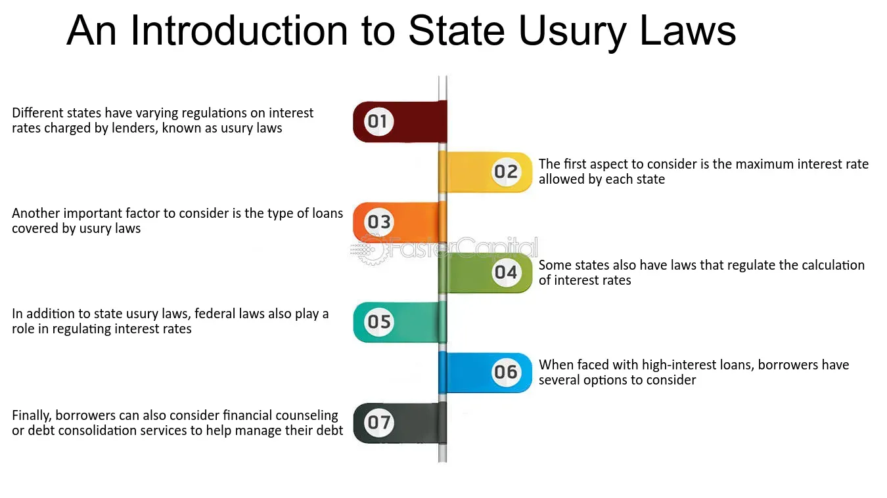

## Table of Contents

## What is usury?

Usury is when someone charges a very high interest rate on a loan. It's like borrowing money and then having to pay back a lot more than you borrowed. People often think usury is unfair because it can make it hard for the borrower to pay back the money.

In the past, many religions and cultures thought usury was wrong. They believed it was not right to make money just from lending money. Today, many places have laws about how much interest someone can charge to stop usury from happening.

## Why were usury laws created?

Usury laws were created to protect people from being taken advantage of when they borrow money. A long time ago, some people would lend money and then charge very high interest rates. This made it hard for the people who borrowed the money to pay it back. It could make them very poor or even lose their homes. So, governments made laws to stop this from happening. These laws set a limit on how much interest someone could charge on a loan.

These laws also came from beliefs in many religions and cultures that thought charging too much interest was wrong. They believed it was unfair to make money just by lending money, especially when it hurt the people who needed to borrow. By making usury laws, governments wanted to make sure that lending money was fair and did not cause more problems for people who were already struggling.

## How do usury laws vary by country?

Usury laws are different in every country. Some countries have strict rules about how much interest someone can charge on a loan. For example, in some places, the government says that the [interest rate](/wiki/interest-rate-trading-strategies) cannot be more than a certain percent. This helps keep loans fair and stops people from charging too much. Other countries might not have such strict rules, and they let lenders charge higher interest rates. This can sometimes lead to problems for people who borrow money because the loans can be very expensive.

In the United States, each state can have its own usury laws. Some states have a limit on interest rates, while others do not have any limits at all. This means that in one state, a loan might be legal, but in another state, the same loan might be against the law because the interest rate is too high. In Europe, countries like Germany and France have laws that set a maximum interest rate, but the rates can be different from one country to another. In some countries, like Japan, the government has changed the usury laws over time to try to balance protecting borrowers and letting lenders make money.

## What is the typical maximum interest rate set by usury laws?

Usury laws set a maximum interest rate that lenders can charge on loans. This rate can be different in each country or even in different parts of the same country. In the United States, some states set the maximum interest rate at around 10% to 12% for personal loans, but other states might not have any limit at all. In Europe, countries like Germany might set the maximum at around 20%, while France might have a different limit.

In other parts of the world, the maximum interest rate can also vary a lot. For example, in Japan, the limit used to be around 20%, but it was changed to 15% to help protect people from very high interest rates. In some countries, the government might change the maximum interest rate over time to balance helping people who borrow money and letting lenders make money. The main goal of these laws is to make sure that loans are fair and do not cause big problems for people who need to borrow money.

## How are usury laws enforced?

Usury laws are enforced by the government to make sure lenders do not charge too much interest on loans. If someone thinks they are being charged too much interest, they can complain to a government agency that looks after these things. The agency will check the loan agreement and see if the interest rate is more than what the law allows. If it is, the lender might have to pay back the extra interest they charged and could even get in trouble, like paying a fine or going to court.

Sometimes, people can also take their lender to court if they think the interest rate is too high. They can ask a judge to look at their loan and decide if it breaks the usury laws. If the judge agrees, they can make the lender stop charging the high interest and might even cancel the loan. This helps protect people from unfair loans and makes sure that everyone follows the rules about how much interest can be charged.

## What are the penalties for violating usury laws?

If someone breaks usury laws by charging too much interest, they can get in trouble. The government might make them pay back the extra interest they charged to the person who borrowed the money. This means the lender has to give back the money they took as extra interest, so the borrower does not have to pay it.

The lender could also have to pay a fine to the government. This is like a punishment for breaking the law. In some cases, if the violation is very bad, the lender might have to go to court. A judge could decide to cancel the loan completely, which means the borrower does not have to pay back any of the money they borrowed. These penalties help make sure lenders follow the rules and treat people fairly when they lend money.

## Can usury laws be circumvented, and if so, how?

Yes, some people try to get around usury laws by finding ways to charge high interest without breaking the rules. One way they do this is by using different names for the interest, like calling it a "fee" or "service charge" instead of "interest." This can make it harder for people to see that the total cost of the loan is still too high. Another way is by making the loan in a place where the usury laws are not as strict. For example, a lender might say the loan comes from a different state or country where they can charge more interest.

Sometimes, lenders also use tricks like giving the borrower less money than they need but making them pay back the full amount plus interest. This can make the real interest rate much higher than what the law allows. These ways of getting around usury laws can be hard to stop because they are sneaky. But if people find out about these tricks, they can still complain to the government or take the lender to court to make them follow the law.

## How have usury laws evolved over time?

Usury laws have changed a lot over time. A long time ago, many religions and cultures thought it was wrong to charge any interest on loans. They believed it was not fair to make money just by lending money. So, they made strict rules against it. But as time went on, people started to see that some interest was okay if it was not too much. This helped people who needed to borrow money and made it easier for lenders to make money too. Governments started to make laws that set a limit on how much interest someone could charge, instead of saying no interest at all.

In more recent times, usury laws have kept changing to fit the needs of different places. In some countries, the government might change the maximum interest rate to help people who borrow money or to let lenders make more money. For example, in the United States, each state can have its own rules about interest rates. Some states have strict limits, while others do not have any limits at all. In Europe and other parts of the world, countries also have different rules. These changes show that governments are trying to find a balance between protecting people from unfair loans and letting lenders do business.

## What impact do usury laws have on the economy?

Usury laws can have a big impact on the economy. These laws set a limit on how much interest lenders can charge on loans. When the interest rates are low, more people can borrow money because the loans are cheaper. This can help the economy grow because people can use the money to buy things, start businesses, or pay for school. But if the interest rates are too low, lenders might not want to lend money because they cannot make enough money from the loans. This can make it harder for people to get loans when they need them.

On the other hand, if usury laws let lenders charge high interest rates, fewer people might borrow money because the loans are too expensive. This can slow down the economy because people might not spend as much money or start new businesses. But if the interest rates are high enough, lenders will want to lend more money because they can make more money from the loans. This can help the economy by making more money available for people to borrow. So, finding the right balance with usury laws is important for keeping the economy healthy.

## How do usury laws affect lending practices?

Usury laws change how lenders give out loans. These laws set a limit on how much interest lenders can charge. Because of this, lenders have to be careful not to charge too much interest. If they do, they could get in trouble with the government. Lenders might also have to find other ways to make money, like charging fees for other services. This can make loans more complicated, but it helps keep the interest rates fair for people who borrow money.

When usury laws are strict, lenders might not want to give out as many loans. This is because they cannot charge enough interest to make a good profit. So, they might only lend money to people they think can pay it back for sure. This can make it harder for some people to get loans, especially if they need the money but are seen as risky borrowers. But when usury laws are not too strict, lenders might be more willing to give out loans because they can charge more interest. This can help more people get the money they need, but it can also lead to problems if the interest rates get too high.

## What are the current debates surrounding usury laws?

People have different opinions about usury laws. Some people think these laws are good because they stop lenders from charging too much interest. They believe that without these laws, people who need to borrow money could get into big trouble. They might not be able to pay back the loans and could lose their homes or go bankrupt. These people want the government to keep strict usury laws to protect borrowers.

Others think usury laws can make it harder for people to get loans. They say that if the interest rates are too low, lenders might not want to give out loans because they cannot make enough money. This can hurt the economy because people might not be able to start businesses or buy things they need. These people think the government should let lenders charge more interest so more people can get loans and the economy can grow.

## How do international usury regulations influence global financial practices?

International usury regulations affect how money is lent and borrowed all over the world. Different countries have different rules about how much interest lenders can charge. This can make it hard for lenders who want to give out loans in many countries because they have to follow different rules in each place. Sometimes, lenders try to get around these rules by making loans in countries where the interest rates can be higher. This can lead to problems because it might mean that some people are paying too much interest, even if it is legal in that country.

These regulations also affect how much money people can borrow and how much it costs. If one country has very strict usury laws, it might be hard for people there to get loans because lenders do not want to charge low interest rates. But if another country has looser rules, more people might be able to get loans, but they could end up paying a lot more in interest. This can make it tricky for people who need to borrow money to decide where to get a loan from. It also means that the global economy can be affected because the flow of money between countries can change based on these different rules.

## What is the role of interest rates in lending?

Interest rates are a crucial element in the financial ecosystem, representing the cost of borrowing money or the return on invested funds. These rates exert significant influence on the economy by affecting consumer spending, business investment, and the overall level of economic activity. When interest rates are low, borrowing becomes more attractive, potentially stimulating economic growth as individuals and businesses increase spending and investment. Conversely, high interest rates can slow down economic activity by making loans more expensive and savings more attractive.

Interest rates can be categorized into several types:

1. **Variable Interest Rates**: These rates fluctuate based on underlying benchmarks or indices, such as the prime rate or the London Interbank Offered Rate (LIBOR). Borrowers with variable rates might benefit from initial lower payments, but they face the risk of rate hikes over time.

2. **Fixed Interest Rates**: Fixed rates remain constant throughout the duration of the loan agreement. This offers predictability for borrowers in terms of payments, although it can be less advantageous if interest rates decline after the loan is taken out.

3. **Nominal Interest Rates**: These are the stated rates without adjusting for inflation. They simply express the percentage increase in money that the borrower must pay back.

4. **Real Interest Rates**: Real interest rates account for inflation, providing a more accurate measure of the cost of borrowing. They are calculated as the nominal rate minus the inflation rate, expressed as:
$$
   \text{Real Interest Rate} = \text{Nominal Interest Rate} - \text{Inflation Rate}

$$

Several factors influence interest rate levels, including central bank policies, inflation expectations, economic growth patterns, and the supply and demand for credit. Central banks, such as the Federal Reserve in the United States or the European Central Bank in the Eurozone, play a pivotal role by setting benchmark rates that influence overall interest rates in the economy. Inflation expectations affect interest rates because lenders demand a higher return to compensate for the decreased purchasing power of future payments if inflation is anticipated to rise.

Interest rates significantly impact borrowing and lending behavior. For borrowers, lower rates reduce the cost of financing purchases like homes, cars, and education, often leading to increased borrowing and economic activity. For lenders, interest rates represent the reward for providing capital, with higher rates offering more attractive returns on savings and investments.

The relationship between interest rates and usury laws is complex. Usury laws set maximum permissible interest rates for loans to protect consumers from predatory lending practices. These caps can influence how lenders price their loans and might limit access to credit if the ceiling is set too low relative to market conditions. During periods of high inflation or economic stagnation, debates often arise about the appropriateness and flexibility of these caps, considering that rigid limits can sometimes restrict the availability of credit beyond the intended protection for consumers.

 to Algorithmic Trading (Algo Trading)

Algorithmic trading, often referred to as algo trading, is a method of executing orders using automated, pre-programmed trading instructions. These instructions account for variables such as time, price, and [volume](/wiki/volume-trading-strategy), allowing for trades to be conducted at speeds and frequencies that are beyond human capabilities. The primary functionality of [algorithmic trading](/wiki/algorithmic-trading) lies in its ability to optimize trade execution in financial markets with minimal human intervention.

The transition from traditional trading methods to algorithmic ones marks a significant evolution in financial markets. Traditional trading relied heavily on individual traders making decisions based on analysis and intuition. This process was not only time-consuming but also limited by human emotional biases. Algorithmic trading addresses these limitations by using complex algorithms, sometimes in conjunction with [machine learning](/wiki/machine-learning) techniques, to analyze market data and execute trades with precision and speed.

The benefits of algorithmic trading are manifold. One of the most significant advantages is speed. Algorithms can process and react to market data in milliseconds, executing trades much faster than human traders. This speed allows traders to capitalize on short-lived market opportunities. Efficiency is another critical benefit; algorithms can process large volumes of data and handle multiple variables simultaneously, reducing the likelihood of errors associated with manual trading. Furthermore, algorithmic trading is cost-effective. By automating the trading process, it reduces transaction costs and improves the overall profitability of trading strategies.

Interest rates play a crucial role within algorithmic trading strategies. For instance, interest rates can influence the cost of holding or financing an asset. Algorithms can be programmed to respond to changes in interest rates, adjusting trading strategies accordingly. This responsiveness is particularly important in environments where central banks frequently alter interest rates to control economic factors such as inflation and employment. 

Despite its advantages, algorithmic trading comes with challenges and risks. One primary concern is the potential for market [volatility](/wiki/volatility-trading-strategies), as algorithms can lead to rapid price movements when multiple automated systems react simultaneously to market events. Additionally, technical failures, such as software bugs or system outages, pose significant risks. Furthermore, the complexity of algorithms makes them susceptible to errors, which can result in substantial financial losses. Moreover, there are ethical concerns about the fairness and transparency of algorithmic trading, particularly with high-frequency trading, which can disadvantage traditional traders.

Overall, while algorithmic trading offers distinct benefits in terms of speed, efficiency, and cost, it also requires careful consideration of associated risks and challenges. As technology continues to advance, algorithmic trading will likely play an increasingly central role in financial markets, necessitating ongoing adaptation and innovation by traders and regulators alike.

## References & Further Reading

[1]: ["Algorithmic Trading and DMA: An introduction to direct access trading strategies"](https://archive.org/details/algorithmictradi0000john) by Barry Johnson

[2]: ["Interest Rate Markets: A Practical Approach to Fixed Income"](https://onlinelibrary.wiley.com/doi/book/10.1002/9781119200949) by Siddhartha Jha

[3]: ["Usury in Christendom: The Mortal Sin that Was and Now is Not"](https://www.amazon.com/Usury-Christendom-Mortal-Sin-that/dp/0970378491) by Michael Hoffman

[4]: ["Algorithmic and High-Frequency Trading"](https://www.cambridge.org/us/universitypress/subjects/mathematics/mathematical-finance/algorithmic-and-high-frequency-trading) by Álvaro Cartea, Sebastian Jaimungal, and José Penalva

[5]: ["Usury Laws: A Legal and Economic Evaluation"](https://books.google.com/books/about/Usury_Laws.html?id=a7THi5bwnoQC) by Todd J. Zywicki