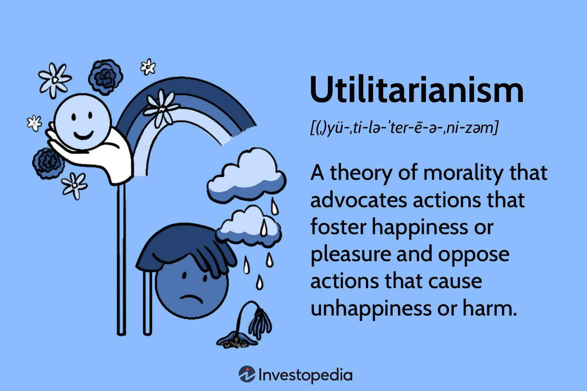

Ethics, a branch of philosophy, investigates into questions surrounding morality, exploring what constitutes right or wrong behavior. Philosophy, by extension, serves as a systematic approach to understanding and evaluating human actions and decision-making processes. Utilitarianism, one of the prominent ethical theories, emphasizes evaluating actions based on their outcomes, striving for "the greatest happiness for the greatest number." Algorithmic trading, a method of executing trading orders using pre-programmed instructions, has become increasingly prevalent in modern financial markets, driven by speed, efficiency, and data analysis capabilities.

Ethics play a crucial role in financial markets, where decisions can significantly impact individual lives and broader socio-economic structures. Ethical considerations ensure that practices within the financial sphere align with societal values, promoting trust and stability. As algorithmic trading continues to dominate the landscape, accounting for a substantial portion of market transactions, the necessity for ethical oversight becomes more pronounced.



The increasing reliance on algorithmic trading poses a central question: How can utilitarian philosophy guide the ethical development of these trading strategies? This article seeks to explore the intersection of ethics, philosophy, utilitarianism, and algorithmic trading, starting with foundational concepts. It will then examine the ethical challenges inherent in algorithmic trading and propose ways in which utilitarian principles might inform ethical decision-making in this context. Concluding with future perspectives, it will offer strategies for promoting ethical standards in the continuously evolving domain of algorithmic trading, thus encouraging a balanced dialogue between technological advancement and ethical accountability.

## Table of Contents

## Understanding Ethics and Philosophy

Ethics is a significant branch of philosophy that addresses questions about morality, guiding individuals in making decisions about what is right or wrong, just or unjust. At its core, ethics involves the systematization, defense, and recommendation of concepts of right and wrong behavior. This branch of philosophy is integral in evaluating human actions and decision-making processes, striving to ascertain whether actions align with ethical norms and principles.

Philosophy plays a pivotal role in evaluating human actions and decision-making by providing structured methodologies for assessing the values and principles underlying choices. Philosophy helps dissect and analyze complex problems by offering a variety of lenses through which moral reasoning can be scrutinized. Critical thinking and logical analysis, essential components of philosophical inquiry, aid individuals and societies in understanding the implications of their actions.

Throughout history, different ethical frameworks have emerged to guide moral reasoning. Notable among these is utilitarianism, an ethical theory that evaluates the rightness or wrongness of actions based on their consequences. This framework advocates for actions that promote the greatest happiness for the greatest number. Other ethical frameworks include deontological ethics, which emphasizes duties and rules, and virtue ethics, which focuses on the moral character of individuals. Each framework offers distinct perspectives on what constitutes ethical behavior, influencing how moral decisions are approached.

The significance of ethics extends to professions impacting society, such as finance. In these fields, ethical conduct is paramount, as decisions and actions can have widespread consequences on individuals, communities, and economies. Adherence to ethical principles fosters trust, integrity, and accountability, crucial elements in maintaining the stability and sustainability of financial markets. Ethical lapses can lead to detrimental outcomes, highlighting the need for robust ethical frameworks to guide decision-making in complex professional environments. Integrating ethics into professional practices ensures that actions align with societal values and expectations, thereby safeguarding public interest and welfare.

## What is Utilitarianism?

Utilitarianism is an ethical theory that posits the morality of an action is determined by its overall consequences. The core idea emphasizes maximizing happiness and minimizing suffering, encapsulated in the phrase, "the greatest happiness for the greatest number." This principle suggests that the ethical value of any action is measured by the net increase in pleasure compared to the pain it produces. 

The origins of utilitarianism trace back to philosophers Jeremy Bentham and John Stuart Mill. Bentham, an influential thinker of the 18th and 19th centuries, introduced the notion of quantifying happiness and suffering, suggesting that actions are right if they promote pleasure and wrong if they produce pain. Bentham's utilitarian calculus involved assessing factors such as intensity, duration, certainty, and extent to determine an action's moral worth.

John Stuart Mill later expanded on Bentham’s ideas, advocating for a qualitative approach to happiness. Mill distinguished between higher and lower pleasures, proposing that intellectual and moral pleasures hold greater value than mere physical satisfaction. This nuanced understanding acknowledges the complexity of human experiences and the varying degrees of utility derived from different activities.

Utilitarianism holds significant relevance in practical ethics due to its focus on outcomes. Its principles are often applied in decision-making processes across diverse fields, from healthcare to public policy, where the goal is to achieve the maximum benefit for the most people. This ethical framework is particularly useful in situations requiring cost-benefit analyses, helping decision-makers weigh the potential impacts of various options to identify the most beneficial [course](/wiki/best-algorithmic-trading-courses) of action. 

Critically, utilitarianism challenges individuals and institutions to consider the broader implications of their actions, fostering a mindset that values the collective well-being. Despite its practical appeal, utilitarianism faces challenges, such as difficulties in quantifying happiness, potential neglect of individual rights, and the complexity of predicting outcomes accurately. Nonetheless, its emphasis on collective welfare continues to influence ethical deliberations and policy formulations globally.

 to Algorithmic Trading

Algorithmic trading, often abbreviated as algo-trading, refers to the use of computer algorithms to automate trading processes in financial markets. These algorithms execute pre-defined sets of instructions for placing trades, dictating parameters such as timing, price, or quantity, enabling traders to achieve optimal outcomes faster and more efficiently than human traders could. Algorithmic trading capitalizes on the computational power of modern technology to manage and execute high-speed transactions, potentially transforming trading strategies.

At the core of [algorithmic trading](/wiki/algorithmic-trading) are quantitative models, which often rely on statistical analyses and mathematical computations to predict and capitalize on market movements. These models are driven by various indicators and technical inputs such as moving averages, [momentum](/wiki/momentum) oscillators, and other market signals, which can be customized according to the strategist's objectives. For instance, a moving average crossover strategy could be programmed to buy a security when a short-term moving average crosses above a long-term moving average, and sell when it crosses below.

Python, one of the most popular programming languages in the field of finance, is frequently used to create such trading algorithms due to its simplicity and a vast ecosystem of libraries such as NumPy and pandas for numerical computation and data manipulation. Here is a simple example of a moving average crossover strategy in Python:

```python
import pandas as pd

# Sample data: loading historical market data
data = pd.read_csv('market_data.csv')

# Calculating moving averages
short_window = 40
long_window = 100
data['Short_MA'] = data['Close'].rolling(window=short_window, min_periods=1, center=False).mean()
data['Long_MA'] = data['Close'].rolling(window=long_window, min_periods=1, center=False).mean()

# Generating signals
data['Signal'] = 0
data['Signal'][short_window:] = np.where(data['Short_MA'][short_window:] > data['Long_MA'][short_window:], 1, 0)
data['Position'] = data['Signal'].diff()

# Inspect the generated signals
print(data[['Close', 'Short_MA', 'Long_MA', 'Signal', 'Position']].tail())
```

The adoption of algorithmic trading has been fueled by its substantial advantages. The primary benefits include enhanced speed and efficiency; algorithms can respond to market conditions and execute orders within milliseconds, a feat unattainable by human traders. This rapid execution minimizes manual errors and improves order accuracy. Furthermore, algorithms can process and analyze large volumes of data in real-time, enabling more informed decision-making and facilitating complex trading strategies, such as statistical [arbitrage](/wiki/arbitrage) or [market making](/wiki/market-making).

Globally, algorithmic trading has witnessed significant growth, with estimates suggesting that it accounts for over 70% of the stock trading [volume](/wiki/volume-trading-strategy) in developed markets like the United States. This dominance is attributed to the competitive edge provided by algorithmic systems in terms of operational efficiency and effectiveness in capturing fleeting market opportunities.

Despite its benefits, algorithmic trading also raises ethical and regulatory considerations, prompting ongoing discussions among industry stakeholders. Nevertheless, its role in modern financial markets continues to expand as technology evolves, underscoring the need for continuous optimization and ethical oversight.

## Ethical Challenges in Algorithmic Trading

Algorithmic trading has revolutionized the financial markets by providing unparalleled speed and efficiency. However, its adoption has led to various ethical challenges that merit careful consideration and regulation. One significant concern is market manipulation, an unethical practice where market dynamics are artificially influenced to create favorable conditions for traders at the expense of the broader market. Algorithms can be programmed to engage in spoofing, where large orders are placed and then canceled to give false impressions of demand or supply, thereby manipulating prices. The pervasive nature of such strategies challenges market fairness and the integrity of trading environments.

Transparency in algorithmic trading is another critical issue. Traditional trading is often governed by systems and procedures well understood by market participants. In contrast, algorithms operate in a less transparent manner, making it difficult for regulators to monitor compliance with ethical standards. The proprietary nature of algorithmic models prevents full disclosure, thereby hindering efforts to ensure that trades are conducted ethically and without undue advantage.

High-frequency trading ([HFT](/wiki/high-frequency-trading-strategies)), a subset of algorithmic trading, poses additional ethical challenges. HFT involves transacting a large number of orders at extremely fast speeds, often within milliseconds. While this can enhance market [liquidity](/wiki/liquidity-risk-premium) and efficiency, it also raises concerns about market stability. The Flash Crash of May 6, 2010, serves as a pertinent example where HFT contributed to rapid and extreme market fluctuations, leading to a sudden drop in the United States financial markets. Such incidents highlight the potential for algorithms to disrupt market stability and amplify systemic risk.

Ethical breaches in algorithmic trading have been documented, with notable cases providing lessons on the importance of stringent oversight. For instance, in 2012, Knight Capital Group experienced a major trading error due to faulty algorithm deployment, leading to a loss of $440 million and demonstrating the potentially disastrous consequences of inadequate ethical and technical controls. This case emphasizes the need for robust testing and oversight mechanisms to prevent unethical behavior and mitigate adverse outcomes in algorithmic trading. 

Overall, the ethical challenges associated with algorithmic trading underscore the necessity for regulatory frameworks and industry standards that prioritize fairness, transparency, and market stability. Implementing these measures is vital to ensure that the benefits of algorithmic trading are realized without compromising the ethical foundations of financial markets.

## Applying Utilitarianism to Algorithmic Trading

Utilitarianism, as an ethical framework, can offer valuable insights into the ethical development of algorithmic trading strategies by focusing on outcomes that promote the greatest good. When applied to algorithmic trading, utilitarian principles can guide decision-making by emphasizing the broader social and economic impacts of trading practices.

One of the main benefits of using utilitarian ethics in this context is the promotion of market efficiency and fairness. Algorithmic trading, by its nature, can process vast amounts of data at a speed unattainable by human traders. By utilizing utilitarian principles, traders and developers can design algorithms that not only seek profit but also enhance liquidity, reduce transaction costs, and improve price discovery, which benefits the wider market ecosystem. Algorithms could, for example, be programmed to avoid exacerbating market [volatility](/wiki/volatility-trading-strategies) during times of low liquidity, thus helping maintain a stable trading environment which aligns with utilitarian ethics by maximizing overall market welfare.

However, significant challenges arise in the practical implementation of utilitarian approaches in algorithmic trading. One such challenge is the difficulty in measuring and comparing the consequences of different trading strategies. The utilitarian calculus, which involves evaluating the positive and negative impacts of actions on affected parties, becomes complex when the outcomes are distributed across a network as vast and intricate as the global financial system. Quantifying the potential benefits and harms, such as impacts on market participants that are not direct counter-parties, presents methodological hurdles. Additionally, the non-linear dynamics of financial markets mean that algorithmic trading actions can have unintended repercussions, complicating utilitarian evaluations.

The role of regulatory frameworks and corporate governance is critical in supporting utilitarian ethics in algorithmic trading. Regulatory bodies can enforce standards that ensure algorithms are designed to contribute to market integrity and economic stability. Policies mandating transparency in algorithmic decision processes, for instance, can help align trading practices with utilitarian ethics by holding firms accountable for strategies that may otherwise prioritize profit over public welfare. Additionally, corporate governance can promote a culture of ethical responsibility. By integrating utilitarian principles into their internal policies, companies can encourage the development of trading algorithms that maximize positive societal impacts while minimizing harm.

In summary, utilitarian principles offer a robust framework for guiding ethical decision-making in algorithmic trading by foregrounding the broader consequences of trading practices. While challenges exist in measuring and implementing these principles, supportive regulatory and corporate infrastructures can bolster efforts to design algorithms that not only achieve profitability but also contribute positively to market systems and society at large.

## Case Studies

In the context of algorithmic trading, utilitarian ethics provide a framework for evaluating the moral implications of trading strategies by focusing on the outcomes and overall well-being generated by these decisions. Several case studies illustrate how utilitarian ethics can be applied to algorithmic trading dilemmas, showcasing both successes and challenges.

One notable success occurred within a major financial institution that implemented a new algorithm designed to optimize stock trades for retirement funds. By prioritizing strategies that aimed to maximize returns for the largest number of fund participants, the institution successfully increased the average retirement savings of its clients. This approach reflected the utilitarian principle of "the greatest happiness for the greatest number." The institution's focus on positive outcomes for a wide demographic, including long-term financial security for retirees, showcased a commitment to ethical decision-making aligned with utilitarian values.

However, challenges arise when attempting to measure and compare the consequences of algorithmic trading strategies. A case involving high-frequency trading (HFT) firms highlighted such difficulties. In this instance, HFT algorithms were designed to capitalize on minute price discrepancies across different markets, providing liquidity and reducing spreads. While these benefits conformed to utilitarian ideals of market efficiency, the sheer speed and volume of trades introduced systemic risks, including market instability and potential flash crashes. The unintended negative consequences for smaller investors and overall market fairness presented a complex ethical dilemma, reflecting the limitations of utilitarian calculations in predicting long-term outcomes.

Responses from financial institutions and regulatory bodies have varied in addressing these ethical challenges. In response to the systemic risks observed in HFT, regulatory actions such as implementing circuit breakers and imposing limits on order-to-trade ratios were introduced. These measures aimed to mitigate adverse market impacts while preserving the benefits of algorithmic trading for liquidity and efficiency. Financial institutions have also adapted by incorporating ethical reviews into their algorithm development processes, ensuring that the potential consequences of trading strategies are evaluated through an ethical lens.

Despite these efforts, the dynamic nature of financial markets and the rapid advancement of technology continually introduce new ethical challenges. The need for ongoing dialogue between regulators, financial institutions, and ethical theorists remains critical in navigating these complexities and fostering algorithmic trading practices that align with utilitarian principles.

## Future Perspectives

As technology continues to evolve, the future of ethics in algorithmic trading is poised to face complex challenges and opportunities. The integration of advanced technologies like [artificial intelligence](/wiki/ai-artificial-intelligence) and [machine learning](/wiki/machine-learning) in algorithmic trading systems raises potential ethical dilemmas that warrant careful consideration.

One emerging ethical dilemma is the increasing opacity of algorithmic decision-making processes. As algorithms become more sophisticated, the rationale behind their trading decisions may become less transparent, complicating accountability and oversight. This opacity can lead to significant ethical concerns, especially when algorithms are responsible for executing large volumes of trades that can impact market stability and investor confidence.

Another potential issue is the inadvertent perpetuation of biases within trading algorithms. Machine learning models trained on historical market data can inadvertently learn and replicate existing market biases, potentially leading to unfair or discriminatory practices. Ensuring data integrity and incorporating fairness constraints into algorithmic design becomes crucial in addressing this challenge.

To promote ethical standards globally in algorithmic trading, several strategies can be proposed. First, enhancing regulatory frameworks to include comprehensive guidelines for the ethical use of algorithms is imperative. Regulators can mandate transparent reporting and auditing requirements for algorithmic trading systems to ensure adherence to ethical standards.

Second, fostering a culture of ethical accountability within financial institutions can drive positive change. By establishing internal committees dedicated to monitoring and evaluating the ethical implications of trading algorithms, institutions can proactively address potential ethical breaches. Additionally, promoting interdisciplinary collaboration between technologists, ethicists, and financial experts can facilitate balanced ethical decision-making.

Technological solutions, such as ethical AI, present promising avenues for enhancing ethical algorithmic trading practices. The development of AI systems explicitly designed to incorporate ethical reasoning into their decision-making processes can mitigate ethical risks. For instance, incorporating ethical parameters into trading algorithms can help ensure they align with broader societal values, such as fairness and transparency.

Incorporating machine learning techniques like explainable AI (XAI) can also enhance transparency by providing insights into the decision-making processes of complex algorithms. XAI models can unravel the "black box" nature of many AI systems, allowing stakeholders to understand how specific trading decisions are made, thereby facilitating accountability and trust.

Moreover, leveraging blockchain technology can support ethical algorithmic trading by enhancing transparency and traceability of transactions. Blockchain's decentralized and immutable nature can help prevent tampering and ensure that trading activities adhere to established ethical norms.

Overall, advancing ethical standards in algorithmic trading will require a multifaceted approach that includes regulatory enhancements, cultural shifts within financial institutions, and the integration of innovative technological solutions. As these efforts evolve, they hold the potential to create a more transparent, fair, and accountable algorithmic trading ecosystem.

## Conclusion

Throughout this exploration of ethics, utilitarianism, and algorithmic trading, we have highlighted the pressing need for ethical frameworks in financial markets. Given the profound influence of algorithmic trading on global finance, the integration of utilitarian ethics offers a compelling avenue for ensuring that trading practices yield the greatest benefit to the greatest number. Utilitarian principles, which prioritize the consequences of actions, can serve as a moral compass in developing strategies that enhance market efficiency and fairness.

There is immense potential for utilitarian ethics to guide ethical practices in modern finance, particularly in the design and implementation of algorithmic trading systems. By focusing on outcomes that maximize collective well-being, finance professionals can foster trust and stability within the markets. Moreover, utilitarianism provides a structured approach to addressing ethical challenges, such as market manipulation and transparency, by evaluating the broader impacts of trading decisions.

Ongoing dialogue and ethical reflection among professionals and regulators are essential to navigate the complexities of algorithmic trading. As technology continues to advance, frequent reassessment of ethical standards and practices must be prioritized. Engaging diverse stakeholders in these discussions will help cultivate an inclusive atmosphere for innovation that is ethically sound.

In conclusion, stakeholders must prioritize ethics in financial innovation by integrating utilitarian principles into the fabric of trading strategies and regulations. This approach will not only safeguard market integrity but also promote societal welfare. As we move forward, a collective commitment to ethical practices will be crucial in shaping a sustainable future for financial markets. Let us leverage the power of utilitarian ethics to champion ethical rigor in modern finance, inspiring a culture of responsibility and accountability across global financial systems.

## References & Further Reading

[1]: Bentham, J., & Mill, J. S. (2003). ["Utilitarianism and Other Essays"](https://www.penguinrandomhouse.com/books/261080/utilitarianism-and-other-essays-by-john-stuart-mill-and-jeremy-bentham-edited-with-an-introduction-by-alan-ryan/). Penguin Classics.

[2]: Biais, B., & Foucault, T. (2014). ["HFT and Market Quality"](https://thierryfoucault.com/wp-content/uploads/2014/09/publishedversion.pdf). The Oxford Handbook of High-Frequency Trading.

[3]: MacKenzie, D. (2018). ["Market Devices: How Data, Algorithms, and Calculations Construct Transparency in High-Frequency Trading."](https://www.semanticscholar.org/paper/Material-Signals%3A-A-Historical-Sociology-of-MacKenzie/a3347764ea03c35bddbc703940a907c6e52f6f6b) Project Management in the Digital Economy.

[4]: Popper, N. (2015). ["Digital Gold: Bitcoin and the Inside Story of the Misfits and Millionaires Trying to Reinvent Money."](https://archive.org/details/digitalgoldbitco0000popp) Harper.

[5]: de Prado, M. L. (2018). ["Advances in Financial Machine Learning"](https://www.amazon.com/Advances-Financial-Machine-Learning-Marcos/dp/1119482089). Wiley.

[6]: Chan, E. P. (2008). ["Quantitative Trading: How to Build Your Own Algorithmic Trading Business"](https://github.com/ftvision/quant_trading_echan_book). Wiley.