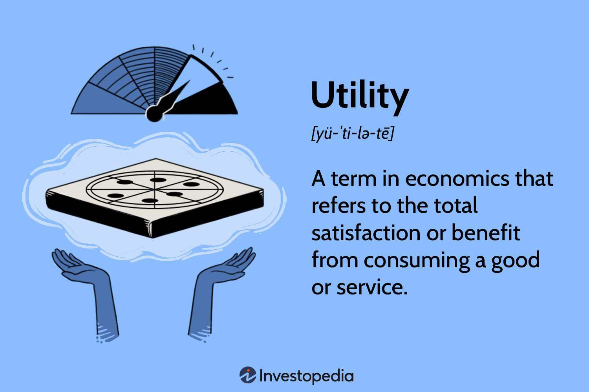

Utility measurement is a foundational concept in economics, rooted in the idea of quantifying the satisfaction or value that individuals derive from goods and services. Historically, utility has been used to explain consumer choice behavior, influencing demand patterns and pricing strategies. This article examines how these economic theories of utility are increasingly being applied in algorithmic trading, a domain at the forefront of modern finance.

Algorithmic trading involves the use of advanced mathematical models and computer programs to execute trading strategies automatically. In recent years, there has been a growing interest in incorporating economic principles of utility into these systems to enhance decision-making processes. By integrating utility concepts, trading algorithms can be fine-tuned to account for varying investor preferences, particularly with regards to risk and potential returns.



Utility measurement encompasses various forms, such as total and marginal utility, each serving a distinct purpose in assessing consumer satisfaction. When applied to trading algorithms, these concepts enable a better understanding of how to allocate resources optimally, aiming to maximize the expected utility of investment portfolios. This is crucial in environments characterized by uncertainty and risk, where traditional decision-making models may fall short.

The relevance of utility in improving trading strategies manifests in several ways. It informs the development of sophisticated utility functions that model investor behavior more accurately. These functions allow algorithms to adjust portfolio allocations dynamically, optimizing them not just based on expected returns but also in consideration of the investor's specific risk tolerance. Moreover, the principles of utility maximization provide a theoretical framework for achieving the highest possible financial returns given specific constraints, a fundamental objective in algorithmic trading.

In summary, utility measurement in economics offers valuable insights that can be effectively applied to algorithmic trading. Understanding and utilizing these concepts can lead to more robust and adaptable trading strategies, potentially providing a competitive edge in the fast-paced world of financial markets.

## Table of Contents

## Understanding Utility in Economics

Utility is a foundational concept in economics that quantifies the satisfaction or value consumers derive from goods or services. It forms the basis for understanding and modeling consumer choice and behavior. Utility allows economists to analyze how individuals make decisions about consumption and how these decisions affect market demand.

There are several forms of utility that are important to consider:

1. **Total Utility** refers to the total satisfaction received from consuming a certain quantity of goods or services. It is expressed as the sum of the utility gained from each unit consumed. For example, if a consumer derives utility $u_1, u_2, ..., u_n$ from each unit of a good, then total utility $TU$ is given by:
$$
   TU = u_1 + u_2 + ... + u_n

$$

2. **Marginal Utility** is the additional satisfaction obtained from consuming one more unit of a good or service. It is the derivative of the total utility function with respect to quantity, often denoted as $MU$. Formally, if $U(q)$ is the utility function where $q$ represents quantity, then marginal utility is:
$$
   MU = \frac{dU}{dq}

$$
   Marginal utility tends to decrease with each additional unit consumed, a phenomenon known as diminishing marginal utility.

3. **Cardinal versus Ordinal Utility** signifies two approaches to measuring utility. Cardinal utility implies that utility can be quantified and compared numerically, while ordinal utility suggests that goods can be ranked based on preference but not measured precisely. Cardinal utility allows for the expression of how much more one good is preferred over another, whereas ordinal utility simply allows for ranking preferences without expressing magnitude.

Utility is a vital component in economic theory, as it provides insight into consumer choice and behavior. By analyzing utility, economists can predict how changes in price or income influence consumer decisions. This understanding is crucial for both businesses aiming to optimize product offerings and policymakers seeking to influence consumption through taxation or subsidies.

Overall, the measurement of utility forms the backbone of numerous economic models, aiding in the analysis of market dynamics and consumer preferences.

## Types of Economic Utility

Economic utility is a fundamental concept that delineates the different ways products or services fulfill consumer needs and desires, enhancing their value and satisfaction. There are four primary types of economic utility: form, time, place, and possession. Each type plays a crucial role in the consumer decision-making process by addressing various factors of product value and availability.

Form utility refers to the transformation of raw materials or components into finished goods that are ready for consumption or use. It is closely associated with the concept of production and manufacturing, where the emphasis lies on ensuring that the product is designed and constructed to meet consumer demands. For example, a manufacturer converting steel into automobiles enhances form utility because the final product (the car) offers much more value and satisfaction than the raw material in its basic form.

Time utility involves the availability of a product or service at a time when it is most desired by consumers. This type aims to fulfill consumer needs at the most opportune moments, aligning supply with consumer demand. Retailers ensure time utility through proper inventory management and logistics, aiming to have the right products available during peak demand periods or seasons. Offering ski gear before and during winter, for example, creates time utility as the products coincide with consumer needs during that season.

Place utility pertains to the accessibility of a product or service in locations that are convenient for consumers. It emphasizes the distribution aspect, ensuring that products are present at the locations where consumers are most likely to buy them. By establishing retail outlets in strategic locations or utilizing online platforms, businesses enhance place utility. An example would be a coffee chain setting up outlets in busy urban centers to cater to office workers and commuters.

Possession utility is derived from the ease of acquiring a product or service, often facilitated through marketing, sales strategies, financing options, and legal ownership rights. It concerns the processes that simplify the purchase or rental of a product, such as payment methods, terms of sale, and transferring ownership. A smartphone retailer offering installment payment plans increases possession utility by making it financially easier for consumers to acquire the desired product.

Together, these four types of economic utility highlight the strategies and processes businesses deploy to enhance consumer satisfaction and product value, guiding efficient resource distribution and effective market strategies.

## Expected Utility Theory

Expected utility theory is a cornerstone of decision-making under uncertainty, providing a structured method to evaluate choices involving risk. The theory posits that rational individuals make decisions by weighing the expected utilities of different actions, rather than merely considering the expected values or returns.

### Fundamental Concepts

At its core, expected utility theory combines the probabilities of potential outcomes with the utility, or satisfaction, derived from those outcomes. The expected utility $EU$ of a gamble or choice can be mathematically represented as:

$$

EU = \sum_{i=1}^{n} p_i \cdot u(x_i)
$$

where $p_i$ is the probability of outcome $i$, and $u(x_i)$ is the utility associated with outcome $x_i$. This framework allows decision-makers to account for their risk preferences, often demonstrated through utility functions that represent varying attitudes toward risk (e.g., risk-averse, risk-neutral, and risk-seeking behaviors).

### Key Applications in Economics and Finance

Expected utility theory is applied extensively in both economics and finance to model and predict behavior in risky environments. In economics, it assists in understanding consumer choices and market dynamics under uncertain conditions. For instance, the theory underlies portfolio construction principles, where investors seek to balance expected return against risk. This optimization often relies on utility functions, where different stakeholders may prioritize utility differently based on their risk appetites.

In finance, expected utility theory is fundamental to the development of risk management strategies. Derivatives pricing, insurance underwriting, and financial product design are influenced by an understanding of how different actors perceive risk and utility. Portfolio optimization frameworks like the Mean-Variance Model rely heavily on the principles of expected utility to achieve a desirable trade-off between risk and reward [Markowitz, 1952].

Besides guiding practical decision-making, expected utility theory has also significantly shaped theoretical advancements in economics and psychology, influencing the development of behavioral economics and prospect theory, which address anomalies and deviations from the expected utility model observed in real-world decision-making.

### Limitations

While expected utility theory is powerful, it is not without limitations. Some critics argue that it oversimplifies human behavior by assuming rationality and consistent risk preferences. This has led to alternative theories and models that incorporate behavioral insights, acknowledging that individuals often make decisions based on heuristics and biases rather than strict utility maximization.

In the continued evolution of economic and financial models, expected utility theory remains a foundational framework, yet it is complemented by broader approaches to understanding decision-making in complex, uncertain environments.

## Utility Maximization

Utility maximization is a fundamental concept in economics that describes how individuals and firms decide how to allocate their available resources to achieve the highest possible level of satisfaction or utility. This idea is deeply rooted in the economic theory of consumer choice, which assumes that consumers aim to maximize their utility subject to their budget constraints. 

The principle of utility maximization is typically expressed through a utility function, $U(x_1, x_2, \ldots, x_n)$, where $x_i$ represents the quantity of goods or services consumed. Individuals seek to choose $x_1, x_2, \ldots, x_n$ such that:

$$
\max U(x_1, x_2, \ldots, x_n)
$$
$$
\text{subject to } \sum_{i=1}^n p_i x_i \leq M
$$

where $p_i$ is the price of good $i$, and $M$ is the consumer's budget. 

For firms, utility maximization translates into profit maximization, where firms choose quantities of inputs to maximize their profit, given cost constraints and production capacity. The firm’s utility function, in this case, could be represented as a profit function or a function of shareholder value.

In [algorithmic trading](/wiki/algorithmic-trading), understanding utility maximization is crucial as trading algorithms aim to optimize asset allocation to achieve the highest expected returns while considering various constraints such as risk tolerance and market conditions. Algorithmic strategies often employ utility functions to evaluate potential trades. For example, a common approach is to use utility functions that incorporate risk, such as the constant relative risk aversion (CRRA) utility function, expressed as:

$$
U(W) = \frac{W^{1 - \gamma}}{1 - \gamma}
$$

where $W$ is wealth and $\gamma$ is the coefficient of relative risk aversion.

In Python, implementing utility maximization can involve using optimization libraries such as `scipy.optimize` to solve for the asset allocation that maximizes the utility function:

```python
from scipy.optimize import minimize

def utility(weights, returns, gamma):
    portfolio_return = sum(weights * returns)
    return - (portfolio_return**(1 - gamma) / (1 - gamma))

# Example parameters
expected_returns = [0.05, 0.07, 0.02]
risk_aversion = 2.0
initial_weights = [0.33, 0.33, 0.34]

# Constraint: weights sum to 1
constraints = {'type': 'eq', 'fun': lambda weights: sum(weights) - 1}

# Bounds: weights must be between 0 and 1
bounds = [(0, 1) for _ in expected_returns]

# Optimization
result = minimize(utility, initial_weights, args=(expected_returns, risk_aversion),
                  constraints=constraints, bounds=bounds)

optimal_weights = result.x
```

In this code, `utility` is a function that calculates the negative of the utility to enable the use of minimization algorithms, consistent with how optimization solvers work. The constraints ensure that the sum of the portfolio weights equals 1, and the bounds prevent short selling.

The application of utility maximization in algorithmic trading leverages these mathematical principles to guide decisions on resource (capital) allocation, balancing potential returns against the risk of market [volatility](/wiki/volatility-trading-strategies). This alignment of economic theory with computational techniques enables the development of sophisticated trading strategies that aim to optimize financial outcomes.

## Algorithmic Trading Basics

Algorithmic trading, often referred to as algo trading, involves the use of computer programs to execute trading strategies on financial markets at speeds and frequencies that humans cannot manage. These algorithms can process massive volumes of data and make trading decisions in fractions of a second, capitalizing on even minimal market inefficiencies for profit. This computerized approach to trading is essential to modern finance due to its ability to significantly enhance both trading efficiency and decision-making processes.

One of the core advantages of algorithmic trading is its efficiency in executing large orders. Algorithms can break down entire orders into smaller parts and execute them strategically over time, optimizing price and reducing market impacts. By doing so, they help in minimizing transaction costs and slippage.

Moreover, algorithmic trading is pivotal in improving decision-making. Algorithms are capable of analyzing complex mathematical models and large-scale datasets swiftly to identify profitable trading opportunities that may not be observable to human traders. For instance, they can automatically screen for patterns or correlations across various financial instruments and apply statistical or [machine learning](/wiki/machine-learning) models to forecast future price movements.

From a technical standpoint, algorithms in trading are based on systematic strategies which can be as simple as sets of rules programmed to make trade decisions based on certain conditions. For example:

```python
# Simple Moving Average Crossover Strategy
def moving_average(series, window):
    return series.rolling(window=window).mean()

def generate_signal(data, short_window=40, long_window=100):
    signals = pd.DataFrame(index=data.index)
    signals['price'] = data
    signals['short_mavg'] = moving_average(data['price'], short_window)
    signals['long_mavg'] = moving_average(data['price'], long_window)

    signals['signal'] = 0.0
    signals['signal'][short_window:] = np.where(signals['short_mavg'][short_window:] > signals['long_mavg'][short_window:], 1.0, 0.0)

    signals['positions'] = signals['signal'].diff()
    return signals
```

In this Python example, a simple moving average crossover algorithm is used to generate buy/sell signals. The strategy involves computing short and long moving averages of asset prices and buying when the short average crosses above the long average, and selling when it crosses below.

Algorithmic trading also plays a pivotal role in [market making](/wiki/market-making), [arbitrage](/wiki/arbitrage), and trading strategy implementation across multiple asset classes. Market makers utilize algorithms to systematically quote buy and sell prices, managing inventory risks while [earning](/wiki/earning-announcement) profits from the bid-ask spread. Arbitrage algorithms explore discrepancies across markets and execute trades to capture risk-free profits.

However, while algorithms can enhance trading performance, they require sophisticated infrastructure and robust risk management frameworks to guard against market volatility and unforeseen consequences, such as flash crashes. Properly [backtesting](/wiki/backtesting) strategies on historical data is also crucial for validating their effectiveness before deployment in live markets. In summary, algorithmic trading represents a fundamental evolution in the functioning of financial markets.

## Using Utility in Algorithmic Trading

Utility measurement in economics has critical implications for algorithmic trading, where it contributes to optimizing trading strategies by aligning them with investor preferences and risk tolerances. Utility functions are mathematical representations of investor preferences, allowing algorithmic trading systems to make decisions that consider varying risk levels and return expectations.

### Application of Utility Concepts

Algorithmic trading systems benefit from utility theory by incorporating these functions to evaluate and rank investment choices. The central idea is to maximize the expected utility, rather than merely maximizing raw returns, which often leads to better alignment with investor goals.

### Modeling Risk Preferences

Risk preferences of investors are characterized by utility functions that can be either risk-averse, risk-neutral, or risk-seeking. The most widely used utility function in finance is the Constant Relative Risk Aversion (CRRA) utility function, expressed as:

$$
U(x) = 
\begin{cases} 
\frac{x^{1-\gamma}}{1-\gamma}, & \text{if } \gamma \neq 1 \\
\log(x), & \text{if } \gamma = 1 
\end{cases}
$$

where $x$ is wealth and $\gamma$ is the coefficient of relative risk aversion. This function aids in determining the optimal portfolio by balancing the expected returns against the risks.

### Portfolio Optimization

Utility functions are used to optimize portfolio allocations through methods like mean-variance optimization, where the goal is to find the portfolio with the maximum expected utility. The optimization process can be implemented programmatically. Here's a basic Python illustration using the scipy library:

```python
import numpy as np
from scipy.optimize import minimize

def utility_func(weights, returns, gamma):
    port_return = np.dot(weights, returns.mean())
    port_volatility = np.sqrt(np.dot(weights.T, np.dot(returns.cov(), weights)))
    utility = (port_return - 0.5 * gamma * port_volatility**2)
    return -utility

# Sample expected returns for assets
expected_returns = np.array([0.05, 0.10, 0.12])
# Sample covariance matrix as input
cov_matrix = np.array([[0.005, -0.010, 0.004],
                     [-0.010, 0.040, -0.002],
                     [0.004, -0.002, 0.023]])

constraints = ({'type': 'eq', 'fun': lambda x: np.sum(x) - 1})
bounds = tuple((0, 1) for _ in range(len(expected_returns)))
initial_w = np.array([1/3, 1/3, 1/3])

result = minimize(utility_func, initial_w, args=(expected_returns, 3), method='SLSQP',
                  bounds=bounds, constraints=constraints)

optimal_weights = result.x
```

### Utility-Based Trading Strategies

Utility-based strategies adjust the asset allocation according to the varying levels of wealth and market conditions. By emphasizing factors beyond sheer profit potential—accounting for risk-adjusted returns—these strategies can more closely match investor preferences. Various trading models, such as Black-Litterman or risk parity, utilize these utility functions to formulate more balanced and tailored trading approaches.

In conclusion, the incorporation of utility functions in algorithmic trading systems plays an essential role in modeling investor risk preferences, deciding asset allocations, and optimizing trading strategies to ensure alignment with the specific financial goals of investors.

## Case Studies and Practical Applications

Algorithmic trading firms have increasingly integrated utility-maximization strategies to optimize their decision-making processes, aligning with risk preferences and financial goals. These strategies are implemented by modeling investor utility functions, often informed by Expected Utility Theory, to maximize returns given specific risk constraints.

One notable example is the use of utility functions to optimize portfolio allocation. Firms often employ a quadratic utility function, which assumes that utility is a function of both expected returns and variance of returns, reflecting a trade-off between risk and reward. The utility $U$ can be represented as:

$$
U = \mathbb{E}(R) - \frac{\lambda}{2} \text{Var}(R)
$$

where $\mathbb{E}(R)$ is the expected return, $\text{Var}(R)$ is the variance of the return, and $\lambda$ reflects the investor's risk aversion coefficient. By maximizing this utility function, firms adjust their portfolios to achieve an optimal balance between risk and expected returns.

Algorithmic trading strategies also leverage utility-maximization through high-frequency trading ([HFT](/wiki/high-frequency-trading-strategies)) algorithms. These algorithms capitalize on short-term market inefficiencies by making rapid decisions that align with predefined utility functions, allowing firms to achieve significant financial gains. For instance, a utility function might prioritize minimizing transaction costs and slippage, leading to optimized order execution strategies that adapt to real-time market conditions.

Case studies show that successful implementation of utility-maximization strategies often involves bespoke coding practices. For example, in Python, firms may utilize libraries such as NumPy and SciPy for mathematical computations and optimizations. Below is a Python snippet illustrating how firms might implement a basic utility-maximization strategy using a quadratic utility function:

```python
import numpy as np
from scipy.optimize import minimize

# Expected returns and variance
expected_returns = np.array([0.10, 0.12, 0.15])
covariance_matrix = np.array([
    [0.005, -0.010, 0.004],
    [-0.010, 0.040, -0.002],
    [0.004, -0.002, 0.023]
])

# Define utility function
def utility(weights, expected_returns, covariance_matrix, risk_aversion):
    return -(np.dot(weights, expected_returns) - 
             0.5 * risk_aversion * np.dot(weights.T, np.dot(covariance_matrix, weights)))

# Risk aversion coefficient
risk_aversion = 3.0

# Constraints and bounds
constraints = {'type': 'eq', 'fun': lambda x: np.sum(x) - 1}
bounds = tuple((0, 1) for _ in expected_returns)

# Initial guess
initial_weights = np.ones(len(expected_returns)) / len(expected_returns)

# Optimization
result = minimize(utility, initial_weights, args=(expected_returns, covariance_matrix, risk_aversion), 
                  method='SLSQP', bounds=bounds, constraints=constraints)

# Optimal weights
optimal_weights = result.x
```

In this script, the portfolio weights are optimized to maximize the quadratic utility function, given the investor's risk aversion and asset return characteristics.

Overall, utility-maximization in algorithmic trading not only aligns strategies with investor preferences but also enhances the ability of firms to meet specific financial objectives. Firms continue to innovate by integrating utility principles with advanced computational techniques, thereby navigating complex financial markets more effectively.

## Challenges and Limitations

Utility theory, while foundational in economics and financial decision-making, faces significant challenges and limitations when applied in practical scenarios such as algorithmic trading. These challenges are broadly categorized into behavioral factors and computational complexities.

Firstly, traditional utility theory assumes rational behavior, suggesting that [agents](/wiki/agents) consistently make decisions aimed at maximizing their own satisfaction. However, empirical evidence indicates that human decision-making often deviates from these rational predictions due to cognitive biases and emotional influences, as explored by Kahneman and Tversky in Prospect Theory (Kahneman, D., & Tversky, A., 1979, "Prospect Theory: An Analysis of Decision under Risk", Econometrica). Such biases include loss aversion, where individuals disproportionately weigh losses more than equivalent gains, and the endowment effect, where ownership increases the perceived value of an item. These deviations are not accounted for by classical utility models, thus limiting their practicality in predicting real-world behaviors.

In algorithmic trading, where decision-making is automated, incorporating behavioral factors necessitates adjustments beyond conventional utility models. Behavioral finance attempts to bridge this gap by introducing models that integrate psychological insights into financial decision-making frameworks. Algorithms that [factor](/wiki/factor-investing) in these human elements typically use modified utility functions that reflect observed behavior rather than purely rational assumptions. This can involve using alternative mathematical formulations that capture risk preferences more accurately under uncertainty.

Computational challenges present another significant limitation of utility-based models in algorithmic trading. Utility maximization often involves solving complex optimization problems, particularly when dealing with high-dimensional data and numerous constraints typical in financial markets. These complexities increase computational loads and require substantial processing power and advanced algorithmic techniques like dynamic programming or Monte Carlo simulations to approximate optimal solutions effectively.

For instance, considering a portfolio optimization problem, the utility function $U(x)$ for a portfolio $x$ might need to balance expected return $E(R)$ and risk $\sigma$, which can be framed as:

$$
U(x) = E(R) - \frac{\lambda}{2} \sigma^2
$$

where $\lambda$ represents the investor’s risk aversion parameter. While theoretically sound, solving this requires estimating accurate returns and covariance matrices, which can be computationally intensive and prone to estimation errors, impacting algorithm reliability and performance.

Moreover, algorithms must be robust against market anomalies and unforeseen risk factors, which are difficult to model within the confined scope of classical utility models. As market conditions evolve, algorithms need constant recalibration to remain relevant, further complicating their design and implementation.

In conclusion, while utility theory provides essential insights into decision-making processes, its assumptions and inherent complexities limit its direct application in contexts such as algorithmic trading. By acknowledging these challenges and integrating behavioral considerations and advanced computational methods, developers can refine algorithmic models to better navigate the complexities of modern financial markets.

## Conclusion

Utility measurement serves as a foundational concept bridging economic theory and algorithmic trading. In economics, utility quantifies the value or satisfaction individuals derive from consuming goods and making various choices, underpinning the analysis of consumer behavior and decision-making. When applied to algorithmic trading, utility concepts offer a structured approach to optimizing trading strategies by aligning them with investor preferences and risk profiles.

In algorithmic trading, strategies can be enhanced through the use of utility functions to model and predict investor behavior. By incorporating utility-maximization principles, trading algorithms can be crafted to better balance potential returns against associated risks, leading to more efficient and tailored trading decisions. This approach not only improves portfolio optimization but also helps accommodate various market conditions by adjusting to changes in risk tolerance or investment horizons.

The significance of utility measurement extends to its role in future trading innovations and strategies. As financial markets become more complex and data-driven, leveraging utility-based models could provide traders and firms with a competitive edge by enabling the precise calibration of algorithmic strategies that reflect the underlying preferences of market participants. Moreover, advancements in computational power and data analytics will likely enhance the practical applicability of these theoretical concepts, further bridging the gap between economic theory and automated trading practices. Ultimately, integrating utility into algorithmic frameworks may facilitate more robust, adaptive, and potentially successful trading systems in the evolving landscape of finance.

## References & Further Reading

[1]: Markowitz, H. (1952). ["Portfolio Selection."](https://onlinelibrary.wiley.com/doi/abs/10.1111/j.1540-6261.1952.tb01525.x) The Journal of Finance, 7(1), 77-91.

[2]: Kahneman, D., & Tversky, A. (1979). ["Prospect Theory: An Analysis of Decision under Risk."](http://web.mit.edu/curhan/www/docs/Articles/15341_Readings/Behavioral_Decision_Theory/Kahneman_Tversky_1979_Prospect_theory.pdf) Econometrica, 47(2), 263-291.

[3]: Black, F., & Scholes, M. (1973). ["The Pricing of Options and Corporate Liabilities."](https://www.cs.princeton.edu/courses/archive/fall09/cos323/papers/black_scholes73.pdf) Journal of Political Economy, 81(3), 637-654.

[4]: Sharpe, W. F. (1966). ["Mutual Fund Performance."](https://www.jstor.org/stable/pdf/2351448.pdf) The Journal of Business, 39(1), 119-138.

[5]: Lopez de Prado, M. (2018). ["Advances in Financial Machine Learning."](https://www.amazon.com/Advances-Financial-Machine-Learning-Marcos/dp/1119482089) Wiley.

[6]: Aronson, D. R. (2006). ["Evidence-Based Technical Analysis: Applying the Scientific Method and Statistical Inference to Trading Signals."](https://www.amazon.com/Evidence-Based-Technical-Analysis-Scientific-Statistical/dp/0470008741) Wiley.

[7]: Chan, E. P. (2008). ["Quantitative Trading: How to Build Your Own Algorithmic Trading Business."](https://github.com/ftvision/quant_trading_echan_book) Wiley.

[8]: Sutton, R. S., & Barto, A. G. (2018). ["Reinforcement Learning: An Introduction."](https://web.stanford.edu/class/psych209/Readings/SuttonBartoIPRLBook2ndEd.pdf) MIT Press.

[9]: Jansen, S. (2020). ["Machine Learning for Algorithmic Trading."](https://github.com/stefan-jansen/machine-learning-for-trading) Packt Publishing.