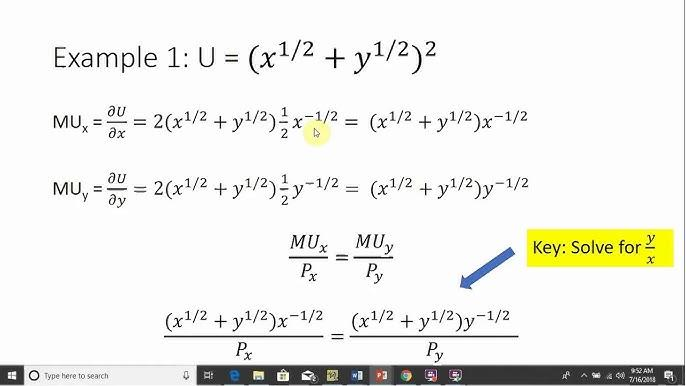

## Table of Contents

## What is a utility function?

A utility function is a way to measure how happy or satisfied someone is with different choices they can make. Imagine you're choosing between different snacks. A utility function helps you decide which snack will make you the happiest by giving each snack a score. The snack with the highest score is the one you'll enjoy the most.

In economics, utility functions are used to understand how people make decisions. For example, if you're deciding how to spend your money, a utility function can show which spending choices will give you the most satisfaction. By using a utility function, economists can predict how people might behave when faced with different options, helping to explain why people choose one thing over another.

## Why are utility functions important in economics?

Utility functions are important in economics because they help us understand why people make the choices they do. When people have different options, like choosing between buying a new toy or saving money, a utility function can show which choice will make them happier. By knowing what makes people happy, economists can predict how people will behave. For example, if a new toy gives more happiness than saving money, more people will buy the toy.

This understanding is useful for making economic policies and business decisions. Governments can use utility functions to see how new laws might affect people's happiness. For example, if a new tax makes people less happy, they might change their spending habits. Businesses can also use utility functions to decide what products to make or how to price them. If a business knows what makes customers happy, they can offer products that people will want to buy, which helps the business grow.

## Can you explain the concept of utility with a simple example?

Imagine you have $10 and you can either buy a new toy or save the money. A utility function helps you decide which choice will make you happier. Let's say buying the toy gives you a happiness score of 8 out of 10, while saving the money gives you a score of 6 out of 10. According to the utility function, you should buy the toy because it gives you more happiness.

This simple example shows how utility functions work. They measure how much happiness or satisfaction you get from different choices. By comparing the happiness scores, you can make decisions that will make you the happiest. In economics, understanding utility helps predict how people will choose between different options, like buying things or saving money.

## How do you calculate utility from a utility function?

To calculate utility from a utility function, you need to know how much happiness or satisfaction each choice gives you. Imagine you have different options, like buying a snack or going to a movie. Each option has a happiness score. For example, if eating a chocolate bar gives you a happiness score of 7 out of 10, and going to a movie gives you a score of 9 out of 10, the utility function helps you see which choice makes you happier. You just look at the scores and pick the one with the highest number.

In real life, calculating utility can be more complicated. People might have many different things to consider, like how much money they have, how much time they have, and what they like. But the basic idea stays the same. You assign a happiness score to each choice based on how much you think it will make you happy. Then, you compare the scores and choose the option with the highest score. This way, you make decisions that will give you the most happiness or satisfaction.

## What is the difference between ordinal and cardinal utility?

Ordinal utility and cardinal utility are two ways to measure how happy or satisfied someone is with their choices. Ordinal utility is about ranking choices from most to least preferred. For example, if you like ice cream more than cake, and cake more than cookies, you can say ice cream is your first choice, cake is your second choice, and cookies are your third choice. You don't need to know exactly how much happier ice cream makes you compared to cake; you just know the order of your preferences.

Cardinal utility, on the other hand, gives a specific number to how happy each choice makes you. It's like giving a score out of 10. If eating ice cream gives you a happiness score of 9, cake gives you a score of 7, and cookies give you a score of 5, you can see not just the order of your preferences but also how much happier one choice makes you compared to another. This way, you can make more detailed decisions because you know the exact difference in happiness between your choices.

## What are some common types of utility functions used in economics?

In economics, one common type of utility function is the linear utility function. Imagine you like both apples and bananas. A linear utility function would say that the happiness you get from apples and bananas can be added up directly. If one apple gives you 2 points of happiness and one banana gives you 3 points, eating one apple and one banana would give you 5 points of happiness. This type of function is easy to understand but it assumes that your happiness grows in a straight line, which is not always true.

Another type is the Cobb-Douglas utility function. This one is a bit more complex but very useful. It shows how you might balance different things you like. For example, if you like both food and entertainment, a Cobb-Douglas function can show how much happiness you get from different amounts of food and entertainment. It can say that having more food makes you happier, but only up to a point, and then you might want more entertainment. This type of function helps economists understand how people might trade off between different goods.

There are also logarithmic utility functions. These are used when the happiness you get from something grows more slowly as you get more of it. For example, the first slice of pizza might make you very happy, but the tenth slice might not make you much happier at all. A logarithmic utility function can show this slowing down of happiness as you consume more of something. This type of function is useful for understanding how people might feel about having more of the same thing.

## How can utility functions be used to model consumer behavior?

Utility functions help economists understand how people make choices by showing which options make them the happiest. Imagine you're deciding between buying a new toy or saving your money. A utility function can give each choice a happiness score. If the toy gives you a higher score than saving, you'll choose the toy. By using these functions, economists can predict what people might do when faced with different options. This helps explain why people pick one thing over another, like why someone might choose to buy a snack instead of waiting for a bigger meal later.

Utility functions also help businesses and governments make better decisions. For example, a company can use a utility function to see what products people will want to buy. If they know that people get more happiness from a new type of phone than from a new game, they might focus on making phones. Governments can use utility functions to see how new laws or taxes might affect people's happiness. If a new tax makes people less happy, they might change their spending habits. By understanding utility, both businesses and governments can make choices that help people be happier and more satisfied with their lives.

## What is the marginal utility and how is it derived from a utility function?

Marginal utility is how much happier you get from having one more of something. Imagine you're eating cookies. The first cookie might make you really happy, but the second one might not make you as happy as the first one. Marginal utility helps you understand how much extra happiness each new cookie gives you. It's like looking at the difference in happiness between having one cookie and having two cookies.

You can find the marginal utility by using a utility function. A utility function is like a happiness scorecard that tells you how happy you are with different amounts of things. To find the marginal utility, you look at how much your happiness score changes when you get one more of something. For example, if eating one cookie gives you a happiness score of 10 and eating two cookies gives you a score of 15, the marginal utility of the second cookie is 5. It's the difference between the happiness you get from two cookies and the happiness you get from one cookie.

## Can you provide an example of a utility function for a risk-averse individual?

Imagine you have $100 and you're thinking about investing it. If you're a risk-averse person, you don't like taking big chances with your money. A utility function for a risk-averse person might look like this: if you keep your $100 safe in a savings account and get a small interest, you might feel pretty happy with a utility score of 8 out of 10. But if you invest your money and there's a chance you could lose it all, even if you could also make a lot more, your utility score might be much lower, maybe a 3 out of 10. This shows that you value safety and predictability more than the possibility of big gains.

This kind of utility function helps explain why risk-averse people might choose safer options even if they don't offer the biggest rewards. For example, if you have the choice between a guaranteed $105 from a safe investment or a risky investment that could give you $200 or nothing, a risk-averse person might pick the $105. The utility function shows that the happiness from knowing you'll have $105 for sure is worth more than the chance of getting $200 but also risking losing everything. By understanding this, economists can predict how risk-averse people will make decisions when faced with different levels of risk.

## How do utility functions help in decision making under uncertainty?

Utility functions help people make choices when they're not sure what will happen. Imagine you're deciding whether to bring an umbrella when there's a chance of rain. A utility function can give you a happiness score for bringing the umbrella if it rains, and another score for not bringing it if it stays dry. If the happiness from staying dry with an umbrella is higher than the happiness from not carrying one around on a sunny day, you'll choose to bring the umbrella. This way, utility functions help you weigh the possible outcomes and make the choice that will make you the happiest overall.

In more complex situations, like investing money, utility functions are even more useful. If you're thinking about putting your money into a stock that could go up or down, a utility function can show how happy you'd be with different results. For example, if losing money makes you very unhappy, but gaining a little bit makes you only a bit happier, the utility function might tell you to choose a safer investment. By comparing the happiness scores for different outcomes, you can make decisions that balance the risks and rewards in a way that feels best for you.

## What are the limitations and criticisms of using utility functions in economic models?

Utility functions help economists understand how people make choices, but they have some problems. One big issue is that it's hard to measure happiness exactly. People's feelings can change a lot, and what makes one person happy might not make another person happy. Also, utility functions often assume people always make perfect choices, but in real life, people can make mistakes or not have all the information they need. This means the predictions from utility functions might not always be right.

Another criticism is that utility functions can be too simple. They might not show all the things that affect people's choices, like social pressure or emotions. For example, someone might choose to buy a gift for a friend even if it doesn't make them happier in terms of the utility function, because they care about the friend's feelings. Critics also say that utility functions can make it seem like people only care about their own happiness, which isn't always true. People often think about others and the world around them when making choices.

## How can advanced mathematical techniques be applied to optimize utility functions in complex scenarios?

Advanced mathematical techniques can help make better decisions by optimizing utility functions in tricky situations. One way to do this is by using something called dynamic programming. This method breaks down big, complicated problems into smaller, easier parts. Imagine you're planning a trip with different stops. Dynamic programming helps you figure out the best order to visit each place to make you the happiest overall. By solving each small part of the problem and putting them together, you can find the best way to do things even when there are a lot of choices and things can change.

Another useful technique is optimization algorithms, like gradient descent. These algorithms help you find the best choice by slowly making small changes and seeing if they make you happier. Think of it like trying to find the perfect spot on a hill to enjoy the view. You take small steps up the hill, checking if each step makes the view better. If it does, you keep going that way. If not, you try a different direction. These methods are great for figuring out how to balance different things you want, like money, time, and happiness, to make the best decision in complex situations.

## How are Utility Functions Calculated?

Utility functions are pivotal in both economic theory and trading, serving as a measure of consumer or investor satisfaction given a set of variables, often goods or investment choices. Mathematically, a utility function can be represented as $U(X_1, X_2, X_3, \ldots, X_n)$, where $X_1, X_2, X_3, \ldots, X_n$ are the quantities of different goods or attributes in a decision-making process. This function's primary purpose is to assign a real number to each conceivable bundle of goods, reflecting the consumer’s preference ranking over these bundles.

### Calculation of Marginal and Total Utility

**Total Utility** refers to the overall level of satisfaction obtained from consuming a certain quantity of goods or assets. Mathematically, it is the value of the utility function $U(X_1, X_2, \ldots, X_n)$.

**Marginal Utility**, on the other hand, is the additional satisfaction gained from consuming an extra unit of a good or service. It can be expressed as the partial derivative of the utility function with respect to a particular good:

$$
MU_{X_i} = \frac{\partial U}{\partial X_i}
$$

where $MU_{X_i}$ represents the marginal utility of good $X_i$.

### Examples: Perfect Substitutes and Complements

1. **Perfect Substitutes**:

   When goods can be perfectly substituted without any loss of utility, the utility function can be linear. For example, if a consumer considers two goods $X_1$ and $X_2$ as perfect substitutes, the utility function can be represented as:

   \[ U(X_1, X_2) = aX_1 + bX_2
$$

   where $a$ and $b$ are constants that indicate the weight or importance of each good in achieving utility. For instance, if one unit of $X_1$ is as good as one unit of $X_2$, then $a = b$.

2. **Perfect Complements**:

   When goods are perfect complements, they are consumed together in fixed proportions. The utility function for perfect complements is typically expressed in a Leontief form:

   \[ U(X_1, X_2) = \min\left(\frac{X_1}{a}, \frac{X_2}{b}\right)
$$

   Here, $a$ and $b$ represent the fixed proportion in which the goods are consumed. For example, if each unit of $X_1$ requires two units of $X_2$ for maximum utility, the proportions would dictate the pattern of consumption.

### Mathematical Representation in Python

To calculate these utilities programmatically, Python can be utilized. Here is an example for a utility function involving perfect substitutes:

```python
def total_utility(x1, x2, a=1, b=1):
    return a * x1 + b * x2

def marginal_utility_x1(x1, x2, a=1, b=1):
    # Since the function is linear, the marginal utility is constant
    return a

x1 = 5
x2 = 10
print("Total Utility:", total_utility(x1, x2))
print("Marginal Utility of X1:", marginal_utility_x1(x1, x2))
```

This simple program defines a linear utility function for perfect substitutes and calculates the total and marginal utility. Similarly, such calculations can be extended for more complex scenarios utilizing numerical methods or optimization libraries in Python.

These examples and calculations illustrate how utility functions can adapt to model consumer behavior realistically under different scenarios. Understanding these concepts is essential for applying utility functions effectively in economic predictions and trading strategies.

## What are Utility Functions in Algorithmic Trading?

Utility theory plays a pivotal role in [algorithmic trading](/wiki/algorithmic-trading) by offering a structured framework for evaluating investment options based on risk and return. Traders use utility functions to quantify their preferences over various trade-offs, enabling them to balance potential gains against associated risks. This approach ensures that their investment strategies align with their risk tolerance levels.

In algorithmic trading, the integration of expected utility provides a foundation for optimizing investment portfolios. The Expected Utility Theory posits that investors choose between risky or uncertain prospects by comparing their expected utilities rather than their predicted economic values. Expected utility is formally expressed as:

$$
E[U] = \sum p_i U(x_i)
$$

where $E[U]$ is the expected utility, $p_i$ is the probability of outcome $x_i$, and $U(x_i)$ is the utility of outcome $x_i$. This formula helps to evaluate the desirability of different investment choices by considering both the potential returns and the likelihood of their occurrence.

Risk aversion, inherent in utility functions, significantly influences trading decision-making. Risk-averse investors prefer investments with lower risk for a given level of expected return. Their utility function is typically concave, reflecting diminishing marginal utility. Consequently, risk-averse investors' preferences can be depicted using a Bernoulli utility function:

$$
U(x) = 1 - e^{-\alpha x}
$$

Here, $\alpha$ represents the degree of risk aversion; higher values indicate more risk-averse behavior. This utility function allows traders to quantify their aversion to risk and make informed decisions that align with their tolerance levels.

To illustrate the real-world application of utility functions in algorithmic trading strategies, consider the portfolio optimization problem. Utility functions are used to determine the optimal asset allocation that maximizes expected utility. Python libraries, such as NumPy and SciPy, facilitate these calculations by providing tools for optimization and statistical analysis.

Here is a simple example using Python to optimize a portfolio based on expected utility:

```python
import numpy as np
from scipy.optimize import minimize

# Define the utility function for a risk-averse investor
def utility(x, alpha=0.5):
    return 1 - np.exp(-alpha * x)

# Portfolio returns and probabilities
returns = np.array([0.05, 0.1, 0.15])
probabilities = np.array([0.2, 0.5, 0.3])

# Function to calculate expected utility
def expected_utility(weights):
    portfolio_return = np.dot(weights, returns)
    return -np.dot(probabilities, utility(portfolio_return))

# Initial guess
weights = np.array([1/3, 1/3, 1/3])

# Constraint: sum of weights is 1
constraints = ({'type': 'eq', 'fun': lambda weights: np.sum(weights) - 1})

# Bounds: weights between 0 and 1
bounds = [(0, 1) for _ in range(len(returns))]

# Optimize
result = minimize(expected_utility, weights, constraints=constraints, bounds=bounds)

# Optimal weights
optimal_weights = result.x
```

This code snippet demonstrates how an investor might use utility theory to determine the asset weights that maximize their expected utility while adhering to their risk preferences.

In summary, utility functions are indispensable tools in algorithmic trading, guiding investors in risk-return analysis and assisting in decision-making processes that align with their financial goals and risk policies.

## What are the Advanced Topics in Utility Theory within Behavioral Economics?

Utility theory, traditionally foundational in economic models, takes on a multi-faceted role in behavioral economics by accounting for cognitive biases that can influence utility calculation in trading contexts. While classical utility theory assumes rational [agents](/wiki/agents) with consistent preferences, behavioral economics recognizes that real-world decision makers often deviate from rationality due to various psychological factors.

**Cognitive Biases and Utility Calculation**

Behavioral economists propose that cognitive biases can lead to systematic errors in judgment, impacting how utility is perceived and calculated. For instance, overconfidence, loss aversion, and recency bias may lead traders to overestimate the utility of certain investment options or undervalue potential risks. These biases result in subjective utility calculations that diverge from objective evaluations based strictly on probability and outcome.

**Prospect Theory**

Prospect Theory, developed by Daniel Kahneman and Amos Tversky, offers an alternative to the classical utility theory by describing how people make decisions between probabilistic alternatives involving risk. Central to prospect theory is the concept of loss aversion, which posits that losses weigh heavier on individuals than gains of comparable magnitude. This asymmetry can be mathematically represented in the value function $v(x)$, which is concave for gains and convex for losses. Moreover, the theory introduces probability weighting, where individuals tend to overweight small probabilities and underweight large probabilities. This deviation can be critical in trading, as it shapes the perception of risk and reward, leading to choices that differ from those predicted by expected utility theory.

For example, the value function $v(x)$ in prospect theory could be expressed as:

$$

v(x) = \begin{cases} 
x^\alpha, & \text{if } x \geq 0 \\
-\lambda(-x)^\beta, & \text{if } x < 0 
\end{cases}
$$

where $\alpha, \beta$ are typically between 0 and 1, and $\lambda > 1$ indicates loss aversion.

**State-dependent Utility Models**

State-dependent utility models extend traditional utility theory to incorporate varying utility levels based on different states of the world or individual conditions. This approach is particularly useful in dynamic trading environments, where market conditions can rapidly shift due to economic indicators, policy changes, or unexpected events.

These models suggest that the utility a trader derives from a specific outcome can depend on external states that may influence trader preferences or perceptions. For instance, in volatile markets, a trader may exhibit heightened risk aversion, resulting in a utility function that prioritizes stability and security over higher expected returns. Consequently, a state-dependent utility model may adapt the trader's investment strategy, dynamically adjusting to optimize utility based on current conditions.

In Python, a simple state-dependent utility model might adjust risk tolerance based on [volatility](/wiki/volatility-trading-strategies):

```python
def state_dependent_utility(risk_aversion, volatility, return_rate):
    adjusted_risk = risk_aversion * (1 + volatility)
    utility = (return_rate) / (1 + adjusted_risk)
    return utility

# Example usage
volatility = 0.05
return_rate = 0.1
risk_aversion = 0.3
utility = state_dependent_utility(risk_aversion, volatility, return_rate)
print(f"Adjusted Utility: {utility}")
```

This code snippet illustrates how changing market conditions, such as volatility, can be used to adjust a trader's utility function dynamically, ensuring that investment strategies remain aligned with both market realities and individual risk profiles.

By integrating behavioral insights into utility theory, financial models become more robust, offering better predictions and more effective strategies that align with the complexities of human behavior in trading environments. Consequently, behavioral economics and utility theory together present a comprehensive framework for understanding and optimizing decision-making processes.

## References & Further Reading

[1]: Mas-Colell, A., Whinston, M. D., & Green, J. R. (1995). ["Microeconomic Theory."](https://archive.org/details/microeconomic-theory-mas-colell-whinston-green-1995) Oxford University Press.

[2]: Varian, H. R. (1992). ["Microeconomic Analysis."](https://archive.org/details/microeconomicana00vari_0) W.W. Norton & Company.

[3]: Pratt, J. W., Raiffa, H., & Schlaifer, R. (1995). ["Introduction to Statistical Decision Theory."](https://mitpress.mit.edu/9780262662062/introduction-to-statistical-decision-theory/) MIT Press.

[4]: Sharpe, W. F. (1994). ["The Sharpe Ratio."](https://web.stanford.edu/~wfsharpe/art/sr/SR.htm) The Journal of Portfolio Management, 21(1), 49-58.

[5]: Kahneman, D., & Tversky, A. (1979). ["Prospect Theory: An Analysis of Decision under Risk."](https://www.jstor.org/stable/1914185) Econometrica, 47(2), 263–292.

[6]: Markowitz, H. (1952). ["Portfolio Selection."](https://onlinelibrary.wiley.com/doi/abs/10.1111/j.1540-6261.1952.tb01525.x) The Journal of Finance, 7(1), 77-91.