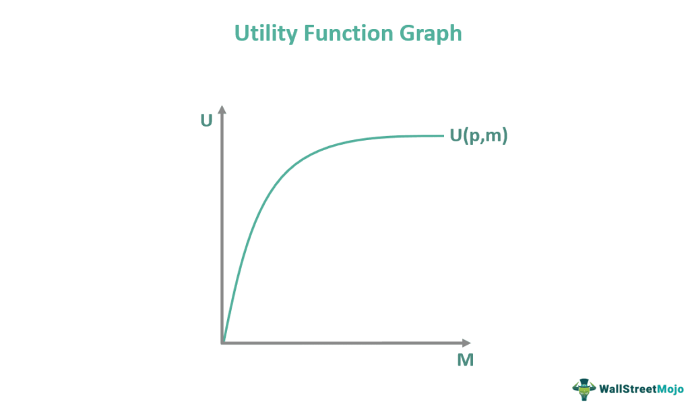

Utility functions are a fundamental concept in economic theory, serving as a quantitative measure of consumer satisfaction derived from the consumption of goods and services. These functions represent consumer preferences and allow economists to analyze choice behavior under various constraints. Mathematically, a utility function assigns a numerical value to different bundles of goods, reflecting the level of satisfaction or happiness a consumer derives from each bundle. The higher the utility, the greater the consumer's satisfaction.

In recent years, utility functions have also gained prominence in algorithmic trading, a field where mathematical models and computational algorithms are used to execute trades at high speed and frequency. In this context, utility functions help traders make informed investment decisions by evaluating and comparing different financial assets based on expected returns and associated risks. By incorporating utility functions, traders can optimize their portfolios to maximize expected utility, taking into account market conditions and their risk preferences.



This article examines the utility function's pivotal role in both economic theory and algorithmic trading. It aims to provide an in-depth look at how utility functions are calculated and utilized, emphasizing their impact on consumer behavior prediction in economics and investment strategy development in trading. The discussion will cover foundational aspects such as ordinal and cardinal utility, the mathematical formulation of utility functions, and their application in real-world trading scenarios. Moreover, the article will explore advanced topics like behavioral economics and how cognitive biases influence utility calculations, thereby enriching investment strategies.

Through this exploration, readers will gain a comprehensive understanding of utility functions and their versatile applications, enhancing decision-making processes across economics and trading disciplines.

## Table of Contents

## Understanding Utility Functions in Economic Theory

Utility functions are mathematical representations used in economic theory to quantify consumer preferences and satisfaction. They assign numerical values to different consumption bundles, allowing economists to model how consumers make choices based on their preferences. By capturing the desirability of various goods and services, utility functions aid in understanding and predicting consumer behavior and decision-making.

There are two primary types of utility: ordinal and cardinal. Ordinal utility ranks preferences without assigning specific numerical values to the differences between choices. For instance, if a consumer prefers apples over oranges and oranges over bananas, ordinal utility would simply rank these preferences without quantifying how much more apples are preferred over oranges. Ordinal utility is foundational in constructing consumer choice theory, facilitating analysis of whether one bundle of goods is preferred over another without delving into the magnitude of preference differences.

In contrast, cardinal utility assigns specific numerical values to these preferences, reflecting the intensity of satisfaction derived from different consumption bundles. This implies a measurable difference in utility levels between choices. Cardinal utility is less commonly used in practice due to the difficulty of measuring satisfaction quantitatively but is important in specific models where quantifiable differences are needed, such as in cost-benefit analysis or utility maximization problems.

Utility functions play a central role in rational choice theory, which postulates that individuals make decisions aimed at maximizing their utility. The theory asserts that, when faced with multiple options, consumers will choose the one leading to the highest utility level. Suppose $U(X)$ represents the utility function of a consumer's choices, where $X$ is a vector of quantities of goods. The consumer's goal is to select $X$ such that their utility $U(X)$ is maximized, given their budget constraint.

A typical assumption in rational choice models is that consumers' preferences are consistent and transitive, meaning if they prefer bundle A to B and B to C, they will prefer A to C. This consistency allows utility functions to effectively predict consumer behavior under various conditions and constraints.

In summary, utility functions serve as a mathematical framework to gauge consumer satisfaction and preference structure, either by ranking preferences or by specifying exact satisfaction levels. Their application in rational choice theory helps economists forecast how consumers will allocate resources to maximize their utility, thereby providing insights into economic decision-making processes.

## Calculation of Utility Functions

Utility functions are pivotal in both economic theory and trading, serving as a measure of consumer or investor satisfaction given a set of variables, often goods or investment choices. Mathematically, a utility function can be represented as $U(X_1, X_2, X_3, \ldots, X_n)$, where $X_1, X_2, X_3, \ldots, X_n$ are the quantities of different goods or attributes in a decision-making process. This function's primary purpose is to assign a real number to each conceivable bundle of goods, reflecting the consumer’s preference ranking over these bundles.

### Calculation of Marginal and Total Utility

**Total Utility** refers to the overall level of satisfaction obtained from consuming a certain quantity of goods or assets. Mathematically, it is the value of the utility function $U(X_1, X_2, \ldots, X_n)$.

**Marginal Utility**, on the other hand, is the additional satisfaction gained from consuming an extra unit of a good or service. It can be expressed as the partial derivative of the utility function with respect to a particular good:

$$
MU_{X_i} = \frac{\partial U}{\partial X_i}
$$

where $MU_{X_i}$ represents the marginal utility of good $X_i$.

### Examples: Perfect Substitutes and Complements

1. **Perfect Substitutes**:

   When goods can be perfectly substituted without any loss of utility, the utility function can be linear. For example, if a consumer considers two goods $X_1$ and $X_2$ as perfect substitutes, the utility function can be represented as:

   \[ U(X_1, X_2) = aX_1 + bX_2
$$

   where $a$ and $b$ are constants that indicate the weight or importance of each good in achieving utility. For instance, if one unit of $X_1$ is as good as one unit of $X_2$, then $a = b$.

2. **Perfect Complements**:

   When goods are perfect complements, they are consumed together in fixed proportions. The utility function for perfect complements is typically expressed in a Leontief form:

   \[ U(X_1, X_2) = \min\left(\frac{X_1}{a}, \frac{X_2}{b}\right)
$$

   Here, $a$ and $b$ represent the fixed proportion in which the goods are consumed. For example, if each unit of $X_1$ requires two units of $X_2$ for maximum utility, the proportions would dictate the pattern of consumption.

### Mathematical Representation in Python

To calculate these utilities programmatically, Python can be utilized. Here is an example for a utility function involving perfect substitutes:

```python
def total_utility(x1, x2, a=1, b=1):
    return a * x1 + b * x2

def marginal_utility_x1(x1, x2, a=1, b=1):
    # Since the function is linear, the marginal utility is constant
    return a

x1 = 5
x2 = 10
print("Total Utility:", total_utility(x1, x2))
print("Marginal Utility of X1:", marginal_utility_x1(x1, x2))
```

This simple program defines a linear utility function for perfect substitutes and calculates the total and marginal utility. Similarly, such calculations can be extended for more complex scenarios utilizing numerical methods or optimization libraries in Python.

These examples and calculations illustrate how utility functions can adapt to model consumer behavior realistically under different scenarios. Understanding these concepts is essential for applying utility functions effectively in economic predictions and trading strategies.

## Utility Functions in Algorithmic Trading

Utility theory plays a pivotal role in [algorithmic trading](/wiki/algorithmic-trading) by offering a structured framework for evaluating investment options based on risk and return. Traders use utility functions to quantify their preferences over various trade-offs, enabling them to balance potential gains against associated risks. This approach ensures that their investment strategies align with their risk tolerance levels.

In algorithmic trading, the integration of expected utility provides a foundation for optimizing investment portfolios. The Expected Utility Theory posits that investors choose between risky or uncertain prospects by comparing their expected utilities rather than their predicted economic values. Expected utility is formally expressed as:

$$
E[U] = \sum p_i U(x_i)
$$

where $E[U]$ is the expected utility, $p_i$ is the probability of outcome $x_i$, and $U(x_i)$ is the utility of outcome $x_i$. This formula helps to evaluate the desirability of different investment choices by considering both the potential returns and the likelihood of their occurrence.

Risk aversion, inherent in utility functions, significantly influences trading decision-making. Risk-averse investors prefer investments with lower risk for a given level of expected return. Their utility function is typically concave, reflecting diminishing marginal utility. Consequently, risk-averse investors' preferences can be depicted using a Bernoulli utility function:

$$
U(x) = 1 - e^{-\alpha x}
$$

Here, $\alpha$ represents the degree of risk aversion; higher values indicate more risk-averse behavior. This utility function allows traders to quantify their aversion to risk and make informed decisions that align with their tolerance levels.

To illustrate the real-world application of utility functions in algorithmic trading strategies, consider the portfolio optimization problem. Utility functions are used to determine the optimal asset allocation that maximizes expected utility. Python libraries, such as NumPy and SciPy, facilitate these calculations by providing tools for optimization and statistical analysis.

Here is a simple example using Python to optimize a portfolio based on expected utility:

```python
import numpy as np
from scipy.optimize import minimize

# Define the utility function for a risk-averse investor
def utility(x, alpha=0.5):
    return 1 - np.exp(-alpha * x)

# Portfolio returns and probabilities
returns = np.array([0.05, 0.1, 0.15])
probabilities = np.array([0.2, 0.5, 0.3])

# Function to calculate expected utility
def expected_utility(weights):
    portfolio_return = np.dot(weights, returns)
    return -np.dot(probabilities, utility(portfolio_return))

# Initial guess
weights = np.array([1/3, 1/3, 1/3])

# Constraint: sum of weights is 1
constraints = ({'type': 'eq', 'fun': lambda weights: np.sum(weights) - 1})

# Bounds: weights between 0 and 1
bounds = [(0, 1) for _ in range(len(returns))]

# Optimize
result = minimize(expected_utility, weights, constraints=constraints, bounds=bounds)

# Optimal weights
optimal_weights = result.x
```

This code snippet demonstrates how an investor might use utility theory to determine the asset weights that maximize their expected utility while adhering to their risk preferences.

In summary, utility functions are indispensable tools in algorithmic trading, guiding investors in risk-return analysis and assisting in decision-making processes that align with their financial goals and risk policies.

## Application of Utility Functions in Real-world Trading

Utility functions play a crucial role in real-world trading by aiding financial institutions in the processes of portfolio optimization, risk management, and strategic alignment with risk appetite. Companies like BlackRock and Goldman Sachs are at the forefront of employing these mathematical models to refine their trading strategies and enhance decision-making processes.

### Case Studies and Implementation

#### BlackRock

BlackRock, one of the largest asset management firms globally, utilizes utility functions within its portfolio optimization practices. The firm focuses on maximizing the expected utility of portfolio returns while considering investors' risk aversion levels. This approach often involves the integration of a utility function, $U(W) = \sum_{i=1}^{n} p_i \cdot u(w_i)$, where $W$ represents wealth, $p_i$ is the probability of state $i$, and $u(w_i)$ is the utility of wealth at state $i$. Such models enable BlackRock to align investment strategies with varying risk preferences of its clients, ensuring customized investment solutions that optimize the balance between risk and return.

#### Goldman Sachs

Goldman Sachs employs utility functions to tailor trading strategies to meet both institutional and individual client needs. One notable application is in risk management, where utility functions help in quantifying risk tolerance and optimizing leverage decisions. By leveraging Expected Utility Theory, the firm is able to compute optimal position sizes across diverse asset classes. This involves estimating parameters such as expected returns, [volatility](/wiki/volatility-trading-strategies), and maximizing the utility of terminal wealth. Here's a simple Python code snippet to illustrate this process:

```python
import numpy as np

# Example utility function: logarithmic utility
def utility(w):
    return np.log(w)

# Expected return and risk-free rate
expected_return = 0.08
risk_free_rate = 0.03

# Optimize position size
position_size = (expected_return - risk_free_rate) / np.var(expected_return)

# Calculate utility
final_wealth = 100000  # Example starting wealth
utility_value = utility(final_wealth * position_size)
```

### Decision-Making in Trading

Utility functions inform several critical trading decisions. They are essential for determining position sizing, as evidenced in the Goldman Sachs example, where the utility function framework aids in calculating the optimal investment portion in different sectors. Additionally, utility functions guide leverage management, helping traders define optimal borrowing levels that align with their risk-return profiles. This alignment is crucial for mitigating the potential downsides of leveraged positions while maximizing returns.

These mathematical models allow institutions to taper their strategies dynamically, integrating risk appetite into every trading decision. As a result, firms like BlackRock and Goldman Sachs can effectively manage risk and optimize portfolios to meet their clients' financial objectives, showcasing the utility function's profound impact on real-world trading environments.

## Advanced Topics: Utility Theory in Behavioral Economics

Utility theory, traditionally foundational in economic models, takes on a multi-faceted role in behavioral economics by accounting for cognitive biases that can influence utility calculation in trading contexts. While classical utility theory assumes rational [agents](/wiki/agents) with consistent preferences, behavioral economics recognizes that real-world decision makers often deviate from rationality due to various psychological factors.

**Cognitive Biases and Utility Calculation**

Behavioral economists propose that cognitive biases can lead to systematic errors in judgment, impacting how utility is perceived and calculated. For instance, overconfidence, loss aversion, and recency bias may lead traders to overestimate the utility of certain investment options or undervalue potential risks. These biases result in subjective utility calculations that diverge from objective evaluations based strictly on probability and outcome.

**Prospect Theory**

Prospect Theory, developed by Daniel Kahneman and Amos Tversky, offers an alternative to the classical utility theory by describing how people make decisions between probabilistic alternatives involving risk. Central to prospect theory is the concept of loss aversion, which posits that losses weigh heavier on individuals than gains of comparable magnitude. This asymmetry can be mathematically represented in the value function $v(x)$, which is concave for gains and convex for losses. Moreover, the theory introduces probability weighting, where individuals tend to overweight small probabilities and underweight large probabilities. This deviation can be critical in trading, as it shapes the perception of risk and reward, leading to choices that differ from those predicted by expected utility theory.

For example, the value function $v(x)$ in prospect theory could be expressed as:

$$

v(x) = \begin{cases} 
x^\alpha, & \text{if } x \geq 0 \\
-\lambda(-x)^\beta, & \text{if } x < 0 
\end{cases}
$$

where $\alpha, \beta$ are typically between 0 and 1, and $\lambda > 1$ indicates loss aversion.

**State-dependent Utility Models**

State-dependent utility models extend traditional utility theory to incorporate varying utility levels based on different states of the world or individual conditions. This approach is particularly useful in dynamic trading environments, where market conditions can rapidly shift due to economic indicators, policy changes, or unexpected events.

These models suggest that the utility a trader derives from a specific outcome can depend on external states that may influence trader preferences or perceptions. For instance, in volatile markets, a trader may exhibit heightened risk aversion, resulting in a utility function that prioritizes stability and security over higher expected returns. Consequently, a state-dependent utility model may adapt the trader's investment strategy, dynamically adjusting to optimize utility based on current conditions.

In Python, a simple state-dependent utility model might adjust risk tolerance based on volatility:

```python
def state_dependent_utility(risk_aversion, volatility, return_rate):
    adjusted_risk = risk_aversion * (1 + volatility)
    utility = (return_rate) / (1 + adjusted_risk)
    return utility

# Example usage
volatility = 0.05
return_rate = 0.1
risk_aversion = 0.3
utility = state_dependent_utility(risk_aversion, volatility, return_rate)
print(f"Adjusted Utility: {utility}")
```

This code snippet illustrates how changing market conditions, such as volatility, can be used to adjust a trader's utility function dynamically, ensuring that investment strategies remain aligned with both market realities and individual risk profiles.

By integrating behavioral insights into utility theory, financial models become more robust, offering better predictions and more effective strategies that align with the complexities of human behavior in trading environments. Consequently, behavioral economics and utility theory together present a comprehensive framework for understanding and optimizing decision-making processes.

## Conclusion

Utility functions serve as a foundational component in both economic theory and practical trading applications. In economics, they provide a framework for understanding consumer preferences and satisfaction, offering insights into how individuals make choices based on the maximization of utility. This theoretical underpinning is crucial for developing models that predict consumer behavior, which, in turn, inform policies and strategies that can enhance welfare and efficiency.

In practical trading, utility theory aids in refining decision-making processes by introducing a structured approach to evaluating investment options based on risk and return. The use of utility functions helps traders and financial institutions align their strategies with their risk appetite, making informed choices that balance potential returns against acceptable levels of risk. By quantifying preferences, utility functions enable traders to optimize portfolio allocations, manage risk effectively, and devise strategies that are robust under varying market conditions.

Understanding and applying utility theory equips traders with a toolset to navigate complex financial landscapes, where the interplay of risk, return, and uncertainty demands nuanced decision-making. Moreover, utility theory's adaptability allows it to be integrated with advanced concepts such as behavioral economics, further enhancing its application by accounting for cognitive biases and non-standard preferences.

As the financial sector evolves and market dynamics become more complex, the continued exploration of utility theory holds promise for further optimizing economic and financial strategies. By leveraging advances in computational techniques and behavioral insights, traders and economists can refine models that more accurately reflect human behavior and market conditions, ultimately leading to strategies that maximize utility in both individual and collective contexts.

Therefore, embracing a deeper understanding of utility functions not only enriches theoretical economic knowledge but also enhances the practical capabilities of traders, ensuring they are better equipped to meet the challenges of modern financial markets.

## FAQs

**Provide answers to common questions about utility functions and their calculation.**

Utility functions are mathematical representations of consumer preferences. They encapsulate satisfaction or happiness derived from the consumption of goods and services. A common question is how to calculate utility functions. Generally, utility functions are represented mathematically as $U(X_1, X_2, X_3, \ldots, X_n)$, where $X_1, X_2, X_3, \ldots, X_n$ are quantities of different goods or services. The function quantifies the level of utility (satisfaction) the consumer derives from various bundles of goods.

**Clarify misconceptions about the difference between utility functions and marginal utility.**

A common misconception is conflating utility functions with marginal utility. A utility function provides the total utility gained from consuming certain quantities of goods. It is a comprehensive representation of satisfaction. Marginal utility, however, refers to the additional satisfaction (or utility) that a consumer receives from consuming one more unit of a good or service, which is mathematically expressed as the derivative of the utility function with respect to the good:
$$
MU = \frac{\partial U}{\partial X_i}
$$
where $MU$ is the marginal utility of good $X_i$. Understanding the distinction is crucial because while the utility function represents overall satisfaction, marginal utility focuses on the additional satisfaction from incremental consumption.

**Explain the practical importance of utility functions in trading and economic decision-making.**

In trading, utility functions help investors and traders evaluate decisions based on risk and return trade-offs. By quantifying preferences in terms of utility, traders can assess which trades align best with their risk tolerance and financial goals. Utility functions are integral to modern portfolio theory, especially through expected utility, which aids in constructing portfolios that maximize expected satisfaction given certain risks.

In economic decision-making, utility functions are vital for modeling consumer choice and behavior. They predict how consumers allocate resources and make decisions under constraints. This is crucial for understanding market demand, pricing strategies, and the economic impact of policy changes. In both domains, utility functions serve as fundamental tools in optimizing decisions to achieve desired outcomes, whether by maximizing consumer satisfaction or aligning investment strategies with risk appetite.

## References & Further Reading

[1]: Mas-Colell, A., Whinston, M. D., & Green, J. R. (1995). ["Microeconomic Theory."](https://archive.org/details/microeconomic-theory-mas-colell-whinston-green-1995) Oxford University Press.

[2]: Varian, H. R. (1992). ["Microeconomic Analysis."](https://archive.org/details/microeconomicana00vari_0) W.W. Norton & Company.

[3]: Pratt, J. W., Raiffa, H., & Schlaifer, R. (1995). ["Introduction to Statistical Decision Theory."](https://mitpress.mit.edu/9780262662062/introduction-to-statistical-decision-theory/) MIT Press.

[4]: Sharpe, W. F. (1994). ["The Sharpe Ratio."](https://web.stanford.edu/~wfsharpe/art/sr/SR.htm) The Journal of Portfolio Management, 21(1), 49-58.

[5]: Kahneman, D., & Tversky, A. (1979). ["Prospect Theory: An Analysis of Decision under Risk."](https://www.jstor.org/stable/1914185) Econometrica, 47(2), 263–292.

[6]: Markowitz, H. (1952). ["Portfolio Selection."](https://onlinelibrary.wiley.com/doi/abs/10.1111/j.1540-6261.1952.tb01525.x) The Journal of Finance, 7(1), 77-91.