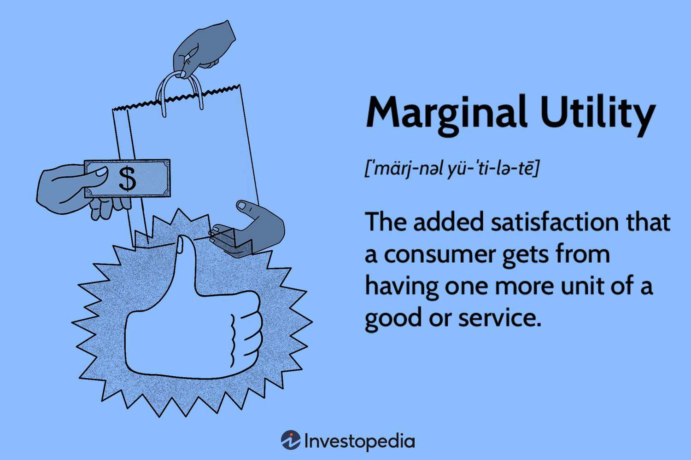

## Table of Contents

## What is utility in the context of microeconomics?

In microeconomics, utility refers to the satisfaction or happiness that a person gets from consuming goods or services. It's a way to measure how much someone enjoys something they use or buy. Imagine you're really thirsty and you drink a glass of water. The relief and pleasure you feel from that drink is the utility you get from it.

Economists use the concept of utility to understand and predict how people make choices. They assume that people try to maximize their utility, meaning they want to get as much satisfaction as possible from what they have. For example, if you have money to spend, you'll choose to buy things that give you the most happiness or satisfaction. This helps economists explain why people might choose one product over another or how they decide to spend their time and money.

## How did the concept of utility originate in economic theory?

The concept of utility started to become important in economics during the 18th and 19th centuries. Before that, economists mostly focused on the cost of making things and how much people were willing to pay for them. But then, thinkers like Jeremy Bentham started talking about how happiness and pleasure could be measured. Bentham believed that people make choices to increase their happiness, and he called this happiness "utility." This idea changed how economists thought about why people buy things.

Later, in the late 19th century, economists like William Stanley Jevons, Carl Menger, and Leon Walras developed the idea of utility further. They created what's called the "marginal utility theory." This theory says that the usefulness of something changes with how much of it you already have. For example, the first slice of pizza might make you very happy, but by the fourth slice, you might not enjoy it as much. These economists used math to show how people make decisions based on how much extra happiness each choice brings. This helped make utility a key part of understanding how economies work.

## What are the different types of utility?

There are different kinds of utility that help us understand why people like things. One kind is total utility, which is the total happiness you get from using or having something. For example, if you eat a whole pizza, the total utility is how happy you are after eating all of it. Another kind is marginal utility, which is the extra happiness you get from having a little bit more of something. If you eat another slice of pizza, the happiness you get from that one slice is the marginal utility.

Another type is average utility, which is the total utility divided by the number of units you have. If you eat four slices of pizza and the total happiness is 20, then the average utility is 5 per slice. There's also the idea of cardinal utility, which says you can measure happiness with numbers, like saying the first slice gives you 10 units of happiness. On the other hand, ordinal utility says you can't measure happiness exactly, but you can rank things by how much you like them, like saying you prefer the first slice over the second.

These different types of utility help economists understand how people make choices. They show why someone might choose to have a little more of something or why they might stop at a certain point. Understanding these ideas helps explain a lot about how people use their money and time to get the most happiness they can.

## How is utility measured in microeconomics?

In microeconomics, utility is measured in two main ways: cardinal and ordinal utility. Cardinal utility means we can put a number on how happy something makes us. For example, if you eat a slice of pizza and it makes you feel 10 units of happiness, that's cardinal utility. Economists use this to add up total happiness from different things and see how much more happiness you get from having a little bit more of something, which is called marginal utility. But measuring happiness exactly like this can be tricky because happiness is hard to pin down with numbers.

Ordinal utility is another way to measure utility, and it's simpler. Instead of putting exact numbers on happiness, ordinal utility just says you can rank things by how much you like them. For example, you might say you like the first slice of pizza more than the second, but you don't need to say how much more. This method helps economists understand people's preferences without needing exact numbers. Both ways of measuring utility help economists figure out how people make choices to get the most happiness they can from what they have.

## What is the difference between total utility and marginal utility?

Total utility is the total amount of happiness or satisfaction you get from using or having something. Imagine you eat a whole pizza. The happiness you feel after eating all of it is the total utility. It's like adding up all the good feelings from each slice you ate. Economists use total utility to understand how happy someone is overall from consuming a certain amount of a good or service.

Marginal utility is different. It's the extra happiness you get from having just a little bit more of something. If you eat one more slice of pizza, the extra happiness you feel from that one slice is the marginal utility. It's about how much more satisfaction you get from each additional unit. Economists use marginal utility to explain why people might stop eating after a few slices, because the extra happiness from each new slice might get smaller and smaller.

## Can you explain the law of diminishing marginal utility?

The law of diminishing marginal utility says that as you have more and more of something, the extra happiness you get from each additional unit starts to go down. Imagine you're eating pizza. The first slice might make you really happy because you were hungry. But as you keep eating, each new slice doesn't make you as happy as the one before it. By the time you get to the fifth or sixth slice, you might not enjoy it much at all.

This idea helps explain why people stop consuming something after a certain point. If the happiness from each new slice of pizza keeps getting smaller, at some point, it's not worth eating more. This law is important in economics because it helps us understand how people make choices. They keep consuming until the extra happiness from one more unit isn't worth it anymore.

## How does utility theory apply to consumer choice?

Utility theory helps us understand how people make choices about what to buy or use. It says that people try to get the most happiness or satisfaction from what they have. When someone is deciding what to buy, they think about how much happiness each thing will bring them. They'll pick the thing that makes them the happiest for the money they spend. For example, if you have $10, you might choose between a movie ticket or a nice meal. You'll go with the one that you think will make you happier.

Economists use ideas like total utility and marginal utility to explain these choices. Total utility is all the happiness you get from something, like how happy you are after eating a whole pizza. Marginal utility is the extra happiness from having a bit more of something, like the happiness from eating one more slice of pizza. The law of diminishing marginal utility says that the more you have of something, the less extra happiness each new bit brings. This helps explain why you might stop eating pizza after a few slices. By understanding these ideas, economists can predict how people will spend their money to get the most happiness.

## What role does utility play in demand theory?

Utility plays a big role in demand theory because it helps explain why people want to buy things. When economists talk about demand, they mean how much of something people want to buy at different prices. Utility helps us understand this by showing that people choose things that make them happy. If a product gives someone a lot of happiness, they'll be willing to pay more for it, and the demand for that product will be high. On the other hand, if something doesn't make them happy, they won't want to buy it as much, so the demand will be low.

The idea of diminishing marginal utility is also important for demand theory. It means that the more you have of something, the less extra happiness you get from having more of it. This helps explain why demand for a product might go down as people get more of it. For example, if you already have a lot of apples, you might not want to buy more even if the price goes down because you don't get much extra happiness from them. So, utility helps economists understand how people's happiness affects what they choose to buy and how much they're willing to pay.

## How do economists use utility to model consumer behavior?

Economists use utility to model consumer behavior by assuming that people make choices to get the most happiness they can from what they have. They use the idea of total utility, which is all the happiness someone gets from using something, and marginal utility, which is the extra happiness from having a bit more of it. For example, if you're deciding between buying a movie ticket or a nice meal, you'll pick the one that makes you happier. Economists use math to figure out how much happiness each choice brings and predict what people will choose. This helps them understand why someone might buy one thing over another and how much they're willing to pay for it.

The law of diminishing marginal utility is also important in modeling consumer behavior. It says that the more you have of something, the less extra happiness you get from each new bit. This helps explain why people might stop buying more of something even if the price goes down. For example, if you already have a lot of apples, you might not want to buy more because they don't make you much happier. By understanding this, economists can predict how people will spend their money to get the most happiness and how demand for products changes. This helps them create models that show how people make choices and how these choices affect the economy.

## What are some criticisms of traditional utility theory?

Some people think traditional utility theory has problems. One big problem is that it's hard to measure happiness with numbers. It's tricky to say that eating a slice of pizza makes you 10 units happy because happiness is different for everyone. Also, traditional utility theory assumes people always make choices that make them happier, but in real life, people don't always do that. They might make choices based on habits, emotions, or other things that aren't about getting the most happiness.

Another criticism is that traditional utility theory doesn't think about how other people or the world around us can affect our choices. For example, you might choose to buy a certain product because your friends like it, not because it makes you the happiest. Also, traditional utility theory doesn't look at how things like fairness or social rules can change what we choose. So, while utility theory helps us understand some choices, it doesn't explain everything about why people do what they do.

## How have modern developments in behavioral economics affected the concept of utility?

Modern developments in behavioral economics have changed how we think about utility. Behavioral economics looks at how people actually make choices, not just how they should make choices to get the most happiness. It shows that people often don't act the way traditional utility theory says they should. For example, people might choose something because it's popular, even if it doesn't make them the happiest. This means that utility isn't just about getting the most happiness; it's also about things like habits, emotions, and what other people are doing.

Behavioral economists have introduced ideas like "bounded rationality," which means people make decisions with limited information and time. This affects how we understand utility because people might not always choose what gives them the most happiness because they don't know all the options or can't think through everything. Also, concepts like loss aversion, where people feel the pain of losing something more than the joy of gaining something, show that utility can be about avoiding unhappiness as much as it is about seeking happiness. These ideas have made the concept of utility more complex and closer to how people really behave.

## What are the advanced applications of utility theory in economic policy and decision-making?

Utility theory helps with making big decisions in economic policy. Governments use it to figure out how to make people happier with their choices. For example, when deciding on taxes, they might think about how much happiness people get from keeping their money versus the happiness that comes from public services like schools and roads. By looking at utility, they can see if changing taxes will make people better off overall. This helps them make policies that balance what people want with what's good for everyone.

Utility theory also helps businesses make decisions. Companies use it to understand what their customers like and how much they're willing to pay for things. They can see how happy their products make people and use this to set prices or create new products. For example, if a company knows that people get a lot of happiness from a new phone feature, they might charge more for it. This helps them make money while also making their customers happy. By understanding utility, businesses can make choices that are good for them and good for their customers.

## What is Understanding Utility Economic Theory?

Utility economic theory, rooted in the discipline of economics, serves as a pivotal framework for explaining how individuals and firms make choices to maximize their satisfaction or utility. The core idea is to quantify the satisfaction one derives from a particular decision or set of choices. Utility theory provides a structured approach to assess the desirability of different outcomes by assigning a numerical value to the level of satisfaction each option provides.

### Key Concepts in Utility Theory

#### Utility Functions

Utility functions are mathematical representations that capture an individual's preference ordering over a set of goods or outcomes. They assign real numbers to different choices, such that if an individual prefers option A over option B, then the utility of A (U(A)) is greater than the utility of B (U(B)). The fundamental assumption is that individuals aim to maximize their utility subject to their budget constraints.

#### Expected Utility

Expected utility theory extends the concept of utility to situations involving uncertainty. Introduced by John von Neumann and Oskar Morgenstern, it postulates that individuals evaluate risky choices based on the expected value of their utility. The expected utility $EU$ for a set of outcomes is calculated as:

$$

EU = \sum (p_i \times U(x_i))
$$

where $p_i$ is the probability of occurrence for each outcome $x_i$, and $U(x_i)$ is the utility of that outcome. Investors often rely on expected utility to make decisions that involve risk and uncertainty, such as in investments or gambling.

#### Risk Aversion

Risk aversion describes the preference for a sure outcome over a risky one with the same expected utility. It is a crucial concept, especially in financial decision-making. A risk-averse individual prefers an investment with a guaranteed return over another with higher potential but uncertain returns. This behavior is often depicted by a concave utility function, indicating diminishing marginal utility.

### Cardinal and Ordinal Utility

Utility can be measured in two principal ways: cardinal and ordinal. Cardinal utility attempts to measure utility in absolute terms, allowing for meaningful comparisons of differences in utility between choices. In contrast, ordinal utility ranks preferences without assigning specific numerical values to them, focusing solely on the order of preferences.

- **Cardinal Utility**: Assumes that the degree of preference can be quantified. For instance, if utility from consuming two apples is twice that of one, the utility values might be 10 for one apple and 20 for two apples. This allows for the assessment of how much more one option is preferred to another.

- **Ordinal Utility**: Simply ranks preferences. If a consumer prefers apples to oranges and oranges to bananas, then $U(\text{apples}) > U(\text{oranges}) > U(\text{bananas})$. However, it does not indicate how much more apples are preferred over oranges.

These concepts are integral in formulating trading strategies and financial models. By incorporating utility considerations, financial analysts and traders can develop models that account for the preferences and risk tolerance of market participants, facilitating more targeted and effective decision-making in economic and trading environments.

## What is the Role of Utility in Microeconomics?

In microeconomics, utility plays a crucial role in understanding consumer behavior and decision-making processes. Utility is a measure of satisfaction or benefit derived from consuming goods and services and serves as a foundational concept in consumer choice theory. 

Total utility and marginal utility are key concepts that help explain how consumers make decisions under various constraints. Total utility refers to the overall satisfaction obtained from consuming a certain quantity of goods or services. As consumers increase consumption, the total utility typically increases but at a diminishing rate.

Marginal utility, on the other hand, describes the additional satisfaction a consumer gains from consuming one more unit of a good or service. It is mathematically expressed as the derivative of the total utility function concerning quantity:

$$
\text{MU}(x) = \frac{dU}{dx}
$$

where $MU(x)$ is the marginal utility of good $x$, and $U$ denotes the utility function. Marginal utility is central to decision-making, as consumers evaluate the additional benefit of purchasing one more unit of a product.

The principle of diminishing marginal utility states that, as more units of a good are consumed, the additional satisfaction gained from each extra unit decreases. This concept is critical in understanding consumer decisions, as it affects how individuals allocate their budget across different goods and services. It also plays a significant role in market dynamics and pricing strategies, as businesses must consider the diminishing value that consumers attribute to additional goods when setting prices.

Understanding these concepts allows economists to predict consumer behavior more accurately. For instance, consumers are likely to spend their income on a mix of different goods rather than a large quantity of a single item, given that the marginal utility of one type of good decreases with each additional unit consumed.

In summary, utility theory provides valuable insights into consumer behavior by elucidating how total and marginal utilities influence purchasing decisions, thereby shaping market trends and pricing strategies.

## What is the relationship between Algorithmic Trading and Utility Theory?

Algorithmic trading applies utility theory to enhance decision-making processes by employing utility functions that evaluate and maximize expected utility. This integration allows trading algorithms to effectively handle large volumes of data, assess multiple variables, and make decisions that strategically align with an investor's objectives. Central to these systems is the consideration of risk tolerance, expected returns, and transaction costs, all vital for executing trades that reflect the preferences and financial goals of investors.

Utility functions serve as mathematical representations of an investor's preferences, helping to quantify the level of satisfaction or utility derived from different potential outcomes. A common approach is the use of expected utility, which incorporates the probability of various outcomes alongside their respective utilities. The expected utility can be calculated with the formula:

$$
EU(x) = \sum_{i=1}^{n} p_i \cdot u(x_i)
$$

where $EU(x)$ is the expected utility of an outcome $x$, $p_i$ is the probability of outcome $i$, and $u(x_i)$ represents the utility of outcome $i$.

By utilizing these principles, [algorithmic trading](/wiki/algorithmic-trading) systems can swiftly execute trades that are not only data-driven but also tailored to meet the objectives of the investor. For instance, algorithms might prioritize trades that reduce risk exposure while maintaining acceptable levels of anticipated returns, ensuring the portfolio's alignment with an investor's risk-reward profile.

A vital aspect of algorithmic trading is the application of risk-adjusted performance measures. These measures, such as the Sharpe Ratio or Conditional Value at Risk (CVaR), assess investment performance relative to risk, allowing algorithms to optimize portfolios beyond mere return maximization. This is crucial for aligning automated strategies with investor preferences, particularly for risk-averse investors.

Moreover, transaction costs are a critical consideration in algorithmic trading. High-frequency trading algorithms, for example, must take into account the costs associated with frequent market entry and [exit](/wiki/exit-strategy). Algorithms are programmed to consider these costs to avoid eroding net returns, thereby maximizing overall utility.

Algorithmic systems are designed to react quickly to market changes, employing predefined rules and sophisticated algorithms that process vast amounts of market data. The function that maps different market states and investor actions to utility scores is continually adjusted based on market feedback, ensuring the system remains aligned with the dynamic nature of financial markets.

In summary, the integration of utility theory in algorithmic trading systems is pivotal for aligning trades with investor preferences and achieving optimal financial outcomes. These systems are built to account for risk, return, and transaction costs, ensuring automated trading strategies are both efficient and tailored to meet specific investment goals.

## What are some applications and examples?

Utility theory plays a pivotal role in trading by facilitating portfolio optimization, risk management, and the development of trading strategies. Investment firms, such as Goldman Sachs and BlackRock, actively apply utility-based principles to refine their investment approaches. These frameworks allow financial institutions to tailor strategies that align with clients' risk preferences and financial objectives, thus enhancing their decision-making processes.

In portfolio optimization, utility theory helps in balancing the trade-off between risk and return. By employing utility functions, investors can quantify their risk aversion and maximize expected utility. A common utility function used in this context is the quadratic utility function, defined as:

$$
U(W) = \mu - \frac{1}{2}\lambda \sigma^2
$$

where $\mu$ is the expected return, $\lambda$ is the risk aversion coefficient, and $\sigma^2$ is the variance of the portfolio. This mathematical expression assists in determining the most favorable asset allocation by maximizing the expected utility of an investment portfolio.

Algorithmic trading strategies also make extensive use of utility theory. These strategies are designed to automate trading decisions based on pre-defined criteria, allowing for quick and efficient execution. By integrating utility functions, algorithmic systems can take into account factors such as risk tolerance, expected returns, and transaction costs, thereby aligning trading actions with an investor's utility-maximization objective.

For example, in Python, one can implement portfolio selection using a utility-based approach. Here's a simple implementation:

```python
import numpy as np

# Expected returns and covariance matrix
expected_returns = np.array([0.05, 0.10, 0.12])
cov_matrix = np.array([[0.0025, 0.0003, 0.0004],
                       [0.0003, 0.0036, 0.0005],
                       [0.0004, 0.0005, 0.0049]])

risk_aversion = 2.5

# Utility function
def utility(weights, expected_returns, cov_matrix, risk_aversion):
    portfolio_return = np.dot(weights, expected_returns)
    portfolio_variance = np.dot(weights.T, np.dot(cov_matrix, weights))
    return portfolio_return - risk_aversion * portfolio_variance / 2

# Constraint: weights sum to 1
constraints = ({'type': 'eq', 'fun': lambda x: np.sum(x) - 1})

# Boundaries for each variable
bounds = tuple((0, 1) for _ in expected_returns)

# Initial guess
init_guess = np.array([1/3, 1/3, 1/3])

# Optimizing the utility function
from scipy.optimize import minimize

result = minimize(lambda x: -utility(x, expected_returns, cov_matrix, risk_aversion), init_guess,
                  method='SLSQP', bounds=bounds, constraints=constraints)

optimal_weights = result.x

print("Optimal Portfolio Weights:", optimal_weights)
```

Such models highlight the importance of utility functions in formulating strategies that navigate the complexities of financial markets effectively. The reliance on utility functions within algorithmic trading strategies enhances operational efficiency by aligning trading decisions with investors’ risk-return preferences. As a result, these utility-based strategies are essential in fostering efficient market operations and contributing to favorable financial performance.

## References & Further Reading

[1]: von Neumann, J., & Morgenstern, O. (1944). ["Theory of Games and Economic Behavior."](https://psycnet.apa.org/record/1945-00500-000) Princeton University Press.

[2]: Varian, H. R. (1992). ["Microeconomic Analysis."](https://archive.org/details/microeconomicana00vari_0) W.W. Norton & Company.

[3]: Hull, J. C. (2012). ["Options, Futures, and Other Derivatives."](https://www.semanticscholar.org/paper/Options%2C-Futures%2C-and-Other-Derivatives-Hull/89bdee500c8623864fc9eb7a471546aa713acc44) Pearson.

[4]: Markowitz, H. (1952). ["Portfolio Selection."](https://onlinelibrary.wiley.com/doi/abs/10.1111/j.1540-6261.1952.tb01525.x) The Journal of Finance, 7(1), 77-91.

[5]: Fabozzi, F. J., & Markowitz, H. M. (2011). ["The Theory and Practice of Investment Management."](https://onlinelibrary.wiley.com/doi/book/10.1002/9781118267028) Wiley.