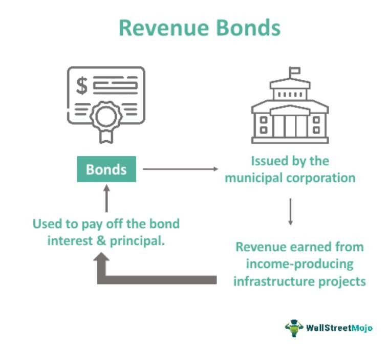

The world of public finance is experiencing a transformation driven by rapid technological advancements. At the forefront of this change are municipal bonds, particularly utility revenue bonds, which are integral in funding essential public projects such as infrastructure development, utilities, and other community services. These bonds provide the necessary capital for projects that range from building schools to improving transportation networks.

Municipal bonds, commonly known as "munis," have traditionally attracted investors with their tax-exempt status and relatively lower default risk compared to corporate bonds. They are pivotal in facilitating capital flow to public projects without the burden of direct tax increases on the community. Among the various types of municipal bonds, utility revenue bonds stand out because they generate returns from specific revenue streams, such as fees from water or electricity services, rather than the general tax revenues backing general obligation bonds.



Simultaneously, the landscape of bond trading, including the municipal bond market, is being reshaped by algorithmic trading. This technology-driven approach utilizes computer programs to execute trades based on pre-set criteria, enhancing the speed, efficiency, and accuracy of trading processes. Algorithmic trading enables market participants to analyze large volumes of data swiftly, ensuring fair price discovery and managing liquidity even in less liquid markets like municipal bonds.

This article aims to explore how the integration of algorithmic trading is transforming the trading dynamics of municipal bonds and utility revenue bonds. By understanding these evolving concepts, investors can better navigate the complexities of the fixed-income market, optimizing their investment strategies in line with technological advancements. As technology progresses, the role of algorithmic trading in the public finance sector is expected to grow, enhancing both market efficiency and investor accessibility.

## Table of Contents

## Understanding Municipal Bonds

Municipal bonds, commonly referred to as "munis," are a form of debt security issued by state and local governments to finance public infrastructure projects. These projects often include essential services such as educational facilities, transportation systems like highways, and utilities like water supply systems. The issuance of municipal bonds serves as a vital tool for governments to access capital while spreading the fiscal responsibility over time.

One of the primary attractions of municipal bonds for investors is their tax advantages. Typically, the interest income received from munis is exempt from federal income tax and, in some cases, state and local taxes as well. This feature makes them particularly appealing to investors in higher tax brackets seeking tax-efficient investments.

Another significant benefit of municipal bonds is their relatively low default risk compared to other fixed-income securities. This lower risk is due in part to the backing of state and local government revenue, which is generally considered stable and reliable. However, it’s worth noting that the degree of risk can vary depending on the specific type of municipal bond and the financial health of the issuing authority.

Despite these benefits, the municipal bond market is characterized by its high fragmentation. Unlike more centralized and standardized markets, such as stock exchanges, the muni market consists of numerous issuers across various jurisdictions, each with differing regulatory and financial conditions. This fragmentation can lead to challenges in terms of [liquidity](/wiki/liquidity-risk-premium) and price transparency, making the trading process complex and, at times, inefficient. Consequently, market participants must navigate a landscape with varying levels of market depth and availability of information, which can impact the overall trading dynamics of municipal bonds. 

Overall, municipal bonds offer a unique investment opportunity combining tax benefits and low risk, albeit within a trading environment that requires careful consideration due to its fragmented nature.

## Utility Revenue Bonds Explained

Utility revenue bonds represent a specific category of municipal bonds utilized by state and local governments to finance public utility projects. These bonds are instrumental in funding essential infrastructure, such as water treatment facilities, electricity grids, and sewage systems. Unlike general obligation bonds, which are backed by the issuer's taxing power, utility revenue bonds are secured by the revenues generated from the specific projects they finance. This structure provides investors with a distinct risk profile, as the repayment of principal and interest is directly tied to the income produced by the utility service.

Repayment from project-specific revenues ensures that these bonds do not impact taxpayers directly. Instead, revenue streams from charges for utility services, such as water bills or electricity fees, form the financial backbone for these securities. The link between bond repayment and revenue generation from project operations often results in a more stable and predictable income stream for bondholders, provided that the utility operations remain efficient and demand for services is sustained.

The assessment of utility revenue bonds by investors typically involves analyzing various financial metrics. A crucial measure is the coverage ratio, which indicates the project’s ability to meet its debt obligations. The coverage ratio is calculated as:

$$
\text{Coverage Ratio} = \frac{\text{Net Operating Income}}{\text{Debt Service}}
$$

A higher coverage ratio signifies a greater ability to cover debt obligations, offering a margin of safety for investors. Another important concept is the net revenue pledge, where the issuer commits to using revenues remaining after operation and maintenance expenses to pay bondholders. This pledge assures investors that priority is given to bond repayments over other financial commitments.

Investors are generally attracted to utility revenue bonds due to their relatively lower default risk and the reliable revenue streams tied to essential services. The consistent demand for utilities in various economic conditions further enhances these bonds' appeal, providing a layer of financial security within a municipal bond portfolio.

## The Rise of Algorithmic Trading in Public Finance

Algorithmic trading employs sophisticated computer programs to execute buy and sell orders automatically, following pre-established criteria. This method is increasingly utilized in the municipal bond market, including for utility revenue bonds, due to its numerous advantages over manual trading.

One of the key benefits of [algorithmic trading](/wiki/algorithmic-trading) is the enhancement of data analysis capabilities. Algorithms can process vast amounts of data from various sources more rapidly and accurately than human traders, identifying trends and pricing discrepancies in real-time. This capability allows traders to make more informed decisions, capturing opportunities that might otherwise be missed in the fast-paced environment of financial markets.

The improvement in market navigation is another significant advantage. Algorithmic systems can automatically adjust to market conditions, executing trades at optimal times to take advantage of price movements. This adaptability is crucial in the municipal bond market, which is notoriously fragmented and less liquid than other financial markets. By using sophisticated algorithms, traders can better manage liquidity and gain a clearer understanding of market dynamics.

Cost efficiency is also paramount to the attractiveness of algorithmic trading. By minimizing the need for manual intervention, algorithms reduce associated labor costs and the potential for human error. This efficiency translates to lower transaction costs and enhanced profitability for traders, particularly when managing large portfolios or executing a high [volume](/wiki/volume-trading-strategy) of trades.

Recent regulatory changes and technological advancements have further facilitated the integration of algorithmic trading into public finance. The shift towards electronic trading platforms and the development of regulatory frameworks supportive of automation have paved the way for wider adoption. This regulatory evolution aims to create a more transparent and efficient market, fostering investor confidence in automated systems.

In conclusion, the rise of algorithmic trading in public finance marks a significant shift in how municipal bonds are traded. With its ability to process data effectively, adapt to market changes, and reduce operational costs, algorithmic trading is poised to play a pivotal role in reshaping the trading landscape of municipal bonds. Advanced technologies continue to drive this transformation, integrating algorithmic trading more deeply into public finance strategies.

## Mechanics of Algorithmic Trading in Municipal Bonds

Algorithmic trading in the municipal bond market leverages computer algorithms to improve the efficiency and accuracy of trading processes. Algorithms analyze vast amounts of market data to detect price discrepancies and capitalize on trading opportunities. This data-driven approach allows for real-time assessment of multiple market variables, providing insights that manual trading might overlook. 

In particular, algorithmic systems ensure fair price discovery by utilizing sophisticated models that consider historical prices, current market conditions, and potential future trends. This capability is crucial in managing liquidity, especially in a market that is inherently less liquid compared to corporate bonds.

Furthermore, algorithms enhance credit analysis by processing information related to credit ratings, financial statements, and economic indicators. This automation facilitates a more comprehensive risk management strategy, as algorithms can continuously assess and adjust positions based on predefined risk criteria, minimizing potential losses.

One key advantage of algorithmic trading is its ability to minimize human error. By relying on pre-established algorithms, traders reduce the likelihood of mistakes that arise from emotional or impulsive decisions. Additionally, algorithms can optimize trading strategies by continuously refining them based on real-time market feedback, leading to more effective trades.

Here's a simple example demonstrating how one might code an algorithmic approach to analyze bond market data using Python:

```python
import numpy as np
import pandas as pd

# Load market data
market_data = pd.read_csv('market_data.csv')

# Function to detect price discrepancies
def detect_discrepancies(data):
    data['Moving_Avg'] = data['Price'].rolling(window=5).mean()
    data['Discrepancy'] = data['Price'] - data['Moving_Avg']
    return data

# Analyze and identify trading opportunities
analyzed_data = detect_discrepancies(market_data)
trading_opportunities = analyzed_data[analyzed_data['Discrepancy'].abs() > threshold]

# Output trading opportunities
print(trading_opportunities)
```

This code exemplifies the use of a simple moving average to spot potential price discrepancies, which may indicate trading opportunities. The threshold value can be adjusted according to the trader's risk appetite and strategic goals.

Overall, algorithmic trading in municipal bonds is about leveraging technology to process and interpret vast amounts of data for more informed decision-making, enhancing how bonds are traded and managed.

## Benefits of Algorithmic Trading for Utility Revenue Bonds

Algorithmic trading offers several advantages when applied to utility revenue bonds, enhancing both trading execution and portfolio management. One of the primary benefits is the speed and precision with which trades are executed. Algorithms efficiently process vast amounts of market data in real time, identifying optimal trade opportunities and executing them within fractions of a second. This rapid execution reduces the chance of price slippage, which occurs when the price of the bond changes during the time it takes to finalize a trade. Consequently, the result is better execution quality and potentially enhanced returns for investors.

Managing large portfolios of utility revenue bonds becomes significantly more efficient with algorithmic trading. The scalability of algorithms allows for the simultaneous monitoring and management of numerous bond positions, irrespective of portfolio size. This capability ensures optimal allocation of assets and can help maintain a balance between risk and return across diverse holdings.

Algorithmic trading also offers cost savings through the reduction of manual processes. Automating the trading process minimizes the need for human intervention, lowering labor costs and decreasing the potential for human error. Furthermore, algorithms optimize the timing and size of trades to reduce transaction costs, thereby enhancing overall portfolio efficiency.

In addition to these benefits, algorithmic trading supports robust risk management frameworks. Advanced algorithms implement sophisticated models for credit analysis and risk evaluation, allowing for real-time assessments of market conditions and bond performance. This proactive risk management capability helps investors mitigate potential losses and adjust strategies dynamically in response to evolving market environments.

Overall, the integration of algorithmic trading in the utility revenue bond market promises improved trade execution, cost-efficiency, enhanced portfolio management, and superior risk management, contributing to a more efficient and effective investment process.

## Challenges in Implementing Algorithmic Trading

Implementing algorithmic trading in the municipal bond market faces various challenges that impede its seamless integration and efficient operation. A prominent issue is market fragmentation. Unlike equity markets, where trading activity is concentrated on centralized exchanges, the municipal bond market is dispersed across numerous platforms and brokers. This [dispersion](/wiki/dispersion-trading) hinders liquidity and complicates the process of obtaining accurate pricing data. Consequently, algorithms must be adept at navigating this fragmented landscape to find and execute trades efficiently.

Data quality issues further exacerbate the complexity of implementing algorithmic trading. Reliable, high-quality data is crucial for the accurate execution of algorithmic strategies. However, the municipal bond market often suffers from inconsistent data standards, leading to inaccuracies that can impact the performance of trading algorithms. Inaccurate pricing data can result in erroneous trades, increasing risks and potentially causing financial losses.

Regulatory compliance presents another significant challenge. Municipal bonds are subject to a complex set of state and federal regulations that algorithms must adhere to. These regulatory requirements necessitate a deep understanding of legal frameworks, ensuring algorithms operate within legal boundaries. Compliance with regulations such as the Securities Act and the Municipal Securities Rulemaking Board's (MSRB) guidelines demands ongoing monitoring and adjustments to trading algorithms, adding a layer of complexity to their implementation.

The technological infrastructure required for effective algorithmic trading in municipal bonds demands substantial investment. Robust trading platforms must be developed, capable of handling large data volumes and executing trades at high speeds. These platforms also need to incorporate sophisticated analytics tools to process market data and identify trading opportunities. Inadequate infrastructure can lead to latency issues and reduced trading efficiency, negating the benefits algorithmic trading seeks to provide.

Lastly, standardization in bond structures and trading platforms remains a significant hurdle. The municipal bond market consists of a diverse array of bonds, each with unique characteristics and covenants. This lack of standardization complicates the development of algorithms that can universally apply across different bonds. Additionally, the variation in trading platforms and protocols requires algorithms to be flexible and adaptable, capable of interfacing with disparate systems to execute trades successfully.

Addressing these challenges is essential for the successful implementation of algorithmic trading in the municipal bond market. By investing in data quality, technological infrastructure, and standardization, market participants can enhance the efficiency and effectiveness of their trading strategies.

## The Future of Municipal Bonds and Algorithmic Trading

Advancements in [artificial intelligence](/wiki/ai-artificial-intelligence) (AI) and blockchain technology are poised to significantly impact the landscape of algorithmic trading within the municipal bond market. AI technologies enhance the ability to process vast amounts of data, enabling more accurate predictions and optimized trading strategies. Predictive modeling and [machine learning](/wiki/machine-learning) algorithms can identify complex patterns in bond pricing and market dynamics that were previously undetectable. This enhanced capability is crucial for executing trades with heightened efficiency, especially in the fragmented municipal bond market where liquidity varies greatly.

Blockchain technology offers the potential to improve transparency and security in municipal bond trading. By leveraging distributed ledger technology, the verification process for bond transactions can be automated and secured, reducing the risk of fraud and ensuring the integrity of trade data. Blockchain can also facilitate the issuance and trading of digital asset-backed bonds, designing a more streamlined process for investors and issuers.

The user-friendliness of algorithmic trading platforms is expected to increase adoption among retail investors. Platforms that offer intuitive interfaces and educational resources can democratize access to sophisticated trading tools, allowing individuals to participate more fully in the municipal bond market. Enhanced accessibility supports broader investment in public utility projects, potentially lowering costs associated with bond issuance.

Regulatory frameworks are evolving to address the challenges posed by sophisticated algorithmic trading systems. Enhanced oversight efforts focus on ensuring algorithm transparency and managing systemic risk. Regulatory bodies may require that algorithms are auditable and compliant with established market conduct rules, thereby fostering market integrity. This can involve implementing standardized protocols and encouraging greater industry collaboration to develop best practices.

The continual evolution of algorithmic trading is shaping the future of municipal bonds by driving improvements in market efficiency and accessibility. As technology continues to advance, integrating these innovations will likely result in a more competitive and transparent trading environment. This evolution presents opportunities for investors to capitalize on enhanced trading systems and for public entities to fund essential projects with improved market mechanisms.

## Conclusion

Municipal bonds and utility revenue bonds play an essential role in funding public infrastructure and services, serving as pillars of public finance. These financial instruments enable state and local governments to raise capital for projects that benefit communities, such as schools, roads, and utilities. While these bonds traditionally attracted investors due to their tax-exempt status and stability, technological advancements are reshaping the way they are traded.

Algorithmic trading is revolutionizing the municipal bond market, introducing efficiency and cost reduction. By employing computer algorithms to execute trades, the trading process becomes faster and more precise, reducing reliance on manual intervention. This automation not only enhances execution quality but also enables the handling of larger bond portfolios with greater scalability. Cost savings are realized through optimized trading strategies and the reduction of manual processes, benefiting both investors and issuers.

For investors seeking opportunities in fixed-income markets, understanding these dynamics is crucial. The integration of algorithmic trading in municipal bonds provides enhanced data analysis capabilities and risk management, optimizing portfolio performance. However, it is vital for investors to remain vigilant about challenges such as market fragmentation and regulatory compliance, which require significant attention and infrastructure investment.

As technology continues to evolve, the prominence of algorithmic trading in the municipal bond market is expected to grow. Advancements in artificial intelligence and blockchain technology promise even greater efficiencies, transparency, and opportunities for market participants. This continual evolution suggests that algorithmic trading will shape the future of municipal bonds, offering exciting prospects for investors and issuers alike.

## References & Further Reading

[1]: ["Algorithmic Trading: Winning Strategies and Their Rationale"](https://books.google.com/books/about/Algorithmic_Trading.html?id=WAlFDwAAQBAJ) by Ernie Chan

[2]: ["Municipal Revenue Bonds: The Basics"](https://www.msrb.org/Municipal-Bond-Basics) by Municipal Securities Rulemaking Board (MSRB)

[3]: Anadu, K., Bohn, J., Boyd, J., & Robideaux, L. (2019). ["The Future of Trading Venues, Post-Trade, and Market Data."](https://pubmed.ncbi.nlm.nih.gov/31252052/) Federal Reserve Bank of New York Staff Reports.

[4]: Lo, Andrew W., & MacKinlay, A. Craig. ["A Non-Random Walk Down Wall Street."](https://www.amazon.com/Non-Random-Walk-Down-Wall-Street/dp/0691092567) Princeton University Press.

[5]: Leung, Mingyang, Xia, Ruoxi, & Thomaidis, Nikolaos S. (2018). ["Forecasting FX market movement with physically inspired Bayesian models."](https://en.wikipedia.org/wiki/%C3%8Ele-de-France) PLOS ONE.