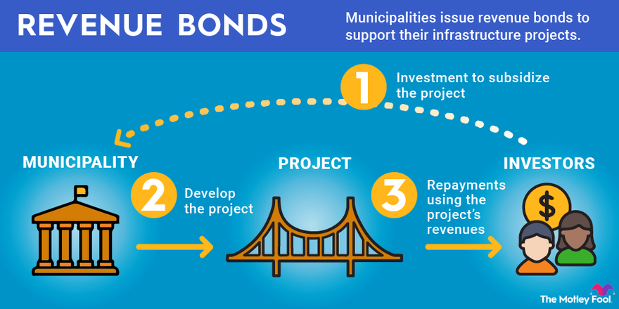

## Table of Contents

## What are Utility Revenue Bonds?

Utility Revenue Bonds are a type of bond that public utility companies issue to raise money for projects like building new water or power plants. Instead of using taxes to pay back these bonds, the money comes from the fees that people pay for using the utility services, like their water or electricity bills.

These bonds are attractive to investors because they are seen as a steady source of income. Since the payments come from the revenue of essential services, there is usually a reliable flow of money to pay back the bondholders. This makes utility revenue bonds a popular choice for funding large infrastructure projects that benefit the community.

## How do Utility Revenue Bonds differ from general obligation bonds?

Utility Revenue Bonds and General Obligation Bonds are two ways that governments or public agencies can borrow money, but they work differently. Utility Revenue Bonds are paid back using the money that comes from the fees people pay for using services like water or electricity. This means the bond's success depends on how much money the utility makes from its customers. If not enough people use the service, or if they don't pay their bills, it might be hard to pay back the bond.

On the other hand, General Obligation Bonds are backed by the full faith and credit of the government that issues them. This means the government promises to use its power to raise taxes or use other general funds to pay back the bondholders. Because of this, General Obligation Bonds are seen as safer for investors, since the government has more ways to make sure the money is paid back, not just from one specific source like a utility.

In simple terms, Utility Revenue Bonds rely on the income from a specific service, while General Obligation Bonds rely on the government's overall ability to raise money. This difference affects how risky the bonds are seen by investors and how they are used for different projects.

## What types of utilities typically issue revenue bonds?

Utilities that often issue revenue bonds include water and sewer systems, electric companies, and sometimes gas utilities. These are the types of services that people use every day and need to live comfortably. When a water or sewer system needs to build new facilities or fix old ones, they can issue revenue bonds to get the money they need. The same goes for electric companies that want to build new power plants or update their systems.

The reason these utilities issue revenue bonds is because they can pay back the money they borrow from the fees they charge their customers. For example, when you pay your water bill, part of that money might go toward paying back a revenue bond that helped build the water treatment plant. This makes sense because the people using the service are the ones helping to pay for the improvements or expansions. It's a way for utilities to keep their services running well without having to raise taxes or use other government funds.

## How is the revenue for these bonds generated?

Revenue for utility revenue bonds comes from the money that people pay for using services like water, electricity, or sewer systems. When you pay your utility bill, part of that money goes towards paying back the bonds that helped build or improve the utility's facilities. For example, if a water company builds a new treatment plant, they might issue revenue bonds to get the money they need. Then, they use the fees they collect from customers to pay back those bonds over time.

This system works because utilities provide essential services that people need every day. Since people will keep paying for these services, there's usually a steady flow of money coming in. This makes it easier for the utility to pay back the bonds without having to raise taxes or use other government funds. It's a way for utilities to keep their services running well and make improvements without putting a strain on other budgets.

## What are the risks associated with investing in Utility Revenue Bonds?

Investing in Utility Revenue Bonds can be a bit risky. One big risk is that the utility might not make enough money from its services to pay back the bonds. If people stop using the service or can't pay their bills, there might not be enough money coming in. This can happen if there's a big change in how people use the utility, like if they start using less water because of a drought, or if there's a big economic downturn and people struggle to pay their bills.

Another risk is that the utility might have to charge higher fees to pay back the bonds, which could make people unhappy and use the service less. If the utility raises prices too much, people might find other ways to get what they need, like using less electricity or finding another water source. This could make it even harder for the utility to pay back the bonds. So, while Utility Revenue Bonds can seem like a safe bet because they're tied to essential services, there are still risks that investors need to think about.

## How are Utility Revenue Bonds rated by credit agencies?

Credit agencies rate Utility Revenue Bonds by looking at how likely the utility is to pay back the money it borrows. They check things like how much money the utility makes from its services, how much it costs to run the utility, and how many people use the service. If the utility has a lot of customers and makes enough money to cover its costs and pay back the bonds, it might get a high rating. But if the utility is struggling to make money or has a lot of debt, it might get a lower rating.

These ratings help investors decide if they want to buy the bonds. A high rating means the bond is seen as safer, so investors might be more willing to buy it. A lower rating means the bond is riskier, so investors might want a higher return to make up for the risk. The ratings are important because they show how confident the credit agencies are that the utility will be able to keep paying back the bonds using the money it makes from its services.

## What are the legal and regulatory considerations for issuing Utility Revenue Bonds?

When a utility wants to issue revenue bonds, it has to follow certain legal and regulatory rules. These rules can be different depending on where the utility is located, but they usually involve getting permission from a government body like a city council or a public utility commission. The utility also has to make sure it follows laws about how it can use the money it gets from the bonds. For example, the money might have to be used only for building or fixing the utility's facilities, and not for other things.

Another important part is that the utility has to be open about its finances. It needs to show investors how much money it makes and how it plans to pay back the bonds. This often means having regular reports and audits to make sure everything is done right. If the utility doesn't follow these rules, it could get in trouble and might not be able to issue bonds in the future. So, it's really important for utilities to understand and follow all the legal and regulatory steps when they want to issue revenue bonds.

## Can you explain the process of issuing Utility Revenue Bonds?

When a utility wants to issue revenue bonds, it starts by figuring out how much money it needs and what the money will be used for. The utility then goes to a government body like a city council or a public utility commission to get permission to issue the bonds. This step is important because the government needs to make sure the utility is using the money for the right reasons, like building or fixing its facilities. Once the utility gets the okay, it works with a financial advisor and a bond underwriter to set up the bond sale. They decide things like how long the bonds will last, what interest rate to offer, and how much money to try to raise.

After everything is set up, the utility sells the bonds to investors. These investors could be regular people, big banks, or even other governments. The utility promises to pay back the money it borrows, plus interest, using the fees it collects from its customers. To make sure investors feel safe about buying the bonds, the utility has to be open about its finances. This means having regular reports and audits to show how much money is coming in and going out. If everything goes well, the utility uses the money from the bonds to make improvements and pays back the investors over time with the money it makes from its services.

## How do interest rates affect Utility Revenue Bonds?

Interest rates have a big impact on Utility Revenue Bonds. When interest rates go up, it means the utility has to pay more money to the people who buy the bonds. This can make it harder for the utility to pay back the bonds because they have to use more of the money they get from their customers to cover the interest. On the other hand, if interest rates go down, the utility has to pay less money to the bondholders. This makes it easier for the utility to pay back the bonds because they can keep more of the money they make from their services.

When interest rates are high, it can also make investors less interested in buying Utility Revenue Bonds. This is because they might be able to get a better return from other investments that seem less risky. But when interest rates are low, Utility Revenue Bonds can look more attractive to investors because they offer a steady return that might be better than what they can get from other places. So, the level of interest rates can change how easy or hard it is for a utility to sell its bonds and pay them back.

## What are some case studies of successful Utility Revenue Bond issuances?

In 2019, the city of Denver, Colorado, issued Utility Revenue Bonds to help pay for upgrades to its water system. They needed about $300 million to fix old pipes and build new water treatment plants. The city was able to sell the bonds easily because it had a good track record of managing its water services and making enough money to pay back its debts. People trusted that Denver would keep making enough money from water bills to cover the bond payments. The project was a success, and the city was able to improve its water system without raising taxes.

Another example is the Metropolitan Water District of Southern California, which issued Utility Revenue Bonds in 2017 to fund a big project called the Pure Water Southern California Program. This project was about turning wastewater into drinking water, which is a smart way to use water in a place where it can be hard to find. The district needed around $1.5 billion for the project, and it was able to sell the bonds because it showed that it had a solid plan to pay back the money using the fees it charges for water. The project is now moving forward and helping to make sure Southern California has enough water for the future.

## How do Utility Revenue Bonds impact the financial planning of a utility company?

When a utility company decides to issue Utility Revenue Bonds, it has to think carefully about its financial plans. The company needs to make sure it can pay back the money it borrows, plus the interest, using the money it makes from its customers. This means the utility has to look at how much money it's making now and how much it expects to make in the future. If the utility thinks it can make enough money to cover the bond payments, then issuing the bonds can be a good way to get the money it needs for big projects like building new water treatment plants or fixing old power lines.

But issuing Utility Revenue Bonds also means the utility has to be careful about how it spends its money. The company might have to keep its fees high enough to make sure it can pay back the bonds, which could make customers unhappy if they feel like they're paying too much. The utility also has to keep a close eye on its finances and be ready to show investors that it's managing its money well. If the utility can do all these things, then using Utility Revenue Bonds can help it improve its services and keep things running smoothly without having to raise taxes or use other government funds.

## What are the future trends and potential innovations in the use of Utility Revenue Bonds?

In the future, utility companies might start using Utility Revenue Bonds in new and smart ways. One big trend could be using these bonds to fund projects that help the environment, like building solar or wind power plants. People are starting to care more about using clean energy, so utilities might find it easier to sell bonds for these kinds of projects. Another trend could be using technology to make it easier for utilities to manage their money and show investors how they're doing. For example, they might use special computer programs to keep track of their finances and share this information with bondholders in real-time.

Another potential innovation is using Utility Revenue Bonds to help with big changes in how utilities work. For example, some places are starting to use smart meters that can tell people exactly how much electricity or water they're using. Utilities might issue bonds to pay for these smart meters and other new technologies. This could help them save money and make their services better, which would make it easier to pay back the bonds. Overall, as people and governments focus more on sustainability and using technology to improve services, Utility Revenue Bonds could become an even more important tool for utilities to fund their future projects.

## What are Utility Revenue Bonds and how are they explained?

Utility revenue bonds represent a specific category of municipal bonds utilized by state and local governments to finance public utility projects. These bonds are instrumental in funding essential infrastructure, such as water treatment facilities, electricity grids, and sewage systems. Unlike general obligation bonds, which are backed by the issuer's taxing power, utility revenue bonds are secured by the revenues generated from the specific projects they finance. This structure provides investors with a distinct risk profile, as the repayment of principal and interest is directly tied to the income produced by the utility service.

Repayment from project-specific revenues ensures that these bonds do not impact taxpayers directly. Instead, revenue streams from charges for utility services, such as water bills or electricity fees, form the financial backbone for these securities. The link between bond repayment and revenue generation from project operations often results in a more stable and predictable income stream for bondholders, provided that the utility operations remain efficient and demand for services is sustained.

The assessment of utility revenue bonds by investors typically involves analyzing various financial metrics. A crucial measure is the coverage ratio, which indicates the project’s ability to meet its debt obligations. The coverage ratio is calculated as:

$$
\text{Coverage Ratio} = \frac{\text{Net Operating Income}}{\text{Debt Service}}
$$

A higher coverage ratio signifies a greater ability to cover debt obligations, offering a margin of safety for investors. Another important concept is the net revenue pledge, where the issuer commits to using revenues remaining after operation and maintenance expenses to pay bondholders. This pledge assures investors that priority is given to bond repayments over other financial commitments.

Investors are generally attracted to utility revenue bonds due to their relatively lower default risk and the reliable revenue streams tied to essential services. The consistent demand for utilities in various economic conditions further enhances these bonds' appeal, providing a layer of financial security within a municipal bond portfolio.

## References & Further Reading

[1]: ["Algorithmic Trading: Winning Strategies and Their Rationale"](https://books.google.com/books/about/Algorithmic_Trading.html?id=WAlFDwAAQBAJ) by Ernie Chan

[2]: ["Municipal Revenue Bonds: The Basics"](https://www.msrb.org/Municipal-Bond-Basics) by Municipal Securities Rulemaking Board (MSRB)

[3]: Anadu, K., Bohn, J., Boyd, J., & Robideaux, L. (2019). ["The Future of Trading Venues, Post-Trade, and Market Data."](https://pubmed.ncbi.nlm.nih.gov/31252052/) Federal Reserve Bank of New York Staff Reports.

[4]: Lo, Andrew W., & MacKinlay, A. Craig. ["A Non-Random Walk Down Wall Street."](https://www.amazon.com/Non-Random-Walk-Down-Wall-Street/dp/0691092567) Princeton University Press.

[5]: Leung, Mingyang, Xia, Ruoxi, & Thomaidis, Nikolaos S. (2018). ["Forecasting FX market movement with physically inspired Bayesian models."](https://en.wikipedia.org/wiki/%C3%8Ele-de-France) PLOS ONE.