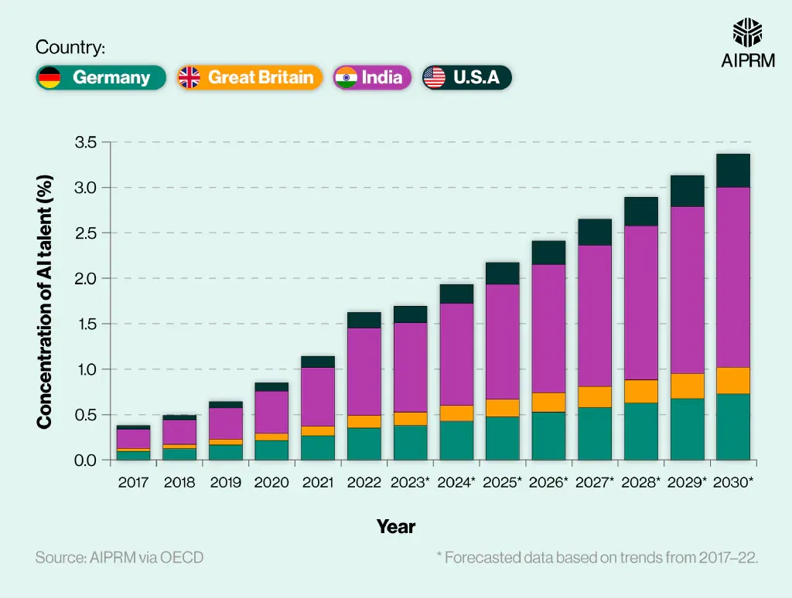

## Table of Contents

## What is artificial intelligence and how does it relate to investment?

Artificial intelligence, or AI, is when computers and machines can do things that normally need human thinking, like understanding language, recognizing pictures, and making decisions. AI uses special math and computer programs to learn from data and get better at tasks over time. It's like how a person learns from experience, but for machines.

In the world of investment, AI is becoming very important. It helps investors by looking at huge amounts of data quickly, finding patterns that people might miss. For example, AI can predict how stock prices might change or help pick the best times to buy or sell investments. This can make investing easier and possibly more successful. But, it's important to remember that AI isn't perfect and can make mistakes, so it should be used carefully along with human judgment.

## How can AI help beginners in making investment decisions?

AI can be a big help for beginners who are just starting to make investment decisions. It can look at a lot of information very quickly, like news about companies, how the economy is doing, and what other investors are doing. This helps beginners understand what's happening in the market without having to spend a lot of time researching. AI can also suggest investments that might be good for someone just starting out, based on how much risk they want to take and what they hope to achieve with their money.

Another way AI helps is by making things simpler. It can explain complicated investment ideas in a way that's easy to understand. For example, if you're new to investing, AI can break down why a certain stock might be a good choice or what a mutual fund does. This can make the whole process less scary and more approachable. Plus, AI can keep an eye on your investments all the time and let you know if you should make changes, which is something beginners might find hard to do on their own.

## What are the basic AI tools available for investment analysis in 2024?

In 2024, there are several basic AI tools that can help with investment analysis. One popular tool is robo-advisors, which are like automatic investment helpers. They use AI to look at your money goals and how much risk you want to take, then they pick investments for you. They can also keep your investments balanced over time without you having to do much. Another tool is AI-powered stock screeners. These tools go through lots of data to find stocks that match what you're looking for, like stocks that are growing fast or ones that pay good dividends.

Another useful AI tool is sentiment analysis software. This tool reads news articles, social media posts, and other online content to figure out how people feel about certain companies or the market in general. This can help you understand if people are feeling positive or negative about an investment, which can affect its price. Lastly, there are AI chatbots and virtual assistants that can answer your questions about investing. They can explain things in simple terms and help you learn more about how to invest wisely. These tools make it easier for anyone to start investing and make smart choices.

## How does AI improve the accuracy of investment predictions?

AI improves the accuracy of investment predictions by looking at huge amounts of data really fast. It can find patterns and connections in the data that people might miss. For example, AI can look at how stock prices have changed over time, news about companies, and what other investors are doing. By finding these patterns, AI can make guesses about what might happen next in the market. This helps investors make better decisions because they have more information to work with.

Another way AI helps is by learning from past mistakes and successes. Over time, AI can get better at predicting because it keeps updating its knowledge. This is called [machine learning](/wiki/machine-learning). When AI makes a prediction and sees if it was right or wrong, it can adjust its methods to be more accurate in the future. This means that the more AI is used, the better it gets at helping investors make smart choices about where to put their money.

## What are the key AI algorithms used in investment strategies?

AI uses different kinds of math tricks, called algorithms, to help with investment strategies. One common one is called machine learning. This is when the computer learns from past data to make better guesses about the future. For example, it can look at how stock prices have moved before and use that to predict what might happen next. Another important algorithm is called neural networks. These are like the computer's way of thinking, trying to copy how our brains work. They can find patterns in big piles of data, like news articles or social media posts, to see how people feel about certain companies or the market.

Another useful algorithm is called natural language processing (NLP). This helps the computer understand and use human language. It can read news and reports to figure out what's happening in the market and how it might affect investments. Lastly, there's [reinforcement learning](/wiki/reinforcement-learning), which is like learning by doing. The AI tries different investment strategies and learns from the results, getting better over time. These algorithms work together to help investors make smarter choices by giving them more accurate information and predictions.

## How can AI be integrated into existing investment portfolios?

AI can be added to your current investments by using tools like robo-advisors. These are like smart helpers that use AI to look at your money goals and how much risk you want to take. They can then suggest changes to your investments or even manage them for you. For example, if you have a mix of stocks and bonds, a robo-advisor can keep an eye on them and make sure they stay balanced, buying or selling as needed to match your plan. This can save you time and help you make better choices without having to be an expert yourself.

Another way to use AI is with AI-powered tools that analyze data to give you insights. These tools can look at lots of information, like news about companies or how the economy is doing, and tell you if you should make changes to your investments. For instance, if AI sees that a company you've invested in is doing well, it might suggest you buy more of its stock. Or if it sees trouble coming, it might tell you to sell some of your shares. By using these tools, you can keep your investments up to date and possibly make more money, all while learning more about how to invest smartly.

## What are the ethical considerations of using AI in investment?

When using AI in investments, it's important to think about fairness. AI might make choices based on data, but if that data has mistakes or is unfair, the AI can make decisions that hurt some people more than others. For example, if AI uses data that shows certain groups of people are less likely to invest, it might not suggest good investment options to those groups. This can make the gap between rich and poor even bigger. So, it's important to make sure the data AI uses is fair and doesn't leave anyone out.

Another big concern is privacy. AI needs a lot of personal information to work well, like how much money you make or what you spend it on. This information can be very private, and if it's not kept safe, it could be used in bad ways. People using AI for investments need to be careful to protect this information and use it in a way that respects people's privacy. It's also important to be clear about how AI is making decisions so that investors can trust it and understand what's happening with their money.

## How does AI handle real-time data for dynamic investment adjustments?

AI is really good at handling real-time data for making quick changes to investments. It can look at information coming in right now, like stock prices, news, and what other investors are doing. This helps AI see what's happening in the market at that very moment. By using this up-to-date information, AI can suggest buying or selling investments to take advantage of new opportunities or to avoid risks. This means your investment strategy can change as the market changes, which can help you make more money or lose less.

For example, if a big company suddenly announces good news, AI can see this right away and suggest you buy more of that company's stock before the price goes up. Or if there's bad news, AI can tell you to sell some of your shares to avoid losing money. This quick reaction to real-time data is something that would be hard for a person to do all the time, but AI can do it easily. By using AI, you can keep your investments in line with what's happening in the market without having to watch it all the time yourself.

## What advanced AI techniques are used for risk management in investments?

AI uses some smart tricks to help manage risks in investments. One of these tricks is called predictive analytics. This is when AI looks at a lot of past data to guess what might happen in the future. It can see patterns in how the market has moved before and use that to predict if there might be a big drop or rise in prices. This helps investors get ready for possible risks and maybe even avoid them. Another trick is called Monte Carlo simulations. This is when AI runs a lot of different scenarios to see how your investments might do under different conditions. It's like playing out many different futures to see which ones are risky and which ones are safe.

Another advanced technique is called [deep learning](/wiki/deep-learning). This is a type of AI that's really good at finding hidden patterns in big piles of data. It can look at things like news articles, social media posts, and even satellite images to see if there are any signs of trouble coming up. By spotting these signs early, AI can help investors take steps to protect their money. All these techniques work together to give investors a better idea of the risks they might face and help them make smarter choices to keep their investments safe.

## How can AI be used to identify new investment opportunities in niche markets?

AI can help find new investment opportunities in niche markets by looking at a lot of data really fast. It can go through information like news articles, social media posts, and industry reports to spot trends that might be hard for people to see. For example, if there's a new technology or product becoming popular in a small market, AI can notice this trend early and suggest investing in companies that are part of it. This way, investors can get in on the ground floor of something that could grow big.

Another way AI helps is by using machine learning to understand what makes a niche market successful. It can look at past data from similar markets to predict what might work well in the future. For instance, if AI sees that certain types of businesses in a niche market tend to do well, it can suggest investing in similar businesses in other niche markets. This can open up new opportunities that investors might not have thought of on their own, helping them to diversify their investments and possibly make more money.

## What are the limitations and potential biases of AI in investment decision-making?

AI can be really helpful for making investment decisions, but it's not perfect. One big problem is that AI can be biased. This happens because AI learns from data, and if that data is not fair or complete, the AI can make decisions that are not fair either. For example, if the data mostly comes from big companies and not small ones, AI might suggest investing in big companies more often, even if there are good opportunities in smaller companies. Also, AI might not understand things like human emotions or sudden changes in the market, which can lead to mistakes in its predictions.

Another limitation is that AI can be hard to understand. Sometimes, it's not clear why AI makes certain choices, which can make it hard for investors to trust it. This is called the "black box" problem, where you can see what goes in and what comes out, but not what happens in the middle. Plus, AI needs a lot of data to work well, and if it doesn't have enough good data, its predictions can be off. So, while AI can help a lot, it's important to use it carefully and not rely on it completely without also using your own judgment.

## How can expert investors leverage AI for high-frequency trading and algorithmic trading strategies?

Expert investors can use AI to make high-frequency trading and [algorithmic trading](/wiki/algorithmic-trading) strategies work better. High-frequency trading is when computers buy and sell stocks very quickly, often in just a few seconds. AI can help by looking at a lot of data really fast and making smart guesses about what the market will do next. This means AI can spot tiny changes in the market and make trades before most people even notice what's happening. By using AI, expert investors can make more trades and possibly make more money because they can react to the market so quickly.

For algorithmic trading, AI can create and improve trading strategies by learning from past data. This type of trading uses math formulas to decide when to buy or sell investments. AI can look at how these formulas have worked before and make them better over time. It can also try out different strategies in a safe way, like a practice run, to see which ones work best. This helps expert investors find the best ways to trade and make their strategies more successful. By using AI, they can keep their trading strategies up to date and take advantage of new opportunities in the market.

## References & Further Reading

[1]: Bergstra, J., Bardenet, R., Bengio, Y., & Kégl, B. (2011). ["Algorithms for Hyper-Parameter Optimization."](https://papers.nips.cc/paper/4443-algorithms-for-hyper-parameter-optimization) Advances in Neural Information Processing Systems 24.

[2]: ["Advances in Financial Machine Learning"](https://www.amazon.com/Advances-Financial-Machine-Learning-Marcos/dp/1119482089) by Marcos Lopez de Prado

[3]: ["Evidence-Based Technical Analysis: Applying the Scientific Method and Statistical Inference to Trading Signals"](https://www.amazon.com/Evidence-Based-Technical-Analysis-Scientific-Statistical/dp/0470008741) by David Aronson

[4]: ["Machine Learning for Algorithmic Trading"](https://github.com/stefan-jansen/machine-learning-for-trading) by Stefan Jansen

[5]: ["Quantitative Trading: How to Build Your Own Algorithmic Trading Business"](https://www.amazon.com/Quantitative-Trading-Build-Algorithmic-Business/dp/1119800064) by Ernest P. Chan

[6]: Barocas, S., Hardt, M., & Narayanan, A. (2019). ["Fairness and Machine Learning."](https://www.semanticscholar.org/paper/Fairness-and-Machine-Learning-Limitations-and-Barocas-Hardt/bae7f0b3448a3eac77886f2a683c0cf9256bb8bf)

[7]: European Commission. (2021). ["Ethics guidelines for trustworthy AI."](https://digital-strategy.ec.europa.eu/en/library/ethics-guidelines-trustworthy-ai)