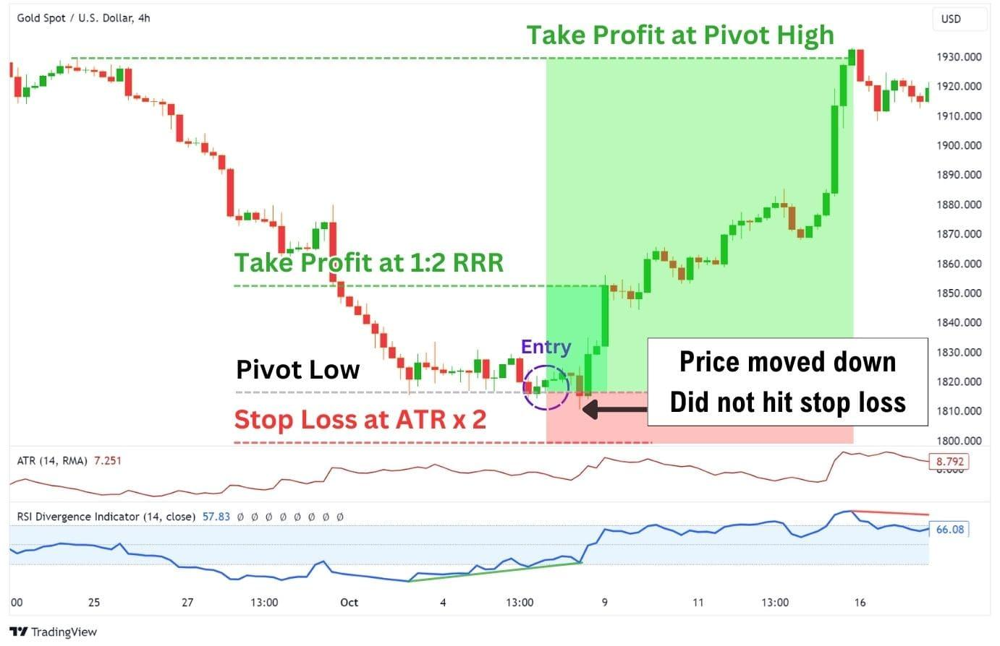

## Table of Contents

## What is Average True Range (ATR) and why is it important in trading?

Average True Range (ATR) is a tool used in trading to measure how much the price of a stock, currency, or other financial instrument moves on average over a certain period. It was created by J. Welles Wilder Jr. and is often used over 14 days. The ATR looks at the difference between the highest and lowest prices of each day, as well as any gaps from the previous day's close to the current day's open. This helps traders understand the volatility of the market, which means how much the price is changing.

ATR is important in trading because it helps traders make better decisions. By knowing the average range of price movements, traders can set more accurate stop-loss orders, which are used to limit potential losses. It also helps in deciding when to enter or exit a trade. If the ATR is high, it means the market is more volatile, and traders might want to be more careful. If the ATR is low, it suggests the market is less volatile, and traders might feel more confident in their trades. Overall, ATR is a useful tool for managing risk and understanding market conditions.

## How is the Average True Range calculated?

To calculate the Average True Range (ATR), you first need to find the True Range (TR) for each day. The True Range is the biggest of three values: the difference between the current day's high and low, the difference between the current day's high and the previous day's close, or the difference between the current day's low and the previous day's close. Once you have the True Range for each day, you take the average of these values over a certain number of days, usually 14 days.

After you have the True Ranges for the first 14 days, you add them up and divide by 14 to get the first ATR. For each day after that, you calculate a new ATR by taking the previous day's ATR and multiplying it by 13, then adding the current day's True Range and dividing the total by 14. This way, the ATR keeps updating every day, giving you a current measure of how much the price is moving on average.

## Can you explain the concept of 'true range' in the context of ATR?

The 'true range' is a part of the Average True Range (ATR) calculation. It's a way to measure how much a price moved in a single day, but it also takes into account any gaps from one day to the next. Imagine you're looking at a stock's price. The true range for that day is the biggest of three numbers: the difference between the highest price and the lowest price of that day, the difference between the highest price of that day and the closing price of the previous day, or the difference between the lowest price of that day and the closing price of the previous day.

This concept helps traders understand the full range of price movement, not just what happens during the trading hours of a single day. If a stock closed at $50 one day and opened at $52 the next day, the true range would consider this $2 jump, even if the stock only moved between $51 and $53 during the trading hours of the second day. By including these gaps, the true range gives a more complete picture of volatility, which is why it's an important part of the ATR calculation.

## What time periods are typically used for calculating ATR?

The most common time period used for calculating the Average True Range (ATR) is 14 days. This period was suggested by J. Welles Wilder Jr., who created the ATR. Traders use this 14-day period because it gives a good balance between being responsive to recent price changes and showing the overall volatility of the market over a couple of weeks.

However, traders can choose different time periods based on their trading style and the specific market they are looking at. Shorter periods, like 7 days, can be used for more short-term trading, where traders want to see quicker changes in volatility. Longer periods, like 20 or 30 days, might be used for a broader view of market volatility, which can be helpful for longer-term investment strategies.

## How can beginners use ATR to set stop-loss orders?

Beginners can use the Average True Range (ATR) to set stop-loss orders by first understanding what the ATR tells them about the market's volatility. If the ATR is high, it means the price is moving a lot, so they should set a wider stop-loss to avoid being stopped out by normal market fluctuations. If the ATR is low, they can set a tighter stop-loss because the price isn't moving as much. A simple way to use ATR for setting stop-losses is to multiply the current ATR by a number, like 2 or 3, and use that as the distance from the entry price to set the stop-loss.

For example, if a beginner buys a stock at $50 and the ATR is $1, they might set the stop-loss at $48 if they use a multiplier of 2 ($50 - 2 * $1). This way, the stop-loss is far enough away to allow for normal price movements but close enough to limit potential losses if the price starts to fall sharply. By using ATR, beginners can make more informed decisions about where to place their stop-loss orders, helping them manage risk better in their trading.

## What are the limitations of using ATR as a sole indicator for trading?

Using ATR as the only tool for trading can be tricky because it only tells you about how much prices move, not the direction they're going. Imagine you're driving a car, and ATR is like knowing how fast you're going but not which way you're heading. It's helpful to know the speed, but you also need to know if you're going forward or backward to make good decisions. So, while ATR can help set stop-losses and understand market volatility, it doesn't tell you if the price will go up or down, which is really important for deciding when to buy or sell.

Another thing to keep in mind is that ATR doesn't work the same in all markets or over different time periods. What works well for one stock might not work for another, and what's good for a short time might not be good for a longer time. So, if you only use ATR, you might miss out on other important information that other indicators or tools could give you. It's like trying to cook a meal with just one ingredient; you need a mix of different tools and indicators to make the best trading decisions.

## How does ATR help in determining market volatility?

ATR helps in determining market volatility by measuring how much the price of a stock, currency, or other financial instrument moves on average over a certain period. It looks at the difference between the highest and lowest prices of each day, and also considers any gaps from the previous day's close to the current day's open. If the ATR is high, it means the price is moving a lot, and the market is more volatile. If the ATR is low, it means the price isn't moving much, and the market is less volatile. This helps traders understand how much they can expect the price to change, which is important for making trading decisions.

By using ATR, traders can get a clear picture of how much risk is involved in a particular market or stock. For example, if a stock's ATR is high, it means the price could change a lot in a short time, so traders might need to be more careful and set wider stop-loss orders to avoid getting stopped out by normal price swings. On the other hand, if a stock's ATR is low, it suggests the price is more stable, and traders might feel more confident in their trades. This way, ATR acts as a helpful tool for managing risk and understanding the ups and downs of the market.

## Can ATR be used effectively in different market conditions, such as trending or ranging markets?

ATR can be used effectively in both trending and ranging markets, but how it's used can change depending on the market condition. In a trending market, where prices are moving in a clear direction, ATR can help traders set their stop-loss orders at a distance that allows for the normal ups and downs of the trend. If the ATR is high during a trend, it means the price is moving a lot, so traders might set their stop-losses further away to avoid being stopped out by normal price swings. This way, they can stay in the trade longer and possibly benefit more from the trend.

In a ranging market, where prices move up and down within a certain range, ATR can help traders understand how much the price might move before it hits the top or bottom of the range. If the ATR is low in a ranging market, it suggests that the price isn't moving much, so traders might set tighter stop-losses. This can help them get out of trades quickly if the price starts to move out of the range. By using ATR in different market conditions, traders can adjust their strategies to better manage risk and make more informed trading decisions.

## How can advanced traders integrate ATR with other technical indicators to enhance trading strategies?

Advanced traders can combine ATR with other technical indicators to make their trading strategies better. One common way is to use ATR with trend-following indicators like Moving Averages. For example, if a trader sees that the price is above a long-term Moving Average, they might think the market is trending up. They can then use ATR to set their stop-loss orders at a safe distance from the entry price, so they don't get stopped out by normal market swings. This helps them stay in the trade longer and possibly make more money from the trend. Another way is to use ATR with momentum indicators like the Relative Strength Index (RSI). If the RSI shows that a stock is overbought or oversold, traders can use ATR to decide when to enter or exit a trade based on how volatile the market is.

Another useful combination is using ATR with support and resistance levels. Traders can look at where the price has bounced off in the past and use ATR to set their stop-losses just below support levels or above resistance levels. This way, they can better manage their risk and protect their profits. By combining ATR with other indicators, advanced traders get a fuller picture of the market. They can see not just how much the price is moving, but also the direction it's going, how strong the trend is, and where important price levels are. This helps them make smarter trading decisions and manage their trades more effectively.

## What are some common mistakes traders make when using ATR?

One common mistake traders make when using ATR is relying on it too much. ATR only tells you how much the price is moving, not which way it's going. So, if traders only look at ATR, they might miss important signs that the price is going up or down. It's like driving a car and only knowing how fast you're going but not if you're going forward or backward. To avoid this, traders should use ATR along with other tools that show the direction of the price, like moving averages or trend lines.

Another mistake is not adjusting the ATR period to match their trading style. The usual period is 14 days, but what works for one trader might not work for another. If a trader is looking at short-term moves, a shorter period like 7 days might be better. But if they're thinking long-term, a longer period like 20 or 30 days could be more helpful. Using the wrong period can lead to bad trading decisions. Traders should try different periods and see what fits best with how they trade and the market they're looking at.

## How can ATR be applied in algorithmic trading to optimize entry and exit points?

In algorithmic trading, ATR can be used to find the best times to buy and sell by understanding how much the price is moving. Traders can set up their computer programs to use ATR to decide when to enter a trade. For example, if the ATR is low, it means the price isn't moving much, so the program might look for a good entry point when the price starts to move more. If the ATR is high, the program might wait for the price to calm down before entering a trade. This way, the computer can use ATR to help find the best times to start trading, based on how much the market is moving around.

ATR can also help in deciding when to exit a trade. A trading algorithm can use ATR to set stop-loss orders, which are like safety nets to limit losses. If the ATR is high, the program might set the stop-loss further away from the entry price to avoid getting stopped out by normal big swings in the price. If the ATR is low, the stop-loss can be set closer because the price isn't moving as much. By using ATR this way, the algorithm can better manage when to get out of a trade, helping to protect profits and minimize losses.

## Can you discuss any case studies or real-world examples where ATR significantly impacted trading outcomes?

One real-world example where ATR significantly impacted trading outcomes is the case of a day trader named Sarah. Sarah used ATR to set her stop-loss orders in the volatile forex market. She noticed that the EUR/USD pair had an ATR of around 80 pips over a 14-day period. Knowing this, Sarah decided to set her stop-loss orders at 160 pips away from her entry point, which is twice the ATR. This allowed her to stay in trades longer during normal market swings, resulting in more successful trades and higher profits. By understanding the volatility of the market through ATR, Sarah was able to manage her risk better and make more informed trading decisions.

Another example involves a hedge fund manager, John, who used ATR to enhance his algorithmic trading strategy. John's algorithm was designed to trade stocks in the tech sector, which can be quite volatile. By integrating ATR into his algorithm, John could dynamically adjust his entry and exit points based on the current market volatility. For instance, when the ATR of a tech stock like Apple increased due to an upcoming product announcement, John's algorithm would widen the stop-loss orders to avoid premature exits. This adjustment helped John's fund capture larger price movements and resulted in significant outperformance compared to when he did not use ATR. The use of ATR allowed John to better navigate the ups and downs of the market, leading to more successful trading outcomes.

## What is the Average True Range (ATR)?

The Average True Range (ATR) is a widely utilized technical analysis indicator that quantifies market volatility by examining the range of price movements over a specified period. It provides traders with critical insights into market conditions, assisting in the evaluation of price action fluctuations without indicating the direction of price movements, thus maintaining its neutrality as a volatility measure.

The formula for ATR begins with the calculation of the True Range (TR), which is the greatest of the following: 

1. The current high minus the current low.
2. The absolute value of the current high minus the previous close.
3. The absolute value of the current low minus the previous close.

Mathematically, this can be expressed as:

$$

TR_t = \max((High_t - Low_t), |High_t - Close_{t-1}|, |Low_t - Close_{t-1}|)
$$

Once the True Range is determined for a series of periods, the Average True Range is calculated by taking a moving average of the True Range over a defined number of periods, typically 14 days for daily charts. This smoothing of data helps provide a clearer picture of market [volatility](/wiki/volatility-trading-strategies) trends, mitigating the effects of anomalous price spikes or drops.

ATR's primary utility lies in its ability to assess volatility rather than price trajectories. Traders employ ATR to strategize potential trade setups by anticipating changes in volatility rather than guessing price direction. This feature makes ATR a vital component in risk management, helping traders set more informed stop-loss levels and position sizing based on prevailing market volatility. By understanding the typical price movement within a given period, traders can better prepare for potential market shifts, leading to more robust and effective trading strategies.

## References & Further Reading

[1]: Wilder, J.W. (1978). ["New Concepts in Technical Trading Systems."](https://archive.org/details/newconceptsintec00wild) Trend Research.

[2]: Pring, M. J. (2002). ["Technical Analysis Explained: The Successful Investor's Guide to Spotting Investment Trends and Turning Points."](https://www.amazon.com/Technical-Analysis-Explained-Fifth-Successful/dp/0071825177) McGraw-Hill Education.

[3]: Schwager, J.D. (1989). ["Market Wizards: Interviews with Top Traders."](https://www.amazon.com/Market-Wizards-Jack-D-Schwager/dp/0887306101) New York Institute of Finance.

[4]: Murphy, J.J. (1999). ["Technical Analysis of the Financial Markets: A Comprehensive Guide to Trading Methods and Applications."](https://archive.org/details/technicalanalysi0000murp) Prentice Hall Press.

[5]: Aronson, D. R. (2006). ["Evidence-Based Technical Analysis: Applying the Scientific Method and Statistical Inference to Trading Signals."](https://www.amazon.com/Evidence-Based-Technical-Analysis-Scientific-Statistical/dp/0470008741) Wiley.

[6]: Lopez de Prado, M. (2018). ["Advances in Financial Machine Learning."](https://www.amazon.com/Advances-Financial-Machine-Learning-Marcos/dp/1119482089) Wiley.

[7]: Chan, E.P. (2009). ["Quantitative Trading: How to Build Your Own Algorithmic Trading Business."](https://github.com/ftvision/quant_trading_echan_book) Wiley.