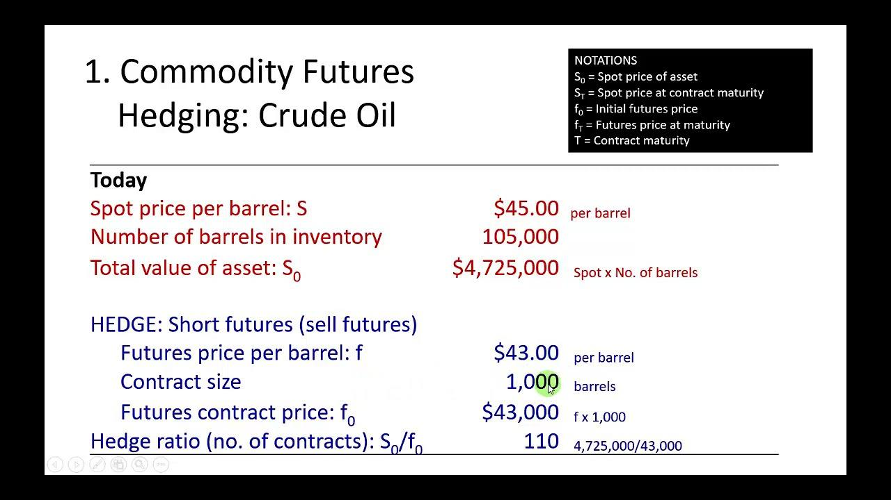

## Table of Contents

## What are commodity futures and how do they work?

Commodity futures are contracts that allow people to buy or sell a specific amount of a commodity, like oil, gold, or wheat, at a set price on a future date. These contracts are traded on special exchanges, like the Chicago Mercantile Exchange. People use commodity futures to protect themselves from price changes or to try to make money by guessing how prices will move.

When someone buys a commodity future, they agree to buy the commodity at the set price when the contract ends. If the price of the commodity goes up, the buyer can make money because they can buy it cheaper than the current market price. On the other hand, if someone sells a future, they agree to sell the commodity at the set price. If the price goes down, the seller makes money because they can sell it for more than the current market price. This way, futures help people manage risk and plan for the future.

## Why is hedging important in commodity markets?

Hedging is important in commodity markets because it helps people and businesses protect themselves from big price changes. Imagine you're a farmer who grows wheat. You want to make sure you can sell your wheat at a good price, even if the market price drops before you can sell it. By using futures contracts, you can lock in a price today for your wheat that you'll deliver later. This way, no matter what happens to the market price, you know you'll get the price you agreed on, which helps you plan your finances better.

Hedging also helps companies that need to buy commodities, like a bakery that needs flour. If the price of wheat goes up, the cost of flour will go up too, which can hurt the bakery's profits. By buying wheat futures, the bakery can lock in a price for wheat now, even if they won't need it until later. This means they can better predict their costs and avoid big surprises. Overall, hedging makes the commodity markets more stable and helps everyone involved manage their risks better.

## How can commodity futures be used for hedging?

Commodity futures can be used for hedging by locking in prices for commodities that will be bought or sold in the future. For example, a farmer who grows corn can sell corn futures to guarantee a set price for their crop before it's even harvested. If the market price of corn drops by the time the farmer is ready to sell, they still get the higher price they locked in with the futures contract. This helps the farmer avoid losing money if prices fall.

On the other hand, a company that needs to buy commodities can use futures to protect against rising prices. Imagine a cereal company that needs to buy wheat. If they think the price of wheat might go up, they can buy wheat futures now at today's price. When they need to buy the actual wheat later, they can use the futures contract to get it at the lower price they locked in, even if the market price has gone up. This way, the company can better predict their costs and protect their profits.

## What are the basic steps to start hedging with commodity futures?

To start hedging with commodity futures, you first need to understand what commodity you want to hedge. For example, if you're a farmer, you might want to hedge the price of your crops like corn or wheat. If you're a business, you might want to hedge the price of the raw materials you need, like oil or metals. Once you know what commodity you want to hedge, you need to find out how much of it you'll need to buy or sell in the future. This helps you decide how many futures contracts you should buy or sell.

Next, you need to open an account with a futures broker. This is someone who can help you buy and sell futures contracts. You'll need to put some money into this account as a deposit, which is called margin. Once your account is set up, you can start trading. You'll buy or sell futures contracts that match the amount of the commodity you want to hedge. If you're a farmer selling corn, you'd sell corn futures. If you're a business buying oil, you'd buy oil futures. By doing this, you lock in a price for the commodity, which helps protect you from price changes in the future.

## What are the risks associated with using commodity futures for hedging?

Using commodity futures for hedging can help you manage risk, but it also comes with its own risks. One big risk is that the price of the commodity might move in the opposite way of what you expected. If you're a farmer who sold corn futures to lock in a price, and the market price of corn goes up instead of down, you might miss out on making more money. This is called opportunity cost. Also, if the market moves a lot, you might have to put more money into your futures account to keep your position open. This is called a margin call, and it can be stressful and expensive.

Another risk is that futures contracts are standardized, which means they might not perfectly match what you need. For example, if you need to buy a certain amount of oil, the futures contract might be for a different amount or a different delivery date. This can make it hard to hedge exactly what you need. Also, using futures involves costs like trading fees and commissions, which can add up and eat into your profits. So, while hedging with futures can help protect you from price changes, it's important to understand these risks and plan carefully.

## How do you determine the appropriate hedge ratio for commodity futures?

To determine the appropriate hedge ratio for commodity futures, you need to figure out how much of the commodity you want to hedge and how much the futures contract covers. The hedge ratio is basically the number of futures contracts you need to buy or sell to protect the amount of the commodity you're dealing with. Let's say you're a farmer with 10,000 bushels of corn. If one futures contract covers 5,000 bushels, you would need to sell two contracts to hedge your entire crop.

Finding the right hedge ratio can be a bit tricky because you also need to think about how closely the futures price moves with the actual price of the commodity you're hedging. This is called the correlation between the two prices. If the futures price usually moves the same way as the actual price, you might use a hedge ratio of 1:1. But if the futures price doesn't move exactly the same way, you might need to adjust your hedge ratio. You can do this by looking at past data to see how the prices have moved together and then figuring out the right number of contracts to use based on that information.

## What are the differences between hedging with futures and options?

Hedging with futures and options are two ways to protect against price changes, but they work a bit differently. When you use futures, you agree to buy or sell a commodity at a set price on a future date. This means you're locked into that price, no matter what happens in the market. If the price goes up, you're happy because you got a good deal. But if the price goes down, you still have to buy or sell at the higher price you agreed on, which can be a problem.

Options give you more flexibility. When you buy an option, you have the right, but not the obligation, to buy or sell a commodity at a set price before a certain date. This means you can choose to use the option if it's good for you, or just let it expire if it's not. Options can be more expensive because of this flexibility, but they let you take advantage of good price changes while still protecting you from bad ones. So, futures are more like a firm promise, while options are more like a safety net with a choice.

## How can basis risk affect hedging strategies with commodity futures?

Basis risk can make hedging with commodity futures tricky. Basis is the difference between the price of the commodity in the futures market and the price you get or pay in the actual market. When you hedge, you're trying to lock in a price to protect yourself from big changes. But if the basis changes a lot, your hedge might not work as well as you hoped. For example, if you're a farmer who sold wheat futures to lock in a price, but the local price of wheat goes down more than the futures price, you might still lose money even though you hedged.

To manage basis risk, you need to keep an eye on how the basis usually changes over time. This can help you make better decisions about when to hedge and how much to hedge. Sometimes, you might need to adjust your hedge as the basis changes. It's all about trying to match the futures price as closely as possible to the price you'll actually get or pay for the commodity. Even though basis risk can make things more complicated, understanding it can help you use futures more effectively to protect yourself from price changes.

## What are some advanced hedging strategies using commodity futures?

One advanced hedging strategy is called a "stack and roll" hedge. This is when you keep rolling over your futures contracts as they get close to expiring. Imagine you're a farmer who wants to lock in a good price for your crop all year. You might sell futures contracts for the next few months. When those contracts are about to expire, you buy them back and sell new ones for later dates. This way, you keep your hedge going without having to deliver the actual commodity. It's like stacking new contracts on top of each other and rolling them forward in time.

Another strategy is called a "calendar spread" hedge. This is when you use two different futures contracts with different expiration dates to hedge your risk. For example, if you're worried about the price of oil going up in the short term but staying stable in the long term, you might buy a near-term oil futures contract and sell a longer-term one. If the price goes up in the short term, you make money on the near-term contract. If it stays stable in the long term, you don't lose much on the longer-term contract. This can help you manage different kinds of price risks at the same time.

A third strategy is using "options on futures" for more flexibility. Instead of just buying or selling futures, you can buy options that give you the right to buy or sell futures at a set price. This can be useful if you want to protect against big price drops but still want to take advantage of price increases. For example, if you're a business that needs to buy copper, you might buy a put option on copper futures. This gives you the right to sell copper futures at a set price if the market price drops a lot. If the price goes up instead, you can just let the option expire and buy copper at the higher market price. This way, you have a safety net but still keep some room to make money if things go well.

## How do market conditions influence the effectiveness of hedging with commodity futures?

Market conditions can really change how well hedging with commodity futures works. If the market is stable and prices don't move around a lot, hedging can be very effective. You can lock in a good price and feel safe knowing that your costs or income won't change much. But if the market is really volatile and prices jump up and down a lot, hedging can be trickier. You might have to keep adjusting your hedge, and even then, you might not be able to protect yourself perfectly from big price swings.

Another thing to think about is how supply and demand affect the market. If there's a sudden change, like a big drop in supply because of a natural disaster, the price of the commodity can go up a lot. Your hedge might not cover all of that increase, so you could still lose money. On the other hand, if there's a lot of the commodity available and the price drops, your hedge can help you a lot by locking in a higher price. So, understanding the market conditions and how they might change is really important for making sure your hedging strategy works well.

## What are the tax implications of hedging with commodity futures?

When you hedge with commodity futures, you need to think about taxes. In the United States, the money you make or lose from futures trading is usually treated as a capital gain or loss. If you hold the futures contract for less than a year, any profit you make is considered a short-term capital gain, which is taxed at your regular income tax rate. If you hold it for more than a year, it's a long-term capital gain, which is taxed at a lower rate. This can make a big difference in how much tax you have to pay.

Also, if you're using futures to hedge your business, you might be able to treat the gains and losses as ordinary income or loss instead of capital gains. This can be helpful because it might let you offset other business income or losses. But the rules can be complicated, so it's a good idea to talk to a tax professional to make sure you're doing everything right and taking advantage of all the tax benefits you can.

## How can one evaluate the performance of a hedging strategy using commodity futures?

To evaluate the performance of a hedging strategy using commodity futures, you need to look at how well it protected you from price changes. Start by comparing the price you locked in with the futures contract to the actual market price when you bought or sold the commodity. If the market price went down and you still got the higher price you locked in, your hedge worked well. But if the market price went up and you missed out on that increase, your hedge might have cost you money. You can also look at how much it cost you to hedge, like the fees and commissions you paid, to see if the benefits were worth it.

Another way to evaluate your hedging strategy is to look at how it affected your overall business or financial situation. Did it help you plan better and avoid big surprises? Did it make your income or costs more predictable? Sometimes, even if you didn't make money from the hedge itself, it can still be valuable if it helped you manage your risks better. By looking at these things, you can figure out if your hedging strategy was successful and if you need to make any changes for the future.

## References & Further Reading

[1]: Hull, J. C. (2017). ["Options, Futures, and Other Derivatives."](https://www.semanticscholar.org/paper/Options%2C-Futures%2C-and-Other-Derivatives-Hull/89bdee500c8623864fc9eb7a471546aa713acc44) Pearson Education.

[2]: Chance, D. M., & Brooks, R. (2015). ["An Introduction to Derivatives and Risk Management."](https://books.google.com/books/about/Introduction_to_Derivatives_and_Risk_Man.html?id=b8PgBQAAQBAJ) Cengage Learning.

[3]: Ghosh, A. (1993). "Hedging with Stock Index Futures: Estimation and Forecasting with Error Correction Model." The Journal of Futures Markets 13(2), 217-233. [DOI:10.1002/fut.3990130206](https://onlinelibrary.wiley.com/doi/10.1002/fut.3990130703)

[4]: Aldridge, I. (2013). ["High-Frequency Trading: A Practical Guide to Algorithmic Strategies and Trading Systems."](https://www.amazon.com/High-Frequency-Trading-Practical-Algorithmic-Strategies/dp/1118343506) Wiley.

[5]: Durbin, M. (2010). ["All About High-Frequency Trading."](https://www.amazon.com/All-About-High-Frequency-Trading/dp/0071743448) McGraw Hill Professional.