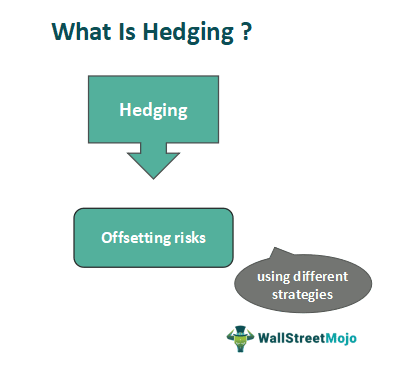

Commodity markets experience significant volatility, driven by a complex interplay of factors such as geopolitical tensions, economic policies, and unpredictable weather conditions. This inherent instability poses substantial risks to producers, consumers, and investors, making effective risk management strategies imperative. Hedging through commodity futures contracts and the adoption of algorithmic trading techniques are critical tools deployed to mitigate these risks effectively.

Commodity futures serve as essential instruments in this venture. These standardized contracts, traded on regulated exchanges, require commitment to buy or sell a specified quantity of a commodity at a predetermined price on a future date. Historically tied to stabilizing agricultural prices, these futures have diversified to cover a broad range of commodities, including energy, metals, and even financial instruments.



While hedging through futures helps manage price uncertainties by locking in prices, algorithmic trading introduces a layer of precision and speed to the process. Algorithmic trading employs computer programs to execute trades based on sets of pre-defined criteria, enabling rapid processing of large datasets and execution of complex strategies. This combination of algorithm-driven approaches with traditional hedging mechanisms offers a modern solution for managing the risks inherent in commodity trading.

This article will examine various hedging techniques and the pivotal role of algorithmic trading, illustrating how these methodologies can be combined to create comprehensive and effective risk management strategies in volatile commodity markets.

## Table of Contents

## Basics of Commodity Futures

Commodity futures are standardized contracts that are traded on organized exchanges. These contracts create a legal obligation for the buyer to purchase, and for the seller to deliver, a specific quantity of a commodity at a pre-specified price on a designated future date. The standardized nature of these contracts allows for ease of trading, as the terms associated with the quality, quantity, and delivery location of the commodity are predetermined and set by the exchange.

Initially, the primary purpose of futures contracts was to stabilize prices for agricultural products, providing farmers and traders with a tool to hedge against the volatility of future price fluctuations. This historical application was crucial in managing the risks associated with crop yields and market surpluses or shortages. Over time, the scope of commodity futures has broadened significantly, now encompassing energy commodities such as oil and natural gas, various metals including gold, silver, and copper, and even financial instruments.

The essential features of futures contracts include their capacity to lock in prices, thus securing a price for the commodity regardless of market fluctuations at the time of delivery. This price-locking mechanism provides both producers and consumers with a hedging tool to offset the inherent risks of physical commodity price instability. By agreeing to a fixed price today for a transaction in the future, market participants can effectively manage their exposure to price [volatility](/wiki/volatility-trading-strategies), which can be particularly advantageous in highly dynamic markets.

A standardized futures contract will usually entail specifications such as:

1. **Contract Size**: The exact amount of the commodity covered by the contract.
2. **Delivery Date**: The date on which the commodity must be delivered or the contract settled.
3. **Tick Size**: The minimum price fluctuation permitted in transactions on the contracts.
4. **Price Quotation**: The manner in which the contract price is quoted on the exchange. 

An example with Python involving numeric applications might involve calculating the potential margin requirements or gains/losses from trading futures. Here's a simplistic illustration of calculating the value of a futures position:

```python
# Example calculation in Python
initial_price = 500.0  # Initial price of the commodity
contract_size = 100  # Number of units per contract
current_price = 520.0  # Current price of the commodity

# Calculation of the change in contract value
contract_value_change = (current_price - initial_price) * contract_size
print(f"Change in contract value: ${contract_value_change}")
```

This code snippet calculates the change in value of a futures contract based on an initial and current price, highlighting the potential financial impact of the futures contract's price-locking feature. By using futures contracts, stakeholders can make financial decisions management strategies that mitigate risks associated with commodity pricing uncertainties.

## Hedging Strategies in Commodity Trading

Hedging in commodity trading involves establishing a derivative position to mitigate the effects of adverse price movements in the physical commodities market. This approach ensures that any potential losses from unfavorable price changes are offset by gains in the derivatives market, thereby stabilizing costs and revenues for businesses involved in commodity production, processing, or distribution.

A fundamental hedging technique is short hedging. This strategy is employed when a market participant expects the price of a commodity to decline in the future. For example, a farmer anticipating a drop in the price of corn might sell corn futures contracts at the current higher price. If the market price falls at harvest time as expected, the loss in the physical market (from selling corn at the lower market price) is counterbalanced by gains from the futures contracts sold at the higher price.

Conversely, long hedging is utilized to protect against rising commodity prices. This strategy is often adopted by companies that need to purchase commodities in the future but seek to guard against price increases. For example, an airline company might purchase [crude oil](/wiki/crude-oil) futures contracts to lock in the current price. If oil prices rise, the extra cost incurred in the physical market is offset by profits from the futures contracts.

In addition to futures-based hedging, options-based hedging provides an adaptable solution. This involves purchasing options, which confer the right, but not the obligation, to buy or sell a commodity at a specific price before a specified date. The flexibility inherent in options is valuable; for instance, a call option allows a buyer to purchase a commodity at a predetermined price, beneficial if market prices increase. Although options require paying a premium, they impart greater strategic flexibility than futures, allowing market participants to capitalize on favorable price movements while shielding against adverse shifts. 

Overall, the effective deployment of these hedging strategies aids in stabilizing financial performance amidst fluctuating commodity prices, allowing businesses to focus on core operations without being derailed by market volatility.

## Algorithmic Trading in Commodities

Algorithmic trading, often referred to as algo-trading, involves the use of computer algorithms to automate and optimize trading decisions based on pre-established criteria. These algorithms analyze vast amounts of data to identify trading opportunities and execute trades with speed and precision that surpass human capabilities.

In commodity markets, [algorithmic trading](/wiki/algorithmic-trading) can significantly enhance the efficiency and effectiveness of hedging strategies. The nature of commodity markets, characterized by high volatility and substantial data, makes them well-suited for the application of algorithms. By processing large datasets instantaneously, algorithms can swiftly respond to market movements, optimizing the timing and pricing of trades.

Algorithms in commodity trading are capable of implementing a variety of sophisticated strategies:

1. **Statistical Arbitrage**: This strategy is based on statistical and computational techniques to exploit price inefficiencies between related commodities or across different time periods. By analyzing historical price relationships, algorithms can predict deviations from the expected prices and execute trades to capitalize on these discrepancies. For example, if a typical correlation between two commodity prices diverges, an algorithm could identify this deviation as an arbitrage opportunity.

2. **Momentum Trading**: Momentum strategies involve algorithms identifying and following trends in commodity prices. By recognizing patterns and trading signals, such as moving averages or breakout points, algorithms can initiate trades that align with the current market momentum. This method relies on the premise that once a trend is established, it is likely to continue for some time.

3. **Mean Reversion**: This strategy postulates that the price of a commodity will eventually return to its historical average. Algorithms employing mean reversion techniques monitor prices that deviate significantly from their historical mean, executing trades that assume the price will revert to this mean. This can involve buying commodities priced below their average or selling those above it.

The blend of algorithmic capabilities with commodities trading brings forth benefits like rapid execution speeds, reduced transaction costs, and the ability to operate continuously without fatigue. These advantages make algorithmic trading an invaluable tool in structuring robust risk management frameworks for commodity futures. Moreover, it allows traders to systematically and unemotionally manage positions, reducing the impact of human error and emotional decision-making. As computing power continues to advance, algorithmic trading is expected to play an increasingly pivotal role in commodities markets.

## Advantages of Combining Hedging with Algorithmic Trading

Combining hedging with algorithmic trading in commodity markets offers significant advantages that enhance the overall efficiency and effectiveness of risk management strategies. At the forefront is the increased trading speed. Algorithmic systems can execute trades within milliseconds, responding to market conditions much faster than manual trading. This rapid execution minimizes the risk associated with price fluctuations during the delay times inherent in manual trading processes.

Further, algorithmic trading helps reduce manual errors—a crucial benefit considering the complexity and fast-paced nature of commodity markets. Human traders, despite experience and expertise, are susceptible to errors due to fatigue, stress, or miscalculations. Algorithms eliminate these human errors by executing pre-defined strategies with precision and consistency.

The capacity to process and handle high-frequency data is another key advantage. Commodity markets generate vast amounts of data every second, from price movements to trading volumes. Algorithms can analyze this information in real-time, identifying patterns and executing trades based on statistical and computational insights. For example, statistical [arbitrage](/wiki/arbitrage) strategies can exploit the temporary price differences between related commodities, adjusting positions in seconds to capitalize on these inefficiencies.

Algorithms enable the development of tailored risk management strategies which can dynamically respond to changing market conditions. These programmable strategies allow traders to set criteria such as stop-loss thresholds and target prices, adapting to market volatility automatically. By continuously analyzing market data, algorithms can optimize trade execution, ensuring that trades are made at the best possible price within the specified parameters.

A practical example of this integration can be demonstrated using Python for implementing a simple moving average crossover strategy, which is a basic yet effective algorithmic trading method:

```python
import pandas as pd

# Load data
data = pd.read_csv('commodity_prices.csv')
data['SMA_50'] = data['Close'].rolling(window=50).mean()
data['SMA_200'] = data['Close'].rolling(window=200).mean()

# Generate trading signals
data['Signal'] = 0
data['Signal'][50:] = np.where(data['SMA_50'][50:] > data['SMA_200'][50:], 1, 0)

# Calculate positions (crossover strategy)
data['Position'] = data['Signal'].diff()

# Review the signals
print(data[['Close', 'SMA_50', 'SMA_200', 'Signal', 'Position']].tail())

```

In this code, we create a signal to buy or hold a commodity when the 50-day simple moving average (SMA) crosses above the 200-day SMA, indicating a bullish market. This type of strategy automates the decision-making process, providing traders with a systematic approach that reacts to conditions as they evolve.

Overall, combining hedging with algorithmic trading ensures that strategies are not only well-defined and consistently executed, but also adaptable, capable of optimizing trade execution to better manage risk. This blend of speed, accuracy, and adaptability provides traders with a significant competitive edge in navigating the complex and volatile landscape of commodity markets.

## Challenges and Considerations

Algorithmic trading has transformed the way participants engage with commodity markets, offering unprecedented speed and accuracy. However, this transformation is not without its complications. The complexity of algorithms poses a significant challenge; designing a robust algorithm requires extensive knowledge in mathematics, [statistics](/wiki/bayesian-statistics), and finance, which can be a barrier for many traders. Additionally, these systems often depend on a sophisticated technological infrastructure to function effectively, demanding significant investment in hardware and software solutions.

One of the principal challenges associated with algorithmic trading is the risk of overfitting. This occurs when algorithms are too finely tuned to historical data, capturing noise instead of the actual underlying market dynamics. Consequently, such algorithms may perform well on past data but falter under different future conditions, leading to inaccurate predictions and potentially significant financial losses. Overfitting is analogous to fitting a curve through every single data point; while it may perfectly match the given data set, it fails to generalize to new data.

```python
import numpy as np
from sklearn.model_selection import train_test_split
from sklearn.linear_model import LinearRegression
from sklearn.metrics import mean_squared_error

# Example: Simple demonstration of potential overfitting
X = np.random.rand(100, 1)  # Random feature
y = X**2 + np.random.normal(0, 0.1, (100, 1))  # Quadratic relation with noise

# Split the data
X_train, X_test, y_train, y_test = train_test_split(X, y, test_size=0.2, random_state=42)

# Fit a high-degree polynomial model (potentially overfitting)
poly_features = np.concatenate([X_train**i for i in range(1, 10)], axis=1)
model = LinearRegression().fit(poly_features, y_train)

# Predict
poly_features_test = np.concatenate([X_test**i for i in range(1, 10)], axis=1)
y_pred = model.predict(poly_features_test)

# Evaluate
print("Mean Squared Error:", mean_squared_error(y_test, y_pred))
```

Furthermore, there is a risk of over-reliance on automated systems. While these systems can process vast amounts of data more quickly than a human, they lack the intuitive understanding of market conditions that a seasoned trader might possess. Market anomalies, sudden geopolitical changes, or unforeseen events can disrupt the algorithm's logic, making human oversight indispensable.

Balancing algorithmic predictions with human insights and broader economic indicators is critical to effective risk management. Human traders offer qualitative insights and adaptability in response to unexpected events, ensuring that trading strategies are not solely reliant on quantitative logic. They can interpret economic indicators such as GDP growth rates, employment statistics, or central bank policies, which can provide context beyond what raw data might imply. 

In conclusion, while algorithmic trading undoubtedly enhances commodity trading, its effective application demands a synthesis of advanced technologies and human expertise. Managing these challenges is crucial for maintaining competitive advantages in increasingly complex and rapid markets.

## Conclusion

Hedging has long been a cornerstone for managing price risks in the inherently volatile commodity markets. The ability to mitigate these risks is vital not only for producers and consumers but also for investors who seek to stabilize their financial outcomes in unpredictable markets. The introduction of algorithmic trading into hedging strategies has brought about a transformative enhancement in managing these complexities, providing an efficient and precise approach to risk management.

Algorithmic trading utilizes advanced technology and complex mathematical models to execute trades at speeds and frequencies that surpass human capabilities. This level of precision enables traders to react almost instantaneously to market changes, capturing price benefits that would otherwise be missed. Moreover, algorithmic trading offers the advantage of processing vast amounts of data to predict market trends and make informed trading decisions, enhancing the traditional methods of hedging.

While challenges exist—including the intricacy of algorithms, the requisite for a robust technological infrastructure, and the potential pitfalls of relying too heavily on automated systems—the benefits often outweigh the risks. The effective application of algorithmic trading in hedging strategies can lead to significant competitive advantages. For instance, it promotes stability and provides greater predictability of financial outcomes, which are crucial components in the long-term planning and budgeting of companies involved in commodity trading.

Additionally, as technology and computational techniques advance, it is crucial for traders and risk managers to stay informed about the latest developments in algorithmic trading processes. This continuous learning and adaptation ensure that companies remain competitive and effectively manage risks in an ever-evolving market landscape. By balancing cutting-edge algorithmic insights with human intuition and wider economic indicators, firms can craft strategies that not only protect against potential downfalls but also capitalize on positive opportunities presented by the commodity markets.

## References & Further Reading

[1]: Hull, J. C. (2017). ["Options, Futures, and Other Derivatives."](https://www.semanticscholar.org/paper/Options%2C-Futures%2C-and-Other-Derivatives-Hull/89bdee500c8623864fc9eb7a471546aa713acc44) Pearson Education.

[2]: Chance, D. M., & Brooks, R. (2015). ["An Introduction to Derivatives and Risk Management."](https://books.google.com/books/about/Introduction_to_Derivatives_and_Risk_Man.html?id=b8PgBQAAQBAJ) Cengage Learning.

[3]: Ghosh, A. (1993). "Hedging with Stock Index Futures: Estimation and Forecasting with Error Correction Model." The Journal of Futures Markets 13(2), 217-233. [DOI:10.1002/fut.3990130206](https://onlinelibrary.wiley.com/doi/10.1002/fut.3990130703)

[4]: Aldridge, I. (2013). ["High-Frequency Trading: A Practical Guide to Algorithmic Strategies and Trading Systems."](https://www.amazon.com/High-Frequency-Trading-Practical-Algorithmic-Strategies/dp/1118343506) Wiley.

[5]: Durbin, M. (2010). ["All About High-Frequency Trading."](https://www.amazon.com/All-About-High-Frequency-Trading/dp/0071743448) McGraw Hill Professional.