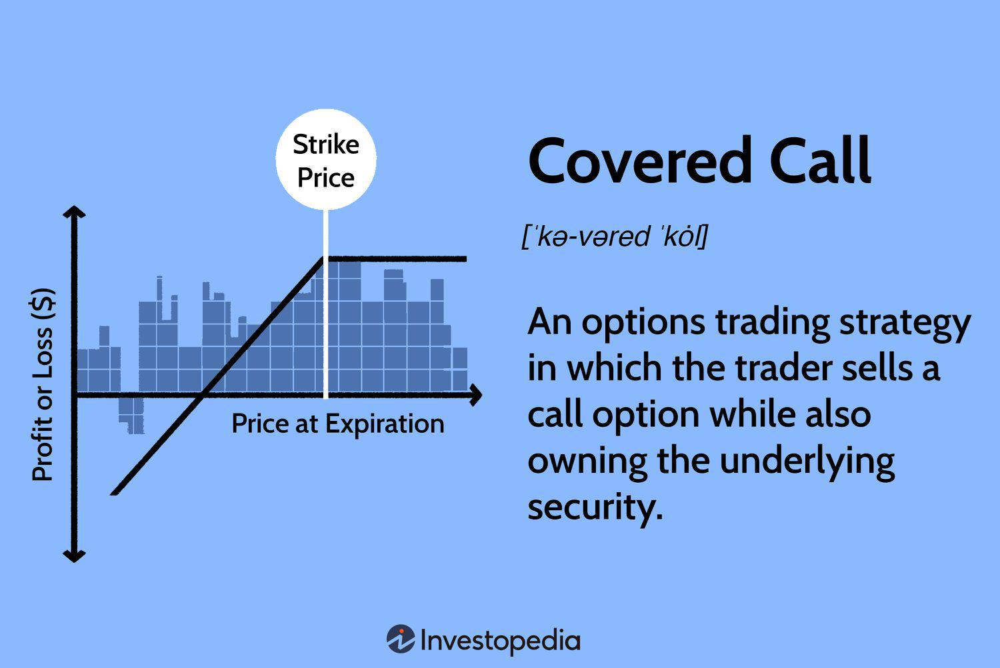

Covered calls are a widely utilized investment strategy designed to generate additional income, particularly within an Individual Retirement Account (IRA). This strategy involves holding a long position in a particular stock while simultaneously selling call options on the same stock. This transaction allows investors to earn a premium, thus providing an extra income stream on top of potential stock gains. The simplicity and conservative nature of this strategy make it attractive for investors seeking to enhance portfolio returns while managing risk.

In recent years, the integration of algorithmic trading has introduced a new dimension to traditional investment strategies like covered calls. Algorithmic trading uses computer algorithms to automate the execution of trades based on predefined criteria. This fusion of technology and finance provides a unique opportunity to optimize income generation, as it allows for more precise timing and execution compared to manual trading. By leveraging real-time data, sophisticated algorithms can identify the most profitable scenarios for writing covered calls, with minimal emotional bias influencing decisions.



This article examines the interplay between covered calls and algorithmic trading, aiming to highlight both benefits and potential drawbacks. While covered calls can offer additional income and risk mitigation, the introduction of algorithmic trading requires a robust understanding of both financial and technological landscapes. By exploring these components, investors can assess how to effectively implement this approach to potentially secure a more stable retirement income.

## Table of Contents

## Understanding Covered Calls

A covered call is a popular and conservative investment strategy whereby an investor sells a call option for an asset they already own, maintaining a long position in the underlying asset. This strategy involves two key components: holding the asset and simultaneously writing (or selling) call options on that asset. The primary objective of a covered call is to generate additional income through the premiums collected from selling the call options. 

The process begins with the investor owning a stock or another asset that they anticipate will not experience significant upward movement in the near term. To capitalize on this expectation, they sell call options, which give the buyer the right, but not the obligation, to purchase the asset at a specified price (the strike price) before the option's expiration date. In exchange for this right, the buyer pays a premium to the option writer, which is the investor holding the long position.

The premium received acts as an instant return and can potentially enhance the overall returns of the investment portfolio. Suppose an investor owns 100 shares of ABC Corporation, currently trading at $50 per share. They could sell a call option with a strike price of $55, expiring in one month, for a premium of $2 per share. This action yields an immediate income of $200 (100 shares $\times$ $2/share). If ABC Corporation trades below $55 at expiration, the options will likely expire worthless, and the investor retains the stock and the premium.

Covered calls are considered conservative because they can offer some downside protection and generate income even during stagnant market conditions. The downside protection arises because the premium can offset potential losses if the asset's price falls. For example, if the asset's market price drops from $50 to $48, the effective cost basis is lowered to $48 ($$50 - $2$), minimizing the loss incurred on the underlying asset.

However, this strategy comes with trade-offs, particularly in a rising market. While it provides immediate income, it also limits the upside potential because if the underlying asset's market price rises above the strike price, the option buyer is likely to exercise their option. In this case, the investor must sell the asset at the predetermined strike price, possibly foregoing additional gains beyond this level.

In summary, covered calls are a strategic approach to capitalize on stable or bearish market conditions, providing an opportunity to earn additional income while maintaining exposure to the underlying asset. While the strategy effectively mitigates downside risk through income generated from premiums, it inherently caps potential gains, requiring careful consideration of market conditions and personal financial goals.

## Advantages of Covered Calls in an IRA

Using covered calls within an Individual Retirement Account (IRA) offers several advantages related to tax deferral and income generation, which can be significantly beneficial for investors, particularly retirees.

Covered calls generate a premium income when investors sell call options on assets they already own within their IRA. This additional income can be either deferred from or exempt from taxes, depending on the type of IRA. In the case of a Traditional IRA, taxes on investment gains are deferred until withdrawals begin, usually during retirement when the investor might fall into a lower tax bracket. For a Roth IRA, qualified withdrawals, including those involving profits from covered calls, are entirely tax-free, enhancing the post-tax return potential [1].

This strategy is also advantageous as it allows retirees to generate steady income without the need to liquidate their underlying assets. By selling call options, retirees can collect option premiums, thereby supplementing their income without selling stocks or bonds in their portfolio. This is particularly important for retirees looking to maintain a stable portfolio composition while still benefiting from periodic cash flow.

Moreover, using covered call writing can serve as a form of protection against market [volatility](/wiki/volatility-trading-strategies). By collecting premiums from selling call options, investors effectively lower their cost basis in the underlying asset. Even if the market experiences fluctuations, the collected premiums can provide a buffer, reducing the overall impact on the portfolio's value. This income generation and downside protection are crucial for maintaining stability in retirement portfolios.

In conclusion, leveraging the covered call strategy within an IRA can provide tangible benefits, offering tax advantages, enhancing income without asset liquidation, and shielding against market volatility, ultimately supporting the financial stability of retirement plans.

[1] Internal Revenue Service. (n.d.). Retirement Topics - IRA Contribution Limits. Retrieved from https://www.irs.gov/retirement-plans/plan-participant-employee/retirement-topics-ira-contribution-limits

## The Role of Algorithmic Trading

Algorithmic trading employs computer algorithms to automate and optimize trading strategies, aiming to enhance trading efficiency and precision. This process involves executing orders based on predefined criteria, which helps to reduce manual intervention and potential human errors. In the context of covered calls, [algorithmic trading](/wiki/algorithmic-trading) can significantly improve the identification of profitable opportunities.

Algorithms can analyze vast amounts of real-time market data to identify optimal circumstances for executing covered calls. For example, they can assess parameters such as stock volatility, option premiums, and time decay to predict the best times to sell call options. By processing these data points rapidly, algorithms can uncover opportunities that might be missed by human traders due to information overload or slower reaction times.

Moreover, algorithmic trading brings consistency to the application of the covered calls strategy. Emotional decisions, often driven by fear or greed, can hinder investment performance. Algorithms, however, operate based on logic and predetermined rules, ensuring that trades are executed consistently regardless of market emotions. This methodical approach helps maintain a disciplined investment strategy, which is crucial for generating stable income from covered calls.

For instance, a simple Python-based algorithm could be configured to execute covered calls using the Pandas and NumPy libraries for data analysis, and an API like Alpaca for brokerage services. Here is a simplified example:

```python
import numpy as np
import pandas as pd
import alpaca_trade_api as tradeapi

# Initialize API
api = tradeapi.REST('<API_KEY>', '<SECRET_KEY>', base_url='https://paper-api.alpaca.markets')

# Function to fetch stock data 
def fetch_data(symbol):
    barset = api.get_barset(symbol, 'day', limit=5)
    return barset[symbol]

# Function to decide if a covered call should be executed
def should_sell_call(data):
    # Simplistic condition: sell a call if stock price is above a calculated threshold
    prices = np.array([bar.c for bar in data])
    threshold = np.mean(prices) + np.std(prices)
    return prices[-1] > threshold

# Fetch data for specific stock
data = fetch_data('AAPL')

# Check condition and execute trade if valid
if should_sell_call(data):
    try:
        api.submit_order(
            symbol='AAPL',
            qty=1,
            side='sell',
            type='limit',
            limit_price=200,  # Example limit price
            time_in_force='gtc',
            order_class='simple'
        )
        print("Order submitted")
    except Exception as e:
        print(f"Error in order submission: {e}")
```

This simple script fetches market data, analyzes it using statistical measures, and places a sell order based on specific conditions, showcasing how algorithmic methods help automate covered call strategies. Such algorithmic strategies can be increasingly sophisticated, incorporating [machine learning](/wiki/machine-learning) models and extensive [backtesting](/wiki/backtesting), aiming to fine-tune their performance.

## Implementing an Algorithm-Based Covered Call Strategy

Implementing an algorithm-based covered call strategy requires several key steps to ensure effectiveness and alignment with an investor's objectives. One of the first considerations is selecting a suitable trading platform that can support algorithmic trading. This platform should provide robust tools and comprehensive access to market data. Commonly used platforms include MetaTrader, [Interactive Brokers](/wiki/interactive-brokers-api), and Thinkorswim by TD Ameritrade. Each of these platforms offers varying levels of data access and algorithm development environments, making it crucial to choose one that matches your specific needs and expertise level.

Developing or acquiring a reliable algorithm is the next step. This algorithm must be tailored to your risk tolerance and investment goals. For instance, a conservative investor might prefer an algorithm that prioritizes consistent income generation while minimizing risk, whereas a more aggressive investor might focus on maximizing premiums through strategically timed option sales. In developing such an algorithm, investors can utilize Python, which is a powerful programming language ideal for such tasks due to its extensive libraries like NumPy, pandas, and TA-Lib for financial market analysis.

Here is an example of a simple Python script that outlines how one might begin developing an algorithm to execute covered call strategies:

```python
import pandas as pd
import numpy as np

# Load historical price data
def load_data(symbol):
    # Data loading logic goes here (e.g., use a library to fetch historical data)
    return pd.DataFrame(data)  # Replace 'data' with loaded data

# Simple covered call strategy
def covered_call_strategy(data, strike_price, premium):
    data['Call_Profit'] = 0
    data['Underlying'] = data['Close']

    # Determine if the stock closes above strike price
    data.loc[data['Close'] > strike_price, 'Call_Profit'] = min(data['Close'] - strike_price, premium)

    # Calculate total profit from covered calls
    total_profit = data['Call_Profit'].sum()

    return total_profit

# Example usage
historical_data = load_data('AAPL')
profit = covered_call_strategy(historical_data, strike_price=150, premium=2)
print(f"Total Profit from Covered Calls: {profit}")
```

Finally, testing the algorithm with historical data is a crucial step before its deployment in live trading. This process, known as backtesting, involves simulating the algorithm’s performance over past market conditions to gauge its potential future performance. This ensures that the strategy behaves as expected under various market scenarios and helps in identifying any weaknesses or areas for optimization. During backtesting, metrics such as profitability, drawdown, and Sharpe ratio are often evaluated to assess risk-adjusted returns.

In summary, implementing an algorithm-based covered call strategy involves choosing a suitable platform, developing or acquiring an appropriate algorithm, and rigorous backtesting. This meticulous process lays the foundation for a disciplined and potentially rewarding investment strategy within an Individual Retirement Account (IRA).

## Risks and Considerations

While covered calls limit upside potential by capping maximum gains at the strike price plus the premium received, they do not provide comprehensive downside protection. If the underlying asset experiences a significant price decline, the premium earned may not be sufficient to offset the losses incurred from holding the asset. Therefore, this strategy may be less effective in markets that experience sharp declines, and investors must be ready to absorb potential losses beyond the premium income.

Algorithmic trading offers automation advantages, yet it introduces its own set of risks. Technical failures can occur, involving issues such as software bugs, hardware malfunctions, or connectivity problems. Such issues can lead to incomplete or erroneous trades, which can affect the overall performance of the covered call strategy. Robust infrastructure is essential, necessitating reliable servers, secure data connections, and contingency plans to handle unforeseen technical challenges.

The algorithms themselves might not fully adapt to unexpected market behaviors or black swan events, circumstances where historical data used for backtesting does not accurately predict future occurrences. This uncertainty underscores the importance of continuous monitoring and adjustments to the algorithm to maintain alignment with market conditions. Here is a simple example of a Python code snippet that illustrates backtesting covered call strategies with historical data:

```python
import pandas as pd
import numpy as np

# Load historical asset price data
data = pd.read_csv('historical_data.csv', parse_dates=['Date'], index_col='Date')
prices = data['Close']

# Define parameters for covered call strategy
strike_price = 110  # Example strike price
premium_received = 2.5  # Example premium per option

# Simulate returns of the covered call strategy
returns = np.minimum(strike_price, prices.shift(-1)) - prices + premium_received

# Calculate cumulative returns
cumulative_returns = (1 + returns / prices).cumprod()

print(cumulative_returns)
```

Additionally, algorithmic trading systems, despite their benefits, require significant oversight and expertise to manage properly. Traders must be vigilant about the risks inherent in algorithmic strategies, including the potential for high-frequency trading anomalies and slippage due to rapid market changes. This requires not only technical acumen but also a strong understanding of financial markets to interpret algorithm output correctly and adjust parameters as needed.

Investors should comprehensively understand both covered calls' financial risks and the technological risks presented by algorithmic trading systems. Being aware of these risks enables investors to create contingency plans and mitigation strategies, such as employing stop-loss orders or diversifying across different assets and strategies. A balanced understanding of these factors can help in reaping the benefits of combining covered calls with algorithmic trading within an IRA, all while maintaining vigilance against potential pitfalls.

## Conclusion

Combining covered calls with algorithmic trading in an Individual Retirement Account (IRA) provides investors with an innovative means to enhance income and mitigate risk effectively. This hybrid strategy necessitates a comprehensive understanding of both financial instruments and advanced technological tools. Covered calls allow investors to capitalize on price stability by selling options while retaining the underlying asset, thus generating additional income through premiums. Algorithmic trading contributes by automating decision-making processes, allowing for the precise execution of trades based on real-time market data and prefabricated trading models.

Successful implementation of this strategy hinges on an investor's willingness to invest time in learning and developing both aspects. Mastery of covered call mechanics ensures that investors can effectively manage risk and identify favorable opportunities within their portfolio. Concurrently, acquiring proficiency in algorithmic trading involves understanding programming languages such as Python and leveraging platforms that support algorithmic functions to optimize trade timing and execution efficiently.

Investors who dedicate themselves to building and refining such strategies potentially benefit from a robust and steady stream of income, crucial for funding a secure retirement. This commitment can yield significant returns by aligning investment practices with individual financial goals and market conditions, contributing to a more resilient and prosperous retirement portfolio.

## References & Further Reading

[1]: ["Covered Calls and the IRS"](https://www.fidelity.com/learning-center/investment-products/options/tax-implications-covered-calls) by Investopedia

[2]: Szado, E. (2009). ["Covered Call Writing: A Risk-Reducing and Income-Enhancing Investment Strategy"](https://www.wiley.com/en-us/New+Insights+on+Covered+Call+Writing%3A+The+Powerful+Technique+That+Enhances+Return+and+Lowers+Risk+in+Stock+Investing-p-9781576601334). 

[3]: Jamshidian, F., & Fein, R. (1990). ["Option and Stock Market Strategies"](https://www.researchgate.net/publication/245280749_An_Analysis_of_American_Options). Springer.

[4]: Mazzeo, M. (1998). ["Algorithmic Analysis: Effective Aspects of Covered Calls"](https://pubmed.ncbi.nlm.nih.gov/27589522/). Financial Analysts Journal.

[5]: Lopez de Prado, M. (2018). ["Advances in Financial Machine Learning"](https://www.amazon.com/Advances-Financial-Machine-Learning-Marcos/dp/1119482089). Wiley.

[6]: Aronson, D. (2007). ["Evidence-Based Technical Analysis: Applying the Scientific Method and Statistical Inference to Trading Signals"](https://www.amazon.com/Evidence-Based-Technical-Analysis-Scientific-Statistical/dp/0470008741). Wiley.

[7]: Jansen, S. (2020). ["Machine Learning for Algorithmic Trading"](https://github.com/stefan-jansen/machine-learning-for-trading). Packt Publishing.

[8]: Chan, E. P. (2009). ["Quantitative Trading: How to Build Your Own Algorithmic Trading Business"](https://github.com/ftvision/quant_trading_echan_book). Wiley.