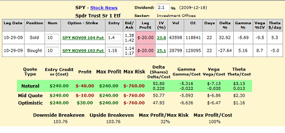

In today's fast-paced financial world, market volatility presents both challenges and opportunities for investors. Volatility, characterized by rapid and unpredictable changes in asset prices, can be a source of significant gains for those who understand how to navigate its complexities. Conversely, it also poses substantial risks, warranting a comprehensive understanding to mitigate potential losses.

Understanding and leveraging market volatility is critical in devising effective investment strategies. By embracing the dual nature of volatility, investors can tailor their approaches to suit various market conditions. The ability to anticipate and respond to price fluctuations is a skill that can significantly enhance investment outcomes. Market participants must focus on volatility as both an indicator of risk and as a source of potential profit, requiring a strategic mindset to capitalize on this dynamic environment.



This article emphasizes the significance of credit spreads and algorithmic trading as pivotal tools in managing risk and seizing opportunities during volatile markets. Credit spreads, a strategy involving the simultaneous purchase and sale of different options, help balance risk and reward by offering structured exposure to volatility. Algorithmic trading utilizes computer algorithms to automate trading decisions, allowing for precision and speed unattainable by human traders. These technologies provide an edge in swiftly moving markets, where milliseconds can make the difference between profit and loss.

We aim to provide essential strategies for navigating market volatility successfully. By understanding and applying proven methods, investors can better position themselves to withstand shock waves inherent to financial markets. From simple hedging techniques to sophisticated algorithmic systems, a well-rounded approach enables traders to hedge against the unpredictability of market movements.

Whether through traditional approaches or cutting-edge algorithmic solutions, investors are equipped with insights to enhance their trading prowess. Staying informed and agile in response to market changes is paramount, and the strategies outlined here offer a foundation for effective engagement with financial markets. By integrating these elements, market participants can strive for a balance between managing risk and exploiting opportunities, optimizing their positions in an ever-evolving landscape.

## Table of Contents

## Understanding Market Volatility

Market volatility refers to fluctuations in the price of securities within a specific timeframe. These fluctuations represent uncertainty and risk within the financial markets, affecting both individual securities and broader market indices. For investors, understanding volatility is critical, as it is not only a source of risk but also an avenue for potential profit, especially for those who are well-prepared and equipped with effective trading strategies.

Volatility is quantitatively measured through statistical metrics such as standard deviation and variance of returns. In practical application, traders and market analysts often rely on these metrics to predict the behavior of asset prices. Furthermore, certain financial instruments, like options, have their pricing models built heavily around [volatility](/wiki/volatility-trading-strategies), showcasing its significance in financial decision-making.

The VIX index, often referred to as the "fear index," is a prominent tool for gauging market sentiment and predicting future volatility. It measures the market's expectation of volatility over the next 30 days based on S&P 500 index options. A higher VIX value suggests greater anticipated volatility, which typically correlates with increased investor anxiety and uncertainty in the market.

Besides the VIX, historical and implied volatilities serve as pivotal metrics for traders. Historical volatility is based on past price movements of a security, offering insights into how volatile an asset has been over a specific period. By contrast, implied volatility is derived from the market price of options, reflecting the market's expectations of future price fluctuations. While historical volatility provides a backward-looking perspective, implied volatility offers a forward-looking gauge, making it particularly valuable for traders strategizing in turbulent markets.

The understanding and analysis of market volatility enable investors to manage risk more effectively and identify potential opportunities. By leveraging these insights, traders can devise strategies that align with their risk tolerance and market outlook, potentially optimizing their returns even amidst unpredictable market conditions.

## Investment Strategies in Volatile Markets

Market volatility often presents challenges, but it also provides various opportunities for investors equipped with the right strategies. Effective investment strategies during volatile markets are characterized by their ability to leverage price movements for potential profit, while managing associated risks. Below, we explore several key strategies used by investors to navigate market volatility.

**Long Volatility Strategies**

Long volatility strategies are designed to profit from large and sudden movements in market prices, regardless of the direction these moves take. Among the most prominent strategies in this category are the long straddle and long strangle.

1. **Long Straddle**: This strategy involves purchasing a call option and a put option with the same strike price and expiration date. The idea is to benefit from significant price movements in either direction. If the price of the underlying asset moves substantially upward or downward, the profit from one of the options can potentially offset the loss from the other, leading to an overall profit.

   - **Formula**: The payoff for a long straddle can be represented as:
$$
     \text{Payoff} = \max(S - K, 0) + \max(K - S, 0) - (C + P)

$$
     where $S$ is the stock price at expiration, $K$ is the strike price, $C$ is the price of the call option, and $P$ is the price of the put option.

2. **Long Strangle**: Similar to a long straddle, a long strangle involves buying a call option and a put option, but with different strike prices. This strategy is typically less costly than a straddle since the options are out-of-the-money. However, the underlying asset must experience even more pronounced price movements for the strategy to be profitable.

   - **Formula**: The payoff for a long strangle is:
$$
     \text{Payoff} = \max(S - K_2, 0) + \max(K_1 - S, 0) - (C + P)

$$
     where $K_1$ is the lower strike price of the put option, and $K_2$ is the higher strike price of the call option.

**Short Volatility Strategies**

When investors expect decreased volatility, short volatility strategies are more appropriate. These strategies generally benefit from stability in prices and smaller movements within the market.

1. **Iron Condor**: This setup involves selling an out-of-the-money call and put, while also buying further out-of-the-money call and put options. The iron condor benefits from low volatility by capitalizing on the premiums received from selling the options. The risk is capped by the purchase of the farther out-of-the-money options, limiting potential losses if significant price movement occurs unexpectedly.

**Volatility Spreads**

Volatility spreads are strategies that involve the simultaneous purchase and sale of options. These strategies are designed to benefit from specific scenarios related to volatility and time decay.

1. **Calendar Spreads**: This method involves selling a short-term option and buying a long-term option with the same strike price. The approach is advantageous in situations where volatility is expected to increase in the longer term.

2. **Ratio Spreads**: This spread includes buying a certain number of options and selling a greater number of options of the same class. It benefits when the underlying asset moves moderately in the direction of the long option.

These strategies allow traders to harness the power of volatility, setting the stage for potential profit while managing inherent risks. Efficient application of long and short volatility strategies, along with volatility spreads, can equip investors to turn market fluctuations into investing opportunities.

## Credit Spreads: Balancing Risk and Reward

Credit spreads are a strategic option for traders looking to mitigate risk while securing upfront premiums. They involve the simultaneous buying and selling of options of the same class and expiration date, but with different strike prices. This setup allows traders to balance potential rewards against the inherent risks of market volatility.

Bull put spreads and bear call spreads are two common strategies within credit spreads. A bull put spread involves selling a put option at a higher strike price while buying another put option at a lower strike price. This strategy is beneficial when a trader anticipates a moderate rise in a security's price. Conversely, a bear call spread involves selling a call option at a lower strike price and buying a call at a higher strike price, profiting from a predicted moderate decline in price.

The primary advantage of credit spreads lies in their defined risk and reward profiles. The maximum potential loss is capped at the difference between the strike prices of the options, minus the net credit received when the spread is initiated. This characteristic is particularly appealing in volatile markets where price predictions can be uncertain. The formula for maximum loss in a bull put spread, for example, can be expressed as:

$$
\text{Max Loss} = \text{Strike Price of Short Put} - \text{Strike Price of Long Put} - \text{Net Credit Received}
$$

Similarly, the potential profit is limited to the net premium collected at the outset of the trade. For traders seeking to manage risk while retaining the opportunity for profit, credit spreads offer a structured approach, with the premium providing a buffer against market shifts.

Credit spreads also permit flexibility in targeting moderate price movements. Unlike outright option purchases where premiums are entirely at risk, credit spreads allow for premium collection upfront, offsetting potential losses and providing a margin for error in price movement predictions. This structure is particularly beneficial when executing trades under conditions of elevated market volatility, offering traders a method to engage with the market with controlled risk exposure and clear profit targets.

These strategies exemplify a nuanced approach to trading, encouraging disciplined risk management while enabling traders to capitalize on their market expectations.

## Algorithmic Trading: Leveraging Technology

Algorithmic trading, also known as algo trading, utilizes computer algorithms to make trading decisions and execute trades at speeds and frequencies that are typically impossible for human traders. These algorithms follow a set of defined instructions for placing a trade to generate profits at a speed and frequency that is beyond the capability of a human trader. In volatile market environments, [algorithmic trading](/wiki/algorithmic-trading) provides significant advantages by quickly analyzing large datasets to discern patterns, trends, or anomalies that might indicate profitable opportunities.

One of the primary benefits of algorithmic trading is its ability to mitigate the emotional component often present in manual trading. Traders are susceptible to psychological biases that can lead to errors in judgment, particularly during periods of high market volatility. By relying on predefined algorithms, traders are able to maintain objectivity, thereby reducing the risk of making impulsive, emotionally-driven decisions.

Moreover, algorithmic trading systems offer precision in the execution of complex trading strategies. These systems can execute a vast number of trades simultaneously and instantly, ensuring the best possible entry and [exit](/wiki/exit-strategy) points based on the predefined criteria. For instance, a common algorithmic strategy incorporates the moving average crossover technique. The algorithm might generate a buy signal when the short-term moving average crosses above a long-term moving average and a sell signal when the reverse happens.

```python
# Example Python Code for Moving Average Crossover Strategy
def moving_average_crossover(data, short_window, long_window):
    signals = pd.DataFrame(index=data.index)
    signals['signal'] = 0.0

    # Create short simple moving average
    signals['short_mavg'] = data['Close'].rolling(window=short_window, min_periods=1, center=False).mean()

    # Create long simple moving average
    signals['long_mavg'] = data['Close'].rolling(window=long_window, min_periods=1, center=False).mean()

    signals['signal'][short_window:] = np.where(signals['short_mavg'][short_window:] > signals['long_mavg'][short_window:], 1.0, 0.0)   

    # Generate trading orders
    signals['positions'] = signals['signal'].diff()

    return signals
```

This Python code demonstrates a simple yet effective form of algorithmic trading strategy centered around moving averages. The 'signals' DataFrame tracks the moving average crossover, allowing the trader to take positions based on predefined parameters.

In addition to precision and emotionless trading, algorithmic systems are adept at rapidly adapting to market volatility. By continuously processing and analyzing real-time data, these systems can identify optimal moments to enter or exit trades, often executing trades within milliseconds. This prompt responsiveness is capitalized on using strategies such as statistical [arbitrage](/wiki/arbitrage), where high-frequency trades are made based on pricing inefficiencies between securities.

Overall, algorithmic trading empowers traders to harness volatility effectively, providing tools that enhance decision-making, sharpen execution, and ultimately improve trading outcomes in uncertain market conditions. Through a combination of mathematical models, computational power, and data analytics, algo trading transforms the landscape of modern finance, aligning opportunity with capability in volatile markets.

## Combining Strategies for Optimal Results

In the complex landscape of financial markets, the interplay between credit spreads and algorithmic trading can provide a robust framework for navigating volatility. This intersection allows traders to leverage the strengths of each strategy, offering a balanced approach to both risk management and capital growth.

Credit spreads are popular among traders for their capacity to define risk parameters and secure upfront premiums. By selling options with higher premiums and simultaneously buying options at lower premiums within the same class, investors can set a predefined maximum loss while retaining the ability to benefit from modest price movements. This structured approach creates a financial buffer, absorbing some of the market's unpredictability.

Algorithmic trading further enhances this strategy by automating the execution of trades based on predefined criteria. Algorithms can instantly process large volumes of data and execute trades with a precision that human traders might find challenging. This technology can spot patterns and opportunities in market volatility that may be too subtle or fleeting for manual trading, responding with speed and accuracy. By removing emotional bias, algorithmic systems help maintain a disciplined approach, crucial in volatile periods.

When these two strategies are combined, traders benefit from a diversified approach. For instance, while credit spreads set a safety net to manage potential losses, algorithmic systems can deploy data-driven strategies to capitalize on emerging opportunities. This synergy offers a balanced approach: the structured risk management of credit spreads protecting downside exposure while algorithmic trading explores upside potential.

Python could be a useful programming language for implementing this combined strategy. For example, using libraries such as NumPy for computational tasks or Pandas for data management can streamline the process. A basic implementation might involve setting up an algorithmic framework using scikit-learn for predictive modeling alongside a function that calculates potential outcomes from various credit spread positions:

```python
import numpy as np
import pandas as pd
from sklearn.linear_model import LinearRegression

# Example dataset
data = pd.read_csv("market_data.csv")
X = data[['feature1', 'feature2']]
y = data['target']

# Fit an algorithmic model
model = LinearRegression()
model.fit(X, y)

# Define a function for credit spread analysis
def credit_spread_analysis(premium_received, premium_paid, position_size):
    max_loss = position_size * (premium_paid - premium_received)
    return max_loss

# Example calculation
spread_loss = credit_spread_analysis(3, 5, 100)
```

In summary, combining credit spreads with algorithmic trading can optimize the strengths of each method. This dual approach is particularly effective during market swings, as it mitigates the risks associated with each individual strategy. By employing a blend of protective and proactive measures, traders can capitalize on both stability and opportunity within volatile environments.

## Conclusion

Navigating market volatility successfully requires a comprehensive understanding of risk factors and the strategic application of various tools. Market participants who master key elements such as credit spreads, effectively leverage algorithmic trading, and grasp the intricate dynamics of volatility are better positioned to enhance their market resilience.

Credit spreads remain a powerful tool in managing risk. They not only define the maximum possible loss but also offer flexibility in adapting to moderate price movements. By employing strategies such as bull put spreads or bear call spreads, traders can set structured risk profiles that allow for profitable outcomes even amidst market swings.

Algorithmic trading plays a crucial role in optimizing the execution of these strategies. By employing complex algorithms, traders can swiftly analyze vast datasets and execute trades at the most opportune moments, thus mitigating the emotional aspects of trading and ensuring precision. This technical edge allows traders to capitalize on volatility opportunities that might be missed in manual trading.

Furthermore, an understanding of volatility dynamics is essential. Recognizing patterns and anticipating movements through key indicators like historical and implied volatilities enables traders to prepare and adjust their strategies accordingly. This knowledge, combined with advanced trading algorithms, equips traders to respond promptly to shifts in market conditions.

Ultimately, the key to thriving in a volatile investment landscape lies in adaptability and continual assessment of strategy efficacy. By remaining vigilant and flexible, traders can not only weather the inevitable market fluctuations but also uncover potential opportunities for growth. Success in navigating market volatility hinges on an informed approach, rooted in the mastery of strategic tools and an ongoing evaluation of market conditions.

## References & Further Reading

[1]: Bergstra, J., Bardenet, R., Bengio, Y., & Kégl, B. (2011). ["Algorithms for Hyper-Parameter Optimization."](https://papers.nips.cc/paper/4443-algorithms-for-hyper-parameter-optimization) Advances in Neural Information Processing Systems 24.

[2]: ["Advances in Financial Machine Learning"](https://www.amazon.com/Advances-Financial-Machine-Learning-Marcos/dp/1119482089) by Marcos Lopez de Prado

[3]: ["Evidence-Based Technical Analysis: Applying the Scientific Method and Statistical Inference to Trading Signals"](https://www.amazon.com/Evidence-Based-Technical-Analysis-Scientific-Statistical/dp/0470008741) by David Aronson

[4]: ["Machine Learning for Algorithmic Trading"](https://github.com/stefan-jansen/machine-learning-for-trading) by Stefan Jansen

[5]: ["Quantitative Trading: How to Build Your Own Algorithmic Trading Business"](https://www.amazon.com/Quantitative-Trading-Build-Algorithmic-Business/dp/1119800064) by Ernest P. Chan