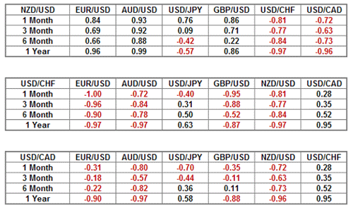

Forex trading, also known as foreign exchange trading, is a dynamic and highly liquid financial market where currencies are bought and sold. It holds immense significance in the global financial markets due to its role in facilitating international trade, investment, and economic stability. With an average daily trading volume exceeding $6 trillion, the forex market is the largest financial market worldwide, attracting a diverse range of participants, including banks, corporations, governments, and individual traders.

Currency correlations refer to the statistical relationship between the movements of two currency pairs. These correlations can be positive, indicating that two currency pairs move in the same direction, or negative, suggesting they move inversely. Understanding currency correlations is vital for developing effective forex trading strategies, as these relationships can influence risk management and position sizing. For example, a trader holding positions in two positively correlated currency pairs may face amplified risk if both pairs move unfavorably.



Algorithmic trading, or algo trading, involves using computer programs to execute trades based on predefined criteria. In forex trading, algorithms can process vast amounts of data and execute trades at speeds beyond human capabilities. This technology is transforming how traders and institutions engage with the market, offering advantages such as enhanced precision, minimized emotional biases, and the ability to backtest strategies over historical data.

This article will explore the interplay between financial strategies, currency correlations, and algorithmic trading in the forex market. By integrating these three elements, traders can potentially enhance their decision-making processes, optimize trading performance, and manage risks more effectively.

The importance of incorporating technology in forex trading continues to grow as markets become more complex and data-driven. Advancements in computing power, data analysis, and machine learning are enabling the development of sophisticated trading systems that adapt to changing market conditions. The synergy between human expertise and technological innovation is shaping the future of forex trading, making it crucial for market participants to embrace and leverage these tools to maintain a competitive edge.

## Table of Contents

## Understanding Forex Trading and Financial Strategies

Forex trading, also known as foreign exchange trading, is the process of exchanging one currency for another in the global marketplace. It is one of the largest financial markets globally, with a daily trading [volume](/wiki/volume-trading-strategy) exceeding $6 trillion, facilitating international trade, investment, and economic activity.

### Overview of Forex Trading and Basic Principles

Forex trading operates on the principle of currency pairs, where the value of one currency is quoted against another. Major currency pairs include EUR/USD, USD/JPY, and GBP/USD, among others. The [forex](/wiki/forex-system) market is decentralized, operating over-the-counter (OTC), and functions 24 hours a day across different global time zones. This feature allows traders to engage in transactions at any time, though [liquidity](/wiki/liquidity-risk-premium) and [volatility](/wiki/volatility-trading-strategies) may vary across sessions.

Key principles that guide forex trading include understanding how exchange rates fluctuate based on a range of factors such as interest rates, inflation, political stability, and economic indicators. These elements collectively influence the supply and demand dynamics of currencies, thereby affecting their relative values.

### Financial Strategies in Forex Trading

Forex traders employ various financial strategies, each tailored to achieve specific objectives under different market conditions. Some of the common strategies include:

1. **Scalping**: This strategy involves making numerous small trades over the course of a day, aiming to profit from minor price movements. Scalpers typically hold positions for seconds to minutes.

2. **Day Trading**: Day traders open and close positions within the same trading day to capitalize on short-term market movements. It requires in-depth technical analysis and swift decision-making.

3. **Swing Trading**: This approach involves holding positions over several days or weeks to profit from expected price swings. Swing traders often use technical and fundamental analysis to identify entry and exit points.

4. **Position Trading**: A long-term strategy where traders hold positions for months or years, relying on extensive analysis of economic trends and fundamental factors.

### Importance of Strategy Selection

Selecting an appropriate trading strategy is crucial for achieving individual financial goals and effectively navigating varying market conditions. Traders must consider factors such as risk tolerance, available capital, time commitment, and market experience when choosing a strategy. For instance, [scalping](/wiki/gamma-scalping) may require more time and attention, which might not be suitable for individuals with other commitments.

Furthermore, the adaptability of a strategy to changing market climates is essential, as forex markets can be highly volatile. Successful traders remain flexible, continuously evaluate their strategies, and are willing to pivot when necessary.

### Integration of Risk Management Practices

Integrating robust risk management practices into trading strategies is vital for long-term success in forex trading. Effective risk management involves defining risk-reward ratios, setting stop-loss and take-profit orders, and managing leverage prudently.

One common risk management tool is the use of stop-loss orders, which automatically close a position when it reaches a specified loss level. This prevents traders from severe losses. Similarly, take-profit orders lock in gains by closing trades once a target profit level is achieved.

Leverage, while amplifying potential profits, also increases potential losses. Therefore, traders must utilize leverage judiciously, ensuring that it aligns with their risk appetite and does not exceed their financial capacity.

In summary, understanding the fundamentals of forex trading and implementing well-suited financial strategies that incorporate sound risk management practices is paramount for traders aiming to navigate the complexities of the forex market successfully.

## The Role of Currency Correlations in Forex Trading

Currency correlations refer to the statistical relationships between the exchange rate movements of two or more currencies. In forex trading, these correlations play an essential role as they directly influence trading decisions. When currencies move in tandem, they are said to be positively correlated, while those moving in opposite directions exhibit negative correlation.

Positive currency correlations occur when two currency pairs move in the same direction. For instance, the EUR/USD and GBP/USD pairs often display a strong positive correlation because both the euro and pound are traded against the dollar and are influenced by economic indicators from Europe and the US. Conversely, a negative correlation is manifested when the movement of one currency pair is inversely related to another. An example is the EUR/USD and USD/CHF pairs, where the US dollar is a base currency in one pair but a counter-currency in the other, often leading to opposite movements.

Global economic events can significantly impact currency correlations. For example, a political event affecting the eurozone might strengthen the euro against the US dollar, concurrently impacting pairs like the EUR/USD and GBP/USD due to heightened market sentiments about European economics. Similarly, shifts in US monetary policy could alter the correlations between the USD and other major currencies as [interest rate](/wiki/interest-rate-trading-strategies) changes might differently affect pairs like USD/JPY, USD/CHF, and others.

Understanding currency correlations aids forex traders not only in making informed trading decisions but also in portfolio diversification. By recognizing which currencies are correlated, traders can manage risk more effectively and reduce exposure by selecting pairs that balance the correlations. For instance, instead of holding positions in multiple positively correlated pairs, a trader might balance them with negatively correlated pairs to stabilize potential gains or losses.

In sum, by grasping the nuances of currency correlations, traders can optimize their strategies to harness the multifaceted interplay of global currency markets, capitalizing on patterns that might otherwise go unnoticed.

## Algorithmic Trading: Transforming Forex Strategies

Algorithmic trading, often referred to as algo trading, is the process of using computer algorithms to automate the execution of trades in financial markets. It has gained considerable traction in modern forex trading due to its ability to enhance efficiency and eliminate human error. By utilizing pre-defined criteria and executing trades at high speeds, algo trading significantly optimizes trading outcomes for forex traders.

One of the primary advantages of [algorithmic trading](/wiki/algorithmic-trading) is its capacity to execute trades with unparalleled speed and precision. Human traders are susceptible to emotional biases and can often delay decision-making. In contrast, algorithms can process vast amounts of market data in milliseconds and execute trades in real-time, ensuring that traders capitalize on even the smallest market movements. This speed and precision not only reduce transaction costs but also increase the potential for profit maximization.

In forex trading, various types of algorithms are employed to achieve different objectives. Technical analysis algorithms typically use historical price data to predict future price movements. They apply technical indicators, such as moving averages or the Relative Strength Index (RSI), to identify entry and [exit](/wiki/exit-strategy) points for trades. For example, the simple moving average (SMA) is calculated as follows:

$$
\text{SMA} = \frac{\sum_{i=1}^{n} \text{Price}_i}{n}
$$

where $n$ is the number of periods considered.

Statistical [arbitrage](/wiki/arbitrage) is another popular algorithmic strategy in forex trading. It involves exploiting price inefficiencies between correlated currency pairs by employing statistical models to predict price divergences. This strategy relies heavily on probability theory and statistical methods to assess the likelihood of profiting from transient price differentials.

Data analysis and [machine learning](/wiki/machine-learning) play a critical role in refining these algorithms. With the exponential growth of data availability, the use of sophisticated data analysis techniques allows traders to extract actionable insights and improve predictive accuracy. Machine learning models, particularly those in the categories of supervised and unsupervised learning, enable the development of adaptive algorithms that can learn from historical data and adjust to changing market conditions. Techniques such as regression analysis, decision trees, and neural networks are commonly used to predict currency price movements and optimize trading strategies.

In summary, algorithmic trading revolutionizes forex strategies by leveraging technology to automate and refine trading execution. Its strengths lie in speed, accuracy, and the potential to incorporate complex data analysis techniques and machine learning models. As a result, algorithmic trading not only enhances traders' decision-making processes but also positions them favorably in competitive forex markets.

## Integrating Currency Correlations into Algo Trading Strategies

Incorporating currency correlations into algorithmic trading strategies involves using statistical measures to analyze and predict movements in forex markets. Currency correlations measure how pairs of currencies move in relation to each other, which can influence trading decisions and strategy formulation. Two currencies are considered to have a positive correlation if they tend to move in the same direction, while a negative correlation indicates they move in opposite directions. Understanding these relationships allows traders to build robust strategies that can leverage or hedge against specific market movements.

Algorithms can capitalize on currency correlations to improve performance by optimizing trade entry and exit points, enhancing risk management, and diversifying investment portfolios. For example, consider a scenario where a trader develops a strategy based on two currency pairs with a high positive correlation, such as the EUR/USD and GBP/USD. If the algorithm detects a strong upward trend in the EUR/USD, it may also predict a similar movement in the GBP/USD, enabling simultaneous transactions to maximize potential gains.

Challenges in integrating currency correlations into algorithmic trading strategies mainly involve data quality and the dynamic nature of forex markets. Correlations are not static; they can fluctuate due to various factors, including geopolitical events, economic data releases, or central bank policies. Therefore, algorithms must be refined continuously to adapt to changing environments and ensure accurate correlation assessments. Additionally, sourcing reliable and up-to-date data is crucial for building effective algorithms, as outdated or inaccurate information can lead to erroneous trading decisions.

Opportunities emerge from correctly integrating currency correlations, such as enabling optimized hedging strategies. For instance, if currency pairs with a negative correlation are identified, traders can hedge one position by taking an opposing position on the correlated pair, reducing exposure to adverse market movements.

Case studies highlight the successful synergy between currency correlations and algorithmic trading strategies. A notable example involves the use of machine learning models, which analyze vast sets of data to identify and adapt to shifting currency correlations. Firms using sophisticated neural networks have reported improved trading outcomes by rapidly adjusting their portfolios to account for nuanced relationship changes between currency pairs.

Advanced traders use statistical software packages or programming languages like Python to execute such strategies. A simplified demonstration in Python might involve using the `pandas` library to calculate correlation coefficients between different currency pairs over time:

```python
import pandas as pd

# Example data: Time series data for two currency pairs
data = {
    'EUR/USD': [1.101, 1.105, 1.099, 1.112],
    'GBP/USD': [1.281, 1.290, 1.285, 1.295],
}

df = pd.DataFrame(data)
correlation = df.corr()

print(correlation)
```

This code snippet calculates the correlation matrix, helping traders assess relationships and make data-driven decisions. By continuously integrating refined correlation data into algorithmic systems, traders can enhance their strategies, leading to potentially more lucrative and lower-risk trading outcomes.

## The Future of Forex Trading with Advanced Strategies

The future of forex trading is poised to undergo significant transformations driven by advancements in technology. As the market evolves, several key trends are expected to shape the landscape.

Artificial intelligence (AI) is anticipated to play a pivotal role in developing sophisticated trading algorithms. By leveraging AI, traders can enhance their ability to analyze vast datasets swiftly and accurately, identifying patterns and trends that may not be apparent through traditional methods. Machine learning algorithms, which improve their accuracy over time through experience, can optimize trading strategies by modeling complex market behaviors and making real-time adjustments.

Consider the potential of using AI to create a predictive model for currency movements:

```python
from sklearn.ensemble import RandomForestRegressor
from sklearn.model_selection import train_test_split

# Sample dataset
data = get_forex_data()  # assume this function fetches historical forex data
features = data[['interest_rate', 'gdp_growth', 'inflation_rate']]  # hypothetical features
target = data['currency_movement']

# Splitting the data
X_train, X_test, y_train, y_test = train_test_split(features, target, test_size=0.25, random_state=42)

# Building the model
model = RandomForestRegressor()
model.fit(X_train, y_train)

# Making predictions
predictions = model.predict(X_test)
```

AI-driven models can potentially redefine trading efficiency, creating a competitive edge for traders who adopt them.

However, the rise of advanced algorithmic strategies brings forth regulatory and ethical considerations. Regulatory bodies must balance fostering innovation with protecting market integrity. Ensuring transparency in algorithmic decision-making is essential to prevent market manipulation and ensure fair trading conditions. Traders and firms need to comply with evolving regulations that address the complexities introduced by these technologies.

Ethically, the deployment of autonomous trading systems must consider the implications of decision-making without human oversight. Issues such as accountability for AI-driven trading decisions and bias in algorithmic predictions must be addressed to maintain ethical standards in trading practices.

For traders aiming to stay competitive, adapting to these changes will be crucial. Continuous education and adaptation to new technologies, such as becoming proficient in data analysis and AI tools, can provide a significant advantage. Leveraging tools like automated trading platforms can streamline processes and enhance decision-making speed.

Building a network within the fintech community can also offer valuable insights and collaborations. Staying informed about regulatory updates will ensure compliance and preparedness for future changes.

In conclusion, the integration of AI and other advanced technologies represents a transformative phase for forex trading. By staying informed and adaptive, traders can position themselves at the forefront of this evolution, leveraging technological advancements to optimize their trading strategies and sustain success in an increasingly dynamic market.

## Conclusion

In conclusion, the dynamic landscape of forex trading necessitates a comprehensive understanding of the interplay between financial strategies, currency correlations, and algorithmic trading. As global financial markets continuously evolve, leveraging the synergies among these components can lead to more informed and strategic decision-making. Mastery of financial strategies allows traders to navigate market conditions with precision, while understanding currency correlations can help optimize portfolio diversification and mitigate risk.

Algorithmic trading represents a paradigm shift, bringing speed, accuracy, and data-driven insights to the forefront of forex trading. By integrating currency correlations into algorithmic frameworks, traders can enhance their strategies, uncovering patterns and relationships that may otherwise be overlooked. This combination not only improves trading outcomes but also pushes the boundaries of what is possible in the financial markets.

Innovation and adaptability are key. Traders are encouraged to adopt and explore new approaches that incorporate advancements in technology to remain competitive. As the forex landscape continues to transform, ongoing education and exploration of these topics are essential for traders seeking to optimize their performance and maintain a strategic edge. Pursuing further knowledge and staying abreast of technological developments will be crucial for success in this ever-changing arena.

## References & Further Reading

[1]: Lopez de Prado, M. (2018). ["Advances in Financial Machine Learning."](https://www.amazon.com/Advances-Financial-Machine-Learning-Marcos/dp/1119482089) John Wiley & Sons.

[2]: Aronson, D. R. (2007). ["Evidence-Based Technical Analysis: Applying the Scientific Method and Statistical Inference to Trading Signals."](https://www.amazon.com/Evidence-Based-Technical-Analysis-Scientific-Statistical/dp/0470008741) John Wiley & Sons.

[3]: Jansen, S. (2020). ["Machine Learning for Algorithmic Trading."](https://github.com/stefan-jansen/machine-learning-for-trading) Packt Publishing.

[4]: Chan, E. P. (2009). ["Quantitative Trading: How to Build Your Own Algorithmic Trading Business."](https://github.com/ftvision/quant_trading_echan_book) John Wiley & Sons.

[5]: Bergstra, J., Bardenet, R., Bengio, Y., & Kégl, B. (2011). ["Algorithms for Hyper-Parameter Optimization."](https://dl.acm.org/doi/10.5555/2986459.2986743) Advances in Neural Information Processing Systems 24.

