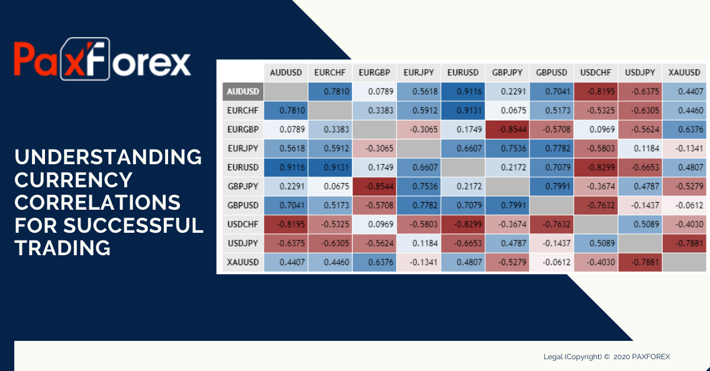

## Table of Contents

## What are currency correlations and why are they important in forex trading?

Currency correlations are the way different currencies move in relation to each other. In forex trading, when one currency goes up, another might go down, and this is what we call being correlated. Some currencies move together a lot, like the euro and the Swiss franc, while others might move in opposite directions, like the US dollar and the Australian dollar. Understanding these relationships helps traders predict how their trades might be affected by movements in other currency pairs.

Knowing about currency correlations is really important for forex traders because it can help them manage their risks better. If a trader knows that two currencies usually move in the same direction, they can avoid having too many trades that depend on the same movement, which could lead to big losses if things go the wrong way. Also, traders can use this knowledge to find opportunities to make money by trading pairs that move in opposite directions, balancing out their risks and possibly increasing their profits.

## How can beginners identify currency correlations using simple tools?

Beginners can identify currency correlations by using simple tools like online correlation calculators or basic charting software. These tools allow you to see how different currency pairs move together over time. For example, you can enter the names of two currency pairs into a correlation calculator, and it will show you a number between -1 and 1. If the number is close to 1, it means the two pairs tend to move in the same direction. If it's close to -1, they move in opposite directions. A number around 0 means there's little to no correlation.

It's also helpful to use charting software, which is often available for free on many trading platforms. By plotting the price movements of two currency pairs on the same chart, you can visually see if they move together or in opposite directions. Over time, you'll start to notice patterns. For instance, if you see that every time the EUR/USD goes up, the USD/CHF goes down, you might infer a negative correlation. Remember, correlations can change, so it's good to check them regularly to stay updated on how currency pairs are behaving.

## What are the most common currency pairs and their typical correlations?

The most common currency pairs in [forex](/wiki/forex-system) trading are called the "majors." These include pairs like EUR/USD, USD/JPY, GBP/USD, and USD/CHF. The EUR/USD and GBP/USD often move in the same direction because both the euro and the British pound can be seen as alternatives to the US dollar. On the other hand, the USD/JPY and USD/CHF typically have a negative correlation with EUR/USD and GBP/USD. This means when the US dollar goes up against the euro or the pound, it often goes down against the Japanese yen or the Swiss franc.

Another important pair to watch is AUD/USD, which is the Australian dollar against the US dollar. The AUD/USD often moves in the opposite direction of USD/JPY. This is because the Australian economy is closely tied to commodity prices, which can affect its currency differently than the yen, which is influenced more by Japan's economic policies. Understanding these typical correlations can help traders make better decisions, but remember that correlations can change over time, so it's good to keep checking them.

## How do economic events influence currency correlations?

Economic events can change how currencies move together. For example, if a country raises its interest rates, its currency might get stronger. If two countries have similar economies and both raise their interest rates, their currencies might move up together. But if one country's economy is doing badly and it cuts interest rates, its currency might go down while another country's currency stays strong. These changes can make the usual patterns between currencies different for a while.

Also, big news like jobs reports or inflation numbers can shake up currency correlations. If the US has a really good jobs report, the US dollar might go up against other currencies. But if at the same time, Europe has a bad report, the euro might go down. This could make the EUR/USD pair move in a new way compared to before. Traders need to watch these events closely because they can change how they should trade based on what they thought were stable correlations.

## What strategies can be used to capitalize on positive currency correlations?

One strategy to use positive currency correlations is to trade in the same direction for both currency pairs. If you see that EUR/USD and GBP/USD usually go up and down together, you can buy both pairs if you think they will go up. This can help spread out your risk because if one pair doesn't move as much as you hoped, the other pair might make up for it. Just remember to keep an eye on how much money you're putting into each trade so you don't risk too much.

Another way to take advantage of positive correlations is to use them to confirm your trading decisions. If you're thinking about buying EUR/USD because you believe it will go up, you can look at GBP/USD. If GBP/USD is also going up, it might give you more confidence that your idea about EUR/USD is right. This can help you feel more sure about your trades and maybe make better choices. But always remember that correlations can change, so it's important to check them often.

## How can traders use negative currency correlations to hedge their positions?

Traders can use negative currency correlations to protect their trades by balancing out their risks. For example, if you think the EUR/USD will go down, you can buy USD/CHF at the same time. Since these two pairs often move in opposite directions, if EUR/USD goes down like you thought, USD/CHF might go up. This can help you lose less money or even make a profit on the other trade if things don't go as planned with EUR/USD.

Using negative correlations this way is like having a backup plan. It doesn't mean you'll always make money, but it can help you avoid big losses. Just make sure you understand how much you're risking on each trade and keep checking the correlations because they can change over time.

## What are the risks involved in trading based on currency correlations?

Trading based on currency correlations can be risky because correlations can change. What you see as a strong pattern today might not be the same tomorrow. If you're trading two currency pairs that you think move together, and suddenly they start moving differently, your trades could lose money. It's important to keep checking these correlations and not rely on them too much.

Another risk is over-trading. If you're using correlations to trade more pairs at the same time, you might end up risking too much money. It can be tempting to open lots of trades thinking they'll all move in your favor, but if things go wrong, you could lose a lot. Always think about how much you're risking and make sure you're not betting too much on the same kind of movement.

## How can advanced traders use correlation matrices to optimize their trading portfolios?

Advanced traders can use correlation matrices to see how different currency pairs move together over time. A correlation matrix is like a big table that shows numbers from -1 to 1 for different pairs. If the number is close to 1, it means the pairs move in the same direction a lot. If it's close to -1, they move in opposite directions. By looking at this matrix, traders can pick pairs that will help them spread out their risk. For example, if they see that EUR/USD and GBP/USD have a high positive correlation, they might not want to trade both pairs in the same direction because it's like putting all their eggs in one basket.

Traders can also use the matrix to find pairs that move in opposite ways to balance their trades. If they're worried about losing money on one trade, they can open another trade on a pair that's negatively correlated. This way, if the first trade loses money, the second one might make money, helping to reduce the overall loss. But it's important to remember that correlations can change, so traders need to keep updating their matrices and not rely on them too much. Using correlation matrices smartly can help traders make better decisions and manage their risks more effectively.

## What role does time frame play in the effectiveness of currency correlation strategies?

The time frame you choose can really change how well your currency correlation strategies work. If you look at correlations over a short time, like a few hours or a day, you might see different patterns than if you look at them over weeks or months. Short-term correlations can be all over the place because of daily news or events, so they might not be as reliable for planning your trades. But if you're trading quickly, these short-term patterns can still be useful for making fast decisions.

On the other hand, looking at correlations over longer times, like months or years, can give you a better idea of how currencies usually move together. These long-term correlations can be more stable and help you plan your trades better if you're not in a hurry. But remember, even long-term correlations can change because of big economic shifts or policy changes. So, it's important to check them regularly no matter what time frame you use.

## How can algorithmic trading be enhanced by understanding currency correlations?

Understanding currency correlations can make algorithmic trading better by helping traders set up their trading rules smarter. When you know how different currencies move together, you can write code that looks at these patterns and makes trades based on them. For example, if you see that the EUR/USD and GBP/USD usually go up and down together, your algorithm can buy both pairs at the same time, hoping they'll both go up. This can help spread out the risk because if one pair doesn't move as expected, the other pair might help balance it out.

Also, knowing about negative correlations can help your algorithm protect your trades. If you think the EUR/USD will go down, your code can also buy USD/CHF because they often move in opposite ways. This way, if EUR/USD does go down, USD/CHF might go up and help you lose less money or even make some profit. But remember, correlations can change, so your algorithm should keep checking them to stay up to date. This can make your trading strategies more reliable and help you manage your risks better.

## What are some case studies of successful trades using currency correlation strategies?

One successful trade using currency correlation strategies happened with a trader who noticed that the EUR/USD and GBP/USD pairs often moved together. The trader saw that both pairs were going up and decided to buy both at the same time. A few days later, good economic news came out for both Europe and the UK, making both the euro and the pound stronger against the US dollar. The trader made a good profit because both pairs went up as expected. This shows how understanding positive correlations can help traders make money by trading in the same direction for both pairs.

Another case involved a trader who used negative correlations to protect their trades. The trader believed that the USD/JPY would go down because of some upcoming news from Japan. Knowing that the USD/CHF often moves in the opposite direction, the trader bought USD/CHF as a hedge. When the news came out and USD/JPY did go down, USD/CHF went up just as the trader hoped. This helped the trader lose less money on the USD/JPY trade and even make some profit on the USD/CHF trade. This example shows how understanding negative correlations can help traders manage their risks better.

## How do global economic shifts impact long-term currency correlation trends?

Global economic shifts can change how currencies move together over a long time. For example, if a country's economy gets much stronger or weaker than others, its currency might start acting differently. If one country's central bank changes its interest rates a lot, that can make its currency go up or down compared to others. Big events like a country joining or leaving a trade group can also shake things up. These changes can make the usual patterns between currencies different for a long time, so traders need to keep watching them.

For instance, if the US economy starts doing much better than Europe's, the US dollar might get stronger against the euro. This could change the way EUR/USD and other pairs move together. If this happens over many years, it could turn what was a positive correlation into a negative one or make a strong correlation weaker. Traders who understand these long-term changes can adjust their strategies to make better trades and manage their risks. But it's important to remember that these shifts take time and need careful watching.

## How is Algorithmic Trading Transforming Forex Strategies?

Algorithmic trading, often referred to as algo trading, is the process of using computer algorithms to automate the execution of trades in financial markets. It has gained considerable traction in modern forex trading due to its ability to enhance efficiency and eliminate human error. By utilizing pre-defined criteria and executing trades at high speeds, algo trading significantly optimizes trading outcomes for forex traders.

One of the primary advantages of [algorithmic trading](/wiki/algorithmic-trading) is its capacity to execute trades with unparalleled speed and precision. Human traders are susceptible to emotional biases and can often delay decision-making. In contrast, algorithms can process vast amounts of market data in milliseconds and execute trades in real-time, ensuring that traders capitalize on even the smallest market movements. This speed and precision not only reduce transaction costs but also increase the potential for profit maximization.

In forex trading, various types of algorithms are employed to achieve different objectives. Technical analysis algorithms typically use historical price data to predict future price movements. They apply technical indicators, such as moving averages or the Relative Strength Index (RSI), to identify entry and [exit](/wiki/exit-strategy) points for trades. For example, the simple moving average (SMA) is calculated as follows:

$$
\text{SMA} = \frac{\sum_{i=1}^{n} \text{Price}_i}{n}
$$

where $n$ is the number of periods considered.

Statistical [arbitrage](/wiki/arbitrage) is another popular algorithmic strategy in forex trading. It involves exploiting price inefficiencies between correlated currency pairs by employing statistical models to predict price divergences. This strategy relies heavily on probability theory and statistical methods to assess the likelihood of profiting from transient price differentials.

Data analysis and [machine learning](/wiki/machine-learning) play a critical role in refining these algorithms. With the exponential growth of data availability, the use of sophisticated data analysis techniques allows traders to extract actionable insights and improve predictive accuracy. Machine learning models, particularly those in the categories of supervised and unsupervised learning, enable the development of adaptive algorithms that can learn from historical data and adjust to changing market conditions. Techniques such as regression analysis, decision trees, and neural networks are commonly used to predict currency price movements and optimize trading strategies.

In summary, algorithmic trading revolutionizes forex strategies by leveraging technology to automate and refine trading execution. Its strengths lie in speed, accuracy, and the potential to incorporate complex data analysis techniques and machine learning models. As a result, algorithmic trading not only enhances traders' decision-making processes but also positions them favorably in competitive forex markets.

## References & Further Reading

[1]: Lopez de Prado, M. (2018). ["Advances in Financial Machine Learning."](https://www.amazon.com/Advances-Financial-Machine-Learning-Marcos/dp/1119482089) John Wiley & Sons.

[2]: Aronson, D. R. (2007). ["Evidence-Based Technical Analysis: Applying the Scientific Method and Statistical Inference to Trading Signals."](https://www.amazon.com/Evidence-Based-Technical-Analysis-Scientific-Statistical/dp/0470008741) John Wiley & Sons.

[3]: Jansen, S. (2020). ["Machine Learning for Algorithmic Trading."](https://github.com/stefan-jansen/machine-learning-for-trading) Packt Publishing.

[4]: Chan, E. P. (2009). ["Quantitative Trading: How to Build Your Own Algorithmic Trading Business."](https://github.com/ftvision/quant_trading_echan_book) John Wiley & Sons.

[5]: Bergstra, J., Bardenet, R., Bengio, Y., & Kégl, B. (2011). ["Algorithms for Hyper-Parameter Optimization."](https://dl.acm.org/doi/10.5555/2986459.2986743) Advances in Neural Information Processing Systems 24.

