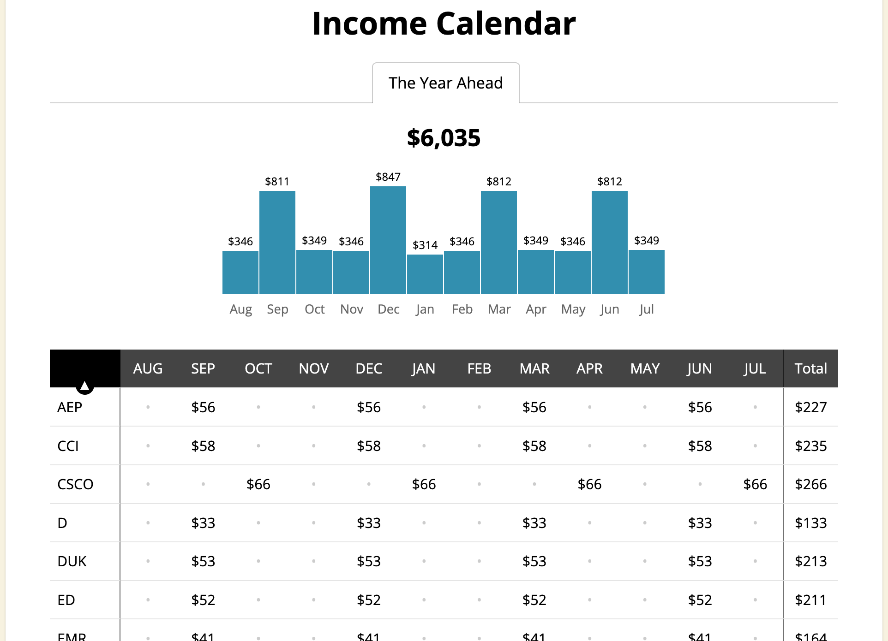

## Table of Contents

## What are dividends and how do they work?

Dividends are payments that companies make to their shareholders from their profits. When a company makes money, it can choose to share some of that money with the people who own its stock. This sharing of profits is called a dividend. Companies usually pay dividends a few times a year, and the amount each shareholder gets depends on how many shares they own.

To receive a dividend, you need to own the stock of a company that pays dividends before a certain date, known as the ex-dividend date. If you buy the stock on or after this date, you won't get the next dividend payment. When the company decides to pay a dividend, it announces how much it will be and when it will be paid. The dividend payment is usually sent directly to your bank account or added to your investment account if you own the stock through a brokerage.

## How can dividends contribute to retirement income?

Dividends can be a big help for people saving for retirement. When you own stocks that pay dividends, you get regular payments from the company. These payments can add up over time and give you extra money to live on when you stop working. If you put the dividend money back into buying more stocks, you can get even more dividends in the future. This is called reinvesting, and it can make your savings grow faster.

Dividends can also make your retirement income more stable. Stocks can go up and down in value, but dividends tend to be more predictable. Many companies try to keep their dividend payments steady or even increase them over time. This means you can count on getting a certain amount of money from your investments each year. Having this steady income can help you feel more secure and plan better for your retirement.

## What types of investments typically pay dividends?

Stocks are the most common type of investment that pays dividends. When you buy shares in a company, you become a part-owner, and if that company makes money, it might share some of it with you as a dividend. Not all companies pay dividends, though. Usually, big and stable companies, like those in the utilities, consumer goods, or financial sectors, are more likely to pay dividends. These companies often have steady earnings and can afford to share their profits with shareholders.

Another type of investment that can pay dividends is mutual funds or exchange-traded funds (ETFs) that focus on dividend-paying stocks. These funds collect money from many investors and use it to buy a bunch of different stocks. If the stocks in the fund pay dividends, the fund will pass those dividends along to the people who own shares in the fund. This can be a good way to get dividends without having to pick individual stocks yourself.

Real estate investment trusts (REITs) are also known for paying dividends. REITs are companies that own and manage properties like apartments, shopping centers, or office buildings. By law, REITs have to pay out most of their income to shareholders as dividends. This makes them a popular choice for people looking for regular income from their investments.

## What is the difference between qualified and non-qualified dividends for tax purposes?

The main difference between qualified and non-qualified dividends is how they are taxed. Qualified dividends are taxed at a lower rate, similar to the rates for long-term capital gains. This can be 0%, 15%, or 20%, depending on your income. Non-qualified dividends, on the other hand, are taxed at your regular income tax rate, which can be much higher, up to 37% depending on your income level.

To be considered qualified, a dividend must meet certain requirements. It must be paid by a U.S. corporation or a qualified foreign corporation, and you must have held the stock for a certain period of time, usually more than 60 days during the 121-day period that begins 60 days before the ex-dividend date. If these conditions aren't met, the dividend is non-qualified and will be taxed at your ordinary income tax rate. Knowing the difference can help you plan your investments and taxes better.

## How can one start investing in dividend-paying stocks?

To start investing in dividend-paying stocks, you first need to open a brokerage account. A brokerage account is like a bank account but for buying and selling stocks. You can open one online with companies like Charles Schwab, Fidelity, or Robinhood. Once your account is set up, you can put money into it and start looking for stocks that pay dividends. You can search for these stocks using tools on the brokerage website or through financial news websites.

After you find some dividend-paying stocks you like, you can buy them through your brokerage account. Look for companies that have a history of paying steady dividends, like big companies in industries like utilities or consumer goods. Once you own the stocks, you'll start getting dividend payments a few times a year. You can choose to take the money out to spend or reinvest it to buy more stocks, which can help your investment grow over time.

## What are dividend reinvestment plans (DRIPs) and how do they benefit retirement planning?

Dividend reinvestment plans, or DRIPs, are a way to use the money you get from dividends to buy more shares of the same stock instead of taking the money out. When you sign up for a DRIP, the dividends you earn are automatically used to buy more shares of the company. This means you don't have to do anything extra, and it's a simple way to grow your investment over time. Many companies offer DRIPs, and you can usually sign up for them through your brokerage account.

DRIPs can be really helpful for retirement planning. By reinvesting your dividends, you're buying more shares without spending any extra money. Over time, these extra shares can earn more dividends, which can then be reinvested again. This can make your investment grow faster, a process called compounding. When you retire, you can stop reinvesting and start taking the dividends as cash to help pay for your living expenses. This way, DRIPs can help you build a bigger nest egg for your retirement.

## How should one assess the sustainability of dividend payments from a company?

To assess the sustainability of a company's dividend payments, you need to look at its financial health and earnings. One key thing to check is the company's payout ratio, which is the percentage of its earnings that it pays out as dividends. If the payout ratio is too high, like over 100%, it means the company is paying out more than it's [earning](/wiki/earning-announcement), which isn't sustainable in the long run. You also want to see if the company has steady earnings over time. If earnings are going up, it's a good sign that the company can keep paying dividends.

Another thing to consider is the company's debt level. If a company has a lot of debt, it might have to use its earnings to pay off that debt instead of paying dividends. You can look at the company's debt-to-equity ratio to see how much debt it has compared to its equity. A lower ratio is usually better. Also, it's good to see if the company has a history of paying dividends consistently or even increasing them over time. Companies that have a long track record of stable or growing dividends are more likely to keep doing so in the future.

## What are the risks associated with relying on dividends for retirement income?

One big risk of relying on dividends for retirement income is that companies can cut or stop paying dividends. This can happen if the company is not making enough money or if it needs to use its money for other things, like paying off debt or investing in new projects. If you're depending on those dividends to pay your bills, a cut can really hurt your retirement plans. It's important to pick companies that have a good history of paying dividends and seem likely to keep doing so, but there's always a chance things could change.

Another risk is that the value of your stocks can go up and down. Even if you're getting dividends, the price of the stock might drop, which means your overall investment could lose value. If you need to sell some of your stocks to get more cash during retirement, you might have to sell them at a lower price than you bought them for. This can make it harder to make your retirement savings last as long as you need them to. Balancing your investments and not putting all your money into just dividend stocks can help manage this risk.

## How can dividend yield and dividend growth impact retirement planning?

Dividend yield and dividend growth can both play a big role in your retirement planning. Dividend yield is the percentage of the stock's price that you get back in dividends each year. A high dividend yield means you get more money from your investment right away, which can be helpful if you need income soon after you retire. But, a really high yield might also mean the company is having trouble, so it's important to look at why the yield is high before you invest.

Dividend growth is about how much the dividends go up over time. If a company keeps increasing its dividends, it can help your retirement income grow too. This can be really good because it means your money keeps up with inflation, so you can still buy the things you need as prices go up. Companies that regularly increase their dividends are often financially strong, which makes them a safer choice for your retirement savings. Balancing both high yield and good growth can help make sure you have enough money during your retirement years.

## What role does diversification play in a dividend-based retirement strategy?

Diversification is really important when you're planning to use dividends for your retirement. It means spreading your money across different kinds of investments instead of putting it all in one place. This can help lower your risk because if one company stops paying dividends, you still have other investments that might keep paying. If you only invest in one or two companies and something goes wrong, it could really hurt your retirement income. But if you have a mix of stocks from different industries or even different types of investments like bonds or real estate, it's less likely that all of them will have problems at the same time.

Having a diversified portfolio can also help you get a steady income from dividends. Different companies might pay dividends at different times of the year, so by owning a variety of stocks, you can get dividend payments more often. This can make your retirement income more predictable and easier to plan with. Plus, if one industry is doing badly, another might be doing well, so you can still get dividends from other parts of your portfolio. Diversification can make your retirement strategy stronger and more reliable.

## How can one adjust their dividend investment strategy as they approach retirement?

As you get closer to retirement, you might want to change your dividend investment strategy to make sure you have enough money to live on. One thing you can do is to start focusing more on companies that have a history of paying steady dividends. These companies are often in stable industries like utilities or consumer goods. By choosing these kinds of stocks, you can feel more confident that you'll keep getting dividend payments even after you retire. It's also a good idea to look at the dividend yield. A higher yield can give you more income right away, but make sure the company is financially healthy and not just offering a high yield because it's in trouble.

Another way to adjust your strategy is to think about how much risk you're comfortable with. As you get older, you might want to take less risk with your investments. This means you could shift some of your money from stocks to other types of investments like bonds or dividend-focused mutual funds and ETFs. These can still give you income but might be less risky than individual stocks. Also, you might want to stop using dividend reinvestment plans (DRIPs) and start taking the dividends as cash. This way, you can use the money to pay for your living expenses during retirement. By making these changes, you can help make sure your retirement income is steady and reliable.

## What advanced strategies can be used to optimize dividend income in retirement?

One advanced strategy to optimize dividend income in retirement is to use a technique called dividend capture. This involves buying a stock just before the ex-dividend date and then selling it soon after you receive the dividend. The idea is to get the dividend payment without holding onto the stock for a long time. This can work well if you pick the right stocks, but it's tricky because stock prices can drop after the ex-dividend date, and you might end up losing money if the stock price falls more than the dividend you receive. It's a good idea to do this with stocks that have a history of not dropping too much after the dividend is paid.

Another strategy is to use options to boost your dividend income. You can sell call options on the stocks you own that pay dividends. By doing this, you get extra money from the option premium, which can add to your income. If the stock price stays below the option's strike price, you keep the stock and the dividend, plus the premium from selling the option. But if the stock price goes above the strike price, you might have to sell your stock, which means you won't get future dividends from that stock. This strategy can be more complicated and risky, so it's important to understand options well before trying it.

A third strategy is to focus on dividend aristocrats and dividend kings. These are companies that have increased their dividends for at least 25 years (aristocrats) or 50 years (kings). By investing in these companies, you can be more confident that your dividend income will keep growing over time. This can help your retirement income keep up with inflation. It's a good idea to mix these reliable stocks with some higher-yield stocks to balance growth and immediate income. This way, you can have a steady and growing stream of income during your retirement years.

## How can one develop a diversified dividend retirement strategy?

A diversified dividend retirement strategy is crucial in safeguarding against potential risks and ensuring a steady income post-retirement. By incorporating both dividend-paying stocks and other asset classes, investors can minimize exposure to specific sector downturns and stabilize returns. Here's a guide to building such a strategy.

### Building a Balanced Portfolio

1. **Inclusion of Dividend-Paying Stocks**: 
   - **Selection Criteria**: Focus on stocks from companies with a history of strong balance sheets and consistent dividend payouts. These companies typically exhibit stable earnings and a sustainable dividend payout ratio, often calculated as:
$$
     \text{Dividend Payout Ratio} = \frac{\text{Dividends Per Share}}{\text{Earnings Per Share}}

$$

     A high ratio might indicate future payout cuts if earnings don't grow, whereas a very low ratio could suggest the ability to increase payouts.

   - **Types of Stocks**: Incorporate a mix of common stocks and preferred stocks to balance between potential capital appreciation and fixed income. Common stocks may offer variable dividends but have a higher growth potential, while preferred stocks generally pay fixed dividends, providing stability.

2. **Inclusion of Non-Equity Assets**:
   - **Bonds**: Adding bonds, which generally offer fixed interest payments, can act as a stabilizing force within the portfolio. They tend to perform well when interest rates are declining, providing a buffer in economic downturns.
   - **Other Asset Classes**: Consider real estate investment trusts (REITs), which are required to distribute at least 90% of taxable income as dividends, making them a valuable income source. Additionally, incorporating commodities or alternative investments may further diversify portfolio risk.

### Selection Tips for Dividend Stocks

- **Financial Health Assessment**: Evaluate potential investments using key financial health indicators such as the debt-to-equity ratio and interest coverage ratio. Low debt levels relative to equity and strong interest coverage signify a company's capability to pay dividends without compromising financial stability.

- **Dividend Growth Track Record**: Prefer companies with a history of increasing dividends over time. Such companies typically exhibit robust business models and sound management practices. Historical dividend growth can often be an indicator of future potential.

- **Sector and Geographic Diversification**: Avoid over-concentration in a particular sector or geographical region. Economic or political turmoil can disproportionally affect similar companies; thus, spreading investments across various sectors and countries can mitigate regional risks.

By constructing a diversified dividend retirement strategy, investors can not only secure a steady stream of income but also protect their retirement savings from market fluctuations. This approach requires careful stock selection and an understanding of the interplay between different asset classes to optimize returns and manage risks.

## What are common pitfalls and how can they be avoided?

Investing in dividend-paying stocks can be an attractive strategy for generating income, especially for retirement. However, there are common pitfalls that investors must be wary of to safeguard against potential risks and maximize the benefits. One of the primary pitfalls is the tendency to pursue high-yield stocks excessively while neglecting the risks such as sector concentration and dividend sustainability issues.

### Avoiding High-Yield Traps

High-yield stocks can be tempting as they promise substantial returns. Yet, these returns often come with increased risk. Some high-yield stocks may be involved in industries vulnerable to volatile economic conditions, resulting in inconsistent yields. It is crucial to remember that a high dividend yield may be indicative of an underlying issue, such as declining business performance or financial strain. Yield is calculated as:

$$
\text{Dividend Yield} = \left( \frac{\text{Annual Dividend Per Share}}{\text{Price Per Share}} \right) \times 100
$$

When the price per share drops significantly—as might occur with problematic companies—the yield might appear attractive, even though the investment risk has increased.

### Importance of Diversification

Diversification reduces risk by spreading investments across different assets, sectors, or geographies. Focusing solely on high yields can lead to sector concentration, where one might unduly invest in a few sectors that traditionally pay high dividends, such as utilities or financials. This concentration can erode portfolio stability during sector-specific downturns. Instead, a balanced approach that includes various sectors can maintain income consistency and reduce exposure to sector-specific risks.

### Behavioral Aspects of Dividend Investing 

Investors might exhibit behaviors like overreacting to short-term market dips, leading to rash decisions that affect long-term returns. Sticking to a rational investment strategy and understanding that dividends are part of a broader investment perspective is crucial. Behavioral biases can be mitigated by adhering to a total return approach that considers both dividend income and capital appreciation. This approach helps in aligning with the overall financial goals rather than short-term gains alone.

### Embracing Total Return Strategies

Relying exclusively on dividends without considering capital gains can limit the growth potential of a retirement portfolio. Total return strategies involve reinvesting dividends and interest, facilitating compound growth. For instance, reinvestment can amplify returns through compound interest, represented by:

$$
A = P \left(1 + \frac{r}{n}\right)^{nt}
$$

Where:
- $A$ is the amount of money accumulated after n years, including interest.
- $P$ is the principal amount (initial investment).
- $r$ is the annual interest rate (decimal).
- $n$ is the number of times that interest is compounded.
- $t$ is the time the money is invested for in years.

Understanding these strategies and incorporating them reinforces a retirement plan that not only relies on the consistency of dividend income but also capitalizes on market opportunities for growth.

## References & Further Reading

[1]: Morgan Stanley. "Dividends Still Matter."

[2]: Internal Revenue Service. ["Tax Topic: Qualified Dividends and Capital Gain Tax Rates."](https://www.investopedia.com/terms/q/qualifieddividend.asp)

[3]: ["Advances in Financial Machine Learning"](https://www.amazon.com/Advances-Financial-Machine-Learning-Marcos/dp/1119482089) by Marcos Lopez de Prado

[4]: ["Machine Learning for Asset Managers"](https://www.cambridge.org/core/books/machine-learning-for-asset-managers/6D9211305EA2E425D33A9F38D0AE3545) by Marcos Lopez de Prado

[5]: ["Quantitative Trading: How to Build Your Own Algorithmic Trading Business"](https://www.amazon.com/Quantitative-Trading-Build-Algorithmic-Business/dp/1119800064) by Ernest P. Chan