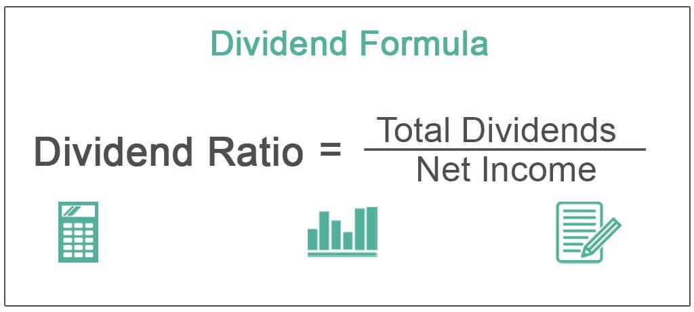

Investing for retirement is a crucial step toward achieving financial independence, and dividend-paying stocks present a unique opportunity to generate a reliable income stream. Dividends are distributions of a portion of a company's earnings, paid regularly to shareholders, often on a quarterly basis. These payments can contribute significantly to a retiree's income, providing a measure of financial security against the uncertainties of market fluctuations and inflation.

This article examines dividends as a retirement income investment strategy and highlights the benefits of incorporating algorithmic trading to potentially enhance portfolio performance. Algorithmic trading, which uses computer algorithms to execute trades based on pre-determined criteria, offers the potential to automate portfolio adjustments, optimize trade timings, and efficiently balance between dividend income and capital appreciation.



Understanding how dividends work is essential. They play a vital role in a diversified retirement strategy, providing a buffer against market downturns through consistent cash flow. When paired with other investments, dividends can help maintain portfolio balance, offering both growth and income opportunities.

Integrating algorithmic trading into a dividend-focused portfolio can further optimize returns. This technology allows for precise timing of stock purchases and sales, potentially increasing overall yield and minimizing risk. The automation of trade processes also helps avoid behavioral biases, ensuring that investment decisions remain objective and aligned with long-term financial goals.

Ultimately, the combination of dividends and strategic investment techniques can provide a dependable income stream while preserving and potentially enhancing retirement savings. This approach not only helps maintain financial stability during retirement but also secures the growth of assets, potentially offering peace of mind in the latter stages of life.

## Table of Contents

## Understanding Dividends as a Source of Income

Dividends are a critical component of investment income, representing the distribution of a company's earnings to its shareholders. Typically paid on a quarterly basis, dividends serve as a steady income stream, providing financial benefits even when markets fluctuate. The cash flow from dividends is particularly attractive for retirees seeking predictable income.

**Role of Dividends in Hedging Against Market Volatility and Inflation**

Dividends play a vital role in counterbalancing market [volatility](/wiki/volatility-trading-strategies) and the erosion of purchasing power due to inflation. When stock prices decline, dividend payouts can help stabilize an investor's cash flow, acting as a buffer against market downturns. Moreover, companies with a history of increasing dividend payments tend to outperform during inflationary periods. According to a 2015 study by Morgan Stanley, dividend-paying stocks generated higher returns than their non-dividend counterparts over decades, demonstrating dividends’ potential to mitigate inflationary effects.[^1^]

**Tax Considerations: Dividends vs. Capital Gains**

Understanding the tax implications of dividends versus capital gains is crucial for effective retirement planning. Generally, qualified dividends in the United States are taxed at a rate of 0%, 15%, or 20%, depending on the individual's taxable income and filing status[^2^]. This favorable tax treatment makes dividends an attractive option, particularly when compared to ordinary income tax rates applied to non-qualified dividends. In contrast, capital gains taxes are levied on the profit from the sale of assets or investments. Short-term capital gains are taxed as ordinary income, whereas long-term capital gains benefit from reduced rates similar to qualified dividends.

**Types of Dividends: Fixed-Rate vs. Variable-Rate**

Dividends come in different forms, each with distinct characteristics and implications for investors:

- **Fixed-Rate Dividends**: Commonly associated with preferred stocks, these dividends imply a guaranteed payout, resembling fixed-income securities like bonds. Investors receive a consistent dividend amount, offering predictable returns and reducing income uncertainty.

- **Variable-Rate Dividends**: More common in ordinary shares, these dividends can fluctuate based on a company’s profitability and strategic decisions. Companies may increase or decrease dividend payouts, introducing variability to the income stream. Variable-rate dividends reflect a company’s current financial health and future outlook but require investors to monitor corporate performance closely.

Investors must weigh the benefits of both fixed and variable dividends, considering factors like investment goals, risk tolerance, and market conditions. By comprehending these elements, individuals can better utilize dividends as part of their comprehensive retirement income strategy.

[^1^]: Morgan Stanley, "Dividends Still Matter."
[^2^]: Internal Revenue Service, "Tax Topic: Qualified Dividends and Capital Gain Tax Rates."

## Advantages and Disadvantages of Dividend Investing

Dividend-paying stocks have long been considered a stable investment option, particularly for retirees seeking a reliable source of income. These investments serve as a hedge against inflation by providing periodic cash flows, which can offer some stability when market performance is suboptimal. Dividends contribute not only to consistent income streams but also to the potential for capital appreciation, as reinvesting dividends can lead to compounded returns over time.

### Advantages of Dividend Investing

1. **Stability and Income Consistency**: Dividend-paying stocks typically belong to well-established companies with a history of stable earnings. These companies often continue to pay dividends even during economic downturns, offering investors a reliable income stream. This consistency is particularly advantageous during retirement, where fixed income can be vital for covering living expenses.

2. **Inflation Hedge**: Dividends can provide a hedge against inflation, preserving purchasing power. Unlike fixed income sources, dividends from well-performing companies can grow over time, potentially increasing the nominal income received by the investor.

3. **Potential for Capital Appreciation**: While dividends provide a regular income, the underlying stock can also appreciate, thereby increasing the overall return on investment. Reinvesting dividends can further magnify these effects through compounding.

### Disadvantages of Dividend Investing

1. **Reliance on Company Performance**: Dependence on dividends can be precarious if companies face financial difficulties and opt not to declare dividends. Such decisions can significantly impact projected income, necessitating a reevaluation of retirement plans.

2. **Tax Implications**: Dividends are generally taxed at a higher rate than capital gains. For instance, qualified dividends are taxed at rates ranging from 0% to 20%, depending on the investor's taxable income bracket, whereas long-term capital gains enjoy preferential tax treatment at similar rates. This tax discrepancy can affect the net income realized from dividend investments, potentially reducing their attractiveness compared to other investment forms.

3. **Market Sensitivity and Risk**: Dividend stocks are not immune to market risk. Changes in interest rates or company-specific issues can affect dividend payouts and stock valuations. Furthermore, high dividend yields can sometimes be indicative of underlying company challenges, posing additional risks to dividend reliability.

In summary, while dividend investing offers tangible benefits like income stability and inflation protection, it also carries inherent risks tied to company performance and tax liabilities. Understanding these dynamics is crucial for investors aiming to optimize dividends as part of their retirement income strategy.

## Integrating Algorithmic Trading for Enhanced Returns

Algorithmic trading, also known as algo trading, involves using computer algorithms to manage the buying and selling of securities. By employing complex mathematical models and statistical analyses, [algorithmic trading](/wiki/algorithmic-trading) can streamline execution processes, minimize costs, and maximize returns in a dividend-focused portfolio. 

**Enhancing Timing and Efficiency**

One of the primary advantages of algorithmic trading is its ability to optimize the timing of trades. Given the volatile nature of financial markets, precise timing can significantly affect investment returns. Algorithms can process vast amounts of market data in real-time, allowing them to detect patterns and execute trades at optimal times, which can be crucial for capturing the full benefit of dividend payouts and favorable price movements. For instance, an algorithm might use historical data to predict stock price movements around dividend announcement dates, thereby optimizing entry and [exit](/wiki/exit-strategy) points.

**Balancing Between Dividend Income and Capital Appreciation**

Algorithmic trading can also help balance the pursuit of dividend income with the need for capital appreciation. By continuously analyzing market conditions and adjusting holdings, algorithms can ensure that portfolios are aligned with an investor's income goals and risk tolerance. Strategies such as mean reversion or trend-following can be incorporated to adjust positions, thus capitalizing on both dividend earnings and potential capital gains.

**Risk Management and Yield Maximization**

Automation plays a crucial role in managing the risks associated with dividend investing. The ability to implement stop-loss orders, dynamic hedging, and portfolio rebalancing strategies can protect against adverse market movements. For instance, a volatility-based strategy might adjust portfolio allocations in reaction to changing market volatility, ensuring that dividend yields are maximized without exposing the portfolio to undue risk.

**Algorithmic Trading Models**

Let's consider a simple example of a mean-reversion algorithm applied to a dividend-focused portfolio, implemented in Python:

```python
import numpy as np
import pandas as pd

# Sample data: Date, Stock Price, Dividend Yield
data = {
    'date': pd.date_range(start='2023-01-01', periods=100, freq='D'),
    'stock_price': np.random.normal(100, 10, size=100),  # Random stock price
    'dividend_yield': np.random.normal(4, 0.5, size=100)  # Random dividend yield
}

df = pd.DataFrame(data)
rolling_mean = df['stock_price'].rolling(window=20).mean()

# Simple mean-reversion strategy: Buy when stock price is below rolling mean, sell otherwise
df['position'] = np.where(df['stock_price'] < rolling_mean, 1, -1)

# Cumulative return calculation based on stock price movement
df['daily_return'] = df['stock_price'].pct_change()
df['strategy_return'] = df['position'].shift(1) * df['daily_return']
df['cumulative_return'] = (1 + df['strategy_return']).cumprod()

print(df[['date', 'stock_price', 'position', 'cumulative_return']].tail())
```

This code snippet demonstrates how an algorithm might base trading decisions on a stock's price relative to its rolling mean, a common mean-reversion strategy. By automating such strategies, investors can systematically exploit pricing inefficiencies while managing dividend income effectively.

In conclusion, algorithmic trading offers substantial benefits for enhancing a dividend-focused investment strategy. By implementing data-driven decision-making, portfolios can achieve better timing, balance, and risk management, ensuring consistent dividend income and capital growth.

## Developing a Diversified Dividend Retirement Strategy

A diversified dividend retirement strategy is crucial in safeguarding against potential risks and ensuring a steady income post-retirement. By incorporating both dividend-paying stocks and other asset classes, investors can minimize exposure to specific sector downturns and stabilize returns. Here's a guide to building such a strategy.

### Building a Balanced Portfolio

1. **Inclusion of Dividend-Paying Stocks**: 
   - **Selection Criteria**: Focus on stocks from companies with a history of strong balance sheets and consistent dividend payouts. These companies typically exhibit stable earnings and a sustainable dividend payout ratio, often calculated as:
$$
     \text{Dividend Payout Ratio} = \frac{\text{Dividends Per Share}}{\text{Earnings Per Share}}

$$

     A high ratio might indicate future payout cuts if earnings don't grow, whereas a very low ratio could suggest the ability to increase payouts.

   - **Types of Stocks**: Incorporate a mix of common stocks and preferred stocks to balance between potential capital appreciation and fixed income. Common stocks may offer variable dividends but have a higher growth potential, while preferred stocks generally pay fixed dividends, providing stability.

2. **Inclusion of Non-Equity Assets**:
   - **Bonds**: Adding bonds, which generally offer fixed interest payments, can act as a stabilizing force within the portfolio. They tend to perform well when interest rates are declining, providing a buffer in economic downturns.
   - **Other Asset Classes**: Consider real estate investment trusts (REITs), which are required to distribute at least 90% of taxable income as dividends, making them a valuable income source. Additionally, incorporating commodities or alternative investments may further diversify portfolio risk.

### Selection Tips for Dividend Stocks

- **Financial Health Assessment**: Evaluate potential investments using key financial health indicators such as the debt-to-equity ratio and interest coverage ratio. Low debt levels relative to equity and strong interest coverage signify a company's capability to pay dividends without compromising financial stability.

- **Dividend Growth Track Record**: Prefer companies with a history of increasing dividends over time. Such companies typically exhibit robust business models and sound management practices. Historical dividend growth can often be an indicator of future potential.

- **Sector and Geographic Diversification**: Avoid over-concentration in a particular sector or geographical region. Economic or political turmoil can disproportionally affect similar companies; thus, spreading investments across various sectors and countries can mitigate regional risks.

By constructing a diversified dividend retirement strategy, investors can not only secure a steady stream of income but also protect their retirement savings from market fluctuations. This approach requires careful stock selection and an understanding of the interplay between different asset classes to optimize returns and manage risks.

## Common Pitfalls and How to Avoid Them

Investing in dividend-paying stocks can be an attractive strategy for generating income, especially for retirement. However, there are common pitfalls that investors must be wary of to safeguard against potential risks and maximize the benefits. One of the primary pitfalls is the tendency to pursue high-yield stocks excessively while neglecting the risks such as sector concentration and dividend sustainability issues.

### Avoiding High-Yield Traps

High-yield stocks can be tempting as they promise substantial returns. Yet, these returns often come with increased risk. Some high-yield stocks may be involved in industries vulnerable to volatile economic conditions, resulting in inconsistent yields. It is crucial to remember that a high dividend yield may be indicative of an underlying issue, such as declining business performance or financial strain. Yield is calculated as:

$$
\text{Dividend Yield} = \left( \frac{\text{Annual Dividend Per Share}}{\text{Price Per Share}} \right) \times 100
$$

When the price per share drops significantly—as might occur with problematic companies—the yield might appear attractive, even though the investment risk has increased.

### Importance of Diversification

Diversification reduces risk by spreading investments across different assets, sectors, or geographies. Focusing solely on high yields can lead to sector concentration, where one might unduly invest in a few sectors that traditionally pay high dividends, such as utilities or financials. This concentration can erode portfolio stability during sector-specific downturns. Instead, a balanced approach that includes various sectors can maintain income consistency and reduce exposure to sector-specific risks.

### Behavioral Aspects of Dividend Investing 

Investors might exhibit behaviors like overreacting to short-term market dips, leading to rash decisions that affect long-term returns. Sticking to a rational investment strategy and understanding that dividends are part of a broader investment perspective is crucial. Behavioral biases can be mitigated by adhering to a total return approach that considers both dividend income and capital appreciation. This approach helps in aligning with the overall financial goals rather than short-term gains alone.

### Embracing Total Return Strategies

Relying exclusively on dividends without considering capital gains can limit the growth potential of a retirement portfolio. Total return strategies involve reinvesting dividends and interest, facilitating compound growth. For instance, reinvestment can amplify returns through compound interest, represented by:

$$
A = P \left(1 + \frac{r}{n}\right)^{nt}
$$

Where:
- $A$ is the amount of money accumulated after n years, including interest.
- $P$ is the principal amount (initial investment).
- $r$ is the annual interest rate (decimal).
- $n$ is the number of times that interest is compounded.
- $t$ is the time the money is invested for in years.

Understanding these strategies and incorporating them reinforces a retirement plan that not only relies on the consistency of dividend income but also capitalizes on market opportunities for growth.

## Conclusion

Incorporating dividends into a retirement income strategy offers both opportunities and challenges. Dividends can provide a reliable income stream, contributing to financial stability during retirement. However, the landscape of dividend investing demands careful navigation. The inclusion of algorithmic trading can significantly enhance this strategy. By automating trade executions through pre-defined algorithms, investors can optimize performance and better manage risks. Algorithmic trading can efficiently balance the timing of buying and selling dividend stocks, maximizing both income and capital appreciation.

To succeed with a dividend-focused retirement portfolio, diversification is essential. A well-diversified portfolio not only mitigates risks but also ensures a more reliable income flow. Diversification should encompass various asset classes and sectors, including dividend-paying stocks with strong balance sheets and consistent payout histories.

Informed decision-making remains a cornerstone of effective retirement planning. By understanding market conditions, tax implications, and company performance, investors can make better choices about their portfolio composition. Ultimately, the integration of dividends and algorithmic trading into a retirement strategy requires a balanced approach, where diversification and informed decisions drive success.

## References & Further Reading

[1]: Morgan Stanley. "Dividends Still Matter."

[2]: Internal Revenue Service. ["Tax Topic: Qualified Dividends and Capital Gain Tax Rates."](https://www.investopedia.com/terms/q/qualifieddividend.asp)

[3]: ["Advances in Financial Machine Learning"](https://www.amazon.com/Advances-Financial-Machine-Learning-Marcos/dp/1119482089) by Marcos Lopez de Prado

[4]: ["Machine Learning for Asset Managers"](https://www.cambridge.org/core/books/machine-learning-for-asset-managers/6D9211305EA2E425D33A9F38D0AE3545) by Marcos Lopez de Prado

[5]: ["Quantitative Trading: How to Build Your Own Algorithmic Trading Business"](https://www.amazon.com/Quantitative-Trading-Build-Algorithmic-Business/dp/1119800064) by Ernest P. Chan