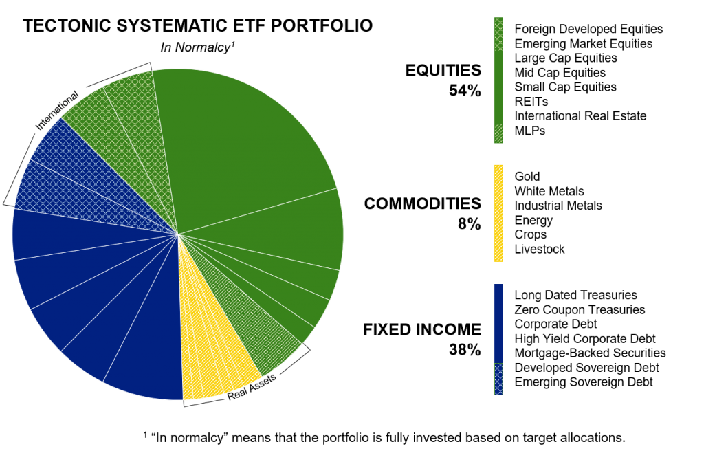

## Table of Contents

## What are ETFs and how do they work?

ETFs, or Exchange-Traded Funds, are a type of investment that works a lot like a mutual fund but trades on a stock exchange like a stock. They are designed to track the performance of a specific index, like the S&P 500, a commodity, bonds, or a basket of assets. When you buy shares of an ETF, you're buying a small piece of all the investments that the ETF holds. This makes it easy for you to diversify your investments without having to buy each asset individually.

ETFs are popular because they offer flexibility and lower costs compared to many other investment options. You can buy and sell ETF shares throughout the trading day at market prices, just like stocks. This is different from mutual funds, which are only priced at the end of the trading day. Also, ETFs often have lower expense ratios, which means you pay less in fees over time. This can make them a more cost-effective way to invest in a broad range of assets.

## What are the benefits of using ETFs for systematic investment?

Using ETFs for systematic investment can be a smart choice because it helps you spread your money across many different investments easily. When you invest systematically, you put money into your investments regularly, like every month. ETFs are great for this because they let you buy a little bit of a lot of different things all at once. This means you don't have to pick each stock or bond yourself, which can be hard and time-consuming. Instead, you can just buy shares of an ETF that already holds a mix of investments, making it simpler to diversify your portfolio.

Another benefit of using ETFs for systematic investing is that they are usually cheaper than other types of investments. ETFs often have lower fees, which means more of your money stays invested and working for you over time. Plus, because ETFs trade on stock exchanges like stocks, you can buy and sell them whenever the market is open. This flexibility can be helpful if you want to adjust your investments or if you need to get your money out quickly. Overall, ETFs can make systematic investing easier, more affordable, and more flexible.

## How can beginners start investing in ETFs?

If you're new to investing and want to start with ETFs, the first step is to open a brokerage account. You can do this online with many different companies. Once your account is set up, you'll need to add some money to it. This is the money you'll use to buy ETFs. When choosing an [ETF](/wiki/etf-trading-strategies), think about what you want to invest in. There are ETFs that track the stock market, others that focus on bonds, and some that invest in specific industries or countries. You can find information about different ETFs on your brokerage's website or on financial news websites.

After you've picked an ETF, you can buy shares of it through your brokerage account. You can start with just a few shares or invest more if you want. One good strategy for beginners is to invest a little bit of money regularly, like every month. This is called dollar-cost averaging, and it can help you buy more shares when prices are low and fewer when prices are high. Over time, this can help you build a solid investment without having to worry too much about the ups and downs of the market. Remember, investing is a long-term game, so be patient and keep learning as you go.

## What are the different types of ETFs available for investment?

There are many different types of ETFs that you can invest in, each designed to focus on different parts of the market or different kinds of investments. Some ETFs track broad market indexes like the S&P 500, which means they try to match the performance of the biggest companies in the U.S. Other ETFs focus on specific sectors, like technology or healthcare, so if you think one part of the economy will do well, you can invest in an ETF that targets that area. There are also ETFs that invest in different countries or regions, like Europe or Asia, which can be a good way to spread your investments around the world.

Another type of ETF is one that focuses on bonds, which are loans to companies or governments. These can be a good choice if you want to earn steady income from your investments. There are also commodity ETFs, which invest in things like gold, oil, or agricultural products. These can be a bit riskier but can also offer a way to diversify your portfolio. Finally, there are ETFs that use more complex strategies, like leveraged ETFs that try to make bigger gains (or losses) than the market, and inverse ETFs that go up when the market goes down. These can be trickier to understand and might be better for more experienced investors.

## How does diversification through ETFs benefit a systematic investment strategy?

Diversification through ETFs can really help when you're using a systematic investment strategy. When you invest systematically, you put money into your investments regularly, like every month. ETFs make it easy to spread your money across lots of different investments all at once. Instead of [picking](/wiki/asset-class-picking) each stock or bond yourself, which can be hard, you can just buy shares of an ETF. This ETF already holds a bunch of different investments, so you get a mix without having to do all the work. This means your money is spread out, which can lower your risk because if one investment does badly, the others might do well and balance it out.

Another way diversification through ETFs helps with systematic investing is by making it easier to stick with your plan. When you're investing regularly, it can be tough to see the market go up and down. But with ETFs, you're not just betting on one company or one type of investment. You're investing in a whole bunch of them. This can make you feel more comfortable sticking to your plan, even when the market gets bumpy. Plus, because ETFs often have lower fees, more of your money stays invested and working for you over time. This can help your investments grow more over the long run.

## What are the costs associated with investing in ETFs?

When you invest in ETFs, there are a few costs you need to know about. One of the main costs is the expense ratio, which is a yearly fee that the ETF charges to cover its operating costs. This fee is a percentage of your investment, so if you have $1,000 in an ETF with a 0.10% expense ratio, you'll pay $1 a year. ETFs usually have lower expense ratios than mutual funds, which is one reason they can be a good choice for investors.

Another cost to think about is the trading commission, which is what you pay to buy or sell ETF shares. Some brokerages offer commission-free trading for certain ETFs, but others might charge you a few dollars every time you trade. It's a good idea to check with your brokerage to see what their fees are. Also, if you're buying and selling ETFs a lot, you might have to pay taxes on any profits you make, which is another cost to consider.

## How can one set up a systematic investment plan using ETFs?

To set up a systematic investment plan using ETFs, you first need to open a brokerage account. You can do this online with many different companies. Once your account is set up, you'll need to add some money to it. This is the money you'll use to buy ETFs. Next, you need to pick an ETF that fits your investment goals. There are lots of ETFs to choose from, so think about what you want to invest in. You can find information about different ETFs on your brokerage's website or on financial news websites. Once you've picked an ETF, you can set up automatic investments. This means you tell your brokerage to buy a certain amount of the ETF every month or every week, whatever works best for you.

After you've set up your automatic investments, your money will go into the ETF regularly without you having to do anything. This is called dollar-cost averaging, and it can help you buy more shares when prices are low and fewer when prices are high. Over time, this can help you build a solid investment without having to worry too much about the ups and downs of the market. Remember, investing is a long-term game, so be patient and keep learning as you go. By using ETFs for your systematic investment plan, you can easily diversify your investments and keep your costs low, which can help your money grow over time.

## What are the tax implications of investing in ETFs?

When you invest in ETFs, you need to think about taxes. One thing to know is that ETFs can be more tax-efficient than other types of investments like mutual funds. This is because ETFs usually have lower turnover, which means they buy and sell the investments they hold less often. When an ETF sells an investment for a profit, it might have to pay capital gains taxes, and those taxes can be passed on to you. But because ETFs trade less, they often have fewer capital gains to pass on, which can mean you pay less in taxes.

Another tax thing to think about is when you sell your ETF shares. If you sell them for more than you paid, you'll have to pay capital gains tax on the profit. How much tax you pay depends on how long you held the ETF. If you held it for more than a year, you'll pay long-term capital gains tax, which is usually lower than the tax on short-term gains, which is what you pay if you held the ETF for a year or less. So, it can be a good idea to hold onto your ETFs for the long term to save on taxes.

## How do market conditions affect ETF performance in a systematic investment strategy?

Market conditions can really change how well your ETFs do when you're using a systematic investment strategy. When the market is doing well, like when the economy is growing and companies are making more money, the value of your ETFs can go up. This is good because you're buying more shares with the same amount of money each time you invest. But if the market goes down, like during a recession, the value of your ETFs might drop. This can be tough to see, but because you're investing regularly, you'll be buying more shares when prices are low. Over time, this can actually help your investments grow more when the market gets better.

Even though market conditions can make your ETFs go up and down, sticking to your systematic investment plan can help you handle these changes. By putting money into your ETFs regularly, you're not trying to guess when the market will go up or down. Instead, you're spreading out your investments over time. This can make it easier to deal with the ups and downs of the market because you're not putting all your money in at one time. Plus, ETFs let you invest in a lot of different things at once, which can help protect your money if one part of the market does badly.

## What advanced strategies can be used with ETFs for optimizing returns?

One advanced strategy for optimizing returns with ETFs is called sector rotation. This means you move your money from one part of the market to another based on where you think the economy is headed. For example, if you think technology companies will do well, you might put more money into a tech ETF. Then, if you think the economy is slowing down, you might switch some of your money to a more stable sector like utilities or consumer staples. By doing this, you're trying to take advantage of different parts of the economic cycle to get better returns.

Another strategy is using leveraged ETFs, which aim to give you bigger gains (or losses) than the market. These ETFs use borrowed money to try to make more money for you. For example, a 2x leveraged ETF tries to give you twice the daily return of the index it tracks. This can be exciting because you might make more money, but it's also riskier because you could lose more money if the market goes down. It's important to understand these risks and maybe use them only as a small part of your overall investment plan.

A third strategy is tax-loss harvesting, which can help you save on taxes while still trying to grow your investments. This means you sell an ETF that has gone down in value to get a tax break on your losses. Then, you quickly buy a similar ETF to keep your investment strategy the same. By doing this, you're using the tax system to your advantage while still staying invested in the market. This can be a bit tricky, so it might be good to talk to a financial advisor to make sure you're doing it right.

## How can one monitor and adjust an ETF-based systematic investment portfolio?

To monitor an ETF-based systematic investment portfolio, you should check your investments regularly, like once a month or every quarter. Look at how your ETFs are doing compared to the market and see if they're still meeting your investment goals. You can use tools on your brokerage's website or apps to keep track of your ETFs' performance. It's also a good idea to stay updated on news and trends that might affect the parts of the market your ETFs are invested in. This way, you can see if anything big is happening that might change how well your ETFs do.

If you need to adjust your portfolio, think about your long-term goals and how the market is doing. If one of your ETFs isn't doing well or if the market has changed a lot, you might want to switch some of your money to a different ETF that you think will do better. You can also add more money to your investments or take some out if your situation changes. Remember, the key to a systematic investment plan is to keep investing regularly, so even if you make changes, try to stick to your plan of putting money in at set times. This can help you stay on track and keep growing your investments over time.

## What are the long-term considerations and potential risks of using ETFs for systematic investment?

When you use ETFs for systematic investing over the long term, you need to think about a few things. One big thing is that ETFs can help you spread your money across lots of different investments, which can lower your risk. But even with ETFs, the market can still go up and down a lot. So, it's important to be ready for these changes and not get too worried if your investments drop in value sometimes. Also, think about your goals and how long you plan to invest. If you're saving for something far in the future, like retirement, ETFs can be a good choice because they let you invest in a lot of different things without having to pick each one yourself.

There are also some risks to know about. One risk is that the fees you pay for ETFs, even though they're usually low, can add up over time. These fees come out of your investment, so they can make a difference in how much money you end up with. Another risk is that the market might not do as well as you hope. Even if you're investing in a broad market ETF, there can still be times when the whole market goes down. And if you're using more complex ETFs, like leveraged ones, the risks can be even bigger because they try to make bigger gains or losses than the market. So, it's good to understand these risks and maybe talk to a financial advisor to make sure you're making the best choices for your long-term goals.

## References & Further Reading

[1]: Bergstra, J., Bardenet, R., Bengio, Y., & Kégl, B. (2011). ["Algorithms for Hyper-Parameter Optimization."](https://papers.nips.cc/paper/4443-algorithms-for-hyper-parameter-optimization) Advances in Neural Information Processing Systems 24.

[2]: ["Advances in Financial Machine Learning"](https://www.amazon.com/Advances-Financial-Machine-Learning-Marcos/dp/1119482089) by Marcos Lopez de Prado

[3]: ["Evidence-Based Technical Analysis: Applying the Scientific Method and Statistical Inference to Trading Signals"](https://www.amazon.com/Evidence-Based-Technical-Analysis-Scientific-Statistical/dp/0470008741) by David Aronson

[4]: ["Machine Learning for Algorithmic Trading"](https://github.com/stefan-jansen/machine-learning-for-trading) by Stefan Jansen

[5]: ["Quantitative Trading: How to Build Your Own Algorithmic Trading Business"](https://www.amazon.com/Quantitative-Trading-Build-Algorithmic-Business/dp/1119800064) by Ernest P. Chan