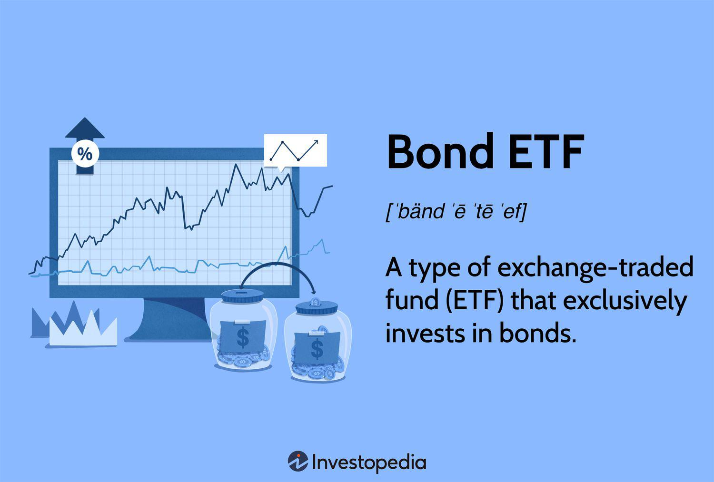

In today's dynamic financial landscape, investors are increasingly looking for systematic approaches to maximize their gains. This article examines the concepts of systematic investment, periodic investments, Exchange-Traded Funds (ETFs), and algorithmic trading. These strategies, independently significant in the financial sphere, can be integrated to enhance investment outcomes. Systematic investment provides a structured approach, reducing emotional bias and promoting disciplined decision-making. It contrasts with ad-hoc methods, offering long-term benefits through consistency and routine.

Periodic investments, such as Dollar-Cost Averaging (DCA), offer a consistent approach to navigating market volatility, aiding in wealth accumulation over time. On the other hand, ETFs present an effective tool for diversification and cost-efficiency, suitable for both long-term holding and active trading.



Algorithmic trading signifies the future of investing, leveraging technology for precise and rapid trade executions. Algorithms enable investors to effectively implement systematic investment strategies, though they come with their own set of challenges and risks.

This article will explore the benefits, challenges, and potential of integrating these strategies. By understanding and aligning these concepts, investors can potentially achieve significant financial success, whether they are seasoned or new to investing.

## Table of Contents

## Understanding Systematic Investment

Systematic investment is a strategy that involves making regular, fixed-amount investments into financial assets, typically over a long period. This disciplined approach is grounded in the principle of consistency, allowing investors to acquire more shares when prices are low and fewer when prices are high, thereby potentially optimizing their investment returns over time. The foundational principle of systematic investment is that it eliminates the guesswork and emotional biases associated with timing the market. Instead, investments are made consistently, whether the market is up or down.

One of the primary advantages of a disciplined investment strategy like systematic investment is its ability to mitigate the impact of emotional biases. Investors often fall victim to emotional decisions when market volatility occurs. For example, fear of losing money can lead to selling investments prematurely, whereas greed can cause one to invest more when the market is peaking. Systematic investment bypasses these emotional pitfalls by adhering to a predetermined plan regardless of market conditions, thus promoting steadier investment growth.

Several successful systematic investment strategies have been adopted by individual investors and institutional entities alike. Dollar-Cost Averaging (DCA) is a well-known example of a systematic strategy. DCA involves investing a fixed amount in a particular investment at regular intervals, such as monthly. This approach reduces the risk of making large investments at inopportune times, effectively smoothing out market [volatility](/wiki/volatility-trading-strategies). Investors may witness their average investment cost decrease over time, potentially increasing their overall returns in the long run.

A pertinent example of a successful systematic investment strategy is Warren Buffet's adherence to value investing principles. By consistently investing in undervalued stocks and applying a buy-and-hold strategy, Buffet has achieved impressive returns for his company, Berkshire Hathaway. His systematic approach emphasizes research and disciplined execution over succumbing to short-term market fluctuations.

The long-term benefits of engaging in consistent and structured investment routines are manifold. Adopting a systematic investment plan helps build financial discipline, encouraging regular savings and fostering a long-term investment perspective. Studies have demonstrated that investors who adhere to systematic plans tend to accumulate more wealth over time than those who engage in sporadic investments.

Systematic investment can be particularly advantageous during market downturns. For example, in the 2008 financial crisis, investors who maintained a systematic strategy and continued investing during the market decline were positioned to benefit from the subsequent recovery, as they acquired assets at lower prices.

In conclusion, systematic investment offers a structured pathway for investors to accumulate wealth, promoting disciplined financial habits while reducing emotional bias. By consistently applying this strategy, investors can effectively navigate market volatility, harnessing the potential for long-term growth and stability in their investment portfolios.

## Periodic Investments: A Consistent Approach

Periodic investments are a strategic approach whereby investors allocate a predetermined amount of money into their chosen investment vehicles at regular intervals, regardless of market conditions. One of the most common forms of periodic investments is Dollar-Cost Averaging (DCA). This method involves purchasing a fixed dollar amount of a particular investment on a regular schedule, regardless of the share price, which means more shares are bought when prices are low and fewer when prices are high. 

The primary benefit of periodic investments is the mitigation of market volatility. By investing consistently over time, investors can reduce the impact of short-term market fluctuations on their portfolios. This method follows the principle that markets are unpredictable in the short term, and rather than timing the market, regular investments ensure that investors are always participating in the market.

Periodic investments also facilitate wealth accumulation over time. By adhering to a disciplined investment strategy, investors can take advantage of compound interest, where the returns on an investment are reinvested to generate further earnings. This creates a snowball effect that can significantly increase the value of the investment in the long run.

In scenarios where markets are particularly volatile or declining, periodic investments often outperform lump-sum investing. For example, during a market downturn, frequent small investments acquire more shares at reduced prices. This can lead to substantial gains when the market rebounds, compared to a single, lump-sum investment made prior to or during the downturn, which could incur significant losses if executed at the wrong time.

The potential for growing systematic wealth in erratic market conditions is another advantage of periodic investments. By maintaining a consistent investment routine, regardless of market conditions, investors can harness the long-term upward trend of markets, which historically rise over extended periods despite intermittent declines. Thus, by continuously investing, one can accumulate wealth even in erratic market scenarios.

In summary, periodic investments serve as a robust strategy for managing risk through market volatility, enhancing the wealth-building process over time, and achieving better performance relative to lump-sum investments. This strategy allows investors to engage in the market with less emotional stress, enabling more methodical and potentially more rewarding investment experiences over the long haul.

## ETFs: An Effective Investment Tool

Exchange-Traded Funds (ETFs) are investment funds traded on stock exchanges, similar to stocks. An [ETF](/wiki/etf-trading-strategies) holds assets such as stocks, commodities, or bonds and generally operates with an [arbitrage](/wiki/arbitrage) mechanism designed to keep it trading close to its net asset value, though deviations can occasionally occur. ETFs offer investors a practical way to build a diversified portfolio, harness the benefits of broad market exposure, and customize investment strategies according to individual risk tolerance and goals.

### Advantages of Using ETFs

#### Liquidity
One of the key strengths of ETFs is their [liquidity](/wiki/liquidity-risk-premium). ETFs are bought and sold on major stock exchanges throughout the trading day, which provides investors with timely opportunities to enter or [exit](/wiki/exit-strategy) positions. This flexibility enhances the attractiveness of ETFs compared to mutual funds, which are traded only at the end of each trading day.

#### Low Cost
ETFs typically have lower expense ratios than mutual funds, owing to their passive management style. By tracking indices or baskets of assets, they minimize the costs associated with frequent active trading strategies. These reduced fees contribute to higher long-term gains for investors by lowering investment expenses.

#### Diversification
ETFs allow investors to gain exposure to a wide array of asset classes and sectors through a single investment vehicle. This diversification mitigates risk by spreading investments across various market segments and reduces the impact of any one asset's poor performance on the overall portfolio.

### Types of ETFs

ETFs are versatile and can align with various investment strategies. They can be categorized according to different objectives:

- **Equity ETFs**: These track indices of equities. They offer investors exposure to specific sectors or geographical markets.

- **Bond ETFs**: Designed to provide fixed-income returns, these ETFs offer exposure to government, municipal, or corporate bonds.

- **Commodity ETFs**: These track commodities like gold, oil, or agricultural products.

- **Sector and Industry ETFs**: Focused on specific sectors such as technology or healthcare, these ETFs help in targeting growth opportunities.

### Suitability for Long-Term and Active Trading

ETFs are apt for both long-term investment strategies and active trading. For long-term investors, they provide a cost-effective way to diversify and grow wealth over an extended period, benefiting from the compounded growth of the underlying assets. For active traders, the real-time pricing and high liquidity of ETFs support short-term strategies, allowing for tactical asset allocation in response to market conditions.

### Case Studies

ETFs have proven beneficial in enhancing portfolio performance in numerous case studies. For instance, during the economic recovery following the 2008 financial crisis, many investors saw significant portfolio improvements by incorporating equity ETFs that tracked broad-based indices like the S&P 500. These investors benefited from the market's overall recovery while maintaining low investment costs and diversified risk.

Another example occurred during periods of rising interest rates when investors turned to bond ETFs with shorter durations to mitigate [interest rate](/wiki/interest-rate-trading-strategies) risk. These strategic allocations allowed for stable income generation while safeguarding against the adverse impacts of interest rate fluctuations.

In summary, ETFs present a compelling investment tool due to their liquidity, cost-effectiveness, and ability to diversify portfolios. By understanding and leveraging different types of ETFs, investors can align these instruments with both long-term and short-term objectives, ultimately optimizing their investment outcomes.

## Algorithmic Trading: The Future of Investing

Algorithmic trading is a method of executing orders using automated pre-programmed trading instructions to account for variables such as time, price, and [volume](/wiki/volume-trading-strategy). The algorithm decides on aspects of an order such as the timing, price, or quantity, or in many cases, routing the order to a specific trading venue. This approach leverages technology to set and initiate trade strategies at precise moments, minimizing human intervention. Advances in computing power and data analysis techniques have significantly contributed to the evolution and wider adoption of [algorithmic trading](/wiki/algorithmic-trading).

One primary benefit of using algorithms in systematic investment strategies is the enhancement of trading accuracy and efficiency. Algorithms can process vast amounts of data at a speed unfathomable to human traders. This enables traders to capitalize on small price movements and execute high-frequency trading strategies. Furthermore, algorithms can operate continuously without human fatigue, significantly expanding trading opportunities.

Algorithmic trading also enhances the precision and speed of trade executions. The rapid assessment of market conditions leads to improved decision-making, allowing trades to be made at optimal prices. This speed advantage means that algorithms can react to market changes faster than human traders, which is essential in highly volatile markets. The algorithms employ complex mathematical models and statistical analyses to lead executions that are both well-timed and accurately priced.

Despite the advantages, algorithmic trading presents certain risks and challenges. One major risk is the potential for systemic errors; a single flaw in code can result in significant financial losses. Algorithms are also subject to overfitting, where a model learns from historical data to the detriment of future performance predictions. Additionally, the reliance on technology brings concerns of network outages and cyber threats. In the broader market, algorithmic trades can contribute to increased volatility, as seen in several notable market flash crashes.

Successful case studies illustrate how algorithms have outperformed human traders. For instance, Renaissance Technologies, a [hedge fund](/wiki/hedge-fund-trading-strategies) known for its [quantitative trading](/wiki/quantitative-trading) approaches, employs sophisticated algorithms running on extensive historical data. The success of their flagship Medallion Fund demonstrates algorithmic trading's potential, circumventing human emotion and bias. Similarly, high-frequency trading firms exploit algorithms to transact thousands of trades per second, realizing profits from even the smallest pricing inefficiencies.

In conclusion, algorithmic trading represents a cutting-edge fusion of technology and finance that promises to redefine traditional trading paradigms. While it offers substantial benefits in terms of execution speed and accuracy, it equally demands careful oversight and a thorough understanding of the associated risks. As technology continues to evolve, algorithmic trading is likely to maintain its role as a key player in investment strategy formulation.

## Integrating Systematic Investment with ETFs and Algo Trading

Integrating systematic investment, exchange-traded funds (ETFs), and algorithmic trading can significantly enhance portfolio performance. This approach leverages the disciplined nature of systematic investment strategies, the diversification and liquidity offered by ETFs, and the precision and speed of algorithmic trading. 

Systematic investments, characterized by disciplined and consistent contributions, harmonize well with algorithmic trading due to their predictable nature. Algorithms can be programmed to execute trades at predetermined intervals, aligning with periodic investment strategies such as Dollar-Cost Averaging (DCA). This synergy helps in autonomously managing investments while reducing emotional bias in decision-making. A Python example to automate periodic investments using an algorithm might look like this:

```python
import datetime
import schedule

def execute_trade(amount, etf):
    # Placeholder function for executing a trade
    print(f"Trading {amount} of {etf} on {datetime.datetime.now()}")

# Schedule trades every month
schedule.every().month.do(execute_trade, amount=500, etf='VOO')

while True:
    schedule.run_pending()
```

Employing ETFs in algorithmic trading systems further enhances performance by allowing investors to tap into diverse segments of the market efficiently. ETFs provide a cost-effective means to gain exposure to various asset classes, sectors, and geographies, which algorithms can exploit to optimize allocations and rebalance portfolios dynamically. For instance, a simple [momentum](/wiki/momentum) strategy might involve buying ETFs showing strong recent performance while selling those underperforming.

The integration of these strategies requires continuous monitoring and adjustments. Market conditions, prices, and trends evolve, necessitating regular modifications to algorithms and investment allocations to maintain optimal performance. Advanced analytics and [machine learning](/wiki/machine-learning) can offer predictive insights, aiding the decision-making process.

Selecting the right tools and platforms is crucial for successful implementation. Investors should seek platforms offering a robust suite of APIs for algorithmic trading, comprehensive data feeds for accurate market analysis, and low-latency execution systems to ensure trades are carried out swiftly. Additionally, tools providing [backtesting](/wiki/backtesting) capabilities are essential for evaluating the effectiveness of strategies before live deployment.

Overall, the integration of systematic investment, ETFs, and algorithmic trading presents a powerful framework for portfolio management. This holistic approach combines the strengths of each component to achieve a well-balanced, efficient, and potentially high-return investment strategy.

## Challenges and Considerations

Combining systematic investment strategies with ETFs and algorithmic trading offers many benefits, but it is crucial to consider the challenges and risks associated with this integration. Understanding market conditions and potential risks is essential for successfully navigating this complex investment landscape. Market volatility, for instance, can significantly influence the performance of investment strategies. Systematic investment approaches often rely on historical data, which might not always predict future market behavior accurately. Therefore, investors need to regularly assess current market trends and potential economic shifts.

Algorithmic trading, while highly beneficial in its ability to execute trades swiftly and accurately, presents several technical and operational challenges. The implementation of algorithms requires robust software and technological infrastructure—often necessitating significant upfront investment. Discrepancies in data sources, latency issues, and software bugs can lead to substantial financial losses. Moreover, the complexity of algorithmic systems demands continuous oversight and maintenance to ensure their effectiveness and to prevent potential malfunction.

Keeping up with regulatory changes is another critical consideration for investors using ETFs and algorithmic trading. Regulatory environments are continually evolving, aiming to protect investors and maintain market integrity. Changes in regulations can affect trading practices, the design and use of algorithms, and ETF structures. Investors must stay informed about such developments to ensure compliance and to anticipate any requisite adjustments to their strategies.

Investors also need strategies to safeguard against unforeseen market events, which could lead to significant losses. Diversification remains a primary strategy, allowing for risk distribution across different asset classes, thereby reducing the impact of a market downturn on an entire portfolio. Implementing stop-loss orders and maintaining a portion of the portfolio in liquid assets can provide additional layers of protection. Regular reviews and stress tests of investment strategies will help in identifying vulnerabilities and preparing responses to potential market disruptions.

In conclusion, while the integration of systematic investment, ETFs, and algorithmic trading holds the promise of enhanced portfolio performance, it demands a cautious approach. By understanding the potential pitfalls, staying aware of market conditions and regulations, and implementing robust risk management strategies, investors can better position themselves to navigate challenges and achieve their financial objectives.

## Conclusion

In this exploration of advanced investment strategies, we have examined how systematic investment, Exchange-Traded Funds (ETFs), and algorithmic trading can be utilized synergistically to optimize portfolio outcomes. Systematic investment promotes a disciplined approach, minimizing emotional biases and fostering long-term wealth accumulation. Concurrently, ETFs offer diversified exposure, liquidity, and cost efficiency, serving as valuable vehicles for both periodic and systematic investments. Algorithmic trading stands at the forefront of financial innovation, enhancing execution speed and precision, which supports systematic investment strategies by capitalizing on real-time market opportunities.

The integration of these strategies can potentially lead to significant financial gains. Systematic investment methodologies align well with the structured nature of ETFs and the rapid, data-driven decisions facilitated by algorithmic trading. This alignment not only enhances portfolio performance but also provides a robust framework for navigating volatile market conditions.

It is crucial for investors to continuously educate themselves about these evolving financial strategies. As technology advances and markets change, staying informed is essential to leveraging these tools effectively. By actively monitoring market trends, regulatory adjustments, and technological innovations, investors can better position themselves to take advantage of new opportunities.

In conclusion, the collaborative use of systematic investment, ETFs, and algorithmic trading presents a compelling strategy for modern investors. As these approaches continue to evolve, their potential for delivering substantial returns remains promising. We encourage readers to thoughtfully incorporate these strategies into their investment planning, considering their unique financial goals and risk tolerance. By doing so, they can harness the full potential of these sophisticated investment techniques.

## References & Further Reading

[1]: Bergstra, J., Bardenet, R., Bengio, Y., & Kégl, B. (2011). ["Algorithms for Hyper-Parameter Optimization."](https://papers.nips.cc/paper/4443-algorithms-for-hyper-parameter-optimization) Advances in Neural Information Processing Systems 24.

[2]: ["Advances in Financial Machine Learning"](https://www.amazon.com/Advances-Financial-Machine-Learning-Marcos/dp/1119482089) by Marcos Lopez de Prado

[3]: ["Evidence-Based Technical Analysis: Applying the Scientific Method and Statistical Inference to Trading Signals"](https://www.amazon.com/Evidence-Based-Technical-Analysis-Scientific-Statistical/dp/0470008741) by David Aronson

[4]: ["Machine Learning for Algorithmic Trading"](https://github.com/stefan-jansen/machine-learning-for-trading) by Stefan Jansen

[5]: ["Quantitative Trading: How to Build Your Own Algorithmic Trading Business"](https://www.amazon.com/Quantitative-Trading-Build-Algorithmic-Business/dp/1119800064) by Ernest P. Chan