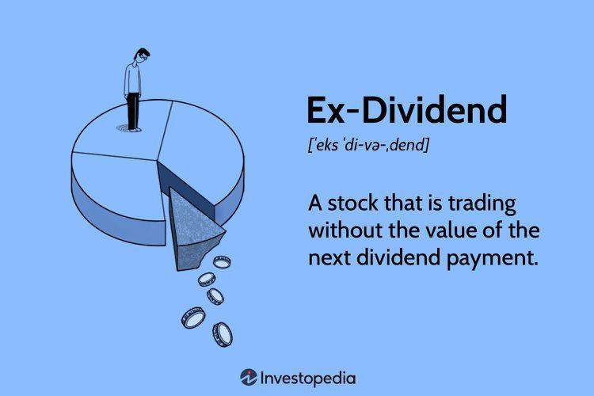

Investment strategies encompass a myriad of tactics and methods employed by individuals and institutions aiming to maximize returns and realize financial goals. These strategies require a deep understanding of market dynamics, financial instruments, and investor objectives. Among these strategies, ex-dividend dividend investing and algorithmic trading stand out for their distinct approaches and potential benefits.

Ex-dividend dividend investing is centered on the timing of stock purchases relative to dividend announcements. By strategically buying stocks before the ex-dividend date, investors can qualify for dividend payouts, which can offer steady income streams and complement capital appreciation goals. This method necessitates a comprehension of the dividend lifecycle and the agility to act on market signals, thus providing a potential avenue for enhancing returns through dividends.



On the other hand, algorithmic trading represents a modern and technology-driven approach to investing. It involves the use of computer systems programmed to execute trades based on pre-defined criteria. This can substantially reduce the latency of trading activities, increase accuracy, and allow for continuous market participation. The ability to automate trading strategies, such as those involving dividend capture, offers significant advantages in terms of speed and efficiency. However, successful algorithmic trading also requires robust programming skills and an acute awareness of market conditions.

Both ex-dividend investing and algorithmic trading can be integrated into a broader investment portfolio, potentially offering a balanced approach to income generation and capital growth. Understanding these strategies can be particularly crucial for investors looking to diversify their holdings and optimize their investment outcomes. By blending traditional dividend capture strategies with the precision of algorithmic trading, investors can strive for a more dynamic and flexible portfolio, tailored to their specific financial ambitions.

In summary, appreciating the intricacies of ex-dividend investing and algorithmic trading can empower investors to make informed decisions, maximize financial returns, and achieve long-term objectives. These strategies, while distinct, offer complementary benefits that, when skillfully executed, can enhance overall investment performance.

## Table of Contents

## Understanding Ex-Dividend Dividend Investing

Ex-dividend dividend investing is a strategy that involves purchasing stocks just before the ex-dividend date to qualify for upcoming dividend payouts. The ex-dividend date is crucial because it marks the cutoff for investors to be eligible to receive the declared dividend. If an investor buys the stock on or after this date, they will not receive the current dividend; instead, the previous stockholder will benefit from the payout.

This strategy is particularly popular among investors who employ the dividend capture strategy. The primary objective of this approach is to acquire the dividend while potentially benefiting from stock price movements following the dividend payout. Typically, when a company declares a dividend, the stock price is expected to drop by an amount approximately equal to the dividend on the ex-dividend date. This is because new buyers are not entitled to the declared dividend, reducing the stock's perceived value temporarily.

To execute this strategy effectively, investors must meticulously plan and time their trades. The goal is to strike a balance where the dividend received outweighs any potential decline in stock price on the ex-dividend date. While capturing dividends, investors must consider the stock's long-term performance, market conditions, and any transaction costs that could impact their strategy's success. Additionally, understanding the behavior of specific stocks around their ex-dividend dates, including historical price adjustments, can provide valuable insights into future price movements.

A simplified analysis of the strategy could consider the following formula for potential profit (P):

$$
P = \text{Dividend} - (\text{Price Drop} + \text{Transaction Costs})
$$

Where:
- Dividend is the income received from the stock.
- Price Drop is the decline in stock price post-ex-dividend.
- Transaction Costs include any fees or commissions related to buying and selling the stock.

Strategically, investors endeavor to maximize P, ensuring the dividend income surpasses the sum of the price drop and any additional costs.

The ex-dividend dividend investing strategy, while potentially lucrative, requires a keen understanding of stock market dynamics and individual stock behavior. Successful implementation typically hinges on thorough research and careful consideration of various factors influencing stock prices and market conditions.

## Exploring Dividend Capture Strategy

Dividend capture is a technique designed to profit from dividend payments in a relatively short period. The core of this strategy involves acquiring a stock just before its ex-dividend date—the last date on which buying the stock makes the investor eligible to receive the declared dividend. Once the stock becomes ex-dividend, the investor can choose to sell it, thereby capturing the dividend.

### Stock Price Adjustment

On the ex-dividend date, stock prices typically adjust downward by approximately the dividend amount. This adjustment reflects the payout, as dividends are taken out of the company's retained earnings impacting its stock value. Mathematically, if $P_{pre}$ is the closing price before the ex-dividend date and $D$ is the dividend, the opening price $P_{post}$ can be approximately modeled as:

$$
P_{post} = P_{pre} - D
$$

However, market dynamics, investor behavior, and rounding often mean the price does not adjust by exactly the dividend amount.

### Profit Potential

Executing a successful dividend capture may yield profits from both the received dividend and potential stock appreciation if the price stabilizes or rebounds after the ex-dividend date. Traders must assess whether the expected gains from dividends and any capital appreciation exceed the total costs of executing these trades.

### Transaction Costs and Tax Implications

While the allure of capturing dividends is compelling, several factors may impact its effectiveness:

- **Transaction Costs**: The strategy entails frequent buying and selling, incurring costs including brokerage fees and potential bid-ask spreads. Calculating the total expense and ensuring it does not surpass the dividend's value is crucial.

- **Tax Considerations**: Dividend income can be subject to taxes, and the holding period for taxing qualified dividends may affect net returns. For qualified dividend taxation, stocks generally need to be held for more than 60 days within the 121-day period surrounding the ex-dividend date.

In conclusion, while dividend capture presents a path to generate returns, it hinges on precise timing and a deep understanding of associated costs. Furthermore, investors should stay informed on regulations and market factors that might influence this strategy's viability in achieving desired outcomes.

## Algorithmic Trading: A Modern Approach

Algorithmic trading, or algo trading, involves leveraging computer systems to execute trades based on a pre-defined set of instructions or algorithms. This modern approach is transformative in the financial sector, noted for its ability to process vast amounts of data, execute trades at high speed, and operate continuously without fatigue, all of which are highly advantageous in high-frequency trading ([HFT](/wiki/high-frequency-trading-strategies)) environments.

One of the primary benefits of [algorithmic trading](/wiki/algorithmic-trading) is its speed and efficiency. Algorithms can analyze and execute trades in milliseconds, far outrunning the capabilities of human traders. This speed is particularly beneficial in volatile markets where prices change rapidly, as it allows for the immediate capitalization on market opportunities. Additionally, algo trading offers precision and accuracy by reducing human error and emotional decision-making, since trades are carried out based on established criteria and conditions.

Algorithmic trading systems can be programmed to follow various strategies. Among these is the ability to focus on dividend capture strategies, where algorithms are designed to identify and exploit opportunities for capturing dividends with minimal risk. By setting algorithms to scan for stocks approaching their ex-dividend dates and predict market movements post-dividend, traders can optimize their dividend capture processes.

Developing effective trading algorithms, however, requires a substantial understanding of both market conditions and programming. Successful algorithmic trading demands a close analysis of historical market data and implementation of sophisticated mathematical models and techniques. Traders or developers typically use programming languages such as Python, due to its robust libraries like NumPy, Pandas, and Scikit-learn, which facilitate data analysis and [machine learning](/wiki/machine-learning) applications.

Here is a basic example of how one might implement a simple moving average crossover strategy using Python:

```python
import pandas as pd
import numpy as np

# Fetch historical stock data into a Pandas DataFrame
stock_data = pd.read_csv('stock_prices.csv')

# Calculate the short and long moving average
short_window = 40
long_window = 100
stock_data['short_mavg'] = stock_data['close'].rolling(window=short_window, min_periods=1).mean()
stock_data['long_mavg'] = stock_data['close'].rolling(window=long_window, min_periods=1).mean()

# Create trading signals
stock_data['signal'] = 0.0
stock_data['signal'][short_window:] = np.where(stock_data['short_mavg'][short_window:] > stock_data['long_mavg'][short_window:], 1.0, 0.0)   

# Generate trading orders
stock_data['positions'] = stock_data['signal'].diff()

print(stock_data[['close', 'short_mavg', 'long_mavg', 'signal', 'positions']].tail())
```

In this example, a moving average crossover strategy is implemented, where a buy signal is generated when the short-term moving average crosses above the long-term moving average, and a sell signal when the reverse occurs. This is a simple form of algorithmic trading, and real-world applications are often more complex, integrating multiple indicators and more sophisticated data processing.

Despite its advantages, algorithmic trading is not without its challenges. It necessitates not only programming expertise but also a deep understanding of financial markets to code algorithms that can adapt to changing market conditions. Moreover, the reliance on technology introduces risks related to software bugs, latency issues, and the need for constant monitoring and adjustment to ensure algorithms remain aligned with market conditions and investor goals. Robust risk management frameworks and continuous testing are essential components of a successful algorithmic trading strategy.

## Integrating Ex-Dividend and Algo Trading Strategies

Combining ex-dividend investing with algorithmic trading offers a sophisticated approach to optimizing dividend capture strategies. By automating the trading process, investors can enhance efficiency and precision in executing trades around ex-dividend dates. Automation helps in mitigating human errors, such as mistimed trades or incorrect data interpretation, by relying on pre-defined trading conditions and rules.

Algorithmic strategies are well-suited for accommodating the intricacies of ex-dividend investing. For instance, algorithms can be programmed to execute trades based on specific triggers, such as the announcement of an ex-dividend date. This ensures that trades are consistently made at optimal times. The integration of algorithmic trading can be exemplified with a simple Python script that such an investor might employ:

```python
import yfinance as yf  # For more datasets, visit: https://paperswithbacktest.com/datasets
from datetime import datetime, timedelta

# Define the stock symbol and date of interest
stock_symbol = 'AAPL'
look_ahead_days = 5

# Fetch stock data
stock_data = yf.Ticker(stock_symbol)
calendar = stock_data.actions

# Determine ex-dividend date
next_ex_date = calendar.loc[(calendar['Dividends'] > 0)].index[0]

# Define trade execution logic
if next_ex_date <= datetime.now() + timedelta(days=look_ahead_days):
    # Execute buy order
    print(f"Buying {stock_symbol} before the ex-dividend date: {next_ex_date}")
```

This script uses the `yfinance` library to extract financial data and plan trades based on upcoming ex-dividend dates. Such automation empowers investors to focus on strategy refinement rather than operational details.

Machine learning and data analytics are crucial in refining algorithmic approaches. By leveraging large datasets, investors can identify patterns in stock price behavior around ex-dividend dates, improving the accuracy of their strategies. For example, regression models can be used to predict potential price adjustments post-dividend:

```python
from sklearn.linear_model import LinearRegression
import numpy as np

# Hypothetical historical data
ex_dividend_effect = np.array([0.95, 0.97, 1.00, 0.98])
price_change = np.array([0.02, 0.01, -0.01, 0.00])

# Train a simple linear regression model
model = LinearRegression().fit(ex_dividend_effect.reshape(-1, 1), price_change)
predicted_change = model.predict([[0.96]])
print(f"Predicted price change: {predicted_change}")
```

However, the effective integration of these techniques necessitates ongoing market analysis, alignment with investment goals, and regular performance monitoring. Investors must ensure that their automated systems are continuously updated to adapt to changing market dynamics, regulatory conditions, and technological advancements. This alignment maximizes efficacy and aligns execution with strategic financial objectives, capitalizing on both dividend income and any associated price fluctuations.

## Evaluating the Risks and Rewards

Ex-dividend investing and algorithmic trading have become increasingly popular strategies for investors seeking to enhance returns, but they also come with inherent risks and rewards that must be carefully evaluated. 

**Market Volatility**: Both approaches are susceptible to the inherent volatility of financial markets. For ex-dividend investing, the potential drop in stock price post-ex-dividend necessitates precise timing to ensure that the dividend received offsets any price decline. In algorithmic trading, algorithms respond rapidly to market data, which can result in unintended outcomes during volatile conditions, underscoring the importance of robust algorithm design and testing.

**Execution Risks**: In algorithmic trading, execution risk is a significant concern as it involves the possibility that trades are not executed at the desired price. This can occur due to latency, which is the delay between the market data update and the action taken by the algorithm. Investors should consider employing co-location services or advanced computational techniques to minimize latency.

**Tax Liabilities**: Both strategies can lead to tax implications. For example, the dividend capture strategy, which involves frequent buying and selling of stocks, may lead to higher capital gains taxes if profits are realized. Understanding the tax regulations in one's jurisdiction and incorporating them into the trading system is crucial for optimizing net returns.

**Diversification and Continuous Learning**: To manage these risks while capitalizing on potential rewards, diversification is a key strategy. By spreading investments across various asset classes or sectors, investors can mitigate the impact of market volatility on their portfolios. Additionally, continuous learning is vital as financial markets evolve, requiring investors to stay informed and adapt their strategies accordingly. This could involve updating algorithm parameters based on new data or adjusting ex-dividend investment tactics in response to changing dividend policies.

**Suitability Assessment**: The appropriateness of ex-dividend and algorithmic trading depends on individual goals, risk tolerance, and investment timeline. For some investors, the fast-paced environment of algorithmic trading might align well with their risk appetite and investment horizon, while others may prefer the predictability of dividend income. Conducting a thorough risk assessment and aligning investment choices with personal financial goals is essential for success.

Effective management of these elements can potentially lead to significant gains, but investors must remain vigilant about the complexities and risks involved. By combining strategic foresight with disciplined execution, these investment approaches can become valuable components of a diversified financial strategy.

## Conclusion

Ex-dividend dividend investing and algorithmic trading present unique opportunities for savvy investors seeking to enhance their investment strategies. These approaches, while distinct, require diligence, careful planning, and a comprehensive understanding of both market mechanics and personal financial goals. Engaging with these strategies involves acknowledging the dynamics of market behavior and using sophisticated tools to navigate them effectively.

Ex-dividend investing allows participants to capitalize on dividend payouts while taking into account stock price fluctuations. This strategy hinges on the investor's ability to time their transactions around the ex-dividend date to maximize returns. Similarly, algorithmic trading leverages technology to execute trades with speed and precision, making it particularly advantageous in high-frequency trading scenarios. By using pre-programmed algorithms, investors can efficiently implement a wide range of strategies, including those focused on dividend capture.

Despite their potential for significant gains, both strategies possess inherent complexities and risks. These include market [volatility](/wiki/volatility-trading-strategies), execution risks, and potential tax ramifications, all of which require investors to maintain a vigilant and informed approach. An awareness of these factors is crucial for optimizing potential rewards.

Incorporating ex-dividend investing and algorithmic trading into an investment portfolio can lead to greater diversification and potentially more rewarding outcomes. However, this integration demands a judicious assessment of individual investment goals, risk tolerance, and time horizons. A strategic approach, supported by market analysis and continuous learning, can help investors leverage the opportunities presented by these innovative strategies while managing associated risks effectively. Through such efforts, investors can better navigate the complexities of modern financial markets and work towards achieving their financial objectives.

## References & Further Reading

[1]: Clifford, M. (2011). ["Dividend Capture Strategies."](https://www.jstor.org/stable/30225721) CFA Institute Research Foundation.

[2]: Aldridge, I. (2013). ["High-Frequency Trading: A Practical Guide to Algorithmic Strategies and Trading Systems."](https://www.ahmetbeyefendi.com/wp-content/uploads/2020/07/High-Frequency-Trading-Irene-Aldridge.pdf) Wiley Finance.

[3]: Jansen, S. (2020). ["Machine Learning for Algorithmic Trading - Second Edition: Predictive models to extract signals from market and alternative data for systematic trading strategies with Python."](https://thuvienso.hoasen.edu.vn/bitstream/handle/123456789/12260/Contents.pdf?sequence=1) Packt Publishing.

[4]: Chan, E. P. (2009). ["Quantitative Trading: How to Build Your Own Algorithmic Trading Business."](https://github.com/ftvision/quant_trading_echan_book) Wiley Finance.

[5]: Lopez de Prado, M. (2018). ["Advances in Financial Machine Learning."](https://www.amazon.com/Advances-Financial-Machine-Learning-Marcos/dp/1119482089) Wiley.