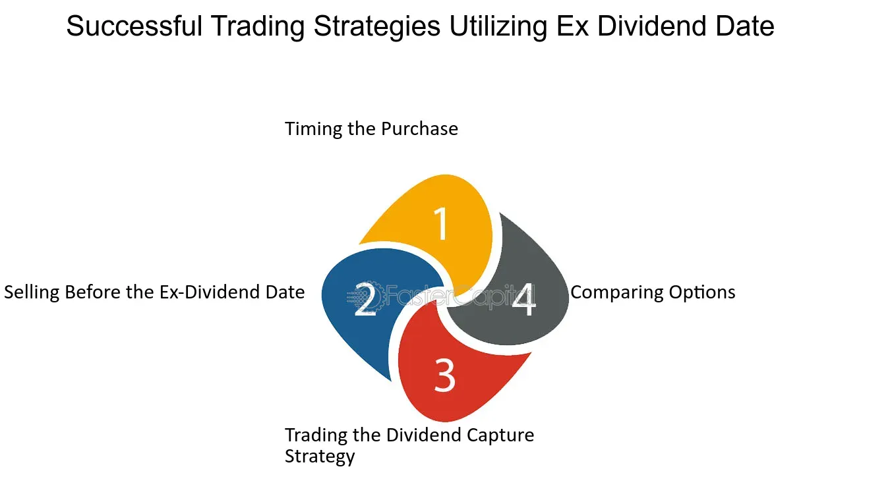

## Table of Contents

## What is an ex-dividend date?

The ex-dividend date is an important date for people who own stocks. It is the first day that a stock trades without its upcoming dividend. If you buy the stock on or after the ex-dividend date, you will not get the next dividend payment. The company sets this date to know which shareholders should receive the dividend.

The ex-dividend date is usually set one business day before the record date. The record date is when the company looks at its records to see who owns the stock. If you own the stock before the ex-dividend date, you will be on the company's list to get the dividend. This is why many investors pay close attention to the ex-dividend date when planning their investments.

## How does the ex-dividend date affect stock prices?

When a stock goes ex-dividend, its price usually drops by about the amount of the dividend on the ex-dividend date. This happens because the dividend is no longer part of the stock's value. For example, if a stock is trading at $50 and the dividend is $1, the stock price might drop to around $49 on the ex-dividend date. This drop reflects the fact that new buyers won't get the upcoming dividend.

However, the exact impact on the stock price can vary. Sometimes, the stock price might not drop as much as expected, or it might even go up if other factors like good news about the company come out around the same time. Overall, the ex-dividend date can cause a noticeable change in the stock's price, but other market conditions can also play a role in how the price moves.

## What are the basic principles of an ex-dividend strategy?

An ex-dividend strategy is when investors try to buy stocks just before the ex-dividend date and sell them shortly after. The idea is to get the dividend payment without holding the stock for a long time. This can work if the stock price doesn't drop as much as the dividend amount on the ex-dividend date. If the stock price stays the same or doesn't drop much, the investor can make a quick profit from the dividend.

However, this strategy can be risky. The stock price usually drops by about the amount of the dividend on the ex-dividend date. If the price drops more than expected, the investor might lose money. Also, buying and selling stocks often can lead to higher transaction costs, which can eat into any profits from the dividends. So, it's important for investors to think carefully about these risks before using an ex-dividend strategy.

## How can beginners start utilizing ex-dividend strategies?

Beginners can start using ex-dividend strategies by first learning about the stocks they are interested in. They should find out when the ex-dividend dates are for these stocks. This information is usually available on financial websites or the company's investor relations page. Once they know the dates, they can plan to buy the stock a few days before the ex-dividend date. This way, they will be on the company's list to get the dividend payment.

After buying the stock, beginners should keep an eye on the stock price. On the ex-dividend date, the stock price might drop by about the amount of the dividend. If the price doesn't drop much or stays the same, they might make a small profit from the dividend. But if the price drops more than expected, they could lose money. So, it's important for beginners to be ready to sell the stock soon after the ex-dividend date. They should also remember that buying and selling stocks often can lead to extra costs, which might reduce their profits.

## What are the risks associated with ex-dividend investing?

Ex-dividend investing can be risky for beginners. One big risk is that the stock price usually drops by about the amount of the dividend on the ex-dividend date. If the price drops more than the dividend, you might lose money. For example, if you buy a stock for $50 and it drops to $48 on the ex-dividend date, but the dividend is only $1, you end up losing $1 overall. This can happen if the market has other news or events that affect the stock's price.

Another risk is the cost of buying and selling stocks often. Every time you buy or sell a stock, you might have to pay fees or commissions. These costs can add up quickly and might be more than the dividend you get. So, even if the stock price stays the same or doesn't drop much, the costs of trading can eat into your profits. It's important to think about these costs before deciding to use an ex-dividend strategy.

## How can one identify stocks with upcoming ex-dividend dates?

To find stocks with upcoming ex-dividend dates, you can use financial websites like Yahoo Finance or Google Finance. These sites have calendars that show when different stocks are going ex-dividend. You can also look at the company's investor relations page on their website. They often list important dates like the ex-dividend date. Another way is to use stock screening tools that let you search for stocks based on specific criteria, like upcoming ex-dividend dates.

Once you know the ex-dividend dates, you can plan when to buy the stock. Remember, you need to buy the stock before the ex-dividend date to get the dividend. It's a good idea to buy a few days before the date to make sure you're on the company's list to get the dividend. Keep in mind that the stock price might drop on the ex-dividend date, so you should be ready to sell the stock soon after if you're using an ex-dividend strategy.

## What is the difference between ex-dividend and record date?

The ex-dividend date and the record date are two important dates for people who own stocks and want to get dividends. The ex-dividend date is the first day that a stock trades without its upcoming dividend. If you buy the stock on or after this date, you won't get the next dividend. The ex-dividend date is usually set one business day before the record date. This gives the stock market time to settle trades and make sure the right people get the dividend.

The record date is when the company looks at its records to see who owns the stock. If you own the stock on the record date, you will get the dividend. The record date is important because it's the company's official list of who gets the dividend. The ex-dividend date helps make sure that people who buy the stock just before the record date don't miss out on the dividend, while people who buy it on or after the ex-dividend date know they won't get it.

## How do tax implications affect ex-dividend strategies?

When you use an ex-dividend strategy, you need to think about taxes. Dividends are usually taxed as income. This means that the money you get from dividends might be less after you pay taxes. If you're in a high tax bracket, the tax on your dividends could be a lot. So, even if you make a small profit from the dividend, taxes might take away most of it.

Also, if you buy and sell stocks often, you might have to pay capital gains tax. This is a tax on the profit you make from selling stocks. If you hold the stock for less than a year, you might pay a higher rate on your capital gains. This can add up, especially if you're doing a lot of buying and selling. So, when you're planning an ex-dividend strategy, you should think about how taxes might affect your overall profit.

## What advanced techniques can be used to optimize returns from ex-dividend investing?

To optimize returns from ex-dividend investing, one advanced technique is to look at the stock's historical price movements around ex-dividend dates. Some stocks might not drop as much as the dividend amount on the ex-dividend date. If you can find these stocks, you might make a bigger profit. Another technique is to use options. You can buy a stock before the ex-dividend date and also buy a put option to protect against a big drop in the stock price. This way, you can still get the dividend but limit your risk if the stock price falls more than expected.

Another approach is to focus on stocks that have a history of increasing their dividends. These stocks might attract more investors around the ex-dividend date, which could help keep the stock price from dropping as much. Also, consider the overall market conditions. If the market is doing well, the stock price might not drop as much on the ex-dividend date. By combining these techniques, you can try to get the best possible returns from your ex-dividend strategy.

## How do market conditions influence the effectiveness of ex-dividend strategies?

Market conditions can really change how well an ex-dividend strategy works. If the stock market is doing well and going up, the stock price might not drop as much on the ex-dividend date. This means you could make more money from the dividend. But if the market is going down or there's bad news about the company, the stock price might drop more than the dividend amount. This could make you lose money even if you get the dividend.

Also, what's happening in the market can affect how many people want to buy the stock around the ex-dividend date. If lots of people want to buy the stock because they think it's a good investment, the price might stay high or not drop as much. But if people are selling their stocks because they're worried about the market, the price could go down a lot. So, it's important to look at the market and what's happening with the company before you decide to use an ex-dividend strategy.

## Can ex-dividend strategies be combined with other investment approaches?

Yes, ex-dividend strategies can be mixed with other ways of investing to make them better. One way is to use them with a long-term investment plan. You can buy stocks that pay good dividends and keep them for a long time. When the ex-dividend date comes, you can get the dividend and also enjoy the stock going up in value over time. This can make your money grow more than just using the ex-dividend strategy by itself.

Another way is to use ex-dividend strategies with a strategy called dollar-cost averaging. This means you put a little bit of money into the stock market at regular times, no matter what the market is doing. If you do this with stocks that have ex-dividend dates coming up, you can get dividends and also smooth out the ups and downs of the stock price. By mixing these strategies, you can make your investments stronger and more likely to make you money over time.

## What are some case studies of successful ex-dividend strategies implemented by expert investors?

One example of a successful ex-dividend strategy is from investor John Neff, who managed the Windsor Fund. Neff focused on buying stocks with high dividend yields just before their ex-dividend dates. He looked for companies that were undervalued and had a history of increasing dividends. By holding these stocks for a short period around the ex-dividend date, Neff was able to capture the dividends and often benefited from the stocks not dropping as much in price as expected. This approach helped him achieve strong returns for his fund over many years.

Another case study involves Warren Buffett, who, while not strictly using an ex-dividend strategy, has benefited from dividends in his long-term investments. Buffett often buys stocks in companies with strong fundamentals and good dividend histories. For instance, his investment in Coca-Cola has paid off not just through stock price appreciation but also through consistent dividend payments. By holding these stocks over long periods, Buffett captures the dividends and uses them to reinvest in other opportunities, showing that combining an ex-dividend approach with long-term investing can be very effective.

## What is Understanding Ex-Dividend Dividend Investing?

Ex-dividend dividend investing is a strategy that involves purchasing stocks just before the ex-dividend date to qualify for upcoming dividend payouts. The ex-dividend date is crucial because it marks the cutoff for investors to be eligible to receive the declared dividend. If an investor buys the stock on or after this date, they will not receive the current dividend; instead, the previous stockholder will benefit from the payout.

This strategy is particularly popular among investors who employ the dividend capture strategy. The primary objective of this approach is to acquire the dividend while potentially benefiting from stock price movements following the dividend payout. Typically, when a company declares a dividend, the stock price is expected to drop by an amount approximately equal to the dividend on the ex-dividend date. This is because new buyers are not entitled to the declared dividend, reducing the stock's perceived value temporarily.

To execute this strategy effectively, investors must meticulously plan and time their trades. The goal is to strike a balance where the dividend received outweighs any potential decline in stock price on the ex-dividend date. While capturing dividends, investors must consider the stock's long-term performance, market conditions, and any transaction costs that could impact their strategy's success. Additionally, understanding the behavior of specific stocks around their ex-dividend dates, including historical price adjustments, can provide valuable insights into future price movements.

A simplified analysis of the strategy could consider the following formula for potential profit (P):

$$
P = \text{Dividend} - (\text{Price Drop} + \text{Transaction Costs})
$$

Where:
- Dividend is the income received from the stock.
- Price Drop is the decline in stock price post-ex-dividend.
- Transaction Costs include any fees or commissions related to buying and selling the stock.

Strategically, investors endeavor to maximize P, ensuring the dividend income surpasses the sum of the price drop and any additional costs.

The ex-dividend dividend investing strategy, while potentially lucrative, requires a keen understanding of stock market dynamics and individual stock behavior. Successful implementation typically hinges on thorough research and careful consideration of various factors influencing stock prices and market conditions.

## What is Exploring Dividend Capture Strategy?

Dividend capture is a technique designed to profit from dividend payments in a relatively short period. The core of this strategy involves acquiring a stock just before its ex-dividend date—the last date on which buying the stock makes the investor eligible to receive the declared dividend. Once the stock becomes ex-dividend, the investor can choose to sell it, thereby capturing the dividend.

### Stock Price Adjustment

On the ex-dividend date, stock prices typically adjust downward by approximately the dividend amount. This adjustment reflects the payout, as dividends are taken out of the company's retained earnings impacting its stock value. Mathematically, if $P_{pre}$ is the closing price before the ex-dividend date and $D$ is the dividend, the opening price $P_{post}$ can be approximately modeled as:

$$
P_{post} = P_{pre} - D
$$

However, market dynamics, investor behavior, and rounding often mean the price does not adjust by exactly the dividend amount.

### Profit Potential

Executing a successful dividend capture may yield profits from both the received dividend and potential stock appreciation if the price stabilizes or rebounds after the ex-dividend date. Traders must assess whether the expected gains from dividends and any capital appreciation exceed the total costs of executing these trades.

### Transaction Costs and Tax Implications

While the allure of capturing dividends is compelling, several factors may impact its effectiveness:

- **Transaction Costs**: The strategy entails frequent buying and selling, incurring costs including brokerage fees and potential bid-ask spreads. Calculating the total expense and ensuring it does not surpass the dividend's value is crucial.

- **Tax Considerations**: Dividend income can be subject to taxes, and the holding period for taxing qualified dividends may affect net returns. For qualified dividend taxation, stocks generally need to be held for more than 60 days within the 121-day period surrounding the ex-dividend date.

In conclusion, while dividend capture presents a path to generate returns, it hinges on precise timing and a deep understanding of associated costs. Furthermore, investors should stay informed on regulations and market factors that might influence this strategy's viability in achieving desired outcomes.

## References & Further Reading

[1]: Clifford, M. (2011). ["Dividend Capture Strategies."](https://www.jstor.org/stable/30225721) CFA Institute Research Foundation.

[2]: Aldridge, I. (2013). ["High-Frequency Trading: A Practical Guide to Algorithmic Strategies and Trading Systems."](https://www.ahmetbeyefendi.com/wp-content/uploads/2020/07/High-Frequency-Trading-Irene-Aldridge.pdf) Wiley Finance.

[3]: Jansen, S. (2020). ["Machine Learning for Algorithmic Trading - Second Edition: Predictive models to extract signals from market and alternative data for systematic trading strategies with Python."](https://thuvienso.hoasen.edu.vn/bitstream/handle/123456789/12260/Contents.pdf?sequence=1) Packt Publishing.

[4]: Chan, E. P. (2009). ["Quantitative Trading: How to Build Your Own Algorithmic Trading Business."](https://github.com/ftvision/quant_trading_echan_book) Wiley Finance.

[5]: Lopez de Prado, M. (2018). ["Advances in Financial Machine Learning."](https://www.amazon.com/Advances-Financial-Machine-Learning-Marcos/dp/1119482089) Wiley.