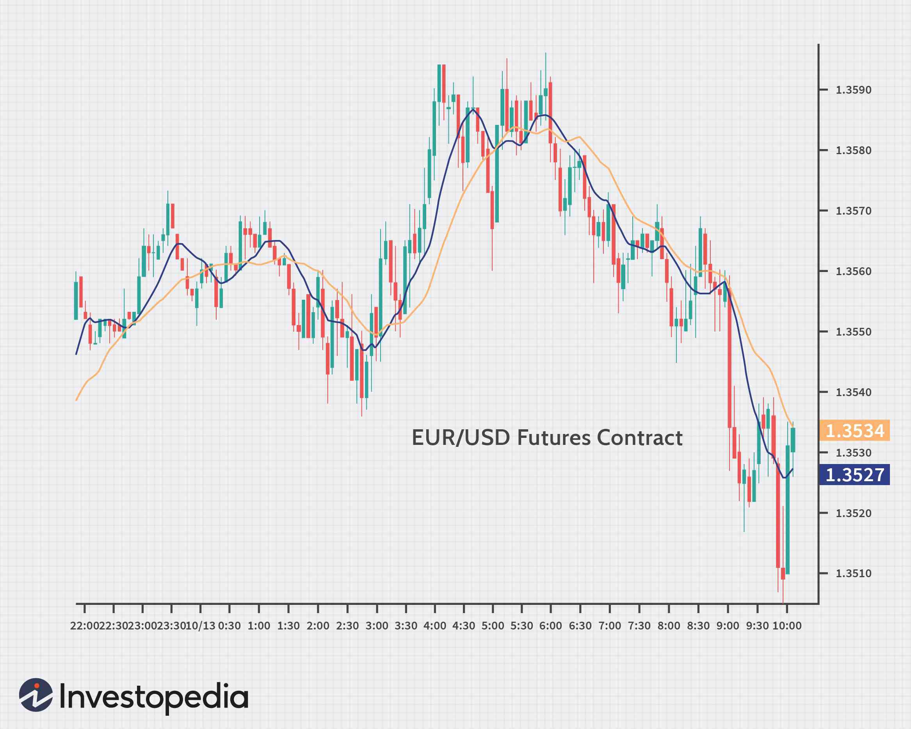

The foreign exchange (forex) market is a vibrant and complex arena where traders engage in buying and selling currencies from around the world. Among the various financial instruments available in this market, forex (FX) options stand out as flexible tools that traders use for both hedging and speculation. Unlike spot trading, where the transaction is settled immediately at current market prices, FX options provide the trader with the right, but not the obligation, to exchange a currency pair at a predetermined price, on or before a specified expiration date. This feature significantly reduces the risk for the buyer while opening up a plethora of strategic possibilities.

This article comprehensively explores the concept of FX options and the sophisticated techniques involved in trading them. FX options can be instrumental in managing financial risks and enhancing trading portfolios, making them attractive to both novice and seasoned traders. The ability to hedge against undesirable currency movements, while also taking advantage of market fluctuations, means FX options play a crucial role in effective forex trading strategies.



In addition to traditional approaches, the integration of algorithmic trading (algo trading) into forex options presents a cutting-edge advancement in trading strategies. Algo trading involves the use of automated algorithms to execute trades based on predefined criteria, allowing for swift decision-making and the analysis of large data sets. This combination of technology and finance helps reduce potential human error, optimize trading strategies, and ensure efficient market operation.

Understanding how to effectively employ FX options, alongside incorporating algorithmic trading, can significantly enhance trading performance and portfolio diversification. Such knowledge is invaluable as it empowers traders to adapt to and capitalize on dynamic market conditions. By exploring FX options and the potential of algorithmic trading, traders can navigate the complexities of the forex market more effectively, ultimately aiming for improved returns and strategic advantages.

## Table of Contents

## Understanding FX Options

FX options, or foreign exchange options, are sophisticated financial derivatives giving traders the right, though not the obligation, to engage in buying or selling a specific currency pair at a predetermined price on or before the expiration date. This financial instrument contrasts with spot forex trading, which necessitates immediate settlement and entails higher immediate risk exposure.

Unlike spot trading, FX options afford traders with limited risk. The maximum loss for an options buyer is restricted to the premium paid to procure the option, thus offering a controlled risk profile. This feature makes FX options appealing for strategies that require both flexibility and risk mitigation.

[FX](/wiki/fx-anomaly) options can be employed for a multitude of objectives. One prevalent use is speculative, allowing traders to capitalize on projected currency movements based on economic indicators or geopolitical events. For instance, if a trader anticipates that the Euro will strengthen against the US Dollar due to an economic announcement, such as a rise in the Eurozone's interest rates, they might purchase a call option on the EUR/USD pair.

Another vital application of FX options is hedging. Traders and corporations alike utilize these derivatives to guard against unfavorable shifts in exchange rates, which can affect international investments and cash flows. By securing an option to buy or sell currencies at a set rate, entities can protect themselves from adverse currency fluctuations, ensuring financial stability.

There are two primary types of FX options: call options and put options. A call option gives its holder the right to purchase a currency pair at a specified strike price, while a put option allows the sale of the currency pair at that price. Each type of option can be employed strategically based on market conditions and the trader's outlook. For example, traders may adopt a bullish stance by purchasing call options when expecting currency appreciation, or a bearish stance with put options if anticipating depreciation.

Navigating the currency markets with options can involve various strategic approaches. Sophisticated traders may combine multiple options in different configurations to exploit market [volatility](/wiki/volatility-trading-strategies), benefit from non-directional trading, or mitigate exposure. Such strategic deployments underscore the versatility of FX options in accommodating diverse trading objectives and enhancing portfolio outcomes.

## Basic FX Options Strategies

FX options strategies provide traders with various methods to capitalize on market movements while managing risks. One of the most direct strategies involves the use of plain vanilla options, which includes purchasing either a call or a put option based on the trader's market outlook. A call option gives the holder the right to buy a currency pair at a specified price, while a put option gives the right to sell. These options are straightforward and serve as the foundation for more complex strategies.

A popular strategy among traders is the debit spread trade. This approach involves simultaneously buying an option and selling another option of the same class and expiration but different strike prices. The primary goal is to limit potential losses while maintaining a position in the market. The net cost of this strategy is often referred to as the debit. For instance, a call debit spread might involve buying a call option at a lower strike price while selling a call option at a higher strike price.

Conversely, the credit spread trade aims to generate income through premiums. This strategy involves selling an option and buying another option of the same class and expiration but different strike prices, similar to the debit spread. However, in a credit spread, the premium received from selling the option exceeds the premium paid for buying the option, resulting in a net gain, or credit. A trader implementing a put credit spread might sell a put option at a higher strike price while purchasing a put option at a lower strike price.

Another strategy is the straddle, which involves buying both a call and a put option at the same strike price and expiration. Straddles are beneficial for traders anticipating high volatility in the market but uncertain about the direction of the movement. The cost of establishing the position involves combined premiums for both options, and profitability relies on the market moving significantly away from the strike price in either direction.

In summary, FX options strategies offer traders various tools to express their market views while managing risk exposure. These strategies require careful planning and an understanding of market conditions to optimize potential outcomes.

## Benefits and Risks

FX options are powerful tools that can offer significant advantages to traders in the [forex](/wiki/forex-system) market by providing hedging capabilities and the potential for customizing trading strategies. Hedging with FX options is a common practice, allowing traders to guard against unfavorable currency movements. For instance, if a trader holds a position in a foreign currency that they anticipate might depreciate, purchasing a put option can mitigate possible losses by offering the right to sell the currency at a predetermined strike price.

The flexibility of FX options enables traders to tailor their strategies based on specific market insights and personal risk preferences. Customization might involve structuring trades that align with directional market forecasts or implementing strategies designed to capitalize on anticipated volatility.

However, there are inherent risks associated with trading FX options. One primary risk is the cost of premiums. Unlike spot trading, where a position is taken directly in the currency market, options require the payment of premiums, which can erode profitability if market movements do not justify the initial expenditure. Additionally, the complexity of accurately forecasting market conditions poses a significant challenge, which can impact the success of an options strategy.

Understanding the balance of these risks and rewards is vital. Traders must critically assess their market perspectives and risk tolerances to effectively incorporate FX options into their trading plans. This involves not only analyzing current market conditions but also considering factors such as implied volatility and the Greeks (Delta, Gamma, Theta, Vega) which provide insights into how option prices are likely to change as market conditions evolve. Proficient use of these financial instruments can enhance a trader's ability to manage risk and potentially achieve greater returns.

## FX Options and Algo Trading

Algorithmic trading, often referred to as algo trading, leverages automated systems to perform trading activities based on pre-defined criteria and algorithms. This approach has become increasingly popular in the FX options market due to its capacity to execute trades more swiftly and efficiently than manual methods.

One of the principal advantages of incorporating algo trading into FX options is the enhancement of trade execution speed. Automated systems can process and act on real-time market data much faster than human traders, who may be slowed by cognitive limits and the need for manual operation. This rapid execution allows traders to capitalize on fleeting market opportunities and mitigate the effects of market slippage.

Another benefit of algo trading is its ability to handle and analyze substantial volumes of data, which is essential given the complexity and volatility of the forex market. Traders can employ sophisticated algorithms to distill meaningful patterns and insights from vast datasets, facilitating informed decision-making and strategy formulation. For instance, using [machine learning](/wiki/machine-learning) algorithms, traders can develop predictive models that improve the accuracy of future price movements, bolstering strategic outcomes.

Additionally, algo trading reduces human error, a common issue in manual trading due to emotions, oversight, or fatigue. By removing these human elements, automated systems ensure consistency and precision in executing trading strategies. This consistency is pivotal for maintaining effective risk management and optimizing the returns of trading portfolios.

Algo trading also plays a crucial role in enhancing market [liquidity](/wiki/liquidity-risk-premium). Automated systems engage in high-frequency trading, executing numerous transactions at high speeds, which contributes to increased trading volumes and tighter bid-ask spreads. This enhanced liquidity benefits all market participants by promoting a more active and vibrant trading environment.

Furthermore, traders can use automated systems for back-testing strategies, an essential process that involves applying trading strategies to historical data to assess their potential performance. This capability allows traders to refine their methods and adapt to evolving market conditions, ensuring strategies remain robust and competitive.

In Python, traders might leverage libraries such as NumPy for data manipulation, pandas for data analysis, and scikit-learn for implementing machine learning models. Here's an example to illustrate how a simple moving average (SMA) strategy might be coded:

```python
import pandas as pd
import numpy as np

# Example function to calculate SMA
def calculate_sma(data, window):
    return data.rolling(window=window).mean()

# Sample data
data = pd.Series([1.1, 1.2, 1.15, 1.16, 1.18, 1.22, 1.25])

# Calculate 3-day SMA
sma = calculate_sma(data, window=3)
print(sma)
```

This simple strategy calculates the moving average over a specified window, allowing traders to identify potential entry and [exit](/wiki/exit-strategy) points based on changes in the trend indicated by the moving averages.

In conclusion, algo trading in FX options is a transformative approach that empowers traders with speed, precision, and the ability to manage vast data efficiently. By integrating this technology, traders can optimize their trading strategies, enhance market participation, and achieve higher levels of performance in a dynamic trading landscape.

## Choosing the Right Forex Broker

Selecting a reliable forex broker is fundamental for effectively managing FX options and ensuring a seamless trading journey. An adept broker bridges the gap between traders and the intricate forex market by providing essential tools and support, making it crucial to choose wisely. 

**Regulatory Compliance:** The foremost consideration when choosing a broker is regulatory compliance. Brokers that adhere to strict regulations ensure a certain standard of transparency and security. Regulatory bodies such as the Financial Conduct Authority (FCA) in the UK, the Commodity Futures Trading Commission (CFTC) in the US, and the Cyprus Securities and Exchange Commission (CySEC) in the EU provide oversight and protect traders from fraudulent practices. Traders should prioritize brokers registered with such authorities to safeguard their investments.

**Trading Platform Features:** The quality of a broker's trading platform significantly impacts trading efficiency and experience. A robust platform should offer real-time data, technical analysis tools, customizable charting options, and seamless order execution. Algorithmic traders, in particular, may need platforms that support automated trading strategies, which require advanced API integration and back-testing capabilities. Compatibility with third-party tools like MetaTrader 4 (MT4) or MetaTrader 5 (MT5) is also beneficial for traders seeking enhanced analytical tools.

**Fee Structures:** Transparent and competitive fee structures are another critical aspect. Brokers may charge various fees, including spreads, commissions, and overnight financing fees (swap rates). A detailed examination of these costs is necessary, as they can significantly affect overall profitability. Some brokers offer fixed spreads, which provide certainty over transaction costs, while others offer variable spreads that may be lower but can widen during periods of high volatility.

**Customer Support:** Reliable customer support is indispensable, particularly for traders operating in global markets across different time zones. Brokers should offer 24/7 support with multiple channels of communication, including phone, live chat, and email. Responsive customer service can resolve technical issues swiftly, ensuring minimal disruption to trading activities.

**Comparison of Leading Forex Brokers:** Comparing leading forex brokers based on the aforementioned criteria can help traders find a suitable partner for executing sophisticated trading strategies. Reputable brokers often provide educational resources, market insights, and trading tools, enhancing the trader's analytical capabilities and decision-making processes.

**Alignment with Trading Goals:** Finally, it is crucial for traders to align broker offerings with their individual trading goals and technical requirements. Traders should evaluate their trading style, whether it be day trading, swing trading, or position trading, and ensure the broker's services complement their strategy. For instance, traders focusing on algorithmic strategies might prioritize brokers with superior technological infrastructure and execution speed.

In summary, while the forex market presents numerous opportunities, the choice of broker can significantly influence trading outcomes. By considering regulatory adherence, platform capabilities, fee structures, customer support, and alignment with personal trading objectives, traders can optimize their trading framework and enhance their chances of success in the competitive forex landscape.

## Conclusion

FX options provide traders with numerous opportunities to diversify their trading strategies and manage financial risks within the forex market. By granting the right, but not the obligation, to execute currency transactions at a specified rate before expiration, FX options offer strategic flexibility. When these instruments are combined with [algorithmic trading](/wiki/algorithmic-trading), traders can achieve enhanced execution efficiency and gain a competitive advantage. Algorithmic trading optimizes trade execution by utilizing pre-set rules, reducing human error, and quickly processing large volumes of market data.

Staying informed about evolving market trends is crucial for traders aiming to leverage FX options effectively. Continuous strategy refinement and the selection of reliable trading partners are vital components of successful trading. Knowledge of intricate market dynamics, along with the adept application of both FX options and algorithmic trading, presents the potential for substantial returns and strategic benefits. In this dynamic trading environment, well-informed decisions and sophisticated tools are key to achieving strategic success with FX options.

## References & Further Reading

[1]: ["Options, Futures, and Other Derivatives"](https://www.amazon.com/Options-Futures-Other-Derivatives-10th/dp/013447208X) by John C. Hull

[2]: Black, F., & Scholes, M. (1973). ["The Pricing of Options and Corporate Liabilities."](https://www.cs.princeton.edu/courses/archive/fall09/cos323/papers/black_scholes73.pdf) Journal of Political Economy, 81(3), 637-654.

[3]: ["Algorithmic Trading: Winning Strategies and Their Rationale"](https://www.amazon.com/Algorithmic-Trading-Winning-Strategies-Rationale-ebook/dp/B00CY5HC0U) by Ernest P. Chan

[4]: Wiecek, P. P., & Wuermli, M. (2023). ["The Impact of Algorithmic Trading on Currency Markets."](https://www.researchgate.net/publication/378548435_Algorithmic_Trading_and_AI_A_Review_of_Strategies_and_Market_Impact) Financial Markets & Instruments.

[5]: ["FX Options and Smile Risk"](https://onlinelibrary.wiley.com/doi/book/10.1002/9781119207085) by Antonio Castagna