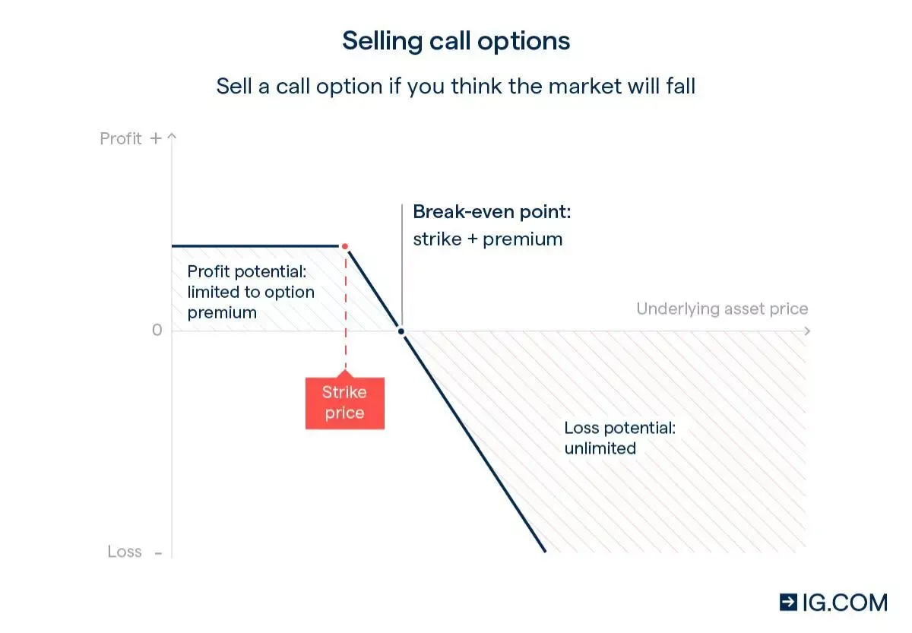

## Table of Contents

## What are forex options and how do they work in currency trading?

Forex options are financial instruments that give traders the right, but not the obligation, to buy or sell a specific currency pair at a set price before a certain date. They are used in currency trading to hedge against potential losses or to speculate on currency movements. When you buy a forex option, you pay a premium for the right to trade at the agreed-upon price, known as the strike price. If the market moves in your favor, you can exercise the option and make a profit. If the market moves against you, you can let the option expire worthless, and your loss is limited to the premium you paid.

In currency trading, forex options work by allowing traders to manage risk and take advantage of market opportunities. For example, if a trader expects the value of the euro to rise against the dollar, they might buy a call option on the EUR/USD pair. If the euro does indeed rise above the strike price before the option expires, the trader can exercise the option to buy euros at the lower strike price and then sell them at the higher market price, making a profit. Conversely, if the euro falls, the trader can simply let the option expire and only lose the premium paid. This flexibility makes forex options a popular tool for both hedging and speculation in the currency markets.

## What are the basic types of forex options available to traders?

There are two main types of forex options that traders can use: call options and put options. A call option gives the buyer the right to buy a currency pair at a set price before the option expires. Traders use call options when they think the value of the first currency in the pair will go up compared to the second currency. For example, if you think the euro will get stronger against the dollar, you might buy a call option on the EUR/USD pair.

A put option, on the other hand, gives the buyer the right to sell a currency pair at a set price before the option expires. Traders use put options when they believe the value of the first currency in the pair will go down compared to the second currency. For instance, if you think the euro will weaken against the dollar, you might buy a put option on the EUR/USD pair. Both call and put options help traders manage risk and take advantage of market movements.

## How can beginners start trading forex options?

To start trading forex options as a beginner, the first step is to learn the basics. Forex options are like a contract that gives you the right to buy or sell a currency pair at a specific price before a certain date. There are two types: call options, which you buy if you think a currency will go up in value, and put options, which you buy if you think it will go down. It's important to understand how these work and the terms like 'strike price' and 'expiration date'. You can find plenty of free resources online, like tutorials and webinars, to help you get started.

Once you feel ready, the next step is to choose a reliable broker that offers forex options trading. Look for a broker that is regulated by a reputable financial authority, has good customer support, and offers a user-friendly trading platform. Many brokers also provide demo accounts where you can practice trading without risking real money. Start with a demo account to get comfortable with the platform and test your strategies. When you're confident, you can open a real account and start trading with small amounts of money to minimize risk as you gain experience.

## What are the key differences between forex options and forex spot trading?

Forex options and forex spot trading are two different ways to trade currencies. With forex spot trading, you buy or sell a currency pair at the current market price and the transaction is settled right away, usually within two business days. It's simple and direct: you think the price will go up, you buy; you think it will go down, you sell. The risk and reward are clear because you know exactly what you're buying or selling at the moment.

Forex options, on the other hand, give you the right, but not the obligation, to buy or sell a currency pair at a set price before a certain date. This means you pay a fee, called a premium, for the chance to trade at that price later. If the market moves in your favor, you can use the option to make a profit. If it doesn't, you can just let the option expire and your loss is limited to the premium you paid. This makes options a bit more complex but also gives you more flexibility and ways to manage risk compared to spot trading.

## What are the advantages of using forex options in currency trading?

Using forex options in currency trading has several advantages. One big advantage is that they let you manage risk better. When you buy a forex option, you pay a small fee called a premium. This fee is the most you can lose, even if the market moves against you. This means you can try to make money from currency movements without risking a lot. It's like having insurance for your trades. If things go wrong, you don't lose more than the premium, but if things go right, you can make a profit.

Another advantage is that forex options give you more flexibility. You can choose when to use the option or let it expire, depending on how the market is moving. This means you can plan your trades better and take advantage of different market conditions. For example, if you think a currency will go up in value, you can buy a call option. If you're wrong, you can just let the option expire and try again later. This flexibility can help you make smarter trading decisions and possibly increase your chances of making money.

## What are the risks associated with trading forex options?

Trading forex options can be risky. One big risk is that you might lose the money you paid for the option, called the premium. If the market doesn't move the way you thought it would, the option can expire worthless, and you won't get that money back. This can happen even if you only lose a little bit on each trade, because those small losses can add up over time.

Another risk is that forex options can be complicated. They have a lot of terms and rules that you need to understand, like strike price and expiration date. If you don't fully understand how they work, you might make bad decisions and lose money. Also, the value of options can change quickly because of things like interest rates and big news events, which can make trading them even riskier if you're not prepared.

## How can forex options be used for hedging in currency trading?

Forex options can be a great tool for hedging in currency trading. Hedging means protecting yourself from losing money if the currency market moves against you. With forex options, you can buy a put option if you think the currency you own might go down in value. This gives you the right to sell that currency at a set price, even if the market price drops lower. So, if the currency does fall, you can use the option to sell at the higher price and avoid a big loss.

For example, imagine you have euros and you're worried they might lose value against the dollar. You could buy a put option on the EUR/USD pair. If the euro does drop, you can use the option to sell your euros at the strike price, which is better than the lower market price. This way, you limit your losses. If the euro stays strong or goes up, you just let the option expire and only lose the small premium you paid for it. This makes forex options a flexible way to hedge against currency risks.

## What strategies can be employed to maximize profits using forex options?

One strategy to maximize profits using forex options is to use them for speculation. If you think a currency will go up in value, you can buy a call option. This gives you the right to buy that currency at a set price later. If the currency does go up, you can use the option to buy it cheap and then sell it at the higher market price, making a profit. The key is to pick the right time to buy the option and the right strike price. You need to study the market and look for trends or news that might make the currency move in your favor.

Another strategy is to use forex options for hedging. This means you use options to protect your other investments from losing money. For example, if you have a lot of euros and you're worried they might lose value against the dollar, you can buy a put option on the EUR/USD pair. This gives you the right to sell your euros at a set price, even if the market price drops. If the euro does fall, you can use the option to sell at the higher price and avoid a big loss. This way, you can limit your losses and still make money if the market moves in your favor.

## How do market conditions affect the pricing of forex options?

Market conditions play a big role in how much forex options cost. One important thing that affects the price is how much the currency pair moves around, called volatility. If the currency pair is moving a lot, the option will be more expensive because there's a bigger chance it will be worth something when it expires. Another thing that matters is the time until the option expires. The longer you have until the option expires, the more it will cost because there's more time for the market to move in your favor.

Interest rates also affect the price of forex options. If the interest rate for one currency in the pair goes up, it can make the option more expensive. This is because higher interest rates can make the currency more valuable, which changes how much people are willing to pay for the option. Big news events, like elections or economic reports, can also make the price of options go up or down quickly because they can cause sudden changes in the market. So, when you're thinking about buying a forex option, you need to keep an eye on all these things to understand why the price is what it is.

## What are advanced techniques for managing forex options portfolios?

One advanced technique for managing forex options portfolios is called delta hedging. This means you try to balance your options so that changes in the currency's price don't affect your overall position too much. You do this by buying or selling the currency itself to offset the risk of the options. For example, if you have a lot of call options and the currency goes up, you might sell some of the currency to make sure you don't lose money if it goes back down. This can be tricky because you need to keep adjusting your position as the market moves, but it can help you manage risk better.

Another technique is using options spreads. This means you buy and sell different options at the same time to create a strategy that can make money in different market conditions. For example, you might buy a call option and sell another call option with a higher strike price. This is called a bull call spread, and it can help you make money if the currency goes up a little bit, but not too much. Using spreads can help you limit your risk and control how much you might lose, but it also means your potential profits are smaller. It's all about finding the right balance for your goals and how much risk you're willing to take.

## How can traders use forex options to speculate on currency movements?

Traders can use forex options to speculate on currency movements by buying call options if they think a currency will go up in value. A call option gives them the right to buy that currency at a set price later. If the currency does go up, they can use the option to buy it at the lower price and then sell it at the higher market price, making a profit. The key is to pick the right time to buy the option and the right strike price. Traders need to study the market and look for trends or news that might make the currency move in their favor.

On the other hand, if traders think a currency will go down in value, they can buy a put option. A put option gives them the right to sell that currency at a set price later. If the currency does fall, they can use the option to sell it at the higher set price, even if the market price is lower, and make a profit. This way, they can take advantage of falling currency values. Both call and put options let traders make money from their predictions about currency movements, but they also need to be careful because they can lose the money they paid for the option if the market doesn't move as expected.

## What are the regulatory considerations for trading forex options internationally?

Trading forex options internationally means you need to know about the rules in different countries. Each country has its own rules about who can trade forex options and how they can do it. For example, in the United States, the Commodity Futures Trading Commission (CFTC) and the National Futures Association (NFA) make the rules. They say you need to be careful and only trade with brokers who are allowed to work in the U.S. In Europe, the rules come from the European Securities and Markets Authority (ESMA), and they might be different from the U.S. rules. So, if you want to trade in different countries, you need to learn about their rules and make sure you follow them.

Another thing to think about is that some countries might not let you trade forex options at all, or they might have very strict rules. For example, some countries might say you need to have a lot of money before you can start trading. It's important to check the rules in each country where you want to trade. Also, be careful about using brokers from other countries because they might not follow the rules in your country. Always make sure the broker is allowed to work where you live and that they are honest and safe to use.

## References & Further Reading

[1]: ["Options, Futures, and Other Derivatives"](https://www.amazon.com/Options-Futures-Other-Derivatives-10th/dp/013447208X) by John C. Hull

[2]: Black, F., & Scholes, M. (1973). ["The Pricing of Options and Corporate Liabilities."](https://www.cs.princeton.edu/courses/archive/fall09/cos323/papers/black_scholes73.pdf) Journal of Political Economy, 81(3), 637-654.

[3]: ["Algorithmic Trading: Winning Strategies and Their Rationale"](https://www.amazon.com/Algorithmic-Trading-Winning-Strategies-Rationale-ebook/dp/B00CY5HC0U) by Ernest P. Chan

[4]: Wiecek, P. P., & Wuermli, M. (2023). ["The Impact of Algorithmic Trading on Currency Markets."](https://www.researchgate.net/publication/378548435_Algorithmic_Trading_and_AI_A_Review_of_Strategies_and_Market_Impact) Financial Markets & Instruments.

[5]: ["FX Options and Smile Risk"](https://onlinelibrary.wiley.com/doi/book/10.1002/9781119207085) by Antonio Castagna