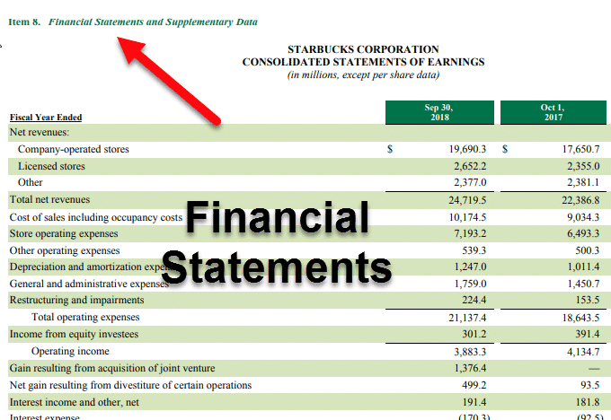

The financial markets are becoming increasingly sophisticated, with a pronounced shift towards data-driven decision-making processes. Algorithmic trading has emerged at the forefront of this evolution, capturing the interest and investment of numerous market participants. This automated trading methodology employs complex algorithms to analyze vast datasets, execute trades, and optimize portfolios with unprecedented speed and accuracy. This paradigm shift has enabled investors to gain a competitive advantage by leveraging cutting-edge technologies and advanced data analysis techniques.

A significant source of data for these algorithmic trading models is the SEC Form 10-K filings. These annual reports, submitted by publicly traded companies, offer a detailed account of a company's financial health, operational strategies, and potential risks. By dissecting the comprehensive information contained in Form 10-K, investors can derive insights that refine their trading strategies and enhance their understanding of stock performance. The ability to utilize this wealth of information systematically allows for more informed decision-making, thus providing an edge in the dynamic and competitive world of financial markets.



Modern investors must grasp how Form 10-K filings can be leveraged for evaluating stocks and refining trading models. Developing this understanding not only aids in identifying value but also in recognizing risks that might impact future performance. By integrating Form 10-K data with algorithmic trading strategies, investors can enhance their stock evaluation processes and align their investment approaches with the evolving landscape of financial trading.

This article examines the intersection of Form 10-K data and algorithmic trading, shedding light on how this powerful combination is revolutionizing stock valuation and trading strategies. It is vital for investors to stay informed and adaptive, ensuring they can effectively navigate the complexities of today's financial markets.

## Table of Contents

## Understanding Form 10-K

Form 10-K is a critical document required by the U.S. Securities and Exchange Commission (SEC) for publicly traded companies. It serves as an annual report, offering shareholders and potential investors a comprehensive overview of the company's financial performance and operations. This document is distinct from the annual report sent to shareholders, providing a more thorough analysis with additional details required by the SEC.

Key components of the Form 10-K include:

1. **Business Overview**: This section provides insight into the company's operations, including its principal products or services, which markets it operates in, and any subsidiaries. Investors often scrutinize this area to understand the company's market positioning and strategic direction.

2. **Financial Statements**: Form 10-K includes audited financial statements such as the balance sheet, income statement, and statement of cash flows. These documents are essential for evaluating a company's financial health and operational efficiency. Analysts use them to calculate financial ratios, such as the current ratio, return on equity (ROE), and debt-to-equity ratio, to assess performance and compare it with industry standards.

3. **Risk Factors**: This section outlines the potential challenges and uncertainties that could affect the company's business and financial results. Understanding these risks helps investors assess the stability and potential volatility of their investments.

4. **Management's Discussion and Analysis (MD&A)**: Here, the company's management discusses its financial condition and operational results. They may also provide insights into future plans, market trends, and how these factors might impact the company. Investors value this analysis for its forward-looking perspective, despite the overall backward-looking nature of Form 10-K.

Despite Form 10-K being a historical document reflecting past performance, it remains a cornerstone for strategic investment planning. Investors leverage the information contained in Form 10-K to conduct [fundamental analysis](/wiki/fundamental-analysis), supplying a factual basis for evaluating a company's worth and forming the groundwork for prospective investment opportunities. The backward-looking nature provides a stable reference point, allowing investors to extrapolate trends and incorporate these insights into forward-looking strategies.

## Components of Form 10-K for Investment Strategies

Form 10-K filings offer comprehensive information that is crucial for investors to form effective investment strategies. These reports consist of several key components that provide valuable insights into a company's operations, financial health, risks, and governance. Understanding these components can aid investors in making informed decisions.

The Business Overview section offers a detailed description of a company's core activities, market positioning, and strategic objectives. This section helps investors comprehend the company's business model and its relevance in the current market landscape. It outlines the principal products or services, markets served, and any competitive advantages that may contribute to the company's growth potential.

Financial Information is a critical part of the 10-K, consisting of balance sheets, income statements, and cash flow statements. These financial statements present a quantitative picture of the company's financial health and performance over the past year. Investors can analyze metrics such as revenue growth, profit margins, return on assets, and equity to assess the company's profitability, efficiency, and [liquidity](/wiki/liquidity-risk-premium). For instance, the balance sheet provides insights into the company's assets and liabilities, while the income statement reveals revenue and expenses, leading to the net income or loss. The cash flow statement further breaks down cash generated from operating, investing, and financing activities, offering a complete view of the company's cash management.

Risk Factors are explicitly detailed within the 10-K to inform investors of the potential challenges that could impact the company’s business outcomes and investment viability. This section lists both internal risks, such as operational inefficiencies, and external risks, like changes in regulatory environments or market conditions. Understanding these risks allows investors to gauge the company's [volatility](/wiki/volatility-trading-strategies) and develop strategies to mitigate potential downsides.

Management and Governance provide insights into the effectiveness of a company's leadership and their approach to strategic decision-making. This section often discusses the management team's qualifications, experience, and track record, offering a glimpse into the company's governance quality. Effective leadership is critical for navigating market challenges and achieving long-term success, making this component essential for investors assessing the potential sustainability of their investments.

In summary, the various sections of Form 10-K equip investors with the necessary information to evaluate a company's operational efficiency, financial health, risk exposure, and leadership quality. By thoroughly analyzing these components, investors can formulate more accurate and strategic investment decisions.

## Algorithmic Trading: A Revolutionary Approach

Algorithmic trading, often referred to as algo-trading, represents a significant shift in how financial markets operate by automating decision-making through advanced algorithms. These algorithms are built on quantitative data models, allowing for the rapid processing of extensive datasets to pinpoint trading opportunities and execute trades with precision and efficiency. This capability is especially valuable in today's fast-paced financial environment, where the timely execution of trades can make a substantial difference.

An essential component of [algorithmic trading](/wiki/algorithmic-trading) is the integration of financial data from SEC Form 10-K filings. These filings, which provide a comprehensive overview of a company's financial performance, supply valuable information that can be incorporated into algorithmic models. By using real-time data extraction and processing techniques, traders can seamlessly incorporate insights from Form 10-K disclosures into their trading strategies, enabling them to react swiftly to new information and make informed trading decisions promptly.

One of the primary advantages of algorithmic trading is its objective nature. By eliminating the emotional biases that often influence human decision-making, algorithmic trading ensures that investment decisions are solely based on data and statistical models. This data-driven approach enhances the consistency and reliability of trading strategies. For example, consider an algorithm designed to execute trades based on specific financial ratios or performance benchmarks extracted from Form 10-K data. The algorithm can assess these parameters with objectivity and act accordingly, removing human discretion from the equation.

Furthermore, algorithmic trading facilitates the use of complex mathematical models and statistical techniques to analyze market trends and predict future movements. Techniques such as quantitative analysis, predictive modeling, and even [machine learning](/wiki/machine-learning) enhance the algorithm's ability to process historical and real-time data, generate trading signals, and execute trades independently. This level of sophistication empowers traders to manage large volumes of data and execute a [high frequency](/wiki/high-frequency-trading) of trades more efficiently than traditional manual methods.

In summary, algorithmic trading, with its reliance on quantitative data models, transforms the approach to financial markets by automating decision-making processes, integrating vital company data like that found in Form 10-K filings, and relying on objective analysis to guide investment decisions. By doing so, it forges a path towards more efficient and effective trading strategies, highlighting the transformative potential of data-driven financial innovations.

## Leveraging Form 10-K for Algorithmic Trading

Traders utilize Form 10-K data to detect patterns and signals indicative of underlying stock movements. The extensive information contained within these filings enables the development and refinement of advanced [quantitative trading](/wiki/quantitative-trading) models. By integrating various components of Form 10-K, algorithmic strategies can adjust positions based on thorough analysis.

Advanced models can process text-based components of Form 10-K, particularly focusing on sections like Management's Discussion and Analysis (MD&A). Natural language processing (NLP) techniques are employed to extract meaningful insights from these text-rich parts of the document. Sentiment analysis, a subset of NLP, is particularly influential as it evaluates the tone and sentiment of management's outlook and strategic plans. Positive or negative sentiments detected in the filing can be quantitatively measured and used to adjust trading strategies accordingly.

Moreover, algorithms can analyze financial ratios and other quantitative insights extracted from Form 10-K filings to inform trading decisions. These ratios, such as profit margins or return on equity, provide a numerical basis for evaluating a company's financial condition and can be incorporated into algorithmic models to predict stock movements. For example, if a company's debt-equity ratio is decreasing, an algorithm might interpret this as a sign of improving financial stability and adjust the trading position accordingly.

Implementing these strategies requires sophisticated data handling techniques. Python libraries such as NLP libraries and data processing packages like Pandas can be used to structure and analyze the content of Form 10-K filings efficiently. A sample Python script for sentiment analysis might look as follows:

```python
from textblob import TextBlob
import requests

# Function to perform sentiment analysis
def analyze_sentiment(text):
    blob = TextBlob(text)
    return blob.sentiment.polarity

# Example section of Management's Discussion
md_text = "The company is optimistic about its strategic initiatives for 2023..."

# Analyzing sentiment
sentiment_score = analyze_sentiment(md_text)
print(f"Sentiment Score: {sentiment_score}")
```

This script demonstrates how the sentiment of management discussions can be quantified, which can then be used as input for algorithmic trading models. By integrating these advanced analytics, traders can more effectively leverage Form 10-K data to make informed investment decisions and optimize their trading strategies.

## Technological Tools and Models for Integration

To effectively integrate Form 10-K data into algorithmic trading models, the use of technological tools and models is indispensable. Traders typically employ Python libraries such as BeautifulSoup and Pandas to scrape and structure data from the SEC databases. BeautifulSoup is instrumental in parsing HTML and XML documents, enabling the retrieval of structured data from the raw content of SEC filings. Here is a basic example of how BeautifulSoup can be used to extract data from an HTML file:

```python
from bs4 import BeautifulSoup

# Load HTML content into BeautifulSoup
with open('example.html', 'r') as file:
    soup = BeautifulSoup(file, 'html.parser')

# Extract specific data
company_name = soup.find('span', class_='companyName').text
print(company_name)
```

Pandas is another essential library that assists in the manipulation and analysis of data once it is extracted. It provides data structures like DataFrames which offer flexible tools to clean, transform, and analyze financial disclosures efficiently. For instance, Pandas can be used to analyze financial statements by calculating key ratios or assessing trends across different financial periods.

Beyond data extraction, machine learning models significantly enhance predictive capabilities by identifying trends and anomalies in financial disclosures. These models can be trained on historical Form 10-K data to recognize patterns that correspond to stock price movements. Techniques such as supervised learning can be leveraged to predict financial performance based on historical datasets. For example, a model could use features derived from management discussions or financial ratios to predict future stock volatility.

Real-time data processing is paramount for traders to capture and react to new Form 10-K filings promptly. Implementing a real-time processing pipeline can involve using technologies like Apache Kafka or RabbitMQ for stream processing, allowing traders to update their models and trading strategies as soon as new filings are available. Here's a simplified example of how one might set up a real-time data processing environment:

```python
from kafka import KafkaConsumer

# Create a Kafka consumer to listen for new Form 10-K filings
consumer = KafkaConsumer('form_10k_filings', bootstrap_servers='localhost:9092')

for message in consumer:
    process_new_filing(message.value)
```

Accuracy and timeliness in data handling are critical factors that investors must consider to fully exploit the potential of newly released financial information. Ensuring the integrity and quality of data is paramount; this includes validating the data against known benchmarks or employing data cleansing techniques to remove any anomalies. 

In summary, the seamless integration of SEC Form 10-K data into algorithmic trading models is facilitated through the adept use of technology, encompassing data extraction tools, machine learning algorithms, and real-time processing capabilities. These components collectively allow traders to maintain an edge in the fast-paced financial markets, leveraging accurate and timely data to make informed trading decisions.

## Future Trends in SEC Filings and Algo-Trading

Increasing transparency and real-time data accessibility within SEC filings are expected to further streamline the integration of these documents with algorithmic trading systems. As financial markets evolve, the convergence of blockchain and [artificial intelligence](/wiki/ai-artificial-intelligence) (AI) technologies is anticipated to revolutionize the interpretation and utilization of financial reports.

Blockchain technology offers the potential to enhance data integrity and security in financial transactions and reporting. By providing an immutable ledger, blockchain can ensure the accuracy and authenticity of financial disclosures, thereby increasing investor confidence and transparency. This technology can facilitate real-time verification of financial data, which is critical for algorithmic trading systems that rely on up-to-the-minute information.

AI technologies, specifically machine learning and natural language processing, are being increasingly applied to interpret complex financial reports like the SEC Form 10-K. These advancements allow for the automated extraction and analysis of quantitative data as well as qualitative text, such as management's discussion and risk assessments. Through these techniques, predictive models can identify underlying patterns and trends that may influence stock movements.

A significant trend emerging in the field is the application of AI-driven sentiment analysis. This approach involves assessing the tone and sentiment of management's communications and other qualitative aspects of SEC filings to forecast market reactions. Sentiment analysis can provide valuable insights into the perceived future performance of a company, influencing trading strategies and decision-making processes.

Despite the advantages offered by technological innovations, ethical practices and market fairness remain essential considerations. As algorithmic trading systems grow more sophisticated, ensuring they operate transparently and equitably is crucial. Regulatory frameworks may need to adapt to address the challenges posed by high-frequency trading and automated decision-making, ensuring that all market participants have a fair opportunity.

In conclusion, while the integration of advanced technologies with SEC filings presents numerous opportunities for enhancing algorithmic trading strategies, maintaining ethical standards and compliance is paramount to sustaining trust and efficiency in financial markets.

## Conclusion

The integration of SEC Form 10-K data with algorithmic trading models represents a significant advancement in modern investment strategies. As traders and investors seek to leverage this development, a comprehensive understanding of both the content of Form 10-K and algorithmic trading methods is paramount for informed decision-making. The in-depth financial disclosures available in Form 10-K filings provide a rich source of data underpinning quantitative analyses and model development.

The dynamic nature of financial markets necessitates that investors engage in continuous learning and adaptation to harness the full potential of data-driven trading strategies. This ongoing education enables traders to refine their models, incorporate new data sources, and adjust to market changes effectively. Embracing advanced analytical techniques, such as natural language processing and sentiment analysis of financial narratives, further empowers traders to gain a competitive edge.

As financial technologies evolve, prioritizing transparency, fairness, and compliance becomes essential for sustainable trading success. Market participants must remain vigilant about regulatory developments and ethical practices to ensure the integrity of their operations. Moreover, adopting robust data governance frameworks ensures that the accuracy and timeliness of financial information driving trading strategies are maintained. In doing so, traders and investors can better navigate the complexities of today's fast-paced markets while fostering trust and confidence in their algorithmic trading approaches.

## References & Further Reading

SEC EDGAR Database: [https://www.sec.gov/edgar.shtml]  
This is the official database where the U.S. Securities and Exchange Commission (SEC) makes company filings available to the public. It is a critical resource for accessing Form 10-K filings, among other disclosures, to analyze company performance and make informed investment decisions.

Advances in Financial Machine Learning by Marcos Lopez de Prado  
This book offers a comprehensive overview of the intersection between machine learning and finance. It covers a wide range of topics relevant to algorithmic trading, including techniques for developing predictive models from financial data, with examples of applications and strategies.

Quantitative Trading: How to Build Your Own Algorithmic Trading Business by Ernest P. Chan  
Ernest P. Chan provides insights into building a successful algorithmic trading enterprise. The book guides readers through the process of developing and implementing trading algorithms using quantitative techniques, including integration with various data inputs such as SEC filings.

A Forecast Comparison of Volatility Models by Peter R. Hansen and Allan Lunde  
This research paper compares various models for forecasting volatility, which is a crucial component in the development of trading strategies. Understanding volatility can enhance risk management and profitability in trading models, forming an integral part of the decision-making process in algorithmic trading.