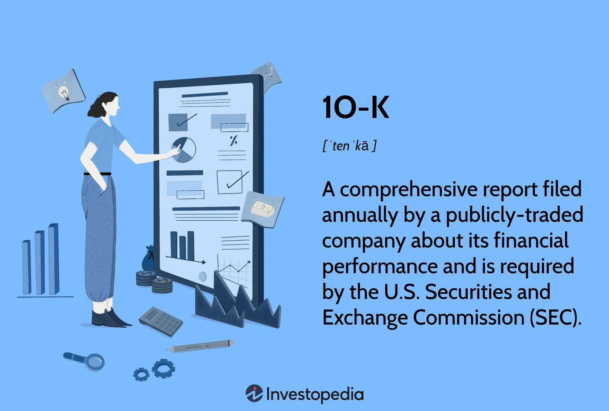

## Table of Contents

## What is Form 10-K and why is it important for investors?

Form 10-K is a detailed report that public companies in the United States must file with the Securities and Exchange Commission (SEC) every year. It gives a complete picture of a company's financial health, including its income, expenses, assets, and liabilities. The report also includes information about the company's business, the risks it faces, and any legal issues it might be dealing with. This form is longer and more detailed than the quarterly reports (Form 10-Q) that companies also have to file.

Form 10-K is important for investors because it helps them make informed decisions about whether to buy, sell, or hold a company's stock. By reading the 10-K, investors can understand how well the company is doing financially and what challenges it might face in the future. This information can help investors see if the company is a good investment or if there are too many risks involved. Overall, the 10-K is a key tool for anyone looking to invest wisely in the stock market.

## How can I access a company's Form 10-K?

You can access a company's Form 10-K by visiting the Securities and Exchange Commission's (SEC) website. The SEC's website is called EDGAR, which stands for Electronic Data Gathering, Analysis, and Retrieval. On the EDGAR website, you can search for the company you're interested in by typing its name into the search bar. Once you find the company, you can look through its filings and find the most recent Form 10-K.

Another way to get a company's Form 10-K is by going to the company's own website. Many companies have an "Investor Relations" section where they post their SEC filings, including the Form 10-K. You can usually find this section by clicking on a link at the bottom of the company's homepage. If you can't find it easily, you can use the website's search function to look for "Form 10-K" or "SEC filings."

Some financial websites and investment platforms also offer access to Form 10-K reports. Websites like Yahoo Finance, Bloomberg, and Morningstar often have sections where you can view a company's financial documents. You might need to create an account on these websites to access the reports, but they can be a convenient way to find the information you need.

## What are the key sections of Form 10-K that I should focus on for stock evaluation?

When you're looking at a company's Form 10-K to evaluate its stock, you should pay close attention to the "Business" section. This part tells you what the company does, how it makes money, and what its main products or services are. It also talks about the company's strategy and any big changes that happened during the year. Understanding the business helps you see if the company is in a good position to grow and make money in the future.

Another important section is the "Management's Discussion and Analysis of Financial Condition and Results of Operations" (MD&A). This part explains the company's financial performance in simple terms. It talks about things like sales, profits, and expenses, and why they went up or down. The MD&A also discusses any risks the company faces, like competition or changes in the economy. Reading this section can help you understand if the company is managing its money well and if there are any big risks you should know about.

Lastly, don't forget to look at the "Financial Statements" section. This part includes the company's balance sheet, income statement, and cash flow statement. These documents show you the numbers behind the company's financial health. The balance sheet tells you about the company's assets, liabilities, and equity. The income statement shows how much money the company made and spent. The cash flow statement explains how the company's cash changed over the year. By looking at these statements, you can see if the company is financially strong and if it's making or losing money.

## How does the management discussion and analysis (MD&A) section help in evaluating a company's stock?

The management discussion and analysis (MD&A) section in a company's Form 10-K is really helpful for figuring out if a company's stock is a good investment. This part of the report is written in a way that's easy to understand, and it explains how the company did financially over the past year. It talks about things like how much money the company made, how much it spent, and why these numbers went up or down. By reading the MD&A, you can see if the company is doing well and if it's making smart choices with its money. This helps you decide if the company is likely to keep growing and making profits in the future.

The MD&A also tells you about any risks the company might be facing. It might talk about things like competition, changes in the economy, or new laws that could affect the company's business. Knowing about these risks is important because they can impact how well the company does and how much money it makes. If the company is facing a lot of big risks, it might not be a safe investment. By looking at the MD&A, you can get a good idea of whether the company's stock is worth buying or if you should be careful because of the risks involved.

## What financial statements are included in Form 10-K and how can they be used to assess a company's financial health?

Form 10-K includes three main financial statements: the balance sheet, the income statement, and the cash flow statement. The balance sheet shows what the company owns (assets), what it owes (liabilities), and the value left for shareholders (equity) at a specific point in time. It helps you see if the company has enough money and resources to pay its debts. The income statement tells you how much money the company made (revenue) and how much it spent (expenses) over the year, showing whether it made a profit or a loss. The cash flow statement explains how the company's cash changed during the year, showing where the money came from and where it went.

These financial statements are really useful for checking a company's financial health. By looking at the balance sheet, you can see if the company has a strong financial position or if it's struggling with debt. A healthy company usually has more assets than liabilities. The income statement helps you understand if the company is making money or losing it. If the company keeps making profits, it's a good sign for investors. The cash flow statement shows if the company is good at managing its cash. If the company has positive cash flow, it means it's bringing in more money than it's spending, which is important for staying financially stable. Together, these statements give you a clear picture of how well the company is doing financially.

## How can the risk factors section of Form 10-K influence investment decisions?

The risk factors section in a company's Form 10-K is really important for making investment decisions. This part of the report lists all the things that could go wrong for the company, like competition, changes in the economy, or new laws. By reading about these risks, you can see if the company might have a hard time making money in the future. If there are a lot of big risks, it might be a good idea to be careful about investing in the company's stock. Knowing about these risks helps you decide if the potential rewards of investing are worth the possible problems.

For example, if a company says it's worried about losing customers to a new competitor, that's a big risk. It means the company might not make as much money as it hopes, which could make its stock price go down. On the other hand, if the risks seem small or manageable, you might feel more confident about investing. The risk factors section gives you a clear picture of what could go wrong, so you can make a smarter choice about whether to buy, sell, or hold the company's stock.

## What are some common red flags to look for in a company's Form 10-K?

When you're looking at a company's Form 10-K, there are some common red flags that you should watch out for. One big red flag is if the company has a lot of debt compared to its assets. If the company owes more money than it owns, it might have a hard time paying its bills. Another red flag is if the company's profits are going down over time. If the company is making less money each year, it might be struggling to keep its business going strong. Also, if the company talks about a lot of legal problems or investigations in the report, that's a warning sign. Legal issues can cost a lot of money and hurt the company's reputation.

Another thing to look for is if the company's risk factors section is really long or if it mentions a lot of big risks. If the company is worried about losing customers, facing new competition, or dealing with big changes in the economy, those are all red flags. It means the company might have a hard time making money in the future. Also, if the company's management discussion and analysis (MD&A) section talks about a lot of one-time gains or unusual events that helped the company's profits, that's something to be careful about. It might mean the company's regular business isn't doing as well as it seems. By keeping an eye out for these red flags, you can make smarter choices about whether to invest in the company's stock.

## How can historical data from Form 10-K be used to predict future performance?

Historical data from a company's Form 10-K can help you guess how the company might do in the future. By looking at the financial statements from past years, you can see if the company's sales, profits, and cash flow have been going up or down. If the company has been growing steadily, it might keep growing in the future. But if the company's numbers have been going down, it might keep struggling. You can also look at the MD&A section to see what the company says about its past performance and what it thinks will happen next. If the company has a good plan for growing and making more money, that's a good sign.

Another way to use historical data is by looking at the risk factors section. If the company has faced the same risks in the past and managed them well, it might be able to handle them again in the future. But if new risks have come up or old risks have gotten worse, the company might have a harder time. By putting all this information together, you can make a better guess about whether the company's stock is a good investment. Historical data doesn't tell you exactly what will happen, but it gives you clues about what might happen next.

## What advanced financial ratios can be derived from Form 10-K data to evaluate stock value?

From the data in a company's Form 10-K, you can figure out some advanced financial ratios that help you understand if a company's stock is a good value. One important ratio is the Price-to-Earnings (P/E) ratio, which you get by dividing the stock's current price by the company's earnings per share. A lower P/E ratio might mean the stock is a good deal, but you need to compare it with other companies in the same industry. Another useful ratio is the Price-to-Book (P/B) ratio, which you find by dividing the stock's price by the company's book value per share. This ratio shows if the stock is priced fairly compared to the company's net assets. If the P/B ratio is low, it might mean the stock is undervalued.

Another ratio to look at is the Debt-to-Equity (D/E) ratio, which you calculate by dividing the company's total liabilities by its shareholders' equity. This ratio tells you how much the company is relying on debt to finance its operations. A high D/E ratio can be a warning sign that the company might have trouble paying its debts. The Return on Equity (ROE) ratio is also important, and you find it by dividing the company's net income by its shareholders' equity. ROE shows how well the company is using the money shareholders have invested to make profits. A high ROE is usually a good sign that the company is doing well. By looking at these ratios, you can get a better idea of whether a company's stock is a good investment.

## How can qualitative information in Form 10-K be quantified for better stock analysis?

Qualitative information in Form 10-K, like the company's business description, management's discussion, and risk factors, can be turned into numbers to help with stock analysis. One way to do this is by using sentiment analysis. This means reading the text and figuring out if the words used are positive, negative, or neutral. For example, if the management's discussion talks a lot about growth and new opportunities, that's a positive sentiment. You can give a score to this sentiment, like a number from -1 to +1, where -1 is very negative and +1 is very positive. This score can then be used alongside financial numbers to see if the company's future looks bright or if there are worries.

Another way to quantify qualitative information is by looking at the risk factors section and counting how many risks are mentioned. You can also rate each risk based on how serious it seems. For example, if a company talks about a new law that could hurt its business, you might rate that risk as high. By adding up these risk scores, you get a total risk score for the company. This score can help you compare the company's risks with other companies. When you combine these risk scores with financial ratios and other numbers, you get a fuller picture of the company's health and whether its stock is a good investment.

## What are the limitations of using Form 10-K for stock evaluation, and how can these be mitigated?

Form 10-K has some limitations when it comes to evaluating a company's stock. One big limitation is that the information in the report can be old by the time it's released. Companies have to file their 10-K within 60 to 90 days after the end of their fiscal year, so the data might not show the latest changes in the company's business. Another limitation is that the report can be hard to understand because it's full of financial and legal terms. Also, while the 10-K gives a lot of information, it might not tell you everything you need to know about the company's future plans or the industry it's in. This can make it tricky to predict how the company will do in the future.

To make up for these limitations, you can use other sources of information along with the 10-K. For example, you can look at the company's quarterly reports (Form 10-Q) to get more up-to-date information. You can also read news articles, analyst reports, and industry studies to learn more about the company and its competitors. Talking to other investors or joining investment groups can also help you understand the company better. By combining the detailed information from the 10-K with these other sources, you can get a fuller picture of the company's health and make smarter investment decisions.

## How can Form 10-K be integrated with other financial analysis tools for a comprehensive stock evaluation?

Form 10-K is a great starting point for evaluating a company's stock, but it's even better when you use it with other financial analysis tools. You can look at the company's quarterly reports, or Form 10-Q, to get more recent information. These reports come out every three months and can help you see how the company is doing right now. You can also use stock market data from websites like Yahoo Finance or Bloomberg. These sites give you real-time stock prices, charts, and analyst ratings that can help you see if the stock is a good buy at its current price. By putting all this information together, you get a fuller picture of the company's health and can make smarter investment choices.

Another helpful tool is financial software like Morningstar or Value Line, which can give you detailed financial ratios and industry comparisons. These tools can take the numbers from the 10-K and turn them into easy-to-understand charts and graphs. This makes it easier to see how the company is doing compared to others in its industry. You can also use economic reports and industry studies to understand the bigger picture. These reports can tell you about trends in the economy or the company's industry that might affect its future. By combining the detailed information from the 10-K with these other tools, you can make a more complete and informed decision about whether to invest in the company's stock.

## References & Further Reading

SEC EDGAR Database: [https://www.sec.gov/edgar.shtml]  
This is the official database where the U.S. Securities and Exchange Commission (SEC) makes company filings available to the public. It is a critical resource for accessing Form 10-K filings, among other disclosures, to analyze company performance and make informed investment decisions.

Advances in Financial Machine Learning by Marcos Lopez de Prado  
This book offers a comprehensive overview of the intersection between [machine learning](/wiki/machine-learning) and finance. It covers a wide range of topics relevant to [algorithmic trading](/wiki/algorithmic-trading), including techniques for developing predictive models from financial data, with examples of applications and strategies.

Quantitative Trading: How to Build Your Own Algorithmic Trading Business by Ernest P. Chan  
Ernest P. Chan provides insights into building a successful algorithmic trading enterprise. The book guides readers through the process of developing and implementing trading algorithms using quantitative techniques, including integration with various data inputs such as SEC filings.

A Forecast Comparison of Volatility Models by Peter R. Hansen and Allan Lunde  
This research paper compares various models for forecasting [volatility](/wiki/volatility-trading-strategies), which is a crucial component in the development of trading strategies. Understanding volatility can enhance risk management and profitability in trading models, forming an integral part of the decision-making process in algorithmic trading.

