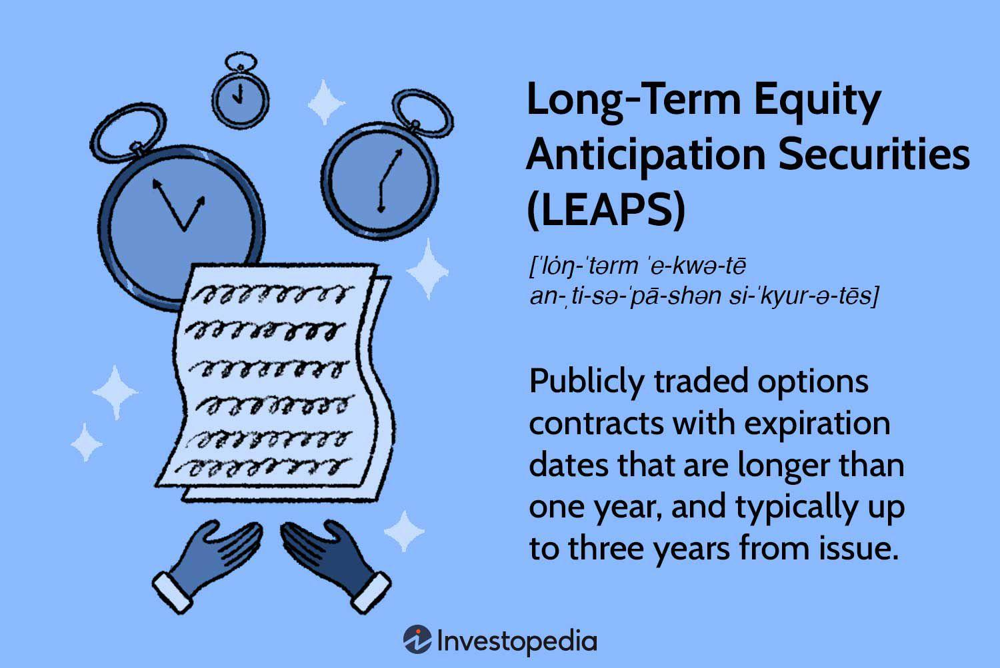

Investment risk management is a fundamental aspect of maximizing portfolio returns while safeguarding against potential financial adversities. The volatile nature of financial markets necessitates a comprehensive understanding of risk management strategies to minimize potential losses and optimize performance. This article focuses on three vital strategies and tools: Index LEAPS, hedging techniques, and algorithmic trading, which form the cornerstone for effective investment risk management.

Index LEAPS (Long-term Equity Anticipation Securities) present a strategic option for investors seeking to protect their portfolios from market downturns without sacrificing growth potential. These long-term options contracts, which extend up to three years before expiration, offer a cushion against market volatility, providing a stable foundation for portfolio risk management. By integrating Index LEAPS into their investment framework, investors can harness the dual advantage of downside protection and upside potential, a critical balance in achieving long-term financial objectives.



Hedging techniques further extend the toolkit available for managing investment risks. By strategically offsetting potential losses through financial instruments, investors can tailor their portfolio management strategies to align with their unique risk tolerance and financial goals. The application of hedging strategies, particularly through Index LEAPS, empowers investors to navigate fluctuating market conditions with greater confidence and resilience.

Algorithmic trading, characterized by its automated and pre-defined criteria, revolutionizes traditional trading methods. This technology-driven approach enhances risk management by enabling precision and reducing human error in executing trades. As a key component of modern risk management, algorithmic trading systems facilitate real-time adjustments, backtesting strategies, and dynamic position sizing to help investors maintain a robust investment portfolio amidst varying market conditions.

By understanding and leveraging these strategies—Index LEAPS, hedging, and algorithmic trading—investors can make informed decisions in complex market landscapes. These risk management tools are instrumental in not only protecting portfolios from downside risks but also in capitalizing on market opportunities. In the sections that follow, we will examine how these elements operate, their benefits, and the ways in which they integrate with current algorithmic trading systems to ensure successful investment outcomes.

## Table of Contents

## Understanding Investment Risks

Investment risk refers to the potential for realized investment returns to diverge from expected returns, which may lead to financial loss. This deviation can stem from various inherent uncertainties present in financial markets, necessitating careful evaluation and management to optimize investment success. Key financial risks include market risk, credit risk, [liquidity](/wiki/liquidity-risk-premium) risk, and operational risk, each contributing differently to a portfolio's overall risk profile.

Market risk involves the possibility of an investment's value fluctuating due to changes in market factors such as stock prices, interest rates, or foreign exchange rates. This type of risk is often unavoidable but can be mitigated through diversification. Market risk is inherently systematic, impacting the entire market or a significant segment rather than individual stocks or securities.

Credit risk arises when a borrower fails to meet contractual debt obligations, leading to potential financial loss for the lender or bondholder. This risk can affect individual securities and is considered unsystematic, meaning it can be somewhat alleviated through diversification within a portfolio to select higher-quality credit instruments.

Liquidity risk is the challenge of executing buy or sell actions in a timely manner without significantly affecting asset prices. Sudden shifts in market demand or regulatory changes often exacerbate this risk. Liquidity risk can be managed by maintaining a mix of liquid and illiquid assets within a portfolio, allowing for flexibility in response to market changes.

Operational risk pertains to intrinsic failures within organizational processes, people, and systems. It can result from a myriad of issues, including internal fraud, system failures, or regulatory breaches. Comprehensive risk management frameworks, designed to anticipate and mitigate these operational disruptions, are crucial for minimizing their potential impact on investments.

Distinguishing between systematic and unsystematic risks is vital for investors as it enables them to apply suitable strategies for managing exposure. Systematic risks, like market risk, are pervasive and cannot be eradicated through diversification; investors often use hedging strategies for protection against such risks. Conversely, unsystematic risks can be significantly reduced through diversification across various securities and asset classes.

In portfolio management, aligning investment strategies with an investor's risk tolerance and financial goals is essential. This requires a nuanced understanding of how different types of risks interact within a portfolio. Analytical tools, such as beta measurements for assessing market risk or credit ratings for evaluating credit risk, assist in this alignment process. Proactively addressing these risks enables investors to formulate strategies that not only protect against potential losses but also position the portfolio to capitalize on potential market opportunities.

 to Index LEAPS

Index LEAPS (Long-term Equity Anticipation Securities) are a type of options contract that grant the buyer the right, but not the obligation, to buy or sell a stock index at a predetermined price before the option expires. These contracts typically have expiration dates extending out to three years, providing a long-term horizon for investors seeking to hedge against potential downturns while maintaining the ability to capitalize on upward movements in the market.

One of the primary advantages of Index LEAPS is their ability to serve as a hedging tool. During volatile market conditions, LEAPS offer a strategic way to protect portfolios from substantial losses. By purchasing these long-duration options, investors can effectively lock in a ceiling on potential losses tied to long-term investments in index funds. This is especially beneficial when market forecasts predict downturns, as these instruments allow for risk mitigation without requiring the liquidation of existing positions.

Investors favor Index LEAPS for several reasons:

1. **Preservation of Upside Potential**: Unlike outright selling stocks during market corrections, using LEAPS allows investors to remain invested while still safeguarding against declines, thus preserving the potential for gains if the market rebounds.

2. **Cost-Effectiveness**: Compared to other hedging strategies, such as short selling or buying shorter-term options (which need frequent rolling over), LEAPS can be more cost-effective due to their longer expiration date and the reduced need for frequent trading adjustments.

3. **Integration with Hedging Strategies**: When incorporated into broader hedging strategies, Index LEAPS can offer comprehensive protection. For example, an investor might use put LEAPS to protect against declines in a specific stock index they are heavily invested in. This protective stance can be tailored based on the market outlook and the particular index of concern.

These securities seamlessly integrate with various hedging approaches by aligning with an investor's market sentiments and risk management objectives. By using LEAPS, investors can design hedges according to anticipated market movements and align their portfolio strategies to balance risks effectively.

In summary, Index LEAPS are a versatile tool in investment risk management, offering long-term outlook flexibility and integration into sophisticated hedging strategies. They allow investors to maintain their investment stances through turbulent times while adjusting for potential adverse conditions effectively.

## Hedging Strategies Using Index LEAPS

Hedging with Index LEAPS involves utilizing long-term options to mitigate potential losses in investment portfolios while still allowing for profit generation. A common strategy is purchasing protective puts, which provide a form of insurance by setting a floor for the value of portfolio holdings within a given index.

### Protective Puts Strategy

The primary method of using Index LEAPS in hedging is the protective puts strategy. Investors buy put options with a strike price that brackets the expected lower boundary of the index. If the value of the index declines below this strike price, the investor can exercise the option, selling the index at the strike price rather than at the market value, thus minimizing losses. 

### Formulating Market Outlook

A critical initial step in using index LEAPS is to formulate a comprehensive market outlook. Investors must analyze macroeconomic indicators, geopolitical events, and market trends to forecast potential index movements. This understanding aids in deciding the exercise price and expiration dates for the LEAPS.

### Determining Appropriate Indices

Choosing the correct index is crucial for effective hedging. The S&P 500, for instance, is a popular choice due to its broad market representation. Investors need to align their choice with their portfolios' underlying assets to achieve optimal risk offset.

### Justifying Hedge Costs

The costs associated with purchasing LEAPS must be justified within the investor's broader financial strategy. While LEAPS options typically come with higher premiums due to their extended expiration periods, they provide substantial insurance against market downturns. The key is to balance the cost of these options with the expected potential market decline and gain from preserved or increased asset value.

### Practical Example

Consider an investor whose portfolio is closely tied to the S&P 500 index. They anticipate potential [volatility](/wiki/volatility-trading-strategies) due to upcoming economic data releases and decide to purchase LEAPS put options for an S&P 500 [ETF](/wiki/etf-trading-strategies). Suppose the ETF is currently trading at $400. The investor might purchase a put option with a strike price of $380, set to expire in two years. This option safeguards the portfolio against declines below $380, minus the option premium.

### Python Code Example

Below is an illustrative example in Python demonstrating how one could monitor the value of an option.
```python
import numpy as np
import matplotlib.pyplot as plt

# Constants for Black-Scholes Model
S = 400  # Current index price
K = 380  # Strike price
T = 2   # Time in years
r = 0.01  # Risk-free rate
sigma = 0.2  # Volatility

def black_scholes_put(S, K, T, r, sigma):
    from scipy.stats import norm

    d1 = (np.log(S / K) + (r + 0.5 * sigma ** 2) * T) / (sigma * np.sqrt(T))
    d2 = d1 - sigma * np.sqrt(T)

    put = K * np.exp(-r * T) * norm.cdf(-d2) - S * norm.cdf(-d1)
    return put

# Calculate put option price
put_price = black_scholes_put(S, K, T, r, sigma)
print(f"LEAPS Put Option Price: {put_price:.2f}")

# Visualizing effect of volatility
sigmas = np.linspace(0.1, 0.5, 100)
put_prices = [black_scholes_put(S, K, T, r, sig) for sig in sigmas]

plt.plot(sigmas, put_prices)
plt.xlabel('Volatility')
plt.ylabel('Put Option Price')
plt.title('Effect of Volatility on LEAPS Put Option Price')
plt.show()
```

The code calculates the put option's price using the Black-Scholes model. It demonstrates how the price changes with volatility, allowing investors to visualize potential hedging costs against possible market conditions.

By utilizing Index LEAPS for hedging, investors can customize strategies that reflect their specific risk tolerance and market expectations, ensuring protection against adverse market movements while retaining growth potential.

## Risk Management in Algorithmic Trading

Algorithmic trading utilizes automated systems to execute trades based on predefined criteria, offering significant advantages in risk management. The primary components of effective risk management within this approach include [backtesting](/wiki/backtesting) strategies, dynamic position sizing, and real-time risk assessments.

Backtesting strategies are fundamental in evaluating trading algorithms. By simulating trades using historical data, algorithms can be assessed for effectiveness and resilience to market conditions. This process allows traders to identify potential flaws or weaknesses in their strategies before they are applied in live trading environments. For instance, by applying a backtest to an algorithm that follows a moving average crossover strategy, traders can determine its historical profitability and volatility.

Dynamic position sizing is another critical element, involving the adjustment of trading positions according to market volatility or strategy-specific criteria. This approach helps in minimizing potential losses and optimizing returns. For instance, traders may use the Kelly Criterion or a volatility-based model to determine the optimal size of a position. Using Python for position sizing, one might implement a simple volatility-based sizing model as follows:

```python
def calculate_position_size(account_balance, volatility, risk_per_trade):
    # Assume a simple model where position size is inversely proportional to volatility
    size = (account_balance * risk_per_trade) / volatility
    return size
```

Real-time risk assessments enable traders to monitor market conditions and adjust strategies promptly. This involves continuous analysis of market data to identify risks associated with trading positions. Algorithms are equipped to handle such assessments, allowing for immediate response to adverse market movements, thus preventing excessive losses.

Algo trading platforms also provide robust tools for monitoring and controlling trading risks. These platforms can generate alerts, automate stop-loss orders, and adjust trades dynamically based on pre-set risk parameters. They often incorporate features such as margin management, real-time exposure analysis, and risk dashboards, offering traders comprehensive control over their risk profiles.

Overall, [algorithmic trading](/wiki/algorithmic-trading) systems play an essential role in enhancing investment risk management by leveraging technology to automate decision-making processes, reduce human error, and facilitate quick adaptations to market changes. This integration of technology not only safeguards portfolios against potential losses but also provides opportunities for optimizing trading performance.

## Balancing Risk and Reward in Algorithmic Trading

Balancing risk and reward in algorithmic trading is essential for optimizing investment returns while effectively managing potential losses. Algorithmic trading employs technology to execute trades with precision, significantly reducing human error and emotional influence in decision-making. This precision is achieved through the implementation of automated systems that operate on predefined criteria, allowing for systematic and consistent trading practices.

Diversification remains a fundamental principle within this approach, with algorithms facilitating real-time portfolio adjustments to maintain an optimal balance. By analyzing market conditions and adjusting holdings automatically, these systems can respond swiftly to changes, thereby mitigating risks associated with market volatility and ensuring alignment with investment objectives.

Quantitative risk techniques, such as Value at Risk (VaR) and stress testing, play a pivotal role in achieving a balance between risk and reward in algorithmic trading. VaR measures the potential loss in value of a portfolio over a defined period for a given confidence interval. For example, a daily VaR of $1 million at a 95% confidence level suggests that the portfolio is expected to lose no more than $1 million on 95 out of 100 days. This metric is crucial for determining the amount of risk exposure and for setting risk limits.

Stress testing complements VaR by simulating portfolio performance under extreme market conditions, helping to identify vulnerabilities that VaR might overlook. These tests involve hypothetical scenarios such as sudden market crashes or shifts in economic indicators, providing insights into how robust a trading strategy is against unforeseen events.

The integration of these quantitative techniques enables algorithmic trading systems to dynamically adjust their strategies based on real-time risk assessments, ensuring that portfolios are not only protected against potential downsides but also positioned to take advantage of market opportunities. By continuously monitoring and recalibrating trading strategies, these systems optimize the risk-reward ratio, contributing to sustained investment success.

## Conclusion

Effective risk management strategies, such as Index LEAPS and algorithmic trading systems, are pivotal to investment success. These tools enable investors to significantly reduce potential losses while optimizing portfolio performance through calculated approaches. A comprehensive understanding and application of these techniques equip investors to adeptly navigate the complexities of today's fast-paced financial markets.

Index LEAPS allows investors to hedge against market downturns while still enjoying the benefits of potential market upswings. Their utility in providing long-term protective measures aligns with the goals of investors seeking to mitigate risk over extended periods. Algorithmic trading systems, on the other hand, leverage automated trade executions based on predefined criteria, minimizing human error and thereby enhancing decision-making efficacy. These systems incorporate advanced techniques such as backtesting and real-time risk assessments, which are crucial for managing volatile market conditions effectively.

By employing these sophisticated tools, investors can shield their portfolios from downside risks such as market fluctuations and systemic shocks. Furthermore, the ability to dynamically adjust to market signals enables investors to capitalize on emerging opportunities, potentially increasing returns. For instance, algorithms can facilitate real-time diversification across various asset classes, ensuring a balanced and optimized portfolio.

The integration of robust risk management frameworks, including both strategic hedging techniques like Index LEAPS and the precision of algorithmic trading, is a prerequisite for sustained success and competitiveness in investing. Investors who harness these advanced strategies can maintain resilience in their portfolios, adapting swiftly to market changes while seizing opportunities for growth. Such proactive risk management practices not only safeguard investments but also enhance the potential for achieving long-term financial objectives.

## References & Further Reading

[1]: Passarelli, D. J. (2008). ["Trading Options Greeks: How Time, Volatility, and Other Pricing Factors Drive Profits."](https://www.amazon.com/Trading-Option-Greeks-Volatility-Bloomberg/dp/157660246X) Wiley.

[2]: Black, F., & Scholes, M. (1973). ["The Pricing of Options and Corporate Liabilities."](https://www.cs.princeton.edu/courses/archive/fall09/cos323/papers/black_scholes73.pdf) Journal of Political Economy, 81(3), 637-654.

[3]: Hull, J. C. (2017). ["Options, Futures, and Other Derivatives."](https://www.pearson.com/en-us/subject-catalog/p/options-futures-and-other-derivatives/P200000005938/9780136939917) Pearson.

[4]: Chan, E. (2009). ["Quantitative Trading: How to Build Your Own Algorithmic Trading Business."](https://github.com/ftvision/quant_trading_echan_book) Wiley.

[5]: Lopez de Prado, M. (2018). ["Advances in Financial Machine Learning."](https://www.amazon.com/Advances-Financial-Machine-Learning-Marcos/dp/1119482089) Wiley.

[6]: Johnson, N. (2010). ["Algorithmic Trading and DMA: An Introduction to Direct Access Trading Strategies."](https://archive.org/details/algorithmictradi0000john) Harriman House.

[7]: Durant, T. B., & Vladimirov, M. (2011). ["Algorithmic and High-Frequency Trading."](https://assets.cambridge.org/97811070/91146/frontmatter/9781107091146_frontmatter.pdf) Cambridge University Press.