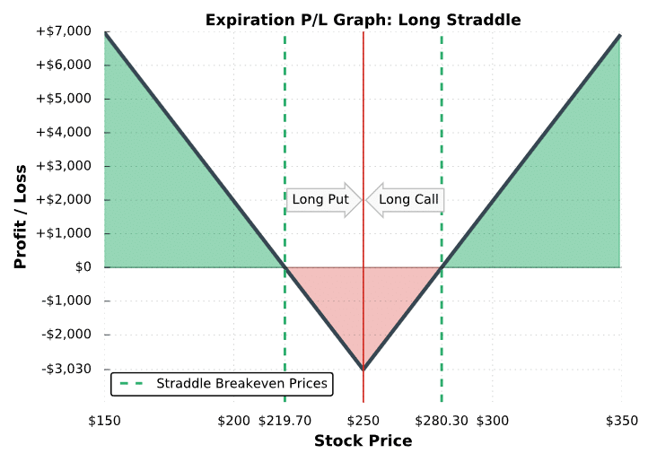

## Table of Contents

## What is a long straddle and how does it work?

A long straddle is an options trading strategy where you buy both a call option and a put option at the same time, with the same strike price and expiration date. The goal is to profit from a big move in the stock price, either up or down. You pay for both options, so it costs money to set up this strategy. It's like betting that the stock will make a strong move, but you're not sure which direction it will go.

This strategy works well when you expect a lot of volatility in the stock price but are unsure of the direction. If the stock price goes up a lot, the call option will become more valuable, and you can make money from it. If the stock price goes down a lot, the put option will become more valuable, and you can profit from that. The key is that the stock needs to move enough to cover the cost of both options. If the stock price stays the same or doesn't move much, you could lose the money you spent on the options.

## What are the key components of a long straddle strategy?

The key components of a long straddle strategy are buying a call option and a put option at the same strike price and expiration date. The call option gives you the right to buy the stock at the strike price, while the put option gives you the right to sell the stock at that same price. You pay a premium for both options, which is the cost of setting up the strategy.

The strategy works best when you expect the stock to move a lot, but you're not sure if it will go up or down. If the stock price goes up significantly, the call option will increase in value, and you can make a profit. If the stock price drops a lot, the put option will gain value, allowing you to make money. The stock needs to move enough to cover the cost of both options for the strategy to be profitable. If the stock price doesn't move much, you could lose the money you spent on the options.

## How can a long straddle be used to profit from market volatility?

A long straddle is a way to make money when you think a stock will move a lot, but you don't know if it will go up or down. You buy both a call option and a put option with the same price and date they expire. The call option lets you buy the stock at a set price, and the put option lets you sell it at that same price. You pay for both options, so it costs money to start this strategy.

This strategy works well when there's a lot of up and down in the stock price. If the stock goes up a lot, the call option becomes worth more, and you can sell it for a profit. If the stock goes down a lot, the put option becomes more valuable, and you can make money from that. The key is that the stock needs to move enough to cover the cost of both options. If the stock doesn't move much, you might lose the money you spent on the options. So, a long straddle is a good choice when you expect big changes in the stock price, but you're not sure which way it will go.

## What are the potential risks and rewards associated with long straddles?

The main reward of using a long straddle is that you can make money if the stock price moves a lot, either up or down. You buy both a call option and a put option at the same price and date. If the stock goes up a lot, the call option becomes more valuable, and you can sell it for a profit. If the stock goes down a lot, the put option gains value, and you can make money from that. The key is that the stock needs to move enough to cover the cost of both options. If it does, you could make a big profit, especially if the move is unexpected and large.

The biggest risk with a long straddle is that you could lose the money you spent on the options if the stock price doesn't move much. You pay for both the call and put options, and if the stock stays the same or only moves a little, both options might expire worthless, and you lose the full amount you paid. Another risk is that the stock might move in the right direction but not enough to cover the cost of both options. Time is also a [factor](/wiki/factor-investing) because as the options get closer to expiring, their value can decrease if the stock doesn't move enough. So, while a long straddle can be rewarding if the stock moves a lot, it also carries the risk of losing the money you invested if it doesn't.

## How do you calculate the break-even points for a long straddle?

To figure out the break-even points for a long straddle, you need to know how much you paid for the call option and the put option together. This total cost is called the net premium. The break-even points are the stock prices where you neither make nor lose money after paying for the options.

There are two break-even points for a long straddle. The first break-even point is when the stock price goes up. To find this, you add the net premium to the strike price of the options. If the stock goes above this point, you start making money from the call option. The second break-even point is when the stock price goes down. To find this, you subtract the net premium from the strike price. If the stock falls below this point, you start making money from the put option. So, the stock needs to move outside of these two points for you to make a profit.

## What are the ideal market conditions for implementing a long straddle?

The best time to use a long straddle is when you think the stock will move a lot but you're not sure if it will go up or down. This often happens before big news or events that can shake up the stock price, like earnings reports, product launches, or big company announcements. If you expect the stock to be all over the place because of these events, a long straddle can be a good choice. You're betting that the stock will move enough to cover the cost of the options you buy.

The other ideal condition is when the market is expecting a lot of ups and downs, which is called high [volatility](/wiki/volatility-trading-strategies). If the market thinks the stock will be very unpredictable, the price of the options might be higher, but that's okay because you're hoping for a big move. If you're right and the stock moves a lot, you can make a good profit. But if the stock doesn't move much, you could lose the money you spent on the options. So, a long straddle works best when you expect big changes and a lot of action in the stock price.

## How does the timing of entering and exiting a long straddle affect its profitability?

The timing of when you start a long straddle can make a big difference in how much money you make or lose. You want to buy the call and put options when you think something big is about to happen that will make the stock price jump around a lot. This could be before a company announces its earnings or a new product. If you time it right and the stock moves a lot after you buy the options, you could make a good profit. But if you buy the options too early and the stock doesn't move much before they expire, you might lose all the money you spent on them.

When you decide to sell the options, or [exit](/wiki/exit-strategy) the long straddle, also matters a lot. You want to sell the options when the stock has moved enough to cover the cost of what you paid for them and then some. If the stock goes up a lot, you sell the call option for a profit. If it goes down a lot, you sell the put option. The trick is to sell before the options lose value as they get closer to expiring. If you wait too long and the stock doesn't move enough, or if it moves back to where it started, you might not make any money or could even lose what you spent on the options. So, timing when you enter and exit a long straddle is key to making it work.

## What are some common mistakes beginners make when using long straddles?

One common mistake beginners make with long straddles is not understanding how much the stock needs to move to make money. They might buy the call and put options thinking any move in the stock will be enough, but they forget that the stock has to move past the break-even points to cover the cost of both options. If the stock doesn't move enough, they could lose all the money they spent on the options. Another mistake is not paying attention to time. Options lose value as they get closer to expiring, so if the big move in the stock doesn't happen soon enough, the options might not be worth much by the time they expire.

Another error beginners often make is choosing the wrong strike price or expiration date. They might pick options that are too far away from the current stock price or that expire too soon, which can make it harder to make a profit. Also, beginners might not consider the cost of the options. The more expensive the options, the bigger the move the stock needs to make to be profitable. So, it's important to think about how much you're spending and whether the expected move in the stock is likely to happen.

## How can advanced traders adjust a long straddle to improve potential outcomes?

Advanced traders can make changes to a long straddle to try and do better. One way they might do this is by adjusting the strike prices of the options. Instead of buying options at the same strike price, they might choose options with different strike prices to better fit what they think the stock will do. For example, if they think the stock might go up more than it goes down, they might buy a call option with a lower strike price and a put option with a higher strike price. This can help them make money if the stock moves in the direction they expect, but it also changes the break-even points and can be riskier.

Another way advanced traders can adjust a long straddle is by changing when the options expire. They might buy options that expire at different times to give the stock more time to move or to take advantage of different market conditions. For instance, they might buy a longer-term call option and a shorter-term put option if they think the stock will go down soon but go up later. By making these changes, advanced traders can try to improve their chances of making money, but they also need to be careful because these adjustments can make the strategy more complex and increase the risk.

## What role does implied volatility play in the pricing and effectiveness of long straddles?

Implied volatility is a big deal when it comes to long straddles because it helps set the price of the options you buy. Implied volatility is like a guess about how much the stock price might move in the future. When implied volatility is high, it means the market thinks the stock could move a lot, so the options cost more. When implied volatility is low, the options are cheaper because the market expects less movement. So, if you buy a long straddle when implied volatility is high, you pay more for the options, but you're also betting that the stock will move enough to make it worth it.

The effectiveness of a long straddle can also be affected by changes in implied volatility. If you buy a long straddle and then implied volatility goes up, the value of your options can increase even if the stock price stays the same. This is because the options become more valuable when the market expects bigger moves. On the other hand, if implied volatility goes down after you buy the options, their value can drop, making it harder for you to make money unless the stock moves a lot. So, keeping an eye on implied volatility can help you decide when to enter and exit a long straddle to try and make the most money.

## How can you use technical analysis to enhance the timing of a long straddle strategy?

Technical analysis can help you figure out the best time to start a long straddle by looking at charts and patterns to guess where the stock price might go next. You can use tools like moving averages, Bollinger Bands, and support and resistance levels to see if the stock is about to make a big move. For example, if the stock price is getting close to breaking out of a tight range or if it's about to cross a key moving average, that might be a good time to buy the options for your long straddle. You're trying to catch the stock right before it makes a big jump, either up or down.

Once you've started the long straddle, technical analysis can also help you decide when to sell the options. If you see signs that the stock's big move is slowing down or if it's hitting a new support or resistance level, it might be time to close out your position. For instance, if the stock price has moved past your break-even points and then starts to show signs of reversing, like a bearish or bullish divergence on the RSI, you might want to sell your options to lock in your profit. Using technical analysis this way can help you time your entry and exit better, making your long straddle more likely to be successful.

## What are some advanced strategies for managing and hedging long straddles in highly volatile markets?

In highly volatile markets, advanced traders might use a strategy called delta hedging to manage their long straddles. Delta hedging means adjusting your position to stay neutral as the stock price moves. If the stock goes up a lot, the call option becomes more valuable, and you might sell some stock to balance it out. If the stock goes down a lot, the put option gains value, and you might buy some stock to keep things even. This can help you make money from the big moves without losing too much if the stock swings back the other way. It's like always trying to keep your position balanced no matter which way the stock goes.

Another way to manage a long straddle in a volatile market is by using a strategy called gamma [scalping](/wiki/gamma-scalping). This means buying and selling the stock quickly to take advantage of small price changes. When the stock price moves, the value of your options changes too. If the stock goes up, you might sell some stock to make a little profit, and if it goes down, you might buy some to do the same. This can help you make money from the ups and downs while waiting for the big move you're hoping for with your long straddle. It's like trying to catch small fish while waiting for the big one.

## What is a Long Straddle?

A long straddle is an options trading strategy that aims to capitalize on significant price movement in an underlying asset, regardless of the direction of that movement. It is constructed by simultaneously purchasing a call option and a put option on the same security, with identical strike prices and expiration dates. This dual acquisition is what gives the long straddle its characteristic market-neutral stance, allowing traders to potentially profit from volatility rather than the asset's specific price trajectory.

In practice, a long straddle involves selecting a strike price that is typically close to the current market price of the underlying asset. For this to be effective, the asset's market price must move significantly in either direction, surpassing the total premium cost of both options for a profit to be realized. This necessity demonstrates the strategy's dependence on market volatility: when markets are highly volatile, the underlying asset is more likely to undergo the substantial price shifts needed for the strategy to be lucrative.

For example, consider a stock currently trading at $100. To establish a long straddle, an investor would buy both a $100 call and a $100 put option. If the market experiences a significant increase or decrease causing the stock price to deviate considerably from the $100 mark, the profits made from the option that increases in value can offset the losses from the other option and cover the initial cost of both premiums. This is represented mathematically by the following conditions for profitability:

$$
\text{Profit when stock rises} = (\text{Stock Price} - \text{Strike Price} - \text{Total Premium})
$$

$$
\text{Profit when stock falls} = (\text{Strike Price} - \text{Stock Price} - \text{Total Premium})
$$

As these formulas indicate, the benefit of a long straddle lies in its capacity to yield unlimited profit given sufficient price movement. However, traders must carefully manage the risk brought on by the cost of entering both positions and the possibility of minimal market movement, which can result in a loss equivalent to the total premiums paid.

Through strategic consideration, long straddles serve as valuable tools in periods of uncertainty, positioning traders to harness potential swings in the market while remaining agnostic to the direction of such moves.

## What are the mechanics and profitability of long straddles?

A long straddle is an options trading strategy that involves purchasing both a call and a put option with the same strike price and expiration date. This strategy is designed to capitalize on significant price movements in either direction, taking advantage of market volatility.

### Setting Up a Long Straddle Position

To set up a long straddle position, a trader begins by identifying an underlying asset expected to experience volatility. The trader simultaneously buys a call option and a put option, each with the same strike price and expiration date. This ensures that the trader benefits from any substantial price change, regardless of direction. The cost of establishing this position is the sum of the premiums paid for both the call and put options.

### Cost Considerations and Breakeven Points

The initial cost of a long straddle includes the premium paid for the call option (C) and the put option (P). Therefore, the total premium outlay is C + P. The strategy's breakeven points are crucial for assessing profitability:

1. **Upper Breakeven Point**: This occurs when the underlying asset's price at expiration is equal to the strike price (K) plus the total premiums paid. Mathematically, this is expressed as:
$$
   \text{Upper Breakeven} = K + (C + P)

$$

2. **Lower Breakeven Point**: This point is reached when the underlying asset's price at expiration equals the strike price minus the total premiums paid:
$$
   \text{Lower Breakeven} = K - (C + P)

$$

For the trade to be profitable, the asset's price at expiration must be either higher than the upper breakeven point or lower than the lower breakeven point.

### Profitable Scenarios for Long Straddles

Long straddles are particularly profitable in scenarios where the underlying asset exhibits strong volatility. Market events, earnings reports, or economic announcements can lead to such significant price fluctuations. For instance, if the market expects a major policy announcement, traders might use long straddles to benefit from the anticipated volatility, regardless of whether the event causes the asset price to rise or fall sharply.

### Advantages: Unlimited Profit Potential and Market Neutrality

One of the chief advantages of a long straddle is its unlimited profit potential. As there are no upper limits to how high or low the underlying asset's price can move, gains can continue to increase with the strength of the price movement.

Furthermore, long straddles offer market neutrality. This strategy does not necessitate a specific directional bias; rather, it profits from significant moves in either direction. This feature makes long straddles particularly attractive in uncertain or volatile markets where price direction is difficult to predict.

In summary, while the initial cost of setting up a long straddle can be substantial, the strategy's potential rewards are significant, especially in volatile markets. By carefully considering breakeven points and leveraging significant market events, traders can effectively use long straddles to manage risk while also capitalizing on substantial price movements.

## References & Further Reading

[1]: Bergstra, J., Bardenet, R., Bengio, Y., & Kégl, B. (2011). ["Algorithms for Hyper-Parameter Optimization."](https://dl.acm.org/doi/10.5555/2986459.2986743) Advances in Neural Information Processing Systems 24.

[2]: ["Advances in Financial Machine Learning"](https://www.amazon.com/Advances-Financial-Machine-Learning-Marcos/dp/1119482089) by Marcos Lopez de Prado

[3]: ["Evidence-Based Technical Analysis: Applying the Scientific Method and Statistical Inference to Trading Signals"](https://www.amazon.com/Evidence-Based-Technical-Analysis-Scientific-Statistical/dp/0470008741) by David Aronson

[4]: ["Machine Learning for Algorithmic Trading"](https://github.com/stefan-jansen/machine-learning-for-trading) by Stefan Jansen

[5]: ["Quantitative Trading: How to Build Your Own Algorithmic Trading Business"](https://www.amazon.com/Quantitative-Trading-Build-Algorithmic-Business/dp/1119800064) by Ernest P. Chan