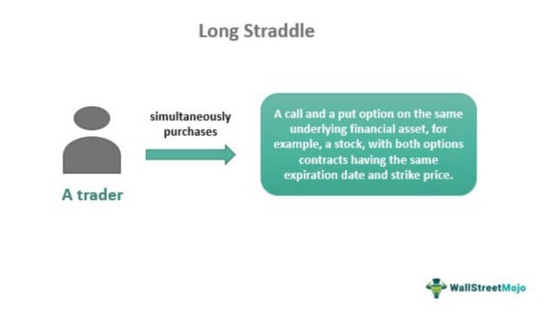

Market volatility is a fundamental aspect of financial markets, representing the rate at which the price of securities increases or decreases for a given set of returns. It is often induced by a variety of factors including economic data releases, geopolitical events, corporate earnings announcements, and sudden changes in market sentiment. High market volatility can present both risks and opportunities for traders and investors, potentially leading to significant profit or loss.

Options trading emerges as a strategic response to market volatility. Options are financial derivatives that give buyers the right, but not the obligation, to buy or sell an underlying asset at an agreed-upon price before or at a specified expiration date. These tools can be used to hedge against risk or to speculate on market changes, providing flexible and strategic avenues for navigating volatile markets.



A long straddle is a specific options trading strategy designed to capitalize on significant price movements, regardless of the direction. It involves simultaneously buying a call option and a put option with the same strike price and expiration date. This strategy thrives in volatile conditions as it profits from large price swings, with potential gains arising from upward or downward price movements exceeding the combined cost of the options.

Algorithmic trading, or algo trading, is another approach increasingly gaining traction in modern financial markets. It involves using computer algorithms to execute trades at optimal conditions, often leveraging high-speed data analysis and predictive models. By automating the trading process, algorithms can identify patterns and trends in market data that may otherwise go unnoticed, enabling traders to swiftly capitalize on volatile market conditions.

The purpose of this article is to explore how traders can leverage market volatility through the strategic use of long straddles and algorithmic trading. By examining their respective roles and potential synergies, we aim to provide insights into how these tools can be effectively employed to maximize profits and manage risks. Additionally, we will touch upon the growing interest in automated trading solutions, which are becoming integral to modern trading strategies due to their enhanced efficiency and precision in handling complex market dynamics.

## Table of Contents

## Understanding Market Volatility

Market volatility refers to the degree of variation in the price of a financial instrument over time. It is quantified by statistical measures such as standard deviation or variance of returns. Volatility is a critical [factor](/wiki/factor-investing) in financial markets as it reflects the uncertainty or risk associated with price changes. Common causes of market volatility include economic indicators, geopolitical events, monetary policy changes, and natural disasters. Changes in investor sentiment can also significantly impact volatility levels. For instance, positive news can lead to increased buying activity, reducing volatility, whereas uncertainty or negative events often lead to heightened volatility as investors struggle to reassess their positions.

The implications of high and low [volatility](/wiki/volatility-trading-strategies) are profound for both traders and investors. High volatility can indicate turbulent markets and larger price swings, which, while presenting increased risk, also offer traders opportunities to realize substantial gains through strategies that capitalize on price movements. Conversely, low volatility signifies stable markets with smaller price swings, which might be indicative of investor confidence or a lack of immediate threats to the market. For long-term investors, periods of low volatility are often favorable, as they suggest a more predictable and less risky investment climate.

Volatility plays a pivotal role in guiding options trading strategies. Options trading inherently involves betting on the future direction and magnitude of price movements, thereby making a comprehensive understanding of market volatility essential. Higher volatility typically leads to an increase in options prices due to the greater expected movement, impacting both the premiums paid and the strategic choices available to traders. Conversely, lower volatility can lead to cheaper options but may reduce the profitability potential of certain strategies. For example, in volatile conditions, strategies like long straddles—which involve purchasing both call and put options at the same strike price and expiry—can become particularly advantageous as they are designed to profit from large price movements regardless of direction.

 to Options Trading

Options and derivatives are financial instruments that derive their value from an underlying asset. The fundamental nature of options allows traders to speculate on the future price movements of these assets, offering both opportunities and risks.

Options are contracts that grant the buyer the right, but not the obligation, to buy or sell an underlying asset at a predetermined price, known as the strike price, before a specific expiration date. There are two primary types of options: call and put options. A call option provides the holder the right to purchase the asset at the strike price, while a put option confers the right to sell the asset at the strike price.

The mechanics of options trading involve several key elements:

1. **Premium**: This is the price paid by the buyer to the seller for the rights conferred by the option. It represents the cost of entering into the options contract.

2. **Strike Price**: This is the fixed price at which the option holder can buy (call) or sell (put) the underlying asset.

3. **Expiration Date**: This marks the deadline by which the option must be exercised, otherwise, it becomes worthless.

Options trading offers several benefits:

- **Leverage**: Options allow traders to control a larger position in the underlying asset with a smaller initial investment compared to buying the asset outright.

- **Flexibility**: Traders can use options for a variety of strategies, from simple speculation to complex risk management techniques.

- **Limited Risk for Buyers**: When purchasing options, the maximum loss is limited to the premium paid for the option.

However, options trading also involves significant risks:

- **Complexity**: Options are complex instruments that require a deep understanding to effectively utilize them. Misjudgments can lead to significant financial losses.

- **Time Decay**: The time value of options decreases as the expiration date approaches, which can erode potential profits.

- **Market Risks**: Adverse price movements in the underlying asset can lead to losses, particularly if the option is not properly hedged or employed without a solid strategy.

Overall, options and derivatives provide powerful tools for traders aiming to benefit from market movements. However, they require careful consideration of their intrinsic complexities and associated risks. Investors engaging in options trading should be cognizant of these factors to successfully navigate this dynamic segment of the financial markets.

## What is a Long Straddle?

A long straddle is an options trading strategy that aims to capitalize on significant price movement in an underlying asset, regardless of the direction of that movement. It is constructed by simultaneously purchasing a call option and a put option on the same security, with identical strike prices and expiration dates. This dual acquisition is what gives the long straddle its characteristic market-neutral stance, allowing traders to potentially profit from volatility rather than the asset's specific price trajectory.

In practice, a long straddle involves selecting a strike price that is typically close to the current market price of the underlying asset. For this to be effective, the asset's market price must move significantly in either direction, surpassing the total premium cost of both options for a profit to be realized. This necessity demonstrates the strategy's dependence on market volatility: when markets are highly volatile, the underlying asset is more likely to undergo the substantial price shifts needed for the strategy to be lucrative.

For example, consider a stock currently trading at $100. To establish a long straddle, an investor would buy both a $100 call and a $100 put option. If the market experiences a significant increase or decrease causing the stock price to deviate considerably from the $100 mark, the profits made from the option that increases in value can offset the losses from the other option and cover the initial cost of both premiums. This is represented mathematically by the following conditions for profitability:

$$
\text{Profit when stock rises} = (\text{Stock Price} - \text{Strike Price} - \text{Total Premium})
$$

$$
\text{Profit when stock falls} = (\text{Strike Price} - \text{Stock Price} - \text{Total Premium})
$$

As these formulas indicate, the benefit of a long straddle lies in its capacity to yield unlimited profit given sufficient price movement. However, traders must carefully manage the risk brought on by the cost of entering both positions and the possibility of minimal market movement, which can result in a loss equivalent to the total premiums paid.

Through strategic consideration, long straddles serve as valuable tools in periods of uncertainty, positioning traders to harness potential swings in the market while remaining agnostic to the direction of such moves.

## Mechanics and Profitability of Long Straddles

A long straddle is an options trading strategy that involves purchasing both a call and a put option with the same strike price and expiration date. This strategy is designed to capitalize on significant price movements in either direction, taking advantage of market volatility.

### Setting Up a Long Straddle Position

To set up a long straddle position, a trader begins by identifying an underlying asset expected to experience volatility. The trader simultaneously buys a call option and a put option, each with the same strike price and expiration date. This ensures that the trader benefits from any substantial price change, regardless of direction. The cost of establishing this position is the sum of the premiums paid for both the call and put options.

### Cost Considerations and Breakeven Points

The initial cost of a long straddle includes the premium paid for the call option (C) and the put option (P). Therefore, the total premium outlay is C + P. The strategy's breakeven points are crucial for assessing profitability:

1. **Upper Breakeven Point**: This occurs when the underlying asset's price at expiration is equal to the strike price (K) plus the total premiums paid. Mathematically, this is expressed as:
$$
   \text{Upper Breakeven} = K + (C + P)

$$

2. **Lower Breakeven Point**: This point is reached when the underlying asset's price at expiration equals the strike price minus the total premiums paid:
$$
   \text{Lower Breakeven} = K - (C + P)

$$

For the trade to be profitable, the asset's price at expiration must be either higher than the upper breakeven point or lower than the lower breakeven point.

### Profitable Scenarios for Long Straddles

Long straddles are particularly profitable in scenarios where the underlying asset exhibits strong volatility. Market events, earnings reports, or economic announcements can lead to such significant price fluctuations. For instance, if the market expects a major policy announcement, traders might use long straddles to benefit from the anticipated volatility, regardless of whether the event causes the asset price to rise or fall sharply.

### Advantages: Unlimited Profit Potential and Market Neutrality

One of the chief advantages of a long straddle is its unlimited profit potential. As there are no upper limits to how high or low the underlying asset's price can move, gains can continue to increase with the strength of the price movement.

Furthermore, long straddles offer market neutrality. This strategy does not necessitate a specific directional bias; rather, it profits from significant moves in either direction. This feature makes long straddles particularly attractive in uncertain or volatile markets where price direction is difficult to predict.

In summary, while the initial cost of setting up a long straddle can be substantial, the strategy's potential rewards are significant, especially in volatile markets. By carefully considering breakeven points and leveraging significant market events, traders can effectively use long straddles to manage risk while also capitalizing on substantial price movements.

## Algorithmic Trading in Options

Algorithmic trading, often referred to as algo trading, is a method of executing trades through pre-programmed instructions accounting for variables such as timing, price, and [volume](/wiki/volume-trading-strategy). These algorithms enable traders to conduct transactions at speeds and frequencies unachievable by human traders. The relevance of [algorithmic trading](/wiki/algorithmic-trading) in modern financial markets lies in its ability to enhance trading efficiency, reduce emotional bias, and manage complex data efficiently.

In options trading, including strategies like long straddles, algorithms can significantly optimize performance by leveraging large amounts of market data to identify patterns and opportunities. By using complex mathematical models, algorithms analyze historical and real-time market data to predict volatility changes, which are crucial for options trading strategies. In a long straddle, where traders purchase both call and put options, the precise timing of trades and selection of the underlying asset is critical. Algorithms can evaluate numerous potential scenarios to optimize these elements, potentially increasing profitability.

An example of algorithmic trading in options can be seen in predictive algorithms designed to anticipate volatility shifts. Volatility prediction models often employ techniques such as the GARCH (Generalized Autoregressive Conditional Heteroskedasticity) model, which forecasts future volatility by analyzing past periods of high and low volatility. Once a significant change is predicted, the algorithm can execute trades almost instantaneously, setting up a long straddle to capitalize on the anticipated market movement.

Furthermore, [machine learning](/wiki/machine-learning) algorithms enhance options trading by continuously improving their predictive capabilities as they process more data. For instance, [reinforcement learning](/wiki/reinforcement-learning) algorithms can be employed to adaptively refine trading strategies based on market feedback, allowing them to react dynamically to changing market conditions.

Python, with its extensive libraries such as Pandas for data manipulation, NumPy for numerical computation, and SciPy for advanced statistical modeling, is often used to develop and implement these algorithms. Below is a simplified example illustrating a basic structure for a Python script that aims to automate straddle position placement based on volatility predictions:

```python
import numpy as np
import pandas as pd
from statsmodels.tsa.api import GARCH

# Load historical data
data = pd.read_csv('market_data.csv')
returns = data['Close'].pct_change().dropna()

# Fit GARCH model for volatility prediction
model = GARCH(returns, order=(1, 1))
results = model.fit()

# Predicted volatility
predicted_volatility = results.forecast().variance.values[-1, :]

# Trading decision
if predicted_volatility > threshold:
    # Algorithm decision logic to initiate long straddle
    buy_call()
    buy_put()
```

As demonstrated in this code, algorithms play a critical role in automating and optimizing trading strategies, offering a strategic edge in the fast-paced environment of options trading. Through their capacity to process and analyze vast datasets, predict market shifts, and execute trades with precision, algorithms are indispensable tools for modern traders aiming to leverage market volatility effectively.

## Combining Long Straddles with Algo Trading

In options trading, the integration of algorithmic trading with long straddle strategies enhances the ability to capitalize on market volatility. Long straddles inherently benefit from significant price movements in either direction, and algorithms can efficiently identify these opportunities by analyzing vast datasets to predict volatility dynamics.

Algorithms systematically scan financial markets, leveraging statistical models and machine learning techniques to forecast price fluctuations. They assess real-time data, identifying conditions ripe for long straddles, like expected volatility shifts based on historical trends or macroeconomic news. This synergy allows traders to identify optimal moments to execute long straddles, often with a speed and precision that manual analyses cannot replicate.

Consider a Python-based example where a simple algorithm identifies potential long straddle scenarios. This script uses historical volatility data and real-time news sentiment analysis:

```python
import yfinance as yf
import numpy as np
from nlp_module import analyze_news_sentiment  # Hypothetical module

def get_historical_volatility(ticker):
    data = yf.download(ticker, period="1y", interval="1d")
    log_returns = np.log(data['Adj Close'] / data['Adj Close'].shift(1))
    return log_returns.std() * np.sqrt(252)

def identify_straddle_opportunities(ticker):
    historical_volatility = get_historical_volatility(ticker)
    news_sentiment_score = analyze_news_sentiment(ticker)

    if historical_volatility > 0.3 and news_sentiment_score < -0.5:  # Thresholds for high volatility and negative sentiment
        return True
    return False

ticker = "AAPL"
if identify_straddle_opportunities(ticker):
    print(f"Consider executing a long straddle for {ticker}")
else:
    print(f"No suitable opportunity for a long straddle on {ticker}")
```

This basic algorithm combines historical volatility analysis with news sentiment, revealing potential scenarios for long straddle positions. The result is an actionable strategy that showcases the synergy between human insight and computational power.

The advantages of automated long straddle execution are significant. Algorithms can efficiently manage risk by adjusting positions based on real-time market conditions, automatically executing trades that align with preset risk parameters. They also mitigate emotional trading decisions, maintaining discipline and objectivity.

Successful implementations of this approach have been observed during periods of geopolitical tensions or sudden economic policy announcements, where volatility spikes provided ideal conditions for long straddles. For instance, during the Brexit vote, many automated systems efficiently captured the resultant volatility through straddle strategies, highlighting the potential of algorithmic aids in volatile markets.

This synergy between algorithmic trading and long straddles not only equips traders with enhanced analytical capabilities but also ensures timely and efficient execution, crucial for optimizing profits in dynamic markets.

## Risks and Challenges

Options trading and algorithmic trading each come with their own sets of risks and challenges, which are further exacerbated when they are combined, as in the case of trading strategies like the long straddle leveraged through algorithmic systems.

### Risks of Long Straddles

**1. Time Decay (Theta Risk):**  
One of the primary risks with long straddles is time decay. Options are decaying assets, meaning their value decreases as the expiration date approaches. This is quantified by the option's theta. In a long straddle, both a call and put option are purchased, and the combined portfolio is highly susceptible to time decay. The position requires a significant move in the underlying asset's price to counteract the loss in premium value over time.

**2. Expensive Premiums:**  
Long straddles involve purchasing both a call and a put option. This double premium can be expensive, especially in volatile markets where implied volatility--and consequently, options pricing--is high. Traders need a substantial movement in the asset’s price to profit, otherwise, there is a risk of incurring losses if the asset price fluctuates minimally.

### Challenges in Algorithmic Trading

**1. Technological Challenges:**  
Algorithmic trading systems rely heavily on technology, from high-speed internet connections to robust and reliable software platforms. Latency issues, hardware failures, and software bugs can lead to trade execution errors that may result in significant financial losses.

**2. Data Quality and Accuracy:**  
Algorithms depend on accurate and timely market data to function effectively. Inaccurate or delayed data feeds can lead to suboptimal trading decisions and, consequently, financial losses. Moreover, incorrect model parameters due to poor data can further amplify risks.

**3. Complexity and Model Risk:**  
The sophistication required to develop, test, and maintain trading algorithms can pose a significant barrier. Algorithms are based on models that predict market behavior, and inaccuracies in these models (model risk) can lead to considerable losses. The complexity of such models also makes them challenging to fine-tune and more prone to unexpected errors.

**4. HFT and Latency Arbitrage:**  
Within the sphere of high-frequency trading ([HFT](/wiki/high-frequency-trading-strategies)), algorithms engaging in latency [arbitrage](/wiki/arbitrage) pose challenges. They exploit small price differentials across various markets, requiring substantial technological resources and infrastructure. Competing in this domain without adequate speed can lead to being consistently 'out-traded'.

### Strategic Challenges

When deploying algorithms in conjunction with long straddles, traders face strategic challenges that involve balancing discretionary insight with systematic trading. Strategies must be adaptable to changing market conditions, and the algorithms need to account for shifts in volatility which could otherwise deteriorate their performance.

**Risk Management:**  
Striking the right balance between aggressive trading and effective risk management is difficult. Algorithmic systems need to be backed by strong risk management protocols to counter unforeseen market events, such as "black swan" events where extreme outcomes occur with low probability and high impact.

Algorithmic systems designed to trade long straddles need to encapsulate robust strategies to mitigate these risks and integrate contingency plans for adverse scenarios. Such comprehensive tactical employing can ensure that automated systems perform as expected and safeguard against market unpredictability and infrastructural uncertainties.

## Case Studies and Real-Life Examples

Traders have increasingly utilized long straddles in conjunction with algorithmic aids, particularly during periods of significant market fluctuations, to exploit opportunities for profitability. This synergy between human strategy and automated execution is exemplified by several noteworthy case studies.

One such instance occurred during the 2020 COVID-19 pandemic, a period characterized by extreme market volatility. Many traders leveraged long straddles to benefit from unpredictable price swings in major indices like the S&P 500. Due to the heightened uncertainty, the implied volatility of options increased, allowing traders to profit from significant movements in either direction. Algorithms were crucial in scanning large datasets for favorable conditions to initiate these trades. An algorithmic model would monitor volatility indexes and track market indicators continuously, executing trades when certain volatility thresholds were breached. This strategy did not rely on price prediction but instead on consistently capturing large movements, irrespective of direction.

In addition, an example from the commodities market highlights the efficacy of this strategy. During unexpected geopolitical tensions that affected oil prices, traders successfully implemented long straddles facilitated by algorithmic analysis. Algorithms processed real-time data feeds, including news and price changes, to identify moments when the market was poised for a significant move. This timely execution enabled traders to enter and [exit](/wiki/exit-strategy) positions swiftly, optimizing potential returns.

Lessons from these cases underline the critical role of timing and execution speed in maximizing the benefits of long straddles. Technological proficiency is crucial, as the ability to deploy sophisticated algorithms ensures traders can effectively respond to rapid market changes. Moreover, the importance of machine learning models that predict not just price movements, but also volatility shifts, becomes apparent. These models enhance the capability to anticipate drastic changes in market conditions, enabling more informed decision-making.

Strategic adjustments emphasized by these examples include a focus on continuously updating algorithm parameters to adapt to new market data and conditions. This adaptability is vital for maintaining the efficacy of trading strategies in dynamic environments. Furthermore, refining algorithms to reduce false signals and enhance predictive accuracy ensures that trades are executed under optimal conditions.

In summary, the integration of long straddles with algorithmic trading provides a powerful toolset for capitalizing on market volatility. The real-world applications discussed illustrate the considerable potential for gain, alongside necessary strategic changes required to navigate the complexities of modern financial markets.

## Conclusion

In summarizing the strategies discussed, it becomes clear that leveraging market volatility through long straddles combined with algorithmic trading offers a considerable potential for profit maximization and risk mitigation. Long straddles allow traders to capitalize on significant price movements in either direction, thus providing an attractive strategy during periods of high market volatility. This setup is enhanced by algorithmic trading, which can systematically scan market conditions and execute trades with precision and speed, creating a powerful synergy that maximizes efficiency and performance.

The use of algorithms in this context adds a layer of sophistication, enabling traders to identify and react to optimal trading opportunities with minimal delay. Algorithms bring the advantage of improved accuracy and reduced emotional bias, crucial factors in volatile markets. This mechanized approach enhances decision-making and allows for quicker responses to market changes, ensuring that traders are well-positioned to capture emerging trends.

Traders considering these strategies should be cognizant of their individual risk tolerance and the specific market conditions they face. While the combination of long straddles and algorithmic trading can optimize profit potential, it is also essential to be aware of the inherent risks, such as time decay and premium costs in options trading, and the technological demands of algorithm implementation.

In encouraging the use of these strategies, it is important for traders to engage with careful planning and rigorous testing. Evaluating the past performance of strategies, understanding market dynamics, and adapting to changes are pivotal steps in utilizing long straddles and algorithmic trading to their fullest advantage. Through a balanced approach that considers both potential and risk, traders can navigate market volatility with improved confidence and strategic insight.

## References & Further Reading

[1]: Bergstra, J., Bardenet, R., Bengio, Y., & Kégl, B. (2011). ["Algorithms for Hyper-Parameter Optimization."](https://dl.acm.org/doi/10.5555/2986459.2986743) Advances in Neural Information Processing Systems 24.

[2]: ["Advances in Financial Machine Learning"](https://www.amazon.com/Advances-Financial-Machine-Learning-Marcos/dp/1119482089) by Marcos Lopez de Prado

[3]: ["Evidence-Based Technical Analysis: Applying the Scientific Method and Statistical Inference to Trading Signals"](https://www.amazon.com/Evidence-Based-Technical-Analysis-Scientific-Statistical/dp/0470008741) by David Aronson

[4]: ["Machine Learning for Algorithmic Trading"](https://github.com/stefan-jansen/machine-learning-for-trading) by Stefan Jansen

[5]: ["Quantitative Trading: How to Build Your Own Algorithmic Trading Business"](https://www.amazon.com/Quantitative-Trading-Build-Algorithmic-Business/dp/1119800064) by Ernest P. Chan