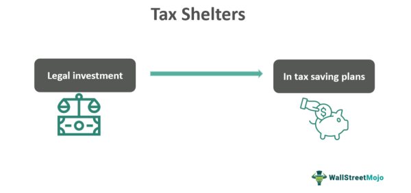

In today’s rapidly evolving financial landscape, achieving optimal returns while minimizing tax obligations is a top priority for traders and investors. One key area that can significantly impact tax efficiency is the management of tax lots. Tax lots are essential components of trading strategies, as they allow for the identification of specific shares or securities acquired at a particular time and price. This helps in calculating the capital gains tax more precisely. By efficiently managing tax lots, traders and investors can realize substantial tax savings.

The advent of algorithmic trading has revolutionized the way complex trading strategies are executed. With pre-defined instructions, algorithms can operate at speeds and frequencies far beyond human capability, incorporating tax implications into their decision-making processes. This advancement facilitates the implementation of sophisticated strategies aimed at reducing tax liabilities without compromising returns.



This article explores how tax lots can be harnessed within investment strategies to reduce tax burdens, especially under algorithmic trading settings. By effectively managing and leveraging tax lots, traders have the potential to enhance their net profits significantly.

## Table of Contents

## Understanding Tax Lots in Investing

Tax lots are critical components in investment strategies as they refer to specific groupings of shares or securities acquired at the same time and price. Each tax lot possesses a unique cost basis, which is pivotal in calculating capital gains or losses. The cost basis is the original value of an asset for tax purposes, adjusted for factors such as stock splits, dividends, and return of capital distributions. Accurately determining the cost basis is essential as it directly affects the calculation of taxable capital gains upon the sale of securities.

To efficiently manage tax lots, investors and traders must calculate potential tax liabilities and optimize their investment strategies accordingly. This involves keeping detailed records of each acquisition and understanding the implications of different methods for handling tax lots. The choice of method can significantly affect the amount of capital gains tax paid. There are three primary methods for tax lot accounting: FIFO (First-In, First-Out), LIFO (Last-In, First-Out), and Specific Identification.

- **FIFO (First-In, First-Out)**: This method assumes that the earliest acquired securities are sold first. It is straightforward and can sometimes result in higher capital gains if older lots have a lower cost basis than more recent acquisitions. However, it can be beneficial in rising markets where the older stocks were purchased at a lower price.

- **LIFO (Last-In, First-Out)**: Under LIFO, the most recently acquired securities are considered sold first. This method can help reduce taxable gains in declining markets, as it allows the sale of newer stocks with a potentially higher cost basis. However, LIFO is not permitted for tax purposes in every jurisdiction, so it is essential to verify its legality.

- **Specific Identification**: This method provides the most flexibility, allowing investors to choose which exact shares or securities to sell. By strategically selecting tax lots with a higher cost basis, investors can minimize their capital gains and, consequently, their tax liability. This method requires meticulous record-keeping and may involve more complex calculations.

Consider the following Python code snippet to visualize how different cost basis methods can impact tax calculations:

```python
def calculate_tax_liability(sale_price, quantity, method, tax_lots):
    capital_gains = 0

    if method == 'FIFO':
        tax_lots.sort(key=lambda x: x['acquisition_date'])
    elif method == 'LIFO':
        tax_lots.sort(key=lambda x: x['acquisition_date'], reverse=True)

    for lot in tax_lots:
        if quantity <= 0:
            break
        lot_quantity = min(lot['quantity'], quantity)
        capital_gains += lot_quantity * (sale_price - lot['cost_basis'])
        quantity -= lot_quantity

    return capital_gains

# Example tax lots
tax_lots = [
    {'acquisition_date': '2022-01-01', 'quantity': 50, 'cost_basis': 100},
    {'acquisition_date': '2022-06-01', 'quantity': 50, 'cost_basis': 150}
]

sale_price = 200
quantity_to_sell = 50

print("FIFO Capital Gains:", calculate_tax_liability(sale_price, quantity_to_sell, 'FIFO', tax_lots))
print("LIFO Capital Gains:", calculate_tax_liability(sale_price, quantity_to_sell, 'LIFO', tax_lots))
```

In this code snippet, we simulate different tax lot accounting methods to determine their impact on capital gains. The `calculate_tax_liability` function calculates capital gains based on the specified method. By understanding and choosing the appropriate method for handling tax lots, investors can align their tax strategy with their financial goals, ultimately optimizing their tax efficiency.

## The Role of Algorithmic Trading in Tax Optimization

Algorithmic trading revolutionizes the financial markets by leveraging pre-defined instructions to execute trades at speeds and frequencies far beyond human capabilities. Central to its advantage is the capacity to integrate tax lot optimization within its core strategy, allowing traders to enhance their tax efficiency and, consequently, their net returns.

In this sophisticated trading environment, algorithms are designed to evaluate vast amounts of data in real-time, making decisions based on pre-set rules. These rules can include components specifically crafted to optimize the selection and management of tax lots, aiming to reduce capital gains tax obligations. By programming algorithms to consider the tax implications of each transaction, traders can automate practices that enhance tax efficiency.

For instance, developers can code logic to identify and select specific tax lots that have higher purchase prices when selling securities. This choice can reduce the taxable gain or increase a loss, thereby minimizing the capital gains tax. Consider a scenario where an investor holds multiple tax lots of a stock purchased at various prices:

```python
import pandas as pd

# Example data of tax lots, where 'shares' is the quantity and 'purchase_price' is per share
tax_lots = pd.DataFrame({
    'shares': [100, 150, 200],
    'purchase_price': [50, 55, 60]
})

# Market sale price per share
sale_price = 65

# Calculate potential taxable gains
tax_lots['potential_gain'] = (sale_price - tax_lots['purchase_price']) * tax_lots['shares']

# Select the tax lot with the lowest potential gain
selected_lot = tax_lots.loc[tax_lots['potential_gain'].idxmin()]
```

In this example, the algorithm identifies the tax lot with the lowest potential gain, allowing for optimal tax efficiency. By doing so, [algorithmic trading](/wiki/algorithmic-trading) can systematically apply tax-efficient practices without human intervention, ensuring that decisions are made swiftly and consistently in response to market conditions.

Moreover, these systems can dynamically adjust their strategies in real-time, accounting for changes in tax laws or market conditions. This adaptability ensures that traders are not only responsive but also proactive in seeking the most advantageous tax outcomes.

Through careful programming, developers ensure that the trading systems engage in behaviors that align with both market objectives and tax efficiency goals. This integration of tax lot optimization into algorithmic trading systems represents a powerful tool for reducing capital gains tax, ultimately allowing traders to preserve more of their profits.

## Strategies for Reducing Tax Liabilities Using Tax Lots

In the pursuit of tax efficiency, understanding and employing strategies related to tax lots can significantly reduce tax liabilities. One of the primary methodologies employed is the Specific Identification method. This method allows investors and traders to select particular tax lots to sell, thereby strategically choosing those with the lowest cost basis to minimize capital gains. Implementing such a strategy can be instrumental when seeking to lower taxable income.

Another effective tactic is tax-loss harvesting. This involves selling securities at a loss to offset capital gains from other investments. Through this approach, investors can reduce their taxable income. Algorithmic trading systems can be particularly advantageous for tax-loss harvesting, as they possess the capability to execute these transactions automatically and in real time. By analyzing market data and determining which tax lots to sell, algorithms can efficiently harvest losses to offset gains.

Moreover, algorithms have the potential to expertly manage the balance between short-term and long-term gains. The tax implications of short-term and long-term gains vary, often with long-term gains being taxed at a more favorable rate under current tax laws. By utilizing tax lots intelligently, algorithms can identify opportunities to shift gains from short-term to long-term or vice versa, optimizing the overall tax outcomes.

Maximizing the benefits of these strategies requires a systematic approach. For instance, a Python-based algorithm might include a decision-making process that evaluates current holdings, identifies low-basis tax lots, and executes strategic trades for loss harvesting. An example Python snippet could look like this:

```python
def optimize_tax_lots(portfolio):
    tax_lots = portfolio.get_tax_lots()
    # Select tax lots with the lowest cost basis
    selected_lots = sorted(tax_lots, key=lambda lot: lot.cost_basis)

    for lot in selected_lots:
        if should_harvest_loss(lot):
            execute_sell_order(lot)
        elif should_convert_gain(lot):
            hold_for_long_term(lot)

def should_harvest_loss(lot):
    # Logic to determine if a lot should be sold for tax-loss harvesting
    current_value = lot.current_value
    return current_value < lot.cost_basis

def should_convert_gain(lot):
    # Logic to determine if a gain should be held for long-term
    holding_period = lot.holding_period
    return holding_period < required_period_for_long_term
```

In this example, the algorithm sorts tax lots by their cost basis and evaluates whether they should be sold to offset gains or held to transition gains from short-term to long-term, maximizing tax efficiency.

Overall, by employing the Specific Identification method, engaging in tax-loss harvesting, and balancing the nature of gains, investors can significantly influence their taxable outcomes. Using algorithmic solutions can further enhance the efficiency and effectiveness of these strategies, ensuring compliance and optimization in real-time.

## Challenges and Considerations in Tax Lot Management

Tax lot management is an important aspect of investment strategies that can significantly affect tax liabilities. However, navigating this area requires a deep understanding of the rules and regulations set by the Internal Revenue Service (IRS). Here, we address some of the key challenges and considerations in managing tax lots effectively.

### Understanding IRS Rules and Regulations

Investors must familiarize themselves with IRS stipulations regarding tax lots to optimize their investment strategies legally and efficiently. IRS guidelines govern the way tax lots are handled, including cost basis calculation methods like First-In, First-Out (FIFO), Last-In, First-Out (LIFO), and Specific Identification. Each method has distinct implications for tax liabilities, necessitating a strategic approach to choosing the most suitable method for individual investment goals.

### Risks Associated with Wash Sale Rules

The wash sale rule presents a significant challenge in tax lot management. This rule prohibits claiming a tax deduction for a security sold at a loss if the same or a substantially identical security is purchased within 30 days before or after the sale. This can complicate strategies that involve tax-loss harvesting, where securities are sold at a loss to offset capital gains. If a wash sale occurs, the intended tax benefit may be deferred, potentially altering the effectiveness of tax efficiency strategies.

### Complexity in Managing Multiple Accounts and Securities

Investors who manage multiple accounts and diverse portfolios face the added complexity of efficiently tracking and optimizing numerous tax lots. This complexity heightens the need for sophisticated algorithmic solutions. Algorithms can help automate the process, selecting the best tax lots to sell based on predefined tax-efficiency criteria. However, the effectiveness of these solutions depends on constant synchronization between trading and accounting systems to ensure accurate tracking of each security’s cost basis and holding period.

### Synchronization of Trading and Accounting Systems

For tax lot management to be effective, seamless integration between trading and accounting systems is crucial. Discrepancies or delays in synchronization can lead to inaccurate tax reporting and suboptimal tax strategies. Advanced software solutions can facilitate this integration, offering real-time data updates and reconciliations across platforms. Investors must ensure that their chosen solutions are capable of providing streamlined, reliable connections between their accounting and trading activities.

By keeping these considerations in mind and leveraging technology, investors can enhance their tax lot management strategies while mitigating associated risks and challenges.

## Future Trends in Tax-Efficient Algorithmic Trading

Algorithmic trading has traditionally relied on quantitative models and pre-set rules to execute trades, but the integration of [artificial intelligence](/wiki/ai-artificial-intelligence) (AI) and [machine learning](/wiki/machine-learning) (ML) introduces new dimensions for optimizing tax efficiency. These technologies enhance the precision and adaptability of trading algorithms, potentially leading to more efficient management of tax lots.

AI and ML can process vast datasets to identify patterns and predict market movements. This capability allows trading algorithms to dynamically adjust their strategies based on real-time data, increasing the potential for tax-efficient trading. For instance, machine learning models can be trained to recognize opportunities for tax-loss harvesting more effectively, thereby reducing an investor's taxable income.

Emerging technologies not only improve the identification of optimal tax lots to sell but also facilitate the management of complex portfolios across different accounts and securities. Advanced analytics can be employed to forecast tax scenarios and simulate the tax impact of various trading strategies. Such simulations enable traders to select strategies that align with their tax optimization goals.

As financial regulations become more intricate, there's a growing need for trading platforms that can seamlessly integrate advanced tax management tools. These platforms could automate the process of tax lot selection, taking into account factors such as holding period, potential capital gains, and the investor's broader tax situation. This automation reduces the manual burden on traders and enhances compliance with tax regulations.

The continuous advancements in fintech are likely to offer even more ways to leverage tax optimization. For instance, blockchain technology could provide transparent and immutable records of tax lots, thereby simplifying auditing processes. Moreover, smart contracts could automate complex tax optimization tasks based on predefined criteria and triggers.

The evolving landscape of financial technology suggests that AI-driven algorithmic trading solutions may soon become integral to tax-efficient investment strategies. As these technologies become more prevalent, traders who embrace them are likely to gain a competitive edge in achieving tax efficiency. Innovations in AI and ML not only improve the speed and accuracy of trading decisions but also significantly enhance the potential for managing and optimizing tax lots, thereby maximizing net returns.

## Conclusion

Tax lots are integral to creating tax-efficient investment strategies, particularly within the realm of algorithmic trading. These groupings of securities, each with unique acquisition costs, influence capital gains calculations significantly. By understanding and utilizing tax lot methods, investors can markedly reduce their tax liabilities. For instance, employing strategies like Specific Identification allows investors to selectively liquidate tax lots based on their cost basis, directly impacting taxable gains and losses.

Algorithmic trading not only accelerates transaction execution but also enables precise control over tax outcomes. By integrating tax lot strategies into trading algorithms, investors can proactively manage tax implications. Algorithms can be coded to optimize the selection of tax lots in a manner that minimizes capital gains tax, thereby enhancing net profit.

As technology progresses, the relationship between tax optimization and algorithmic trading is expected to strengthen. Advancements in artificial intelligence and machine learning may further enhance tax-efficient strategies, providing tools to navigate complex tax regulations and maximize gains. Investors aiming to optimize their net returns should consider leveraging these technologies to integrate tax-efficient strategies into their trading frameworks.

## References & Further Reading

[1]: ["Reducing Capital Gains Tax Obligations by Correctly Using Tax Lots"](https://www.kiplinger.com/taxes/ways-to-minimize-a-higher-capital-gains-tax-rate) by John M. Connolly, Journal of Financial Taxes.

[2]: ["The Basics of Tax Lot Accounting"](https://www.investopedia.com/terms/t/taxlotaccounting.asp) by Wayne Duggan, Forbes Advisor.

[3]: Bergstra, J., Bardenet, R., Bengio, Y., & Kégl, B. (2011). ["Algorithms for Hyper-Parameter Optimization."](https://proceedings.neurips.cc/paper/2011/file/86e8f7ab32cfd12577bc2619bc635690-Paper.pdf) Advances in Neural Information Processing Systems 24.

[4]: ["Algorithmic Trading: Winning Strategies and Their Rationale"](https://books.google.com/books/about/Algorithmic_Trading.html?id=WAlFDwAAQBAJ) by Ernest P. Chan

[5]: ["Advances in Financial Machine Learning"](https://www.amazon.com/Advances-Financial-Machine-Learning-Marcos/dp/1119482089) by Marcos Lopez de Prado

[6]: ["Quantitative Trading: How to Build Your Own Algorithmic Trading Business"](https://github.com/LucindaYa/quant-resources/blob/master/Quantitative%20Trading%20How%20to%20Build%20Your%20Own%20Algorithmic%20Trading%20Business.pdf) by Ernest P. Chan