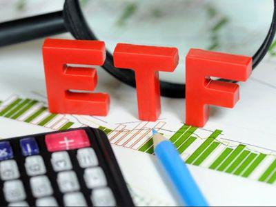

The world of investing offers a myriad of opportunities, each with its own set of challenges and benefits. Investors are constantly seeking financial instruments that not only protect their portfolios from risk but also enhance potential returns. Among these options, VIX ETFs are a sophisticated tool for those aiming to hedge against or capitalize on market volatility.

VIX ETFs, derived from the Volatility Index (VIX), play a critical role in the investment landscape by providing exposure to market volatility without the need to engage directly with complex futures markets. These financial products allow investors to navigate the ebb and flow of market sentiment, capturing gains or mitigating losses during times of economic uncertainty. Understanding the structure, risks, and potential of VIX ETFs can be essential for both individual and institutional investors seeking diversification and resilience in their portfolios.



This article examines the intricacies of VIX ETFs, highlighting how they function, the associated risks, and how they can be integrated into an algorithm-driven investment portfolio. Leveraging algorithmic trading strategies, investors can enhance their decision-making processes and improve the efficiency of managing volatile assets like VIX ETFs. This automated approach can offer a significant advantage, optimizing entry and exit points based on volatility forecasts and reducing the emotional biases that often accompany human-managed trades during turbulent market periods.

By exploring these dynamics, the article aims to provide a comprehensive overview of VIX ETFs, offering insights into their strategic application and potential benefits, while acknowledging the substantial risks involved. Through careful integration into an algorithmic trading framework, investors can potentially unlock new avenues for portfolio management and performance optimization.

## Table of Contents

## Understanding the Volatility Index (VIX)

The Volatility Index, abbreviated as VIX, serves as an essential indicator of market sentiment, often termed the "fear index." This index provides a quantitative measure of the market's expectations regarding the near-term volatility of the S&P 500, specifically over the next 30 days. It derives its calculations from the prices of S&P 500 index options, assessing the market's anticipation of future volatility levels.

Mathematically, the VIX represents the square root of the risk-neutral expectation of the S&P 500's return variance over the following month. As it stands, the formula used by the Chicago Board Options Exchange (CBOE) to compute the VIX is:

$$
\text{VIX} = 100 \times \sqrt{\frac{2}{T} \sum_{i} \frac{\Delta K_i}{K_i^2} e^{RT} Q(K_i) - \frac{1}{T} \left( \frac{F}{K_0} - 1 \right)^2 }
$$

In this equation, $T$ represents the time to expiration of the options, $K_i$ signifies the strike prices, $\Delta K_i$ denotes the interval between strike prices, $R$ is the risk-free [interest rate](/wiki/interest-rate-trading-strategies), $Q(K_i)$ is the midpoint of the bid and ask quote for each option with strike $K_i$, and $F$ is the forward index level derived from the option prices.

The VIX is particularly known for its propensity to spike during periods of market distress or significant uncertainty, during which investor anxiety tends to rise sharply. These spikes indicate a heightened expectation of future [volatility](/wiki/volatility-trading-strategies), reflecting growing concerns about potential declines in market prices. Consequently, the VIX serves as a barometer for assessing the prevailing level of fear or confidence among investors, offering insight into the overall mood of the market.

## What is a VIX ETF?

VIX ETFs are sophisticated financial instruments designed to provide investors with exposure to market volatility. Primarily, these ETFs are linked to the Volatility Index, commonly known as the VIX, which measures anticipated 30-day volatility of the S&P 500 index. Rather than being directly correlated with the VIX itself, most VIX ETFs are linked to futures contracts on the VIX. This crucial distinction means that VIX ETFs do not perfectly mimic the VIX, but instead reflect the expected future path of market volatility as implied by these futures.

The primary advantage of VIX ETFs lies in their ability to offer exposure to market volatility without requiring investors to engage directly with the complexities of futures trading. By purchasing shares of a VIX [ETF](/wiki/etf-trading-strategies), investors can position themselves to benefit from or hedge against fluctuations in market volatility. This mechanism allows for broader participation in volatility trading, as it simplifies access to volatility-based strategies that might otherwise necessitate specialized knowledge and experience in managing futures contracts.

A typical VIX ETF may hold futures contracts with varying expiration dates to maintain exposure. As time progresses and contracts near expiration, fund managers must "roll" these contracts from one month to the next. This involves selling contracts that are nearing expiration and purchasing contracts further out in time. This roll process can lead to costs, particularly in periods of contango, where the futures prices are higher than the spot price of the index, potentially eroding returns over time.

For investors keen to incorporate volatility strategies into their portfolio, understanding these nuances is essential. They must be aware that the behavior of VIX ETFs is largely dependent on the structure and pricing of the underlying futures, which can differ significantly from the movements of the VIX itself. Consequently, while VIX ETFs provide a vehicle for gaining volatility exposure, they come with unique characteristics and risks that must be carefully considered in the context of an overall investment strategy.

## The Role of VIX ETFs in a Portfolio

VIX ETFs represent a strategic component within investment portfolios, particularly for those aiming to manage exposure to market volatility. These financial instruments offer an opportunity to hedge against market downturns by providing potential gains during periods of heightened market turbulence, when traditional assets may falter. When volatility increases, typically indicated by a rising VIX, the value of VIX ETFs can rise as well, offering a counterbalance to declining equity values in portfolios.

Investors may also employ VIX ETFs to speculate on future volatility, leveraging these instruments to enhance their portfolio's diversification. By doing so, they can potentially improve resilience against unforeseen market events. However, this strategic inclusion necessitates a comprehensive understanding of both the behavior of VIX ETFs and the inherent risks involved. The performance of these ETFs is influenced by factors ranging from the term structure of VIX futures to the path dependency of their returns. 

Moreover, it's important to note that VIX ETFs often engage with futures contracts rather than the spot index itself, which introduces complexities such as contango and backwardation into the investment equation. Contango refers to a situation where the futures price is higher than the expected future spot price, which can erode returns as futures contracts roll over. Conversely, backwardation occurs when the futures price is below the expected future spot price, potentially benefiting the ETF's performance. As such, investors must remain vigilant about these contract dynamics to avoid potential performance pitfalls.

Overall, while VIX ETFs can serve as effective portfolio tools, they demand a strategic approach, integrating them in a way that aligns with the broader investment goals and risk tolerance of the portfolio. Understanding how to utilize these instruments effectively can help mitigate risks and capitalize on volatility-driven market opportunities.

## Risks Associated with VIX ETFs

VIX ETFs are complex financial products that attempt to track the performance of the Volatility Index (VIX) through the use of futures contracts. However, they often fail to perfectly mirror the VIX due to the inherent characteristics of these futures. The discrepancy stems primarily from the process of rolling futures contracts, which can lead to performance decay over time.

The futures roll process involves selling near-term futures contracts and purchasing longer-term ones as they approach expiration. This process is susceptible to "contango," a market condition where longer-dated futures are priced higher than near-term ones. As a result, VIX ETFs may incur a cost at each roll-over, negatively impacting their value over time and leading to potential long-term losses for investors.

Moreover, inverse and leveraged VIX ETFs present additional challenges. These products are designed to provide amplified exposure to the VIX, either by offering returns that are inversely proportional to the VIX or magnifying gains and losses through leverage. The inherent volatility of the VIX, combined with the daily reset feature typical of leveraged ETFs, can exacerbate risks. For example, leveraged ETFs reset their leverage daily, which can lead to significant compounding effects, particularly during periods of high volatility. This daily recalibration can cause the ETF's performance to diverge significantly from expected long-term behavior, especially in volatile markets.

Investors considering VIX ETFs must therefore exercise strategic positioning and care. Understanding the intricacies of the futures roll process and the specific design of leveraged and inverse products is crucial to managing the heightened risks associated with these investment vehicles.

## Algorithmic Trading and VIX ETFs

Algorithmic trading significantly enhances the management of VIX ETFs by automating the execution of buy and sell orders based on pre-defined criteria and sophisticated models. These algorithms assess a vast array of market indicators and predictions, optimizing entry and [exit](/wiki/exit-strategy) points specifically tailored to market volatility forecasts. The core advantage lies in the algorithm's ability to process massive volumes of data at high speeds, reacting to volatility shifts in real-time without the delays inherent in human decision-making.

In terms of structure, a typical algorithm for trading VIX ETFs might incorporate various statistical methods and [machine learning](/wiki/machine-learning) techniques to predict short-term market movements. Here is a simplified outline and Python code snippet illustrating the basic structure of such an algorithm:

```python
import numpy as np
from sklearn.linear_model import LinearRegression

def volatility_forecast(data):
    # Simulate past volatility data (e.g., daily VIX changes)
    X = np.array(range(len(data))).reshape(-1, 1)
    y = np.array(data)

    # Linear regression model for simplicity
    model = LinearRegression().fit(X, y)
    predicted = model.predict([[len(data) + 1]])

    return predicted[0]

def trade_decision(current_pred, threshold=0.05):
    # Simple decision rule based on predicted volatility
    if current_pred > threshold:
        return "Buy VIX ETF"
    elif current_pred < -threshold:
        return "Sell VIX ETF"
    else:
        return "Hold"

# Example usage
historical_volatility_data = [0.02, 0.03, 0.05, 0.07, 0.06]  # Hypothetical VIX daily changes
prediction = volatility_forecast(historical_volatility_data)
trade_action = trade_decision(prediction)
print(f"Trade Action: {trade_action}")
```

The algorithm predicts volatility using historical data and makes trading decisions based on forecasted changes. Algorithmic interventions mitigate risks linked to human emotion, especially relevant in market conditions marked by frequent and rapid changes. By utilizing statistical models for forecasting, such systems systematically remove biases that often impair human-driven trades.

Furthermore, [algorithmic trading](/wiki/algorithmic-trading) extends beyond simple regression models, employing advanced approaches like neural networks or support vector machines for more accurate predictions. These methods can be adapted to various market conditions, allowing a dynamic and responsive trading strategy essential for VIX ETF management. Through these automated operations, investors can efficiently balance the complex dynamics of volatility-related investments, optimizing their portfolios even in the face of unpredictable market upheavals.

## Conclusion

VIX ETFs represent a sophisticated investment avenue for those seeking to hedge against or capitalize on market volatility. These financial instruments allow investors to engage with market sentiment dynamics, providing a counterbalance in volatile conditions by enabling speculation on future volatility or protection against potential downturns. Despite the compelling advantages, investors must remain vigilant of the inherent risks involved. The imperfect tracking of the VIX due to the characteristics of futures contracts and the decay over time caused by the futures roll process can lead to potential long-term losses. Additionally, inverse and leveraged VIX ETFs introduce amplified risks that necessitate thorough analysis and strategic management.

Utilizing algorithmic trading strategies to manage VIX ETFs in a portfolio can significantly enhance decision-making efficiency and portfolio resilience. Automated trading algorithms can optimize entry and exit points based on volatility forecasts, minimizing the impact of human emotion during turbulent market conditions. This strategic integration not only provides hedging benefits but also opens avenues for speculative gains, enhancing overall portfolio performance. For sophisticated investors, the combination of VIX ETFs and algorithm-driven tactics offers a potent mechanism for navigating market uncertainties and capitalizing on volatility-driven opportunities.

## References & Further Reading

[1]: Whaley, R. E. (2009). ["Understanding the VIX."](https://www.researchgate.net/publication/277429711_Understanding_the_VIX) Journal of Portfolio Management. 

[2]: Jegadeesh, N., & Titman, S. (1993). ["Returns to Buying Winners and Selling Losers: Implications for Stock Market Efficiency."](https://www.jstor.org/stable/2328882) Journal of Finance.

[3]: ["VIX Futures and Options"](https://www.cboe.com/tradable_products/vix/vix_futures/) by the Chicago Board Options Exchange (CBOE)

[4]: Alexander, C. (2008). ["Market Risk Analysis Volume II: Practical Financial Econometrics"](https://pdfs.semanticscholar.org/159a/c49d31ebb0e594e993935a463c42c97874e6.pdf) by Carol Alexander.

[5]: Black, F., & Scholes, M. (1973). ["The Pricing of Options and Corporate Liabilities."](https://www.cs.princeton.edu/courses/archive/fall09/cos323/papers/black_scholes73.pdf) Journal of Political Economy.

[6]: ["Volatility: Practical Options Theory"](https://www.amazon.com/Volatility-Practical-Options-Theory-Finance/dp/111950161X) by Adam S. Iqbal.