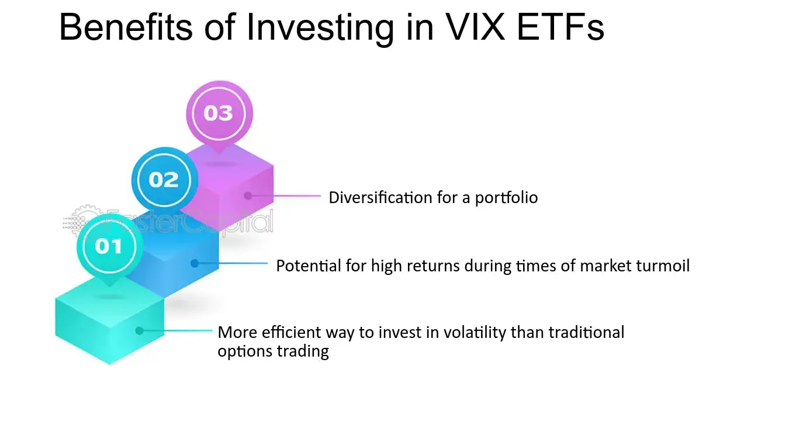

## Table of Contents

## What is the VIX and how does it measure market volatility?

The VIX, or the CBOE Volatility Index, is a tool that measures how much people expect the stock market to move up or down in the future. It's often called the "fear gauge" because it shows how worried or calm investors are about the market. The VIX is calculated using the prices of options on the S&P 500, which are contracts that give people the right to buy or sell the index at a certain price. When the VIX is high, it means that people expect big changes in the market, and when it's low, they expect smaller changes.

The VIX doesn't predict the direction of the market, just how much it might move. For example, if the VIX is at 20, it means that people expect the S&P 500 to move up or down by about 20% over the next year. This can be useful for investors because it helps them understand how risky the market might be. If the VIX is high, investors might want to be more careful with their investments, while a low VIX might make them feel more confident.

## What are VIX ETFs and how do they track the VIX?

VIX ETFs, or Exchange Traded Funds, are investment products that try to follow the performance of the VIX. They give investors a way to bet on how much the stock market might move without having to buy options directly. These ETFs don't actually hold the VIX itself because you can't invest in the VIX directly. Instead, they use other financial tools like futures contracts to try to match the VIX's movements.

Tracking the VIX can be tricky because the VIX changes a lot and can be hard to predict. VIX ETFs usually use a method called "rolling" to keep up with the VIX. This means they buy and sell futures contracts that are about to expire and replace them with new ones. This process can lead to something called "contango," where the price of future contracts is higher than the current price, which can make the ETF lose value over time even if the VIX stays the same. So, while VIX ETFs can be useful for short-term trading, they can be risky for long-term investments.

## How can VIX ETFs be used in a diversified investment portfolio?

VIX ETFs can be a useful part of a diversified investment portfolio because they help manage risk. When the stock market gets shaky, the VIX usually goes up. By adding a VIX ETF to your portfolio, you can balance out losses in your stocks. For example, if your stocks go down because the market is volatile, the VIX ETF might go up, which could help lessen the impact on your overall portfolio. This is called a hedge, and it's like having an insurance policy for your investments.

However, using VIX ETFs in a portfolio needs careful thought. They are not meant for long-term holding because they can lose value over time due to how they are structured. They are better for short-term strategies, like when you think the market will get more volatile soon. It's important to keep an eye on them and understand that they can be risky. So, while they can be a helpful tool for managing risk, they should be just one small part of a bigger, well-thought-out investment plan.

## What are the benefits of including VIX ETFs in an investment strategy?

Including VIX ETFs in an investment strategy can help protect your money when the stock market gets bumpy. When stocks go down because the market is volatile, VIX ETFs often go up. This can help balance out the losses in your portfolio, acting like a safety net. By having a VIX ETF, you can feel a bit more secure knowing that if the market takes a sudden dip, your VIX ETF might gain value and help cushion the blow.

However, VIX ETFs aren't perfect and they come with their own set of challenges. They are not good for long-term holding because they can lose value over time due to how they are made. They work best for short-term moves when you think the market will get more volatile soon. So, while VIX ETFs can be a smart way to manage risk, they should be just a small part of your overall plan. It's important to watch them closely and understand the risks involved.

## What are the risks associated with investing in VIX ETFs?

Investing in VIX ETFs comes with some big risks that you should know about. One main risk is that VIX ETFs are not good for holding onto for a long time. They lose value over time because of how they are made. They use something called futures contracts, which can be more expensive in the future than they are now. This can make the ETF go down in value even if the VIX stays the same. This is called "contango," and it can eat away at your money if you keep the ETF for too long.

Another risk is that VIX ETFs can be very unpredictable and move a lot in a short time. Because they are meant to follow the VIX, which measures how much the market might move, they can jump up and down quickly. This can be good if you're trying to make quick money, but it can also mean big losses if the market doesn't move the way you think it will. So, if you're not ready for these big swings, VIX ETFs might not be the best choice for you.

## How do VIX ETFs perform during different market conditions?

VIX ETFs usually do well when the stock market is going through rough times. When stocks are falling and the market is feeling shaky, the VIX, which measures how much the market might move, goes up. This means VIX ETFs, which follow the VIX, also go up. So, if you have VIX ETFs in your portfolio during a market downturn, they can help make up for the losses you might be seeing in your other investments. This is why some people use VIX ETFs as a kind of insurance against market drops.

But, when the stock market is calm and doing well, VIX ETFs usually don't do so great. During these times, the VIX is low because people aren't expecting big changes in the market. This means VIX ETFs will go down in value. Also, even if the market stays the same, VIX ETFs can lose money over time because of how they are made. They use futures contracts, and if these contracts cost more in the future than they do now, it can make the ETF lose value. So, VIX ETFs are more useful for short periods when you think the market might get bumpy, not for holding onto for a long time.

## What are the key differences between short-term and mid-term VIX ETFs?

Short-term VIX ETFs are designed to track the VIX over a very short period, usually one or two months. They use futures contracts that are about to expire soon, which makes them very sensitive to quick changes in the market. If you think the market will get really volatile soon, these ETFs can be a good choice because they can go up a lot in a short time. But, they can also lose value quickly if the market stays calm, and they are not good for holding onto for a long time because of how they work.

Mid-term VIX ETFs, on the other hand, track the VIX over a longer period, usually about five to six months. They use futures contracts that are further away from expiring, which makes them less sensitive to immediate market changes but still responsive to longer-term volatility. These ETFs can be useful if you think the market will stay volatile for a while, but they still face the same problem of losing value over time due to the way they are structured. So, while they might not react as quickly as short-term VIX ETFs, they can be a bit more stable for slightly longer periods.

## How can VIX ETFs be used for hedging against market downturns?

VIX ETFs can be a good tool for protecting your money when the stock market starts to go down. When stocks lose value because the market is getting more volatile, the VIX, which measures how much the market might move, usually goes up. This means that VIX ETFs, which try to follow the VIX, also go up. So, if you have some VIX ETFs in your portfolio, they can help make up for the losses you might be seeing in your other investments. It's like having a safety net that catches you if the market falls.

But, you need to be careful with VIX ETFs because they are not meant to be kept for a long time. They can lose value over time because of how they are made, using something called futures contracts. These contracts can be more expensive in the future than they are now, which can make the ETF go down in value even if the VIX stays the same. So, VIX ETFs are best used for short periods when you think the market might get bumpy soon. They can be a smart way to manage risk, but they should be just a small part of your overall plan, and you should watch them closely.

## What are some common strategies for trading VIX ETFs?

One common strategy for trading VIX ETFs is to use them as a short-term hedge against market downturns. When you think the stock market might get shaky, you can buy VIX ETFs. They usually go up when the market gets more volatile, which can help balance out losses in your other investments. This strategy works best if you only hold the VIX ETFs for a short time, like a few days or weeks, because they can lose value over time due to how they are made.

Another strategy is to trade VIX ETFs based on the market's fear and greed. When investors are scared and the market is dropping, the VIX goes up, and VIX ETFs follow suit. You can buy VIX ETFs when you see this fear starting and then sell them when things calm down. On the other hand, when the market is calm and the VIX is low, you might want to sell or avoid buying VIX ETFs because they will likely lose value.

Some people also use VIX ETFs for more advanced trading, like trying to make money from the big swings in the VIX. This can be riskier but can also be rewarding if you time it right. You might buy VIX ETFs when you think a big event will make the market more volatile and then sell them after the event when the VIX goes back down. But remember, this kind of trading needs a lot of watching and understanding of the market, and it's not for everyone.

## How do fees and expenses impact the returns of VIX ETFs?

Fees and expenses can really affect how much money you make from VIX ETFs. These ETFs often have higher fees than regular ETFs because they are more complicated to manage. They use futures contracts, which need a lot of work to keep up with the VIX. These fees come out of your investment, so they can eat into your returns. If the VIX ETF goes up by 5% but you have to pay 1% in fees, you only get to keep 4% of that gain.

Over time, these fees can add up and make a big difference in your overall returns. Since VIX ETFs are not meant to be held for a long time, the impact of fees might not be as big if you're just trading them for a short period. But if you keep them longer, the fees can really start to hurt your money. It's important to look at the expense ratio of any VIX ETF you're thinking about buying, so you know how much it will cost you and can plan your strategy accordingly.

## What are the tax implications of investing in VIX ETFs?

Investing in VIX ETFs can have special tax rules that you need to know about. When you buy and sell VIX ETFs, you might have to pay taxes on any money you make. If you hold the ETF for less than a year, the profit you make is called a short-term capital gain. The tax on this is the same as your regular income tax, which can be pretty high. If you hold it for more than a year, it's a long-term capital gain, and the tax rate is usually lower. But, because VIX ETFs are often used for short-term trading, you might end up paying the higher short-term rate more often.

Another thing to think about is how VIX ETFs use futures contracts. The money you make or lose from these contracts can be treated differently for taxes. Sometimes, the gains or losses from futures are taxed at a special 60/40 rate, where 60% of the gain is taxed as a long-term capital gain and 40% as a short-term capital gain. This can be good because it might lower your overall tax bill. But, it can also make your taxes more complicated, so it's a good idea to talk to a tax expert to understand how it all works for your situation.

## How can advanced investors use VIX ETFs in combination with other derivatives for complex strategies?

Advanced investors can use VIX ETFs along with other derivatives like options and futures to create more complex trading strategies. One way to do this is by using VIX ETFs as part of a volatility arbitrage strategy. In this strategy, investors might buy VIX ETFs when they think the market will get more volatile soon, and at the same time, they might sell options on stocks or indices that they think will stay calm. By doing this, they can make money from the difference between the expected volatility in the VIX and the actual volatility in the market. This can be a smart way to take advantage of market movements, but it needs a lot of watching and understanding of how the market works.

Another way advanced investors can use VIX ETFs is in a strategy called a "dispersion trade." In this strategy, investors might buy VIX ETFs to bet on overall market volatility, while also buying options on individual stocks that they think will move less than the market as a whole. This can help them make money if the market gets more volatile but the stocks they picked stay calm. This kind of trading can be tricky because it involves balancing different parts of the market, but it can be rewarding if done right. Both of these strategies show how VIX ETFs can be a powerful tool for advanced investors when used with other derivatives, but they also come with a lot of risk and need careful planning.

## What is the Volatility Index (VIX) and how can it be understood?

The Volatility Index, abbreviated as VIX, serves as an essential indicator of market sentiment, often termed the "fear index." This index provides a quantitative measure of the market's expectations regarding the near-term volatility of the S&P 500, specifically over the next 30 days. It derives its calculations from the prices of S&P 500 index options, assessing the market's anticipation of future volatility levels.

Mathematically, the VIX represents the square root of the risk-neutral expectation of the S&P 500's return variance over the following month. As it stands, the formula used by the Chicago Board Options Exchange (CBOE) to compute the VIX is:

$$
\text{VIX} = 100 \times \sqrt{\frac{2}{T} \sum_{i} \frac{\Delta K_i}{K_i^2} e^{RT} Q(K_i) - \frac{1}{T} \left( \frac{F}{K_0} - 1 \right)^2 }
$$

In this equation, $T$ represents the time to expiration of the options, $K_i$ signifies the strike prices, $\Delta K_i$ denotes the interval between strike prices, $R$ is the risk-free [interest rate](/wiki/interest-rate-trading-strategies), $Q(K_i)$ is the midpoint of the bid and ask quote for each option with strike $K_i$, and $F$ is the forward index level derived from the option prices.

The VIX is particularly known for its propensity to spike during periods of market distress or significant uncertainty, during which investor anxiety tends to rise sharply. These spikes indicate a heightened expectation of future [volatility](/wiki/volatility-trading-strategies), reflecting growing concerns about potential declines in market prices. Consequently, the VIX serves as a barometer for assessing the prevailing level of fear or confidence among investors, offering insight into the overall mood of the market.

## References & Further Reading

[1]: Whaley, R. E. (2009). ["Understanding the VIX."](https://www.researchgate.net/publication/277429711_Understanding_the_VIX) Journal of Portfolio Management. 

[2]: Jegadeesh, N., & Titman, S. (1993). ["Returns to Buying Winners and Selling Losers: Implications for Stock Market Efficiency."](https://www.jstor.org/stable/2328882) Journal of Finance.

[3]: ["VIX Futures and Options"](https://www.cboe.com/tradable_products/vix/vix_futures/) by the Chicago Board Options Exchange (CBOE)

[4]: Alexander, C. (2008). ["Market Risk Analysis Volume II: Practical Financial Econometrics"](https://pdfs.semanticscholar.org/159a/c49d31ebb0e594e993935a463c42c97874e6.pdf) by Carol Alexander.

[5]: Black, F., & Scholes, M. (1973). ["The Pricing of Options and Corporate Liabilities."](https://www.cs.princeton.edu/courses/archive/fall09/cos323/papers/black_scholes73.pdf) Journal of Political Economy.

[6]: ["Volatility: Practical Options Theory"](https://www.amazon.com/Volatility-Practical-Options-Theory-Finance/dp/111950161X) by Adam S. Iqbal.