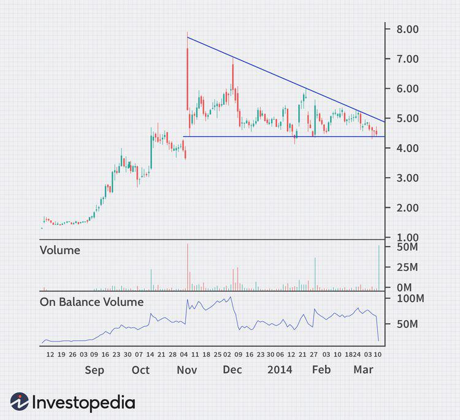

Trading in the stock market necessitates a comprehensive understanding of various patterns and indicators that define market behavior. Among these, the analysis of volume trends and topping patterns stands out as a pivotal approach, guiding traders toward more informed decision-making. Volume trends provide a lens into the market's activity, revealing the underlying strength or weakness of price movements. By examining volume alongside price, traders can discern the commitment of market participants, offering insights into potential continuations or reversals.

Topping patterns, on the other hand, are key indicators of potential market reversals. These patterns form when a security experiences a peak, often amidst heightened emotional and speculative activity, signaling a shift from bullish to bearish sentiment. The analysis of topping patterns, such as the head and shoulders or double tops, is crucial in anticipating and navigating changes in market direction.



This article will explore the utility of volume analysis and emotion-driven patterns, alongside the burgeoning role of algorithmic trading strategies. Algorithmic trading involves the use of automated systems to execute strategies based on predefined criteria, such as volume indicators and pattern recognition, at speeds beyond human capability.

In subsequent sections, we will cover the basics of volume indicators, the identification and implications of topping patterns, and the impact of emotions on market dynamics. The discussion will culminate in advanced algorithmic trading techniques that integrate these elements, providing a comprehensive toolkit for traders seeking to enhance their market strategies.

## Table of Contents

## Understanding Volume Indicators

Volume indicators are integral components in the toolkit of a trader, offering insight into the strength of market trends and potential price directions. By analyzing the volume of trades, these indicators provide a clearer picture of market dynamics, helping traders confirm trends, identify potential reversals, and assess the conviction behind price movements.

One of the most commonly used volume indicators is the On-Balance Volume (OBV). The OBV is a running total of trading volume that adds volume on up days and subtracts it on down days. The concept behind OBV is that volume precedes price movements; thus, an increase in OBV indicates that smart money is flowing into a security, potentially suggesting an upcoming price increase. Conversely, a declining OBV could suggest an impending price decline. The OBV can be calculated as follows:

$$
OBV = \begin{cases} 
OBV_{prev} + V & \text{if } P_{close} > P_{close, prev} \\
OBV_{prev} - V & \text{if } P_{close} < P_{close, prev} \\
OBV_{prev} & \text{if } P_{close} = P_{close, prev} 
\end{cases}
$$

where $OBV_{prev}$ is the previous day's OBV, $V$ is the day's volume, and $P_{close}$ and $P_{close, prev}$ are the current and previous day's closing prices, respectively.

Another vital [volume](/wiki/volume-trading-strategy) indicator is the Volume-Weighted Average Price (VWAP), which provides a measure of the average trading price over a specific period, weighted by volume. VWAP is particularly useful for assessing the average price over a trading session and is often used by institutional traders to improve their execution quality by trading close to the VWAP. The calculation of VWAP is as follows:

$$

VWAP_t = \frac{\sum_{i=1}^{t} (P_i \times V_i)}{\sum_{i=1}^{t} V_i}
$$

where $P_i$ and $V_i$ are the typical price and volume at each period $i$ within time $t$.

Both OBV and VWAP offer traders unique insights into the flow of trading activity that pure price analysis might overlook. By employing these indicators, traders can make more informed decisions, potentially enhancing their ability to capitalize on trends and reversals in the market. These indicators are essential tools for investors looking to gauge market sentiment and make data-driven trading decisions.

## Topping Patterns in Trading

Topping patterns are a critical component in technical analysis, providing signals of potential market reversals from a bullish to a bearish trend. These formations occur when a security reaches a peak before undergoing a downward trend, typically indicating that the upward [momentum](/wiki/momentum) is waning and a decline might follow. Recognizing these patterns allows traders to predict bearish market conditions and adjust their strategies accordingly.

Two of the most widely recognized topping patterns are the Head and Shoulders and the Double Top patterns. 

The Head and Shoulders pattern is characterized by three peaks: a higher central peak (the head) flanked by two lower peaks (the shoulders). This pattern is formed as follows:
1. The left shoulder is created when the price rises to form a peak and then declines.
2. The head is formed when the price rises once more, surpassing the previous peak, and then declines again.
3. The right shoulder is characterized by a rise to a peak lower than the head but similar to the left shoulder, followed by another decline.

Traders interpret the completion of this pattern as a bearish signal, especially if the decline in prices is accompanied by increasing volume, which confirms the strength of the reversal. 

The Double Top pattern consists of two peaks at roughly the same price level, separated by a trough. This indicates that the security has tried and failed twice to break through resistance at the top level, suggesting a reversal to a downward trend. Volume analysis is crucial here: typically, volume is higher on the first peak and lower on the second, indicating diminished buying enthusiasm.

Understanding the nuances of volume during the formation of these patterns greatly aids in assessing the likelihood of a successful reversal. In a Head and Shoulders pattern, for example, a higher volume during the formation of the left shoulder and head compared to the right shoulder can indicate a stronger reversal. Conversely, a Double Top with declining volume on the second peak reinforces the expectation of a downturn.

Python can be utilized effectively for identifying these patterns and analyzing associated volumes. Here is a simplified example of identifying a Double Top pattern using a price series:

```python
def identify_double_top(prices):
    peaks = []
    for i in range(1, len(prices) - 1):
        if prices[i - 1] < prices[i] > prices[i + 1]:
            peaks.append(i)

    # Check for double top
    if len(peaks) < 2:
        return False

    first_peak, second_peak = peaks[:2]
    if abs(prices[first_peak] - prices[second_peak]) < 0.05 * prices[first_peak]:
        return True
    return False

# Example usage
prices = [100, 105, 102, 110, 108, 106, 104, 100]
print(identify_double_top(prices))
```

In practice, algorithmic solutions can further incorporate volume analysis to evaluate the firmness of these patterns. By programming trading algorithms to recognize these signals, traders can automate their responses to market movements, thus harnessing the predictive power of topping patterns in trading strategy development.

## The Role of Emotion in Trading Decisions

Emotion significantly influences trading decisions, affecting market participants' perceptions and actions. This impact often results in patterns that can provide insights into future market movements. When traders are swayed by emotions, such as fear and greed, their decisions may become irrational, deviating from logical and data-driven choices.

A common emotional phenomenon in trading is the transition from bearishness, characterized by fear and pessimism, to excessive bullishness, marked by overconfidence and exuberance. This transition creates risk blindness, a state where traders overlook potential negative outcomes due to a heightened focus on potential gains. Such shifts contribute to the formation of topping patterns, where markets reach a peak before a potential reversal. As traders become excessively optimistic, they may ignore warning signs of an impending decline, leading to unsustainable price levels that eventually trigger a correction.

Understanding these emotional dynamics is crucial for traders aiming to predict market tops and mitigate risks. By recognizing the emotional underpinnings that drive trading behavior, traders can anticipate when market sentiment may be overextended, indicating a potential reversal. Techniques such as sentiment analysis, which evaluates market mood through news, social media, and other channels, can be employed to gauge the emotional state of the market. Additionally, incorporating volume analysis can offer insights into whether a trend is supported by strong market participation or fueled by speculative frenzy.

Algorithmic tools can help manage emotional biases by automating trading decisions based on predefined rules. For example, a Python script could use sentiment analysis to adjust trading strategies dynamically:

```python
import requests

def fetch_sentiment_data():
    response = requests.get('https://api.sentimentanalysis.com/market')
    return response.json()

def determine_market_top(sentiment_score, volume):
    if sentiment_score > 0.8 and volume > 1000000:  # Arbitrary thresholds
        return True
    return False

def execute_trade_decision():
    data = fetch_sentiment_data()
    sentiment_score = data['sentiment_score']
    current_volume = data['volume']

    if determine_market_top(sentiment_score, current_volume):
        print("Executing sell order to mitigate risk.")

execute_trade_decision()
```

By integrating emotional understanding with quantitative data, traders can develop robust strategies that anticipate market reversals induced by emotional extremes. This knowledge not only positions traders to capitalize on market inefficiencies but also provides a safeguard against emotional market swings.

## Algorithmic Trading: Automated Strategies

Algorithmic trading represents a significant evolution in financial markets, utilizing automation to execute trades with remarkable speed and precision. This approach leverages computational algorithms, capable of processing vast amounts of data, to identify potential trading opportunities that are often invisible to manual traders. By incorporating volume analysis and pattern recognition, these algorithms are designed to operate based on pre-defined criteria, allowing for data-driven and emotion-free decision making.

### Speed and Efficiency

One of the primary advantages of [algorithmic trading](/wiki/algorithmic-trading) is the ability to execute trades at speeds that far exceed human capabilities. Algorithms evaluate real-time market conditions, scanning multiple securities across various exchanges within microseconds. This rapid assessment enables traders to exploit fleeting market inefficiencies, such as [arbitrage](/wiki/arbitrage) opportunities or temporary mispricings.

### Volume Analysis in Algorithms

Volume indicators play an integral role in the formation and execution of algorithmic trading strategies. The On-Balance Volume (OBV) and Volume-Weighted Average Price (VWAP) are commonly used metrics that provide insights into trading activity. For instance, OBV considers volume flow to predict changes in stock prices, while VWAP gives a price benchmark by averaging the trading price into volume. By embedding these indicators into automated systems, algorithms can trigger buy or sell signals based on significant shifts in trading volume.

### Pattern Recognition Techniques

Beyond volume analysis, algorithms utilize pattern recognition techniques to identify market trends and potential reversals. Techniques such as neural networks and [machine learning](/wiki/machine-learning) models are employed to recognize complex patterns, such as head and shoulders, flags, or double tops, which may indicate a pending market shift. These patterns are programmed into the algorithm, enabling it to react autonomously when specific conditions are met.

### Practical Application in MQL4

A practical application of algorithmic trading can be illustrated using MetaQuotes Language 4 (MQL4), a programming language for developing automated trading strategies in the MetaTrader platform. Below is a basic example of an MQL4 script that implements a volume-based trading strategy:

```c
//+------------------------------------------------------------------+
//|                                                      VolumeTrade |
//|                        Sample MQL4 Script                        |
//+------------------------------------------------------------------+
#include <Trade\Trade.mqh>
input double VolumeThreshold = 5000; // Volume threshold for triggering trade
input double Lots = 1;
input int Slippage = 3;

void OnTick()
  {
   double volume = iVolume(NULL,0,0);

   if(volume > VolumeThreshold)
     {
      // Check if no position is opened
      if(PositionSelect(Symbol()) == false)
        {
         // Open Buy position
         trade.Buy(Lots, NULL, Ask, Slippage);
        }
     }
  }
//+------------------------------------------------------------------+
```

This script automates the process of buying a stock when its traded volume surpasses a predefined threshold. It highlights the efficiency of using systematic algorithms to respond instantaneously to market movements, minimizing human error and psychological biases.

### Amplifying Decision Making

Ultimately, algorithmic trading amalgamates mathematical models, statistical analysis, and market insights to improve decision-making in trading. By integrating volume analysis and pattern recognition, these computerized systems provide a robust framework for executing trades with accuracy and speed. As technology continues to advance, the sophistication and capabilities of trading algorithms will only increase, offering new strategies and enhancing market [liquidity](/wiki/liquidity-risk-premium).

## Case Studies in Volume and Topping Patterns

Historical case studies in trading reveal the profound impact of volume analysis and topping patterns on market predictions. Two notable examples are Schlumberger, a leading oilfield services company, and Geron Corporation, a biopharmaceutical firm. These cases demonstrate how keen observation of volume dynamics and market sentiment can offer lucrative trading opportunities.

### Schlumberger

In the case of Schlumberger, traders noticed a distinct topping pattern coinciding with significant shifts in global oil prices. During periods of excessive bullish sentiment in the oil sector, Schlumberger's stock often reached a peak characterized by the 'head and shoulders' pattern—a common topping formation. This pattern consists of three peaks, with the middle being the highest, resembling a head and two shoulders.

As Schlumberger's price formed this pattern, a notable increase in trading volume was observed, particularly during the formation of the left shoulder and head. However, as the right shoulder formed, volume diminished, indicating weakening bullish sentiment and the potential for a trend reversal. Traders who recognized this volume-anomaly capitalized on the subsequent downward movement in the stock price, illustrating how volume analysis complements pattern recognition in anticipating market shifts.

### Geron Corporation

Geron Corporation provides another instructive example. The company's stock exhibited a classic 'double top' pattern—a price peak followed by a slightly higher peak. This pattern, often considered a bearish reversal signal, was accompanied by critical volume dynamics. During the first top, trading volume surged, reflecting heightened interest and optimism in Geron's innovative therapies. However, the second peak saw a marked decrease in volume, suggesting the rally was losing momentum.

This divergence between price and volume signaled to astute traders that a reversal might occur. Emotional factors had played a significant role, as over-enthusiasm led to exaggerated price increases. By analyzing the volume alongside the topping pattern, traders who anticipated the correction protected their investments or profited from short positions when the price declined.

### Key Takeaways

These case studies underpin the importance of integrating volume analysis with pattern recognition when evaluating potential market reversals. Recognizing the emotional undercurrents that drive these patterns enhances a trader's ability to navigate market complexities. In both Schlumberger and Geron, traders who understood the signals from volume dynamics and topping patterns successfully anticipated market shifts, optimizing their trading strategies for better outcomes.

## Conclusion

Combining the analytical power of volume analysis, recognition of topping patterns, and comprehension of emotional influences in trading strategies significantly boosts the decision-making process for traders. Volume indicators like On-Balance Volume (OBV) and Volume-Weighted Average Price (VWAP) enable traders to verify the strength of trends and predict potential reversals. Meanwhile, topping patterns, such as head and shoulders or double tops, serve as critical signals for anticipating bearish market conditions. Recognizing these patterns is vital for making informed trading decisions that reduce the risk of sudden market shifts.

An understanding of how emotions drive market behavior provides traders with valuable insights into the psychological aspects influencing market movements. Emotions such as fear and greed can manifest in trading patterns, often leading to irrational actions that signal market tops. By aligning this emotional understanding with technical analysis, traders can better forecast market dynamics, thus improving their risk management strategies.

Algorithmic trading stands out as a powerful tool for traders aiming for precision and efficiency. By automating the execution of trading strategies, traders can handle large volumes of data and complex calculations at speeds unattainable by manual efforts. Integrating algorithms with volume analysis and pattern recognition enables quick, data-backed decisions that tap into market efficiencies. Using platforms like MQL4, traders can automate strategies based on predefined indicators, optimizing their trading performance.

In summary, mastering the trio of volume analysis, pattern detection, and emotional understanding equips traders with a comprehensive framework to anticipate and respond to market movements confidently. As technology advances, algorithmic trading further enhances these capabilities, offering traders a definitive edge in the ever-competitive financial markets. Embracing these elements judiciously can lead to more consistent and successful trading outcomes.

## References & Further Reading

[1]: Bergstra, J., Bardenet, R., Bengio, Y., & Kégl, B. (2011). ["Algorithms for Hyper-Parameter Optimization."](https://dl.acm.org/doi/10.5555/2986459.2986743) Advances in Neural Information Processing Systems 24.

[2]: ["Advances in Financial Machine Learning"](https://www.amazon.com/Advances-Financial-Machine-Learning-Marcos/dp/1119482089) by Marcos Lopez de Prado

[3]: ["Evidence-Based Technical Analysis: Applying the Scientific Method and Statistical Inference to Trading Signals"](https://www.amazon.com/Evidence-Based-Technical-Analysis-Scientific-Statistical/dp/0470008741) by David Aronson

[4]: ["Machine Learning for Algorithmic Trading"](https://github.com/stefan-jansen/machine-learning-for-trading) by Stefan Jansen

[5]: ["Quantitative Trading: How to Build Your Own Algorithmic Trading Business"](https://github.com/LucindaYa/quant-resources/blob/master/Quantitative%20Trading%20How%20to%20Build%20Your%20Own%20Algorithmic%20Trading%20Business.pdf) by Ernest P. Chan

[6]: Bulkowski, T. (2005). ["Encyclopedia of Chart Patterns"](https://www.amazon.com/Encyclopedia-Chart-Patterns-Thomas-Bulkowski/dp/0471668265) (2nd ed.). Wiley Trading.

[7]: Murphy, J. J. (1999). ["Technical Analysis of the Financial Markets: A Comprehensive Guide to Trading Methods and Applications"](https://archive.org/details/technicalanalysi0000murp). New York Institute of Finance.