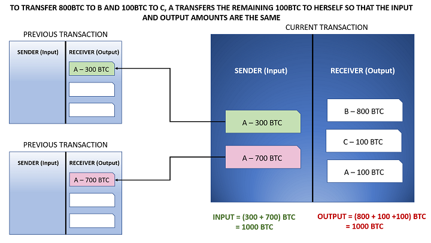

Blockchain technology has become a transformative force across numerous sectors, with finance being one of the most impacted areas. A pivotal element within blockchain architectures is the Unspent Transaction Output (UTXO) model, which is integral to the operation of major cryptocurrencies such as Bitcoin. This model underpins how transactions are recorded and managed on the blockchain, ensuring each transaction is both unique and traceable.

Simultaneously, the rise of algorithmic trading has introduced sophisticated strategies to cryptocurrency markets. These strategies leverage computational algorithms to execute trades at speeds and volumes far exceeding human capabilities. As a result, algorithmic trading has the potential to optimize trading decisions and maximize returns in the fast-paced world of cryptocurrencies.

This article aims to examine the relationship between the UTXO model and algorithmic trading within the cryptocurrency landscape. By understanding how these components work together, we can gain insight into enhancing both the efficiency and security of trading activities. Whether it's through facilitating quicker transaction confirmations or providing a robust framework for trade verification, the UTXO model offers distinct advantages when integrated with algorithmic trading methodologies.

## Table of Contents

## Understanding the UTXO Model

UTXO stands for 'Unspent Transaction Output', a fundamental concept within certain blockchain architectures, particularly those underpinning cryptocurrencies like Bitcoin. This model operates by treating transactions as discrete data segments, maintaining a high degree of integrity and security in the network.

In the UTXO model, each transaction generates an output that is either spent immediately in a subsequent transaction or retained as unspent, thus becoming an input for future transactions. This method of handling transactions ensures that each output is uniquely identifiable and verifiable on the blockchain, contributing significantly to the transparency and audibility of the blockchain network.

The uniqueness of each transaction output in the UTXO model stems from its ability to remain separate from the account balances. Unlike the account/balance model—frequently used in platforms like Ethereum, which consolidates transaction details under a single account—the UTXO model compartmentalizes each transaction. This distinction enhances security as each output can be traced independently, minimizing the risk of mixing and ensuring accountability across the network.

The transaction process in a UTXO model can be better understood through its lifecycle:

1. **Creation**: When a transaction is initiated, it generates one or more outputs. Each output specifies a certain amount of cryptocurrency tied to a recipient address.

2. **Storage**: These outputs remain unspent (UTXOs) until referenced by a specific transaction. This status of being 'unspent' captures the essence of the UTXO model—each transaction piece waits to be utilized in future transactions.

3. **Consumption**: When a new transaction involves one or more existing UTXOs as its inputs, those UTXOs are marked as spent, and the transaction creates new outputs. 

The robustness of the UTXO model is largely attributed to its statelessness, wherein the blockchain does not maintain account balances internally. Instead, the ledger records only transaction outputs and their respective states (spent or unspent), which are validated during transactions. This stateless nature eliminates certain vulnerabilities associated with maintaining global states across the network, making the system resilient to fraud and hacking attempts.

Moreover, the UTXO model facilitates enhanced parallel processing capabilities. Due to the independent nature of each transaction output, transactions can be validated simultaneously, boosting the processing efficiency of the network—an advantage vital for handling high transaction volumes.

In summary, by enabling independent verification of transaction outputs and fostering an environment where each transaction is traceable and secure, the UTXO model underpins the fundamental operational dynamics of many blockchain systems today. Whether applied to high-[volume](/wiki/volume-trading-strategy) transaction scenarios or ensuring the integrity of individual crypto wallets, this model remains indispensable in the contemporary blockchain landscape.

## UTXO Model vs Account/Balance Model

The UTXO (Unspent Transaction Output) model and the account/balance model are the two primary transaction accounting frameworks used in blockchain technologies. Each framework has its own unique characteristics, catering to different [cryptocurrency](/wiki/cryptocurrency) ecosystems and use cases.

The account/balance model, prominently used by platforms like Ethereum, maintains a continuous state that records the balance of each account. This approach simplifies the execution of complex transactions and smart contracts. Smart contracts, which are self-executing contracts with the terms of the agreement directly written into code, benefit greatly from this model because it allows for complex interactions between multiple accounts and their states without requiring reconstruction of past transactions. The stateful nature of the account/balance model ensures that every update to an account’s balance is instantaneous and reflects the current global state.

In contrast, the UTXO model, which is fundamental to Bitcoin, records all transactions as discrete and stateless events. Each transaction is composed of inputs (previous UTXOs that are spent) and outputs (new UTXOs that are created). Once a transaction output becomes a UTXO, it retains its status until it is used again as an input in a future transaction. This stateless characteristic enhances security and flexibility, as it makes double-spending and tampering with previous transactions exceedingly challenging without the consensus of the network.

Mathematically, a transaction in the UTXO model can be expressed as:
$$
\text{Inputs (UTXOs)} = \text{Outputs (UTXOs) + Fees}
$$

This model inherently supports parallel validation of transactions because the spend of a UTXO by one transaction is independent of any other transaction, unlike the account/balance model that often necessitates sequential processing due to its state dependencies.

Comparing efficiencies, the UTXO model provides enhanced privacy through coin mixing and increased transaction throughput due to its parallelizability. However, it introduces complexity in handling smart contracts and requires more data storage, as all UTXOs need to be tracked. On the other hand, the account/balance model is more intuitive for developers implementing smart contracts and DeFi applications, facilitating rapid application development and interaction complexity management.

In conclusion, understanding these differences is vital for traders and developers who operate across various blockchain platforms. The choice between UTXO and account/balance models is a compromise between the need for security, transaction efficiency, scalability, and the complexity of interaction that users and developers desire. As blockchain technology progresses, enhancements to both models will likely continue, offering evolving solutions to meet the expanding needs of the cryptocurrency ecosystem.

## Algorithmic Trading in Cryptocurrencies

Algorithmic trading in cryptocurrencies refers to the use of computer algorithms to automate trade execution, allowing transactions to occur at speeds and frequencies surpassing human capabilities. This approach is particularly beneficial in the highly volatile cryptocurrency markets, where rapid decision-making and execution are crucial for maximizing profits. 

### Techniques in Algorithmic Trading

Traders in the cryptocurrency domain often use various techniques powered by advanced algorithms:

1. **Arbitrage**: This strategy exploits price differences of the same asset across different exchanges. An algorithm can automatically buy a cryptocurrency on an exchange where the price is lower and sell it on another where the price is higher, capturing the spread.

2. **Market Making**: This technique involves placing buy and sell orders simultaneously to capture the bid-ask spread. Market makers provide liquidity to the market and profit from the spread while managing the inventory risk through algorithmic adjustments.

3. **Trend Following**: Algorithms can be programmed to analyze market data and identify trends, making trades that align with the current market direction. Such strategies rely on technical indicators and moving averages to forecast market movements.

### Tools and Platforms for Algorithmic Trading

A variety of tools and platforms support [algorithmic trading](/wiki/algorithmic-trading) in cryptocurrencies:

- **Trading Bots**: These are software programs designed to interact with specific exchanges, automating trading based on pre-set conditions. Bots like 3Commas and HaasOnline are popular among traders for their adaptability and user-friendly interfaces.

- **APIs**: Many cryptocurrency exchanges offer APIs (Application Programming Interfaces) that allow developers to write scripts for monitoring market data and executing trades. Python libraries like CCXT provide a unified interface for accessing multiple exchange APIs, facilitating algorithm development.

- **Backtesting Frameworks**: Tools such as Backtrader and QuantConnect enable traders to test their strategies against historical data, helping them refine their algorithms and assess potential profitability before live deployment.

### Risks and Regulatory Considerations

While algorithmic trading offers significant advantages, it also comes with inherent risks and regulatory challenges:

- **Market Volatility**: The high volatility in cryptocurrency markets can lead to substantial gains or losses, highlighting the importance of robust risk management strategies.

- **Technical Failures**: Algorithms might encounter bugs or unexpected behavior, which could result in financial losses. It is essential to conduct thorough testing and implement fail-safes to mitigate such risks.

- **Regulatory Compliance**: The regulatory landscape for cryptocurrencies varies globally and is continually evolving. Traders must stay informed about regulations to ensure compliance and avoid potential legal issues. Regulatory bodies like the U.S. Securities and Exchange Commission (SEC) and the European Securities and Markets Authority (ESMA) have expressed intentions to monitor and regulate algorithmic trading practices to ensure market stability and fairness.

Algorithmic trading in cryptocurrencies presents a powerful approach for optimizing trading efficiency and profitability, yet it requires careful consideration of the associated risks and compliance with regulatory standards.

## Integrating UTXO Model with Algo Trading Strategies

The UTXO (Unspent Transaction Output) model, foundational in cryptocurrencies like Bitcoin, introduces distinct advantages for algorithmic traders. As transaction outputs in a UTXO blockchain are treated as individual entries, their unique traceability and secure verification guarantee transactional integrity, an essential element for automated trading strategies. This traceability allows algorithmic traders to quickly validate the status of transaction outputs, which is pivotal for high-frequency trading operations.

One notable aspect is the method by which UTXO model enhances transaction efficiency and security. Given the decentralized, transparent nature of blockchain, a trader can track the life cycle of coins from creation to the current moment, ensuring every coin's authenticity and availability for trade. This transparency diminishes the risk of double-spending, a crucial [factor](/wiki/factor-investing) for traders relying on rapid, automated exchanges.

Algorithmic trading strategies benefit significantly from the speed of confirmation that UTXO-based cryptocurrencies provide. As the UTXO system inherently supports parallel processing—since each transaction is independent and doesn't rely on a global state—this facilitates faster validation times. Traders and developers can build algorithms that act on confirmed transactions with reduced delay, thus optimizing trading efficiencies.

Case studies highlight the practical integration of the UTXO model in algorithmic trading. Consider an [arbitrage](/wiki/arbitrage) trading strategy, where discrepancies between cryptocurrency exchange prices are identified and exploited. Using the UTXO model, a trader can ensure quick validation and transfer of funds, enabling the capture of fleeting price advantages before the market corrects itself. This is particularly beneficial in volatile markets where price shifts are constant and unpredictable.

Various tools and APIs empower this integration by providing necessary interfaces for developers to access and manipulate UTXO data within trading algorithms. Libraries such as Bitcoin's "bitcoinlib" in Python or "bitcore" in JavaScript offer robust frameworks for interacting with UTXO-based blockchains. These tools allow traders to script operations, leveraging the UTXO model's benefits of traceability and transaction independence in crafting sophisticated trading strategies.

For developers and traders seeking to maximize the potential of blockchain's UTXO model, comprehending its integration into algorithmic trading is fundamental. By mastering these technologies, one can exploit blockchain's decentralized nature, secure transaction validation, and seamless trade execution capabilities—ultimately enhancing trading strategies and outcomes. Understanding how to leverage tools and adapting strategies to incorporate these UTXO characteristics offers a competitive edge in evolving cryptocurrency markets.

## Challenges and Future Prospects

The UTXO (Unspent Transaction Output) model, while advantageous in terms of security and traceability, presents notable challenges, particularly for algorithmic traders. One primary issue is scalability. UTXO systems inherently require maintaining a comprehensive list of all unspent outputs, which can grow significantly and lead to increased data processing requirements. This complexity poses a challenge for algorithmic traders, who demand speed and efficiency in executing high-frequency trades.

Research is actively underway to enhance the efficiency of UTXO-based systems. Techniques such as UTXO set pruning and implementing more compact data structures aim to reduce the computational load associated with verifying transactions. Such advancements could allow these systems to better handle the demands of high-frequency trading ([HFT](/wiki/high-frequency-trading-strategies)), where millisecond transaction executions are crucial.

Layer-2 solutions offer promising avenues to overcome the scalability issues of UTXO systems. By allowing transactions to occur off the main blockchain, layer-2 solutions alleviate the processing burden on the main network. This not only improves transaction speed but also enhances scalability, making UTXO-based systems more amenable to HFT strategies. Technologies such as Bitcoin's Lightning Network exemplify how layer-2 solutions can facilitate faster payment channels, although they come with their complexities and require robust management to ensure security.

Cross-chain platforms are another innovative frontier impacting UTXO-based systems. They enable interoperability between different blockchain networks, allowing assets and information to flow seamlessly across disparate ledger systems. This interoperability could empower algorithmic traders to craft more sophisticated strategies, leveraging the strengths of multiple blockchain architectures simultaneously. However, ensuring security and consensus in cross-chain transactions poses significant technical hurdles that must be addressed.

Despite these challenges, the future prospects for UTXO-based systems in algorithmic trading are promising. Continued advancements in computing power and cryptographic techniques will likely enhance the capabilities and efficiency of UTXO systems. As new tools and methodologies are developed, the integration between UTXO models and trading algorithms is poised to redefine the landscape of cryptocurrency trading, promising greater speed, security, and versatility.

## Conclusion

The integration of the UTXO model with algorithmic trading strategies presents a promising paradigm shift within cryptocurrency markets. By leveraging the unique properties of the UTXO model, traders can capitalize on the model's inherent security and traceability to enhance trading efficacy. The stateless nature of UTXO ensures that each transaction output is unique and verifiable, providing an additional layer of security that is invaluable for algorithmic trading, where transaction integrity is paramount.

Understanding the distinctive properties of the UTXO model is crucial for developers and traders aiming to maximize its potential. The UTXO model's emphasis on individual transaction outputs simplifies the tracking and validation process, which can be particularly advantageous in automating trading strategies. This characteristic allows for faster and more reliable transaction processing, essential for executing trades in volatile markets where opportunities can be fleeting.

As blockchain technology continues to evolve and mature, the relevance and application of UTXO models in trading are expected to expand. Innovations such as layer-2 solutions and cross-chain platforms hold potential for enhancing UTXO systems' efficiency and scalability. This progress will likely broaden the scope of algorithmic trading applications, offering new avenues for traders to explore and exploit.

To fully harness the potential of these advancements, traders and developers should remain vigilant about emerging tools and strategies. Continued education and adaptation are essential to stay competitive in this rapidly changing field. By maintaining an understanding of cutting-edge blockchain technologies and their applications, traders can better position themselves to take advantage of the advances in UTXO models and algorithmic trading.

With the strategic integration of UTXO models into algorithmic trading, the future holds significant potential for enhancing trading experiences and outcomes, making it an exciting time for stakeholders in the cryptocurrency ecosystem.

## References & Further Reading

[1]: Narayanan, A., Bonneau, J., Felten, E., Miller, A., & Goldfeder, S. (2016). ["Bitcoin and Cryptocurrency Technologies: A Comprehensive Introduction."](https://press.princeton.edu/books/hardcover/9780691171692/bitcoin-and-cryptocurrency-technologies) Princeton University Press.

[2]: Antonopoulos, A. M. (2017). ["Mastering Bitcoin: Unlocking Digital Cryptocurrencies."](https://books.google.com/books/about/Mastering_Bitcoin.html?id=IXmrBQAAQBAJ) O'Reilly Media.

[3]: Peters, G. W., & Panayi, E. (2016). "Understanding Modern Banking Ledgers through Blockchain Technologies: Future of Transaction Processing and Smart Contracts on the Internet of Money". In: Tasca, P., et al. (eds) Handbook of Digital Currency. 

[4]: Narayanan, A., et al. (2015). ["Bitcoin and Cryptocurrency Technologies,"](https://press.princeton.edu/books/hardcover/9780691171692/bitcoin-and-cryptocurrency-technologies) online book draft.

[5]: Satoshi Nakamoto. (2008). ["Bitcoin: A Peer-to-Peer Electronic Cash System,"](https://nakamotoinstitute.org/library/bitcoin/) Bitcoin.org.