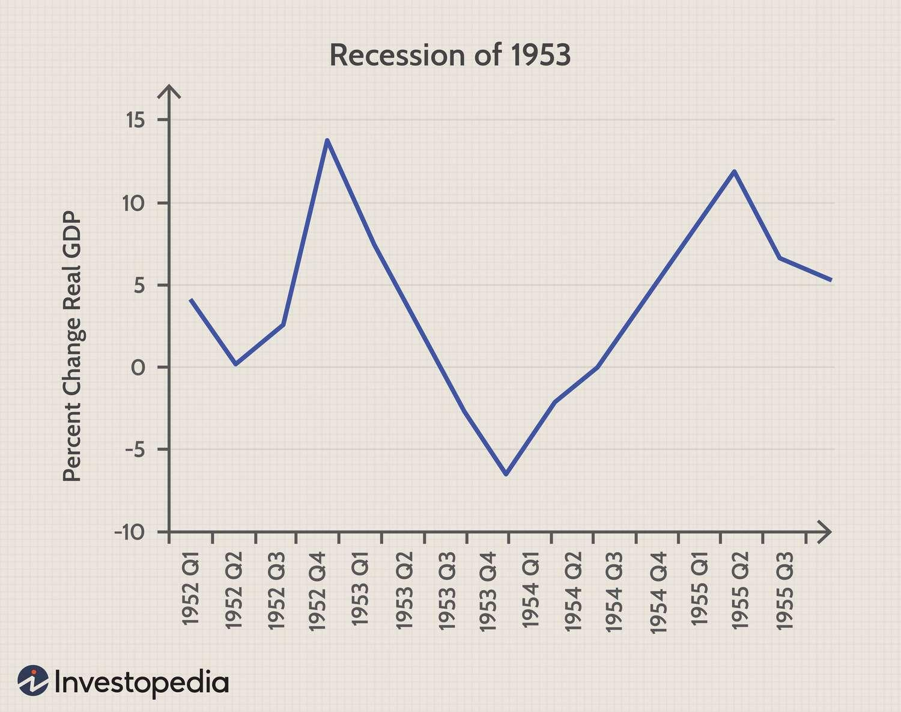

## Table of Contents

## What is a V-shaped economic recovery?

A V-shaped economic recovery is when an economy quickly falls into a recession and then quickly recovers back to where it was before. Imagine drawing the letter "V" on a piece of paper. The left side of the "V" shows the economy going down fast, and the right side shows it coming back up fast.

This type of recovery is what many people hope for after a sudden economic shock, like a financial crisis or a big drop in business activity. It's good because it means the economy can bounce back quickly, and people can get back to work and start spending money again soon.

## How does a V-shaped recovery differ from other types of economic recoveries?

A V-shaped recovery is different from other types of economic recoveries because it happens fast. When the economy drops suddenly, like during a big crisis, a V-shaped recovery means it bounces back quickly to where it was before. This is good because people can get back to work and start spending money again soon. Other types of recoveries, like U-shaped or L-shaped, take much longer or don't fully recover.

A U-shaped recovery is when the economy stays down for a while before it starts to get better. It's like the economy is taking a long nap before waking up. This can be tough because people have to wait longer to see things get better. An L-shaped recovery is even worse because the economy drops and then stays down, not getting much better over time. It's like the economy is stuck in a low place and can't climb back up.

So, a V-shaped recovery is the best kind because it's quick. A U-shaped recovery takes longer, and an L-shaped recovery is the hardest because the economy doesn't really get better. Each type shows how the economy might act after a big problem, and they help people understand what might happen next.

## What are the key characteristics of a V-shaped economic recovery?

A V-shaped economic recovery happens when the economy falls fast and then comes back up just as fast. It's like drawing the letter "V" on a piece of paper. The left side of the "V" shows the economy going down quickly, and the right side shows it coming back up quickly. This type of recovery is what people hope for after a sudden problem, like a financial crisis or a big drop in business activity. It's good because it means the economy can bounce back quickly, and people can get back to work and start spending money again soon.

The key thing about a V-shaped recovery is how fast it happens. Unlike other types of recoveries, like a U-shaped or L-shaped recovery, a V-shaped recovery doesn't take a long time. In a U-shaped recovery, the economy stays down for a while before it starts to get better. An L-shaped recovery is even worse because the economy drops and then stays down, not getting much better over time. So, a V-shaped recovery is the best kind because it's quick and gets the economy back on track fast.

## Can you provide historical examples of V-shaped economic recoveries?

One example of a V-shaped economic recovery happened after the stock market crash of 1987, also known as Black Monday. On that day, the stock market dropped a lot, but it bounced back quickly. By the end of the year, the market had recovered most of its losses. This quick recovery showed that the economy could get back on track fast after a big shock.

Another example is the recovery after the 2003 SARS outbreak. The SARS virus caused a lot of fear and hurt the economy in places like Hong Kong and China. But once the outbreak was under control, the economy in those areas bounced back quickly. Businesses started working again, and people began spending money, which helped the economy recover in a V-shaped way.

These examples show that a V-shaped recovery can happen after different kinds of problems, like a stock market crash or a health crisis. The key is that the economy falls fast but then comes back up just as fast, helping everyone get back to normal quickly.

## What economic indicators signal the start of a V-shaped recovery?

When an economy starts to recover in a V-shaped way, you can see it in some key signs. One big sign is when the Gross Domestic Product (GDP) starts to grow again after it had been shrinking. GDP is like a report card for the whole economy, showing how much money is being made from all the goods and services. If GDP goes up quickly after going down, it's a good hint that a V-shaped recovery is happening. Another sign is when the unemployment rate starts to go down fast. This means more people are getting jobs again, which is a big part of the economy getting better quickly.

Another important indicator is the stock market. When stock prices start to go up after a big drop, it can show that people are feeling more confident about the economy. They start buying stocks again because they think things will get better. Also, if businesses start to see their sales go up quickly after they had been going down, that's another sign of a V-shaped recovery. All these signs together show that the economy is bouncing back fast, which is what a V-shaped recovery is all about.

## What factors contribute to a V-shaped economic recovery?

A V-shaped economic recovery happens when the economy falls fast but then comes back up just as fast. One big reason this can happen is because of quick action by the government and central banks. They might lower interest rates or give money to people and businesses to help them keep going. This can make people feel more confident and start spending money again, which helps the economy bounce back quickly. Another reason is if the problem that caused the economy to fall, like a health crisis or a financial shock, gets fixed fast. When the problem goes away, businesses can start working again, and people can go back to their jobs.

Another [factor](/wiki/factor-investing) that helps a V-shaped recovery is strong consumer spending. If people keep their jobs and feel good about the future, they'll keep buying things. This spending helps businesses grow and hire more people, which makes the economy recover faster. Also, if businesses can quickly adjust to the new situation, like moving to online sales during a crisis, they can keep making money and help the economy get better. All these things together can make the economy fall and then rise again in a V-shape, getting back to normal quickly.

## How do government policies influence the likelihood of a V-shaped recovery?

Government policies can really help make a V-shaped recovery happen. When the economy falls fast, the government can step in with quick actions like lowering interest rates or giving money to people and businesses. This helps people keep their jobs and businesses stay open. When people feel more confident because of these policies, they start spending money again, which is a big part of the economy getting better quickly. If the government can fix the problem that caused the economy to fall, like a health crisis, it can also help the economy bounce back faster.

Another way government policies can influence a V-shaped recovery is by making sure businesses can keep going during tough times. For example, the government might give loans or grants to businesses so they don't have to close down. This keeps people working and the economy moving. If the government can also help businesses adjust to new situations, like moving to online sales during a crisis, it can make the recovery even quicker. All these actions together can help the economy fall and then rise again in a V-shape, getting back to normal fast.

## What are the potential challenges in achieving a V-shaped economic recovery?

Achieving a V-shaped economic recovery can be tough because it depends on many things going right at the same time. One big challenge is that the problem causing the economy to fall, like a health crisis or a financial shock, needs to be fixed quickly. If it takes a long time to solve the problem, the economy might not bounce back as fast as people hope. Another challenge is that people need to feel confident enough to start spending money again. If they're worried about losing their jobs or not having enough money, they might hold onto their cash instead of spending it, which can slow down the recovery.

Another challenge is that government policies need to work well and fast. If the government can't give money to people and businesses quickly, or if it can't lower interest rates fast enough, the economy might not recover in a V-shape. Also, businesses need to be able to adjust to new situations, like moving to online sales during a crisis. If they can't do this quickly, it can make the recovery slower. All these challenges together can make it hard for the economy to fall and then rise again in a V-shape, getting back to normal fast.

## How can businesses prepare for and benefit from a V-shaped recovery?

Businesses can get ready for a V-shaped recovery by being quick to change and adapt. If they can switch to new ways of working, like selling things online during a crisis, they can keep making money even when things are tough. It's also important for businesses to keep in touch with their customers and find out what they need. By listening to their customers, businesses can offer the right products and services at the right time, which can help them grow fast when the economy starts to get better.

Another way businesses can benefit from a V-shaped recovery is by using government help. If the government gives out money or loans to businesses, taking advantage of these can help keep the business going and even grow. Businesses should also keep an eye on economic signs like GDP and unemployment rates. When these start to go up and down in a good way, it's a sign that a V-shaped recovery might be happening. By being ready to act fast when these signs show up, businesses can jump on new opportunities and do well when the economy bounces back quickly.

## What are the long-term implications of a V-shaped recovery on an economy?

A V-shaped recovery can be really good for an economy in the long run because it means the economy gets back to normal quickly. When the economy bounces back fast, people can keep their jobs and businesses can keep making money. This helps everyone feel more confident about the future, which can lead to more spending and more growth. If the government and businesses work well together during the recovery, it can set the stage for a strong and stable economy for years to come.

But there can also be some challenges after a V-shaped recovery. If the economy grows too fast, it might lead to inflation, which means prices go up a lot. This can make it harder for people to buy things and can cause new problems. Also, if the quick recovery makes people and businesses take on too much debt, it could lead to more financial problems down the road. So, while a V-shaped recovery is great because it's fast, it's important for everyone to keep an eye on things to make sure the economy stays healthy in the long run.

## How do different sectors of the economy respond during a V-shaped recovery?

During a V-shaped recovery, different parts of the economy can bounce back at different speeds. Sectors like technology and online services often do well because people use them more during tough times. For example, if people are staying home, they might buy more things online or use more apps. This means these businesses can grow quickly when the economy starts to get better. On the other hand, sectors like travel and hospitality might take a bit longer to recover. These businesses need people to feel safe and confident enough to go out and spend money on trips and eating out, which might not happen right away.

Another part of the economy that can do well during a V-shaped recovery is manufacturing. If businesses can start making things again quickly, they can meet the demand for products that people want. This can help the economy grow fast. But sectors like real estate might not see a quick recovery because buying a house or property is a big decision that people might put off until they feel more sure about the future. Overall, a V-shaped recovery means that some parts of the economy can get back to normal quickly, while others might need a bit more time.

## What advanced economic models are used to predict and analyze V-shaped recoveries?

Economists use different models to predict and understand V-shaped recoveries. One common model is the Dynamic Stochastic General Equilibrium (DSGE) model. This model looks at how different parts of the economy, like households, businesses, and the government, interact with each other. It uses math to show how these parts might change over time and how they might react to big shocks, like a financial crisis. By running different scenarios through the DSGE model, economists can see if the economy might bounce back quickly in a V-shape.

Another model that helps is the Vector Autoregression (VAR) model. This model looks at past data to see how different economic indicators, like GDP and unemployment, have moved together in the past. By studying these patterns, the VAR model can help predict how the economy might recover after a big drop. If the model shows that the economy has bounced back quickly in the past after similar problems, it might suggest a V-shaped recovery could happen again. Both these models help economists make better guesses about the future and plan for what might come next.

## References & Further Reading

[1]: Bergstra, J., Bardenet, R., Bengio, Y., & Kégl, B. (2011). ["Algorithms for Hyper-Parameter Optimization."](https://papers.nips.cc/paper/4443-algorithms-for-hyper-parameter-optimization) Advances in Neural Information Processing Systems 24.

[2]: ["Advances in Financial Machine Learning"](https://www.amazon.com/Advances-Financial-Machine-Learning-Marcos/dp/1119482089) by Marcos Lopez de Prado

[3]: ["Evidence-Based Technical Analysis: Applying the Scientific Method and Statistical Inference to Trading Signals"](https://www.amazon.com/Evidence-Based-Technical-Analysis-Scientific-Statistical/dp/0470008741) by David Aronson

[4]: ["Machine Learning for Algorithmic Trading"](https://github.com/stefan-jansen/machine-learning-for-trading) by Stefan Jansen

[5]: ["Quantitative Trading: How to Build Your Own Algorithmic Trading Business"](https://www.amazon.com/Quantitative-Trading-Build-Algorithmic-Business/dp/1119800064) by Ernest P. Chan