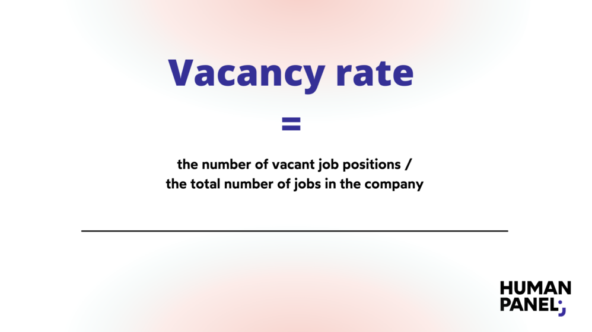

## Table of Contents

## What is the definition of vacancy rate?

The vacancy rate is the percentage of all available units in a rental property, such as apartments or houses, that are not currently being rented out. It is an important measure for property owners and managers because it shows how well they are doing at keeping their properties filled with tenants.

A high vacancy rate can mean that there might be too many similar rental options available in the area, or that the rent prices are too high for what people can afford. On the other hand, a low vacancy rate usually means that the rental property is in high demand, which can be good for the property owner but might make it harder for people looking to rent a place to find an available unit.

## Why is the vacancy rate important in real estate?

The vacancy rate is important in real estate because it tells property owners and managers how many of their rental units are empty. If the vacancy rate is high, it means a lot of units are not being rented out. This can be a problem for owners because empty units do not bring in any money. A high vacancy rate might also mean that there are too many similar places to rent in the area, or that the rent is too high for what people can afford to pay.

On the other hand, a low vacancy rate is good news for property owners. It means that most of their units are rented out and bringing in money. A low vacancy rate can also mean that the rental property is popular and in high demand. But, it can be hard for people looking to rent a place because there are fewer options available. Understanding the vacancy rate helps everyone in real estate make better decisions about buying, selling, and renting properties.

## How do you calculate the vacancy rate for a property?

To calculate the vacancy rate for a property, you need to know two things: the total number of units in the property and the number of units that are currently empty. The vacancy rate is the percentage of units that are not rented out. You can find this percentage by dividing the number of empty units by the total number of units, and then multiplying the result by 100.

For example, if a building has 100 units and 5 of them are empty, the vacancy rate would be calculated like this: 5 (empty units) divided by 100 (total units) equals 0.05. When you multiply 0.05 by 100, you get a vacancy rate of 5%. This means that 5% of the units in the building are not being rented out.

## What is considered a high vacancy rate?

A high vacancy rate is usually when more than 10% of the rental units are empty. This number can change depending on where the property is and what kind of property it is. In big cities, a high vacancy rate might be lower, like around 7%, because there are a lot of people looking to rent. In smaller towns, a high vacancy rate might be higher, like 12% or more, because there are fewer people looking for a place to rent.

Having a high vacancy rate can be a problem for property owners because it means they are not making as much money as they could be. When a lot of units are empty, owners have to find ways to fill them, like lowering the rent or offering special deals. This can make it harder for them to make a profit. It also means that there might be too many similar places to rent in the area, or that people are not able to afford the rent being asked.

## What factors can influence vacancy rates?

Many things can affect how many empty units there are in a rental property. One big factor is the location of the property. If it's in a popular area where lots of people want to live, the vacancy rate will be low because the units fill up quickly. But if the property is in a place that's not as popular, or if there are a lot of similar places to rent nearby, the vacancy rate might be higher because it's harder to find tenants.

Another thing that influences vacancy rates is the price of rent. If the rent is too high compared to what people can afford, more units will stay empty. Property owners might need to lower the rent or offer special deals to fill the units. Also, the condition of the property matters. If the units are old or need repairs, people might not want to rent them, which can lead to a higher vacancy rate.

The economy can also play a role in vacancy rates. When the economy is doing well, more people have jobs and can afford to rent places, so vacancy rates go down. But if the economy is not doing well, people might move back in with family or choose cheaper housing options, which can increase the vacancy rate. All these factors together help decide how many units will be empty at any given time.

## How does vacancy rate affect property value?

The vacancy rate can have a big impact on how much a property is worth. When a lot of units in a property are empty, it means the property is not making as much money as it could. This can make the property less valuable because investors and buyers want to see that the property is bringing in good income. If the vacancy rate is high, it might also mean there are problems with the property or the area it's in, which can make people less interested in buying it.

On the other hand, a low vacancy rate usually makes a property more valuable. It shows that the property is in demand and that it's making money from rent. When most units are filled, it means the property is doing well, and this can attract more buyers and investors. They see that the property is a good investment because it's likely to keep bringing in money. So, the vacancy rate is an important thing to look at when figuring out how much a property is worth.

## Can vacancy rate be used to predict market trends?

Yes, the vacancy rate can help predict market trends. When the vacancy rate is low, it means that a lot of people want to rent in that area. This can be a sign that the area is growing and that more people want to live there. Property owners might see this and decide to build more places to rent, thinking they will be able to fill them easily. Also, if the vacancy rate is low, it might mean that the economy is doing well because more people can afford to rent.

On the other hand, if the vacancy rate is high, it can show that there are too many places to rent and not enough people wanting to rent them. This could mean that the area is not as popular anymore or that people can't afford the rent. Property owners might then need to lower their rent prices or offer special deals to fill the empty units. A high vacancy rate can also be a sign that the economy is not doing well, because fewer people have the money to rent. So, by looking at the vacancy rate, you can get a good idea of what might happen in the real estate market next.

## What are the differences between residential and commercial vacancy rates?

Residential vacancy rates are about how many empty homes or apartments there are in a place. This can tell you if a lot of people want to live in that area or if there are too many homes for rent. If the residential vacancy rate is low, it means most of the homes are being rented out and the area might be popular. But if the rate is high, it could mean there are too many homes to rent or that people can't afford the rent. This information helps people who own homes for rent know how to set their prices and make their homes more attractive to renters.

Commercial vacancy rates, on the other hand, are about how many empty office spaces, stores, or other business places there are. This rate can show how well businesses are doing in an area. If the commercial vacancy rate is low, it means most of the business spaces are being used, which can be a sign that the area is good for businesses. But if the rate is high, it might mean that businesses are moving out or that there are too many empty spaces. This can affect how much rent business owners have to pay and can help people who own these spaces decide if they need to lower their prices or offer deals to fill them up.

## How do seasonal changes impact vacancy rates?

Seasonal changes can really affect how many empty units there are in a rental property. In places where a lot of people visit during certain times of the year, like beach towns in the summer or ski resorts in the winter, the vacancy rate can go down a lot during those busy times. People want to rent places to stay while they are on vacation, so it's easier for property owners to fill their units. But when the busy season is over, the vacancy rate can go up because fewer people are looking to rent.

In other places, like college towns, the vacancy rate can change with the school year. When students come back to school, the demand for places to rent goes up, and the vacancy rate goes down. But when students leave for summer break, more units can become empty, making the vacancy rate go up. Property owners in these areas need to think about these seasonal changes when they set their rent prices and plan how to keep their units filled all year.

## What strategies can property owners use to reduce vacancy rates?

Property owners can do a few things to make sure their rental units don't stay empty for too long. One good idea is to set the rent at a fair price that people in the area can afford. If the rent is too high, people might not want to rent the place, and it will stay empty. Another thing they can do is to keep the property in good shape. If the units are clean and well-maintained, more people will want to live there. Offering special deals or discounts can also help fill empty units faster. For example, giving a month of free rent or lowering the price for the first few months can attract more renters.

Another strategy is to use good advertising to let people know the units are available. Posting ads online, using social media, and working with rental agencies can help spread the word. Property owners can also think about offering extra things that make the units more appealing, like free parking, laundry facilities, or allowing pets. It's also important to be flexible with lease terms. Some people might want a short-term lease instead of a long one, and offering this option can help fill units that might otherwise stay empty. By using these strategies, property owners can keep their vacancy rates low and make sure their rental properties are doing well.

## How does vacancy rate relate to rental yield?

The vacancy rate and rental yield are closely connected because they both have to do with how much money a rental property makes. The vacancy rate is the percentage of units that are empty and not bringing in any rent. If the vacancy rate is high, it means more units are empty, so the property owner is not making as much money from rent. This can lower the rental yield, which is the amount of money the property makes compared to how much it costs. A high vacancy rate can make the rental yield go down because there's less rent coming in.

On the other hand, if the vacancy rate is low, it means most of the units are being rented out and bringing in money. This can help increase the rental yield because the property is making more money from rent. Property owners want to keep the vacancy rate as low as possible to make sure their rental yield stays high. By keeping units filled and collecting rent, they can get a better return on their investment.

## What are the advanced statistical methods for analyzing vacancy rate data?

One advanced way to look at vacancy rate data is by using time series analysis. This method helps us see how the vacancy rate changes over time. We can use it to find patterns, like if the vacancy rate goes up or down at certain times of the year. Time series analysis can also help predict what the vacancy rate might be in the future. By looking at past data, we can make better guesses about what might happen next. This can be really helpful for property owners who want to plan ahead and make smart decisions about their rentals.

Another method is regression analysis, which looks at how different things affect the vacancy rate. For example, we can use regression to see if things like the price of rent, the economy, or the location of the property make a difference in how many units are empty. This helps us understand which factors are most important. By knowing this, property owners can focus on the things that will help them keep their units filled. Both time series and regression analysis are powerful tools that can give us a deeper understanding of vacancy rates and help make better choices in real estate.

## What is the understanding of vacancy rate in real estate?

The vacancy rate is an essential metric in real estate, quantifying the proportion of unoccupied units in a property relative to its total capacity. This metric serves as a significant indicator of a property's performance, reflecting both the demand in the market and the effectiveness of its management. 

To calculate the vacancy rate, the formula is straightforward:

$$
\text{Vacancy Rate (\%)} = \left( \frac{\text{Number of Vacant Units}}{\text{Total Number of Units}} \right) \times 100
$$

For example, if a building has 100 units and 10 of them are unoccupied, the vacancy rate would be:

$$
\text{Vacancy Rate (\%)} = \left( \frac{10}{100} \right) \times 100 = 10\%
$$

A high vacancy rate often signifies low demand for a property or potentially subpar management practices, which might include poor marketing strategies or inadequate property maintenance. On the other hand, a low vacancy rate typically indicates robust market demand, suggesting that the property is appealing to tenants. 

Investors rely on vacancy rates to evaluate the health and attractiveness of a property. A consistently low vacancy rate can be an indication of a lucrative property investment with steady income potential and lower risk. Conversely, high vacancy rates may signal challenges in tenant acquisition or retention, necessitating strategic shifts in management or investment approaches. Understanding and monitoring vacancy rates assist investors in making informed decisions regarding property acquisition, pricing, and portfolio management, thereby enhancing their ability to navigate market conditions effectively.

## What is the importance of vacancy rates for property management?

Property managers rely on vacancy rates to evaluate the appeal and demand for rental properties. A vacancy rate is calculated by dividing the number of unoccupied units by the total number of units and expressing it as a percentage:

$$
\text{Vacancy Rate (\%)} = \left( \frac{\text{Number of Vacant Units}}{\text{Total Number of Units}} \right) \times 100
$$

Monitoring vacancy rates is essential for property managers to understand tenant behaviors and market conditions. High vacancy rates may suggest potential issues such as unattractive property features, inadequate pricing strategies, or insufficient marketing efforts. Conversely, low vacancy rates often indicate a strong market demand and effective management practices.

To minimize vacancy rates, property managers employ a variety of strategies focused on tenant retention and effective marketing. Tenant retention involves ensuring tenant satisfaction by addressing maintenance issues promptly, offering lease renewal incentives, and fostering a positive community environment. By prioritizing tenant needs, property managers can reduce turnover and maintain stable occupancy levels.

Efficient marketing plays a crucial role in attracting new tenants and filling vacancies quickly. This involves utilizing both digital platforms and traditional advertising methods to reach prospective tenants. Online listings, virtual tours, and social media campaigns can significantly enhance a property's visibility, attracting more inquiries and potential renters.

Understanding vacancy rates also aids property managers in optimizing rental pricing strategies. By analyzing market trends and regional vacancy rates, managers can adjust rent prices to remain competitive while maximizing revenue. Dynamic pricing models, which adjust rental rates based on demand analytics and vacancy data, are increasingly used to enhance pricing strategies.

In summary, vacancy rates are a fundamental tool for property managers to assess the demand and attractiveness of rental properties. Effective management strategies aimed at reducing vacancy rates through tenant retention and marketing efforts, combined with optimized pricing strategies, ensure enhanced occupancy levels and financial performance.

## What are the key real estate metrics to analyze for investment purposes?

In real estate investment, various metrics serve as fundamental tools for evaluating property value, potential returns, and market conditions. Among these, vacancy rates, capitalization rates (cap rates), and gross income multipliers are particularly significant.

**Vacancy Rates**: As a crucial indicator of property performance, the vacancy rate measures the proportion of unoccupied units within a property. It is calculated by dividing the number of vacant units by the total number of units available and is expressed as a percentage. A high vacancy rate could signal low demand or ineffective property management, whereas a low vacancy rate often indicates robust market demand and effective management strategies. Consistent monitoring of vacancy rates allows investors to gauge market dynamics and identify emerging trends.

**Cap Rates**: The capitalization rate helps investors assess the potential return on investment from a real estate property. It is calculated by dividing the net operating income (NOI) of the property by its current market value. The formula is:

$$
\text{Cap Rate} = \left( \frac{\text{Net Operating Income (NOI)}}{\text{Property Value}} \right) \times 100
$$

Cap rates serve as a benchmark for comparing similar investments, where higher cap rates suggest potentially higher returns but also higher risk. Conversely, lower cap rates are often associated with lower risk and stable returns.

**Gross Income Multipliers (GIM)**: This metric assists investors in determining property value by comparing the sale price of income-generating properties. It is measured by dividing the property's sale price by its gross annual rental income. The formula is:

$$
\text{GIM} = \frac{\text{Property Sale Price}}{\text{Gross Annual Rental Income}}
$$

A lower gross income multiplier indicates a better investment opportunity, as it implies a faster return on the initial investment outlay.

By comparing these metrics across similar properties, investors can identify lucrative investment opportunities. Each metric offers different insights—the vacancy rate highlights occupancy trends, cap rates assess profitability potential, and gross income multipliers focus on income relative to property cost. Integrating analysis from these metrics provides a comprehensive view, enhancing an investor's ability to make informed decisions and optimize their real estate portfolios. Understanding and applying these metrics help mitigate risks and improve investment outcomes, aligning strategies with market dynamics.

## References & Further Reading

[1]: ["Advances in Financial Machine Learning"](https://www.amazon.com/Advances-Financial-Machine-Learning-Marcos/dp/1119482089) by Marcos Lopez de Prado.

[2]: ["Quantitative Trading: How to Build Your Own Algorithmic Trading Business"](https://www.amazon.com/Quantitative-Trading-Build-Algorithmic-Business/dp/1119800064) by Ernest P. Chan.

[3]: ["Machine Learning for Algorithmic Trading"](https://github.com/stefan-jansen/machine-learning-for-trading) by Stefan Jansen.

[4]: Baum, A., & Crosby, N. (2008). ["Property Investment Appraisal."](https://books.google.com/books/about/Property_Investment_Appraisal.html?id=4-ASEAAAQBAJ) Wiley-Blackwell.

[5]: Geltner, D., Miller, N. G., Clayton, J., & Eichholtz, P. (2013). ["Commercial Real Estate Analysis and Investments."](https://www.researchgate.net/publication/245702364_Commercial_Real_Estate_Analysis_and_Investments) ONCOURSE LEARNING.

[6]: Bhasin, R., & Sedov, S. (2021). ["Real Estate Investment Analysis & Valuation."](https://scholar.google.com/citations?user=QDpbiZMAAAAJ) Wiley.