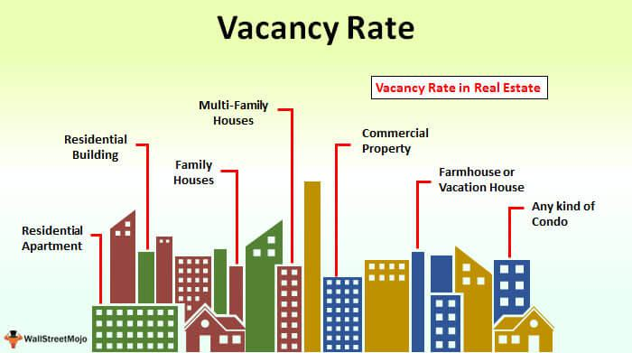

Effective management and strategic investment are key components in real estate, essential for achieving maximum returns. This article explores how property management, real estate metrics, vacancy rates, and algorithmic trading converge to offer a comprehensive view of market dynamics. By understanding these elements, stakeholders can make informed decisions that improve investment outcomes.

Property management is central to maintaining and increasing the value of real estate investments. It involves various tasks, from tenant relations to maintenance, all aimed at creating an attractive and profitable property. Metrics such as vacancy rates provide critical insights into a property's performance and market conditions. A vacancy rate is calculated by dividing the number of vacant units by the total units available and is indicative of the demand and management efficiency. A clear understanding of these metrics aids investors in assessing property potential and shaping investment strategies.



In addition to traditional metrics, algorithmic trading is gaining traction in real estate investments. This innovative approach involves the use of automated systems to execute transactions based on data analysis, allowing investors to respond swiftly and precisely to market changes. Algorithmic trading can incorporate real estate-specific metrics, like vacancy and capitalization rates, to enhance decision-making processes.

The article examines key metrics, algorithmic strategies, and their implications for real estate investment, highlighting how technology and data-driven approaches are transforming the industry. By the end of the article, readers will gain a deeper understanding of how these elements interconnect, providing the foundation for enhanced profitability and risk management in real estate.

## Table of Contents

## Understanding Vacancy Rate in Real Estate

The vacancy rate is an essential metric in real estate, quantifying the proportion of unoccupied units in a property relative to its total capacity. This metric serves as a significant indicator of a property's performance, reflecting both the demand in the market and the effectiveness of its management. 

To calculate the vacancy rate, the formula is straightforward:

$$
\text{Vacancy Rate (\%)} = \left( \frac{\text{Number of Vacant Units}}{\text{Total Number of Units}} \right) \times 100
$$

For example, if a building has 100 units and 10 of them are unoccupied, the vacancy rate would be:

$$
\text{Vacancy Rate (\%)} = \left( \frac{10}{100} \right) \times 100 = 10\%
$$

A high vacancy rate often signifies low demand for a property or potentially subpar management practices, which might include poor marketing strategies or inadequate property maintenance. On the other hand, a low vacancy rate typically indicates robust market demand, suggesting that the property is appealing to tenants. 

Investors rely on vacancy rates to evaluate the health and attractiveness of a property. A consistently low vacancy rate can be an indication of a lucrative property investment with steady income potential and lower risk. Conversely, high vacancy rates may signal challenges in tenant acquisition or retention, necessitating strategic shifts in management or investment approaches. Understanding and monitoring vacancy rates assist investors in making informed decisions regarding property acquisition, pricing, and portfolio management, thereby enhancing their ability to navigate market conditions effectively.

## Importance of Vacancy Rates for Property Management

Property managers rely on vacancy rates to evaluate the appeal and demand for rental properties. A vacancy rate is calculated by dividing the number of unoccupied units by the total number of units and expressing it as a percentage:

$$
\text{Vacancy Rate (\%)} = \left( \frac{\text{Number of Vacant Units}}{\text{Total Number of Units}} \right) \times 100
$$

Monitoring vacancy rates is essential for property managers to understand tenant behaviors and market conditions. High vacancy rates may suggest potential issues such as unattractive property features, inadequate pricing strategies, or insufficient marketing efforts. Conversely, low vacancy rates often indicate a strong market demand and effective management practices.

To minimize vacancy rates, property managers employ a variety of strategies focused on tenant retention and effective marketing. Tenant retention involves ensuring tenant satisfaction by addressing maintenance issues promptly, offering lease renewal incentives, and fostering a positive community environment. By prioritizing tenant needs, property managers can reduce turnover and maintain stable occupancy levels.

Efficient marketing plays a crucial role in attracting new tenants and filling vacancies quickly. This involves utilizing both digital platforms and traditional advertising methods to reach prospective tenants. Online listings, virtual tours, and social media campaigns can significantly enhance a property's visibility, attracting more inquiries and potential renters.

Understanding vacancy rates also aids property managers in optimizing rental pricing strategies. By analyzing market trends and regional vacancy rates, managers can adjust rent prices to remain competitive while maximizing revenue. Dynamic pricing models, which adjust rental rates based on demand analytics and vacancy data, are increasingly used to enhance pricing strategies.

In summary, vacancy rates are a fundamental tool for property managers to assess the demand and attractiveness of rental properties. Effective management strategies aimed at reducing vacancy rates through tenant retention and marketing efforts, combined with optimized pricing strategies, ensure enhanced occupancy levels and financial performance.

## Analyzing Real Estate Metrics for Investment

In real estate investment, various metrics serve as fundamental tools for evaluating property value, potential returns, and market conditions. Among these, vacancy rates, capitalization rates (cap rates), and gross income multipliers are particularly significant.

**Vacancy Rates**: As a crucial indicator of property performance, the vacancy rate measures the proportion of unoccupied units within a property. It is calculated by dividing the number of vacant units by the total number of units available and is expressed as a percentage. A high vacancy rate could signal low demand or ineffective property management, whereas a low vacancy rate often indicates robust market demand and effective management strategies. Consistent monitoring of vacancy rates allows investors to gauge market dynamics and identify emerging trends.

**Cap Rates**: The capitalization rate helps investors assess the potential return on investment from a real estate property. It is calculated by dividing the net operating income (NOI) of the property by its current market value. The formula is:

$$
\text{Cap Rate} = \left( \frac{\text{Net Operating Income (NOI)}}{\text{Property Value}} \right) \times 100
$$

Cap rates serve as a benchmark for comparing similar investments, where higher cap rates suggest potentially higher returns but also higher risk. Conversely, lower cap rates are often associated with lower risk and stable returns.

**Gross Income Multipliers (GIM)**: This metric assists investors in determining property value by comparing the sale price of income-generating properties. It is measured by dividing the property's sale price by its gross annual rental income. The formula is:

$$
\text{GIM} = \frac{\text{Property Sale Price}}{\text{Gross Annual Rental Income}}
$$

A lower gross income multiplier indicates a better investment opportunity, as it implies a faster return on the initial investment outlay.

By comparing these metrics across similar properties, investors can identify lucrative investment opportunities. Each metric offers different insights—the vacancy rate highlights occupancy trends, cap rates assess profitability potential, and gross income multipliers focus on income relative to property cost. Integrating analysis from these metrics provides a comprehensive view, enhancing an investor's ability to make informed decisions and optimize their real estate portfolios. Understanding and applying these metrics help mitigate risks and improve investment outcomes, aligning strategies with market dynamics.

## Algorithmic Trading in Real Estate Investment

Algorithmic trading in real estate investment represents an innovative approach, utilizing automated systems to execute transactions based on sophisticated data analysis. This method leverages technology to process large volumes of information, enabling investors to react swiftly to market shifts and optimize their investment strategies.

One of the primary advantages of [algorithmic trading](/wiki/algorithmic-trading) is its ability to capitalize on market fluctuations with precision and speed. By employing algorithms, investors can analyze a multitude of market variables in real-time, including vacancy rates and capitalization (cap) rates, to make informed decisions. The integration of these metrics can lead to more strategic asset allocation, risk assessment, and ultimately, enhanced returns.

The effective utilization of algorithmic trading in real estate necessitates a deep understanding of key metrics. Vacancy rates, for instance, provide insights into the supply-demand dynamics within a market. A low vacancy rate might signal strong demand and potential for rental growth, while a high rate could indicate oversupply or poor property management. Cap rates, on the other hand, measure the return on investment properties and are crucial for evaluating property profitability and comparing investment opportunities.

To implement algorithmic trading, investors might use a simple Python script to analyze real estate data. Below is a basic example where Python could be used to assess properties based on vacancy and cap rates, providing recommendations for buy or sell decisions:

```python
def calculate_cap_rate(net_operating_income, property_value):
    return (net_operating_income / property_value) * 100

def analyze_property(vacancy_rate, cap_rate):
    if vacancy_rate < 5 and cap_rate > 8:
        return "Buy"
    elif vacancy_rate > 10 and cap_rate < 6:
        return "Sell"
    else:
        return "Hold"

# Example property data
properties = [
    {'name': 'Property A', 'vacancy_rate': 4, 'net_income': 50000, 'value': 600000},
    {'name': 'Property B', 'vacancy_rate': 12, 'net_income': 45000, 'value': 750000},
]

for prop in properties:
    cap_rate = calculate_cap_rate(prop['net_income'], prop['value'])
    decision = analyze_property(prop['vacancy_rate'], cap_rate)
    print(f"{prop['name']}: {decision}")
```

In this example, properties with a vacancy rate below 5% and a cap rate above 8% are considered attractive investments ("Buy"). Conversely, properties exceeding a 10% vacancy rate and having a cap rate below 6% are viewed as less favorable ("Sell").

Algorithmic trading in real estate is an evolving field, increasingly supported by advances in data analytics and [machine learning](/wiki/machine-learning). For investors, embracing these technologies can facilitate more informed, timely, and profitable decisions in an otherwise complex market landscape. Applying algorithmic tools not only enhances efficiency but also aligns investment strategies with objective market insights, minimizing human error and emotional bias.

## Integrating Technology in Property Management

Modern property management is increasingly adopting technology-based solutions to boost operational efficiency and streamline various processes. Algorithmic tools are at the forefront of this transformation, providing significant benefits to property managers.

Dynamic pricing algorithms play a crucial role in rent optimization. By analyzing market trends, economic indicators, and seasonal demand fluctuations, these algorithms can adjust rental prices dynamically. This approach ensures that rental properties remain competitively priced, maximizing occupancy rates and revenue. For example, machine learning models can predict peak demand periods and suggest optimal pricing strategies. A basic implementation in Python might involve using libraries such as scikit-learn to train a model on historical data and forecast future rental trends.

Tech tools also streamline property management tasks, such as maintenance scheduling and tenant communication. Automated systems can manage workflows, prioritize maintenance requests based on urgency, and allocate resources efficiently. This reduces management overhead and ensures timely resolution of issues. Tenant communication platforms enable managers to deliver announcements, facilitate maintenance requests, and handle queries, all through a centralized digital interface. These platforms often integrate with mobile apps, allowing tenants easy access to information and quick communication with management.

Moreover, IoT (Internet of Things) devices have started transforming property management practices. Smart sensors and devices provide real-time data on property conditions, energy usage, and security, enabling proactive management and immediate responses to potential issues. This integration of technology not only enhances tenant satisfaction by improving service quality and reliability but also reduces operational costs by optimizing resource usage.

Overall, the integration of technology in property management processes significantly enhances operational efficiency, decreases costs, and improves tenant satisfaction, making it a valuable strategy for modern property managers.

## Conclusion

Understanding and leveraging real estate metrics, vacancy rates, and algo trading strategies are central to achieving success in today's competitive market. The accurate interpretation of these metrics empowers property managers and investors to make informed decisions, enhancing profitability and minimizing risks associated with real estate investments. 

By closely monitoring vacancy rates, managers can evaluate the effectiveness of their management strategies and the desirability of their properties. High vacancy rates may prompt interventions like improved tenant retention strategies or targeted marketing efforts to reduce unoccupied units. Meanwhile, investors can use these metrics, alongside others like capitalization rates and gross income multipliers, to assess the investment potential of properties and identify trends within the market. 

Algorithmic trading adds another dimension to the real estate investment strategy, offering precision and speed in exploiting market fluctuations. The integration of algorithms allows for swift execution of transactions based on extensive data analysis, providing a competitive edge in acquiring profitable investments. This technology-driven approach minimizes human error and optimizes trading decisions, aligning real estate investment with the cutting-edge practices observed in other financial markets.

The broader integration of technology into property management and investment processes signifies a transformative shift within the industry. Tools such as dynamic pricing algorithms and automated communication systems streamline operations, reducing management overhead and enabling data-driven decisions. This technological evolution not only enhances operational efficiency but also opens new avenues for maximizing returns on investment.

Ultimately, embracing these advanced strategies in real estate means keeping pace with a rapidly changing landscape. By adopting metrics analysis, algorithmic trading, and technology integration, property managers and investors can navigate the complexities of the market with confidence, ensuring sustained growth and success.

## References & Further Reading

[1]: ["Advances in Financial Machine Learning"](https://www.amazon.com/Advances-Financial-Machine-Learning-Marcos/dp/1119482089) by Marcos Lopez de Prado.

[2]: ["Quantitative Trading: How to Build Your Own Algorithmic Trading Business"](https://www.amazon.com/Quantitative-Trading-Build-Algorithmic-Business/dp/1119800064) by Ernest P. Chan.

[3]: ["Machine Learning for Algorithmic Trading"](https://github.com/stefan-jansen/machine-learning-for-trading) by Stefan Jansen.

[4]: Baum, A., & Crosby, N. (2008). ["Property Investment Appraisal."](https://books.google.com/books/about/Property_Investment_Appraisal.html?id=4-ASEAAAQBAJ) Wiley-Blackwell.

[5]: Geltner, D., Miller, N. G., Clayton, J., & Eichholtz, P. (2013). ["Commercial Real Estate Analysis and Investments."](https://www.researchgate.net/publication/245702364_Commercial_Real_Estate_Analysis_and_Investments) ONCOURSE LEARNING.

[6]: Bhasin, R., & Sedov, S. (2021). ["Real Estate Investment Analysis & Valuation."](https://scholar.google.com/citations?user=QDpbiZMAAAAJ) Wiley.