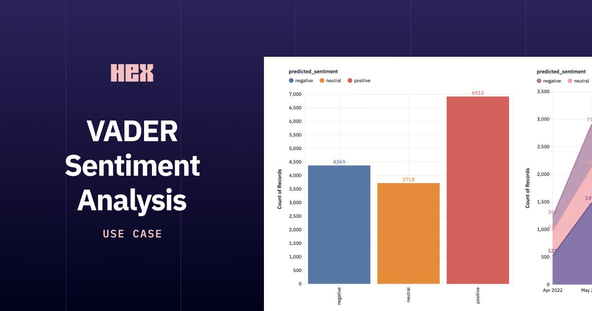

## Table of Contents

## What is VADER Sentiment Analysis?

VADER Sentiment Analysis, which stands for Valence Aware Dictionary and sEntiment Reasoner, is a tool used to understand if text is positive, negative, or neutral. It's really good at figuring out the feelings in things like social media posts, reviews, and short messages. VADER works by looking at words and symbols in the text and using a special list of words that it knows have certain feelings attached to them.

What makes VADER special is that it can understand not just the words, but also how they are used. For example, it knows that words like "love" or "hate" are strong, and it can tell if someone is being sarcastic or using all caps to show they are shouting. This makes VADER very useful for quickly analyzing a lot of text to see what people are feeling about a topic.

## Who developed VADER and when was it introduced?

VADER was developed by a group of researchers led by C.J. Hutto and Eric Gilbert. They worked at the Georgia Institute of Technology. The main goal was to create a tool that could easily understand the feelings in text, especially on the internet.

VADER was introduced to the public in 2014. It quickly became popular because it was good at understanding the emotions in short messages and social media posts. People started using it a lot for things like analyzing customer reviews and social media sentiment.

## What does VADER stand for?

VADER stands for Valence Aware Dictionary and sEntiment Reasoner. It's a tool that helps understand if text is happy, sad, or neutral. It's really good at figuring out feelings in short messages, like those on social media or in reviews.

VADER works by looking at words and symbols in the text. It uses a special list of words that it knows have certain feelings attached to them. This makes it easy for VADER to quickly analyze a lot of text and see what people are feeling about a topic.

## How does VADER differ from other sentiment analysis tools?

VADER is different from other sentiment analysis tools because it's really good at understanding short messages, like those on social media or in reviews. It uses a special list of words that it knows have certain feelings attached to them. This makes it easy for VADER to quickly analyze a lot of text and see what people are feeling about a topic. Other tools might not be as good at understanding short messages or might need a lot of training data to work well.

Another way VADER is different is that it can understand not just the words, but also how they are used. For example, VADER knows that words like "love" or "hate" are strong, and it can tell if someone is being sarcastic or using all caps to show they are shouting. This makes VADER very useful for quickly analyzing a lot of text to see what people are feeling about a topic. Other tools might not be as good at [picking](/wiki/asset-class-picking) up on these little details that can change the meaning of a message.

## What types of text is VADER best suited for?

VADER is best suited for short messages like those found on social media, in text messages, or in customer reviews. It's really good at understanding the feelings in these short pieces of text because it can pick up on the little details that can change the meaning of a message. For example, VADER can tell if someone is being sarcastic or using all caps to show they are shouting.

VADER works well with texts that are informal and might include emojis, slang, or abbreviations. It uses a special list of words that it knows have certain feelings attached to them, which helps it quickly figure out if the text is happy, sad, or neutral. This makes VADER a great tool for businesses or researchers who want to understand what people are feeling about a topic without having to read through a lot of text themselves.

## How does VADER handle negations and intensifiers in text?

VADER is smart about understanding when people use words like "not" or "never" to change the meaning of what they're saying. These are called negations. For example, if someone says "I am not happy," VADER knows that "not" makes "happy" mean the opposite. So, it will see the whole sentence as negative instead of positive. This helps VADER get a better idea of what the person really feels.

VADER also pays attention to words that make feelings stronger or weaker. These are called intensifiers. Words like "very" or "extremely" can make a feeling more intense, while words like "slightly" or "somewhat" can make it less intense. For example, if someone says "I am very happy," VADER knows that "very" makes "happy" even more positive. This way, VADER can tell the difference between someone who is just happy and someone who is very happy.

## Can you explain the VADER compound score and its range?

The VADER compound score is a number that shows the overall feeling of a piece of text. It's like a summary of all the positive and negative feelings in the text. The score can be between -1 and 1. A score of -1 means the text is very negative, while a score of 1 means it's very positive. A score of 0 means the text is neutral, with no strong feelings one way or the other.

VADER calculates the compound score by looking at all the words and symbols in the text. It adds up the positive and negative feelings, and then uses a special formula to turn that into a single number. This makes it easy to quickly see if a piece of text is mostly happy, sad, or somewhere in between.

## How can VADER be implemented in Python?

To use VADER in Python, you first need to install the `vaderSentiment` package. You can do this by running `pip install vaderSentiment` in your command line. Once it's installed, you can start using VADER in your Python code. You do this by importing the `SentimentIntensityAnalyzer` from the `vaderSentiment` package. Then, you create an instance of the analyzer, which you can use to check the feelings in any text.

After setting up the analyzer, you can use it to analyze text. You just need to call the `polarity_scores` method on your text. This method will give you a dictionary with scores for positive, negative, neutral, and compound feelings. The compound score is a number between -1 and 1 that shows the overall feeling of the text. A score close to -1 means the text is very negative, while a score close to 1 means it's very positive. A score around 0 means the text is neutral.

## What are the limitations of using VADER for sentiment analysis?

VADER is really good at understanding short messages like those on social media or in reviews, but it has some limitations. One big limitation is that it might not work as well with longer texts, like [books](/wiki/algo-trading-books) or long articles. VADER is designed to quickly analyze short pieces of text, so it might miss some of the deeper feelings or context in longer texts. Also, VADER uses a list of words that it knows have certain feelings attached to them, but this list might not include all the words people use, especially if they use a lot of slang or words from other languages.

Another limitation is that VADER might not always understand the context or culture behind the words. For example, if someone uses a word that means something different in another culture, VADER might not pick up on that. It also might not be as good at understanding sarcasm or irony if it's not very clear in the text. VADER is good at picking up on some signs of sarcasm, like using all caps or certain words, but it's not perfect. So, while VADER is a great tool for quickly understanding the feelings in short messages, it's important to remember these limitations when using it.

## How does VADER handle emojis and slang in sentiment analysis?

VADER is smart about understanding emojis and slang in text. It has a special list of emojis and their meanings, so it knows that a smiley face means happy and a sad face means sad. This helps VADER figure out the feelings in messages that use emojis. For slang, VADER also has a list of common slang words and what they mean. So, if someone uses slang like "LOL" or "OMG," VADER can understand that these words have feelings attached to them.

However, VADER might not understand all slang or emojis, especially if they are new or used in a special way. If someone uses a slang word that VADER doesn't know, it might not be able to figure out the feeling behind it. The same goes for emojis that are not in its list. So, while VADER is good at understanding a lot of emojis and slang, it's not perfect and might miss some feelings if it doesn't recognize the words or symbols used.

## Can VADER be fine-tuned for domain-specific sentiment analysis?

VADER can be fine-tuned for domain-specific sentiment analysis, but it's not as easy as with some other tools. VADER uses a fixed list of words and their sentiment scores, which means you can't directly change these scores or add new words to the list. However, you can still make VADER work better for your specific area by using it together with other methods. For example, you could use [machine learning](/wiki/machine-learning) to train a model on your domain-specific data, and then combine the results with VADER's scores to get a more accurate sentiment analysis.

One way to fine-tune VADER is by adjusting the thresholds for what counts as positive, negative, or neutral sentiment. You can look at how VADER performs on your specific texts and then change the thresholds to better match your needs. Another approach is to use VADER's scores as features in a larger model that you train on your domain-specific data. This way, you can still benefit from VADER's ability to understand short messages and emojis, while also improving its accuracy for your particular field.

## What are some real-world applications of VADER sentiment analysis?

VADER sentiment analysis is used in many real-world situations to understand how people feel about things. One common use is in social media monitoring. Companies and organizations use VADER to look at what people are saying on platforms like Twitter or Facebook. This helps them see if people are happy or unhappy with their products or services. For example, a company might use VADER to analyze tweets about a new product launch to see if the overall sentiment is positive or negative.

Another application is in customer feedback analysis. Many businesses use VADER to go through customer reviews and feedback forms. This helps them quickly understand if customers are satisfied or if there are common problems that need to be fixed. For instance, a restaurant might use VADER to analyze reviews on a site like Yelp to see if people generally like their food and service, or if there are specific complaints they need to address.

## References & Further Reading

[1]: Hutto, C. J., & Gilbert, E. (2014). ["VADER: A Parsimonious Rule-based Model for Sentiment Analysis of Social Media Text."](https://ojs.aaai.org/index.php/ICWSM/article/view/14550) Proceedings of the International AAAI Conference on Web and Social Media, 8(1).

[2]: Bollen, J., Mao, H., & Zeng, X. (2011). ["Twitter mood predicts the stock market."](https://www.sciencedirect.com/science/article/pii/S187775031100007X) Journal of Computational Science, 2(1), 1-8.

[3]: Tetlock, P. C. (2007). ["Giving content to investor sentiment: The role of media in the stock market."](https://onlinelibrary.wiley.com/doi/abs/10.1111/j.1540-6261.2007.01232.x) The Journal of Finance, 62(3), 1139-1168.

[4]: Solomon, D. H., Soltes, E., & Sosyura, D. (2022). ["What are we meeting for? The consequences of private meetings with investors."](https://papers.ssrn.com/sol3/papers.cfm?abstract_id=1959613) Journal of Financial Economics, 145(2), 351-380.

[5]: ["Natural Language Processing with Python: Analyzing Text with the Natural Language Toolkit"](https://www.nltk.org/book/) by Steven Bird, Ewan Klein, and Edward Loper.

[6]: Jegadeesh, N., & Titman, S. (1993). ["Returns to Buying Winners and Selling Losers: Implications for Stock Market Efficiency."](https://www.bauer.uh.edu/rsusmel/phd/jegadeesh-titman93.pdf) The Journal of Finance, 48(1), 65-91.