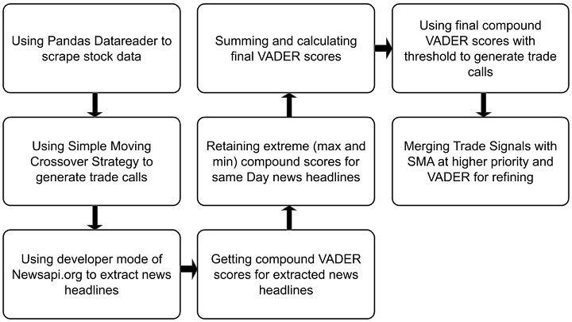

In the world of finance and trading, the constant influx of news and social media updates plays a pivotal role in shaping market movements. Information reaches global audiences in seconds, and trading strategies must rapidly adapt to these speedy transmissions. Sentiment analysis tools such as VADER (Valence Aware Dictionary and sEntiment Reasoner) have emerged as valuable assets for algorithmic traders seeking to interpret the ever-evolving emotional undercurrents of the market. By gauging the sentiment expressed in textual data, traders can gain a strategic edge, positioning themselves ahead of potential market shifts driven by collective emotional reactions.

This article aims to examine VADER Sentiment Analysis, highlighting its integration into algorithmic trading and its effectiveness in generating actionable trading signals. Understanding how VADER works, its level of accuracy, and the way it can be utilized alongside other trading strategies is crucial for those looking to enhance their trading performance. We will explore how VADER processes language sentiment, the precision with which it delivers sentiment scores, and a practical example where it is effectively incorporated into a trading strategy.



VADER provides a quantifiable measure of sentiment that can be blended with traditional technical analysis techniques, offering a more nuanced market view. By diving into the mechanics of VADER, traders can better appreciate its potential to decode market sentiment from news and social media sources.

Join us as we explore the application of VADER Sentiment Analysis in algorithmic trading, a tool that bridges the gap between qualitative sentiment and quantitative trading strategies.

## Table of Contents

## What is VADER Sentiment Analysis?

VADER (Valence Aware Dictionary and sEntiment Reasoner) functions as a robust sentiment analysis tool meticulously calibrated for interpreting the nuances of social media text. VADER stands apart from other sentiment analysis models due to its efficiency; it does not require extensive data training, making it a time-saving and computationally efficient option. At the core of its functionality lies a lexicon-based methodology combined with heuristics to interpret and assign sentiment scores.

The VADER model evaluates text by scoring words and phrases on a scale that spans positive, negative, and neutral sentiments. By leveraging a comprehensive lexicon imbued with intensity measures for various terms, VADER efficiently identifies sentiments expressed in tweets, comments, and posts. It excels in contexts abundant with informal language, effectively handling intricacies such as sarcasm, slang, and emoticons.

A critical advantage of VADER is its capacity for rapid sentiment assessment without compromising accuracy. This capacity makes it an invaluable tool in [algorithmic trading](/wiki/algorithmic-trading), where analyzing market sentiment gleaned from news sources and social media can significantly inform trading decisions. Sentiment-imbued insights allow traders to align their strategies with current market emotions, offering a strategic edge in timing trade entries and exits.

In practical terms, VADER utilizes a predefined dictionary of lexical features with sentiment valence scores. Heuristics within VADER refine these scores by considering aspects such as punctuation and capitalization, which often [carry](/wiki/carry-trading) sentiment cues. The model calculates a compound score, ranging from -1 (most negative) to 1 (most positive), providing an immediate gauge of the overall sentiment. This attribute is pivotal in trading, where quick interpretation of vast text data can lead to informed, time-sensitive decisions. 

VADER's extensive use in different fields underscores its robustness and applicability, particularly in scenarios where understanding human emotion and opinion in real-time is crucial.

## The Accuracy and Mechanism of VADER

VADER Sentiment Analysis stands out for its ability to achieve human-level accuracy in determining sentiment from textual data. This is primarily due to its reliance on a predefined dictionary enriched with sentiment-laden lexical features and a comprehensive set of rules (heuristics). These aspects enable VADER to deliver consistent and precise sentiment analysis, even when processing informal language often found in social media and news.

The predefined dictionary includes a vast array of words and phrases tagged with sentiment intensities. Each word has an associated sentiment score, allowing VADER to efficiently measure the emotional tone of the text. Importantly, the heuristics that VADER employs significantly refine the primary sentiment scores by assessing several textual elements:

1. **Punctuation**: The heightened use of exclamation points, for example, is interpreted as an intensifier of the sentiment.

2. **Capitalization**: Uppercase words are treated as sentiment enhancers, suggesting increased emphasis or intensity.

3. **Degree Modifiers**: Words like "very" or "slightly" adjust the sentiment degree. They can amplify or dampen the primary sentiment signified by the adjacent words.

4. **Polarity Shifts**: The presence of contrastive conjunctions, such as "but," can shift sentiment polarity, affecting the overall sentiment score derived.

5. **Negations**: Words like "not" can flip the sentiment, transforming what might be inherently positive into negative (e.g., "not good").

The culmination of VADER's analysis is expressed in its compound score, which synthesizes the sentiment score range into a single, normalized value between -1 and 1. This value provides a concise sentiment overview; scores near -1 indicate a strong negative sentiment, while those near 1 reflect pronounced positivity. A score around 0 suggests a neutral sentiment, providing traders with a rapid assessment tool for sentiment evaluation.

The robustness of VADER in handling diverse contexts and varying sentiment strengths is critical for its application in automated trading systems. It allows algorithmic traders to incorporate sentiment analysis into trading algorithms, giving them heightened sensitivity to market sentiments reflected in both news media and social platforms. This adaptability ensures that trading strategies are not only reactive to market indicators but are also informed by the broader emotional landscape influencing market movements.

## Implementing VADER with Python

VADER (Valence Aware Dictionary and sEntiment Reasoner) is a sentiment analysis tool renowned for its efficacy and simplicity in processing social media texts. It is available as a Python library, which makes it an ideal addition to algorithmic trading frameworks. The integration of VADER into Python-based pipelines is uncomplicated and efficient, delivering valuable sentiment insights that traders can utilize to interpret market moods and respond promptly to news-driven events.

To start utilizing VADER for sentiment analysis, the initial step involves installing the 'vaderSentiment' package. This can be accomplished via Python's package manager pip:

```bash
pip install vaderSentiment
```

After successful installation, importing the SentimentIntensityAnalyzer from the 'vaderSentiment' package is straightforward. Here's a brief demonstration of how to get started with analyzing text sentiment using Python:

```python
from vaderSentiment.vaderSentiment import SentimentIntensityAnalyzer

# Initialize the analyzer
analyzer = SentimentIntensityAnalyzer()

# Sample text for analysis
text = "The stock market showed a strong upward trend today!"

# Conduct sentiment analysis
sentiment_scores = analyzer.polarity_scores(text)

# Output the results
print(sentiment_scores)
```

The output from the `polarity_scores` method provides sentiment scores through four key metrics: positive, negative, neutral, and the compound score. The compound score gives a holistic sentiment metric, normalizing the scores between -1 (most negative) and 1 (most positive).

In the context of trading, these sentiment scores are invaluable. They allow traders to assess and react to real-time market moods, providing an edge when integrated into trading systems. Trading algorithms can leverage these insights to adjust strategies based on perceived sentiment shifts, particularly following significant market announcements or social media buzz.

Practical implementation of VADER involves using Python scripts to continuously feed and analyze social media or news text data, producing sentiment scores that seamlessly integrate into broader trading strategies. For instance, a simple trading algorithm might incorporate sentiment thresholds to decide on buy or sell actions, enhancing or tempering signals from traditional technical indicators.

Utilizing VADER effectively ensures that sentiment is not only considered but is actively shaping trading decisions, adapting approaches to the fluid dynamics of market sentiment. This integration represents a critical tool in a trader's arsenal, marrying data-driven strategies with the nuanced influence of market psychology.

## Using VADER in Trading Strategies

Incorporating VADER sentiment analysis into algorithmic trading strategies offers a sophisticated mechanism to refine or form trading signals. By analyzing sentiment scores, traders can complement technical analysis tools like Moving Averages, thereby gaining a comprehensive view of the market. Sentiment analysis can be particularly useful in adjusting trade entries and exits based on the prevailing market sentiments as reflected in news articles and social media discussions.

For instance, VADER sentiment scores can be utilized to provide a contextual backdrop to technical indicators such as Simple Moving Averages (SMA). Here, VADER scores could enhance trading signals generated from SMA by either confirming the existing signal or suggesting a contrarian view based on sentiment trends. This dual-layer approach can improve decision-making and enhance the robustness of trading strategies.

### Case Study: VADER with Simple Moving Average Strategy

A practical application involves combining VADER sentiment analysis with a Simple Moving Average (SMA) strategy. In this case study, we assess how VADER scores and SMA indicators can work together to refine trading signals.

#### Implementation Steps

1. **Data Collection**: Use Python libraries such as pandas and yfinance to scrape historical stock data. Concurrently, collect sentiment data by analyzing recent news articles or social media posts using VADER to generate sentiment scores for the same timeframe.

2. **SMA Calculation**: Compute the Simple Moving Average for the stock using a chosen period (e.g., 50-day or 200-day SMA).

   ```python
   import yfinance as yf  # For more datasets, visit: https://paperswithbacktest.com/datasets
   import pandas as pd

   # Fetch historical stock data
   data = yf.download('AAPL', start='2020-01-01', end='2021-01-01')
   data['SMA_50'] = data['Close'].rolling(window=50).mean()
   ```

3. **Sentiment Integration**: Calculate the compound sentiment score for each day using VADER and incorporate these scores into your data as an additional column.

   ```python
   from vaderSentiment.vaderSentiment import SentimentIntensityAnalyzer

   # Example sentiment analysis
   analyzer = SentimentIntensityAnalyzer()
   sentiment_scores = []

   for headline in news_headlines:
       vs = analyzer.polarity_scores(headline)
       sentiment_scores.append(vs['compound'])

   # Convert sentiment scores to a Pandas Series and append to DataFrame
   sentiment_series = pd.Series(sentiment_scores, index=data.index)
   data['Sentiment'] = sentiment_series
   ```

4. **Signal Generation**: Develop a trading strategy that adjusts trade signals based on the sentiment score. For instance, a high positive sentiment score could confirm an existing "buy" signal from an SMA crossover, whereas a negative sentiment might suggest holding back despite a technical "buy" signal.

5. **Evaluation**: Backtest the refined strategy over historical data to evaluate its efficacy against traditional methods using metrics like Sharpe ratio, maximum drawdown, and return on investment.

The combination of VADER sentiment scores with SMA strategies enriches the trading framework by introducing a sentiment dimension, which can significantly boost the performance and adaptability of trading strategies. This integration allows traders to navigate complex market environments with enhanced insights derived from both technical data and market sentiment.

## Generating Trade Signals: A Case Study

Our case study demonstrates the integration of VADER sentiment analysis with a Simple Moving Average (SMA) trading strategy to enhance the accuracy and timeliness of trading signals. By leveraging Python's robust data handling capabilities, we scrape historical stock data and sentiment scores derived from news sources to form a comprehensive approach to trading signals.

Firstly, we gather historical stock price data using Python libraries such as `yfinance` or `pandas_datareader`. This involves retrieving daily closing prices for a selected stock, which forms the basis for our SMA calculations. The SMA is a widely used technical indicator that smooths price data by creating an average price over a specified time frame. We implement the SMA as follows in Python:

```python
import yfinance as yf  # For more datasets, visit: https://paperswithbacktest.com/datasets
import pandas as pd

# Download historical stock data
stock = yf.download("AAPL", start="2020-01-01", end="2023-01-01")
stock['SMA_20'] = stock['Close'].rolling(window=20).mean()

# Display the stock data with SMA
print(stock[['Close', 'SMA_20']].tail())
```

Simultaneously, sentiment scores are extracted employing VADER sentiment analysis on relevant news articles and social media mentions. The sentiment scores range from -1 to 1, where values close to -1 indicate negative sentiment, values near 0 indicate neutral sentiment, and values approaching 1 suggest positive sentiment. Using the `vaderSentiment` package in Python, sentiment analysis can be performed as follows:

```python
from vaderSentiment.vaderSentiment import SentimentIntensityAnalyzer

analyzer = SentimentIntensityAnalyzer()
texts = ["The company reports record profits", 
         "Stock market crash looming"]

# Calculating sentiment scores
sentiment_scores = [analyzer.polarity_scores(text)['compound'] for text in texts]

print(sentiment_scores)
```

Next, we combine the SMA signals with sentiment scores to create refined trade signals. This involves setting a sentiment score threshold to modify buy/sell signals from the SMA strategy. For instance, a high positive sentiment score could confirm a buy signal when the stock price crosses above the SMA, while a negative sentiment could negate a potential buy.

The following pseudocode illustrates this integration:

```python
def trading_decision(stock_price, sma, sentiment_score, threshold=0.2):
    if stock_price > sma and sentiment_score > threshold:
        return "Buy"
    elif stock_price < sma and sentiment_score < -threshold:
        return "Sell"
    else:
        return "Hold"

for i in range(len(stock)):
    decision = trading_decision(stock['Close'][i], stock['SMA_20'][i], sentiment_scores[i])
    print(f"Date: {stock.index[i]} Decision: {decision}")
```

Visualizations further clarify how sentiment and price data interact to produce more precise trading strategies. Plotting the stock price, SMA, buy/sell signals, and sentiment scores can enhance understanding and communication of the strategy's efficacy.

The case study's primary lesson is the applicability of this framework across varying assets and trading contexts. By customizing sentiment thresholds and SMA parameters, traders can adapt this strategy to different market conditions, improving the agility and robustness of algorithmic trading systems.

## Conclusion & Future Implications

VADER sentiment analysis provides a nuanced dimension to enhance traditional algorithmic trading strategies. By integrating emotional intelligence via sentiment scores into trading algorithms, traders can gain deeper insights, potentially leading to more informed and timely decisions. 

While our case study highlighted the combination of VADER with Simple Moving Averages (SMA), its application is not limited to this strategy. Traders can leverage VADER across various algorithmic methodologies and asset classes, from equities to commodities, to diversify their approaches and adapt to market conditions. By incorporating sentiment scores alongside other technical indicators, traders can formulate a more comprehensive view of market movements, potentially increasing the robustness of their trading strategies.

However, it is crucial for sentiment analysis to be rigorously backtested. This testing should incorporate various market scenarios to validate its effectiveness and reliability. Sentiment data, while powerful, must be interpreted within the broader market context, accounting for factors like economic events and geopolitical developments that might influence market behavior.

As algorithmic trading continues to evolve, there is a strong possibility of increased reliance on sentiment data. The complexity and speed of financial markets demand that trading strategies be adaptable, and sentiment analysis can provide the flexibility traders require. Tools like VADER, which bridge data analysis with adaptive strategy execution, help maintain competitiveness in an environment characterized by rapid information flow and dynamic market conditions.

Incorporating sentiment analysis into trading strategies represents a significant shift towards intelligent trading frameworks, paving the way for more sophisticated and responsive trading ecosystems. This integration not only enhances current trading strategies but also positions traders to better navigate the nuanced landscape of future market dynamics.

## References & Further Reading

[1]: Hutto, C. J., & Gilbert, E. (2014). ["VADER: A Parsimonious Rule-based Model for Sentiment Analysis of Social Media Text."](https://ojs.aaai.org/index.php/ICWSM/article/view/14550) Proceedings of the International AAAI Conference on Web and Social Media, 8(1).

[2]: Bollen, J., Mao, H., & Zeng, X. (2011). ["Twitter mood predicts the stock market."](https://www.sciencedirect.com/science/article/pii/S187775031100007X) Journal of Computational Science, 2(1), 1-8.

[3]: Tetlock, P. C. (2007). ["Giving content to investor sentiment: The role of media in the stock market."](https://onlinelibrary.wiley.com/doi/abs/10.1111/j.1540-6261.2007.01232.x) The Journal of Finance, 62(3), 1139-1168.

[4]: Solomon, D. H., Soltes, E., & Sosyura, D. (2022). ["What are we meeting for? The consequences of private meetings with investors."](https://papers.ssrn.com/sol3/papers.cfm?abstract_id=1959613) Journal of Financial Economics, 145(2), 351-380.

[5]: ["Natural Language Processing with Python: Analyzing Text with the Natural Language Toolkit"](https://www.nltk.org/book/) by Steven Bird, Ewan Klein, and Edward Loper.

[6]: Jegadeesh, N., & Titman, S. (1993). ["Returns to Buying Winners and Selling Losers: Implications for Stock Market Efficiency."](https://www.bauer.uh.edu/rsusmel/phd/jegadeesh-titman93.pdf) The Journal of Finance, 48(1), 65-91.