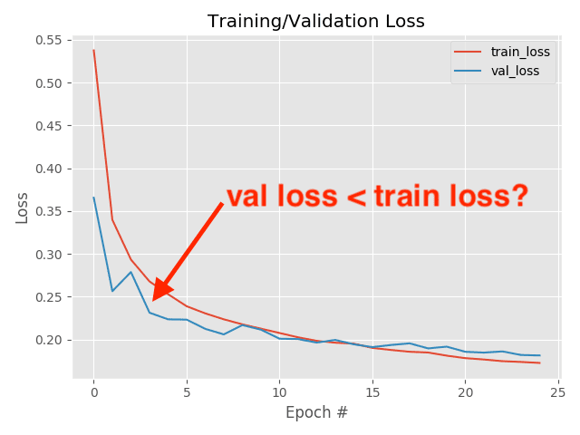

## Table of Contents

## What is validation loss in machine learning?

Validation loss in machine learning is a measure of how well your model is performing on a set of data that it hasn't seen during training. This data is called the validation set. The validation loss helps you understand if your model is overfitting, which means it's doing really well on the training data but not so well on new data. By keeping an eye on the validation loss, you can adjust your model to make it better at predicting outcomes for data it hasn't seen before.

Think of validation loss like a test score. When you study for a test, you might do well on practice questions (training data), but the real test of your knowledge comes when you take the actual exam (validation data). If your validation loss is low, it's like getting a good score on the exam, showing that your model is learning in a way that's useful for new situations. If the validation loss starts to go up while your training loss goes down, it's a sign that your model might be memorizing the training data instead of learning general patterns, and you might need to make some changes to your approach.

## Why is validation loss important in training machine learning models?

Validation loss is really important when you're training a machine learning model because it helps you check if your model is learning the right way. Imagine you're teaching a kid to recognize different animals. You show them pictures of cats and dogs, and they get really good at identifying the ones you've shown them. But if you show them a new picture of a cat or dog they haven't seen before, and they can't tell what it is, that's a problem. The validation loss is like showing your model new pictures it hasn't seen before. If the validation loss is low, it means your model is doing well with new data, not just the data it was trained on.

If the validation loss starts to get higher while your training loss gets lower, it's a warning sign that your model might be overfitting. Overfitting is when your model is too focused on the training data and isn't learning general rules that work for new data. It's like if the kid you're teaching only recognizes cats and dogs if they look exactly like the ones in the pictures you showed them. By keeping an eye on the validation loss, you can adjust your model to make sure it's learning in a way that will work well for new data, not just the data it was trained on. This helps you create a model that's more reliable and useful in real-world situations.

## How is validation loss calculated?

Validation loss is calculated by using a loss function to measure how far off your model's predictions are from the actual values in the validation dataset. A common loss function for regression problems is the mean squared error (MSE), which you can calculate with the formula $$ \text{MSE} = \frac{1}{n} \sum_{i=1}^{n} (y_i - \hat{y}_i)^2 $$. Here, $y_i$ is the true value, $\hat{y}_i$ is the predicted value, and $n$ is the number of samples in your validation set. For classification problems, you might use cross-entropy loss instead, but the idea is the same: you're measuring the difference between what your model predicts and what's actually true.

To calculate the validation loss, you first run your model on the validation data to get predictions. Then, you plug these predictions into your chosen loss function along with the true values from the validation set. The result is your validation loss, which tells you how well your model is doing on data it hasn't seen during training. If you're using a programming language like Python, you might use a library like TensorFlow or PyTorch to help with these calculations. For example, in PyTorch, you could do something like this:

```python
import torch
import torch.nn as nn

# Assume 'model' is your trained model, 'validation_data' is your validation set,
# and 'criterion' is your loss function (e.g., nn.MSELoss() for regression)

model.eval()  # Set the model to evaluation mode
with torch.no_grad():  # No need to track gradients for validation
    outputs = model(validation_data)
    loss = criterion(outputs, true_values)  # 'true_values' are the actual values

validation_loss = loss.item()  # Convert the loss to a Python number
print(f"Validation Loss: {validation_loss}")
```

This code snippet shows how you might calculate the validation loss in a practical setting, helping you understand how well your model generalizes to new data.

## What is the difference between training loss and validation loss?

Training loss and validation loss are two important measures that help you understand how well your [machine learning](/wiki/machine-learning) model is doing. Training loss is the error your model makes on the data it's learning from. When you're training your model, it sees the training data over and over, and it tries to get better at predicting the right answers for that data. The training loss tells you how far off your model's predictions are from the actual values in the training set. If your training loss is going down, it means your model is getting better at understanding the training data.

Validation loss, on the other hand, is the error your model makes on a different set of data it hasn't seen during training. This set is called the validation set. The validation loss helps you figure out if your model is learning in a way that's useful for new data, not just the data it was trained on. If your validation loss is low, it's a good sign that your model is doing well at predicting outcomes for new situations. If the validation loss starts to go up while your training loss keeps going down, it might mean your model is overfitting, which means it's memorizing the training data instead of learning general patterns that work for new data.

To calculate both training loss and validation loss, you use a loss function like mean squared error (MSE) for regression problems, which you can calculate with the formula $$ \text{MSE} = \frac{1}{n} \sum_{i=1}^{n} (y_i - \hat{y}_i)^2 $$. Here, $y_i$ is the true value, $\hat{y}_i$ is the predicted value, and $n$ is the number of samples in your set. In practice, you might use a programming language like Python and a library like PyTorch to help with these calculations. For example, to calculate validation loss, you could use code like this:

```python
import torch
import torch.nn as nn

# Assume 'model' is your trained model, 'validation_data' is your validation set,
# and 'criterion' is your loss function (e.g., nn.MSELoss() for regression)

model.eval()  # Set the model to evaluation mode
with torch.no_grad():  # No need to track gradients for validation
    outputs = model(validation_data)
    loss = criterion(outputs, true_values)  # 'true_values' are the actual values

validation_loss = loss.item()  # Convert the loss to a Python number
print(f"Validation Loss: {validation_loss}")
```

This code snippet shows how you might calculate the validation loss in a practical setting, and a similar approach would be used for calculating the training loss on the training data.

## How does overfitting affect validation loss?

Overfitting happens when your model gets too good at the training data but doesn't do well on new data. Imagine you're trying to teach a kid to recognize animals. If you show them pictures of cats and dogs, and they memorize every detail of those exact pictures, they might not recognize a new cat or dog that looks a bit different. This is what overfitting is like for your model. When your model overfits, it's like it's learning the training data too well, including any random errors or noise, instead of learning the general patterns that would help it with new data.

When your model overfits, the validation loss usually goes up. This is because the model is not good at predicting outcomes for the new data in the validation set. The training loss might keep going down because the model is getting better and better at the training data, but if the validation loss starts to increase, it's a sign that your model is overfitting. You can see this by comparing the training loss and validation loss over time. If the validation loss is much higher than the training loss, it's time to make some changes to your model, like using less data for training or making the model simpler, to help it learn in a way that works for new data too.

## What are common techniques to reduce validation loss?

To reduce validation loss, one common technique is to use more data for training. The more examples your model sees, the better it can learn general patterns instead of just memorizing the training data. Another approach is to use regularization, which adds a penalty to the model's complexity. This can help prevent overfitting by making the model simpler. For example, you might use L2 regularization, which adds a term to the loss function that's proportional to the square of the model's weights: $$ \text{Loss} = \text{Original Loss} + \lambda \sum_{i} w_i^2 $$. Here, $\lambda$ is a hyperparameter that controls how much to penalize the weights, and $w_i$ are the weights of the model.

Another technique is to adjust the model's architecture. Sometimes, a simpler model can perform better on new data because it's less likely to overfit. You can also use techniques like dropout, which randomly turns off some neurons during training to prevent the model from relying too much on any single part of the network. In practice, you might implement dropout like this in Python using PyTorch:

```python
import torch
import torch.nn as nn

class MyModel(nn.Module):
    def __init__(self):
        super(MyModel, self).__init__()
        self.fc1 = nn.Linear(10, 20)  # input layer (10) -> hidden layer (20)
        self.dropout = nn.Dropout(0.2)  # dropout layer with probability of 0.2
        self.fc2 = nn.Linear(20, 1)  # hidden layer (20) -> output layer (1)

    def forward(self, x):
        x = torch.relu(self.fc1(x))  # activation function for hidden layer
        x = self.dropout(x)  # apply dropout
        x = self.fc2(x)
        return x
```

Finally, you can use cross-validation to get a better estimate of how well your model will perform on new data. Cross-validation involves splitting your data into different parts and training the model multiple times, each time using a different part as the validation set. This helps you see if your model's performance is consistent across different subsets of the data, which can give you more confidence that it will work well on new data too.

## How can you use validation loss to prevent overfitting?

You can use validation loss to prevent overfitting by keeping an eye on it during training. If you see the validation loss start to go up while the training loss keeps going down, it's a sign that your model might be overfitting. Overfitting happens when your model is too focused on the training data and isn't learning general patterns that work for new data. By watching the validation loss, you can catch overfitting early and make changes to your model to help it learn better.

One common way to use validation loss to prevent overfitting is to use a technique called early stopping. With early stopping, you stop training your model when the validation loss stops improving. This helps prevent the model from overfitting because it stops learning before it gets too good at the training data. For example, in Python using PyTorch, you could implement early stopping like this:

```python
import torch
import torch.nn as nn

# Assume 'model' is your model, 'optimizer' is your optimizer, 'criterion' is your loss function,
# 'train_loader' is your training data loader, and 'validation_loader' is your validation data loader

best_validation_loss = float('inf')
patience = 5  # Number of epochs to wait before stopping
counter = 0

for epoch in range(num_epochs):
    model.train()
    for batch in train_loader:
        # Training step...

    model.eval()
    validation_loss = 0
    with torch.no_grad():
        for batch in validation_loader:
            # Validation step...
            validation_loss += loss.item()

    validation_loss /= len(validation_loader)
    if validation_loss < best_validation_loss:
        best_validation_loss = validation_loss
        counter = 0
        # Save the model
    else:
        counter += 1
        if counter >= patience:
            print(f"Early stopping at epoch {epoch}")
            break
```

By using early stopping based on validation loss, you can train your model to perform well on new data without overfitting to the training data.

## What role does the validation set play in evaluating model performance?

The validation set is like a practice test for your machine learning model. When you're training your model, it's learning from the training data, but you want to know how well it will do on new data it hasn't seen before. That's where the validation set comes in. It's a separate set of data that you use to check your model's performance during training. By looking at how well your model does on the validation set, you can see if it's learning the right things or if it's just memorizing the training data. If your model does well on the validation set, it's a good sign that it will work well on new data too.

One way to use the validation set is to calculate the validation loss. The validation loss is a measure of how far off your model's predictions are from the actual values in the validation set. You can use a loss function like mean squared error (MSE) to calculate it: $$ \text{MSE} = \frac{1}{n} \sum_{i=1}^{n} (y_i - \hat{y}_i)^2 $$. Here, $y_i$ is the true value, $\hat{y}_i$ is the predicted value, and $n$ is the number of samples in your validation set. If the validation loss is low, it means your model is doing a good job at predicting outcomes for new data. By keeping an eye on the validation loss, you can make changes to your model to help it learn better and perform well on new data.

## How do you interpret changes in validation loss during training?

When you're training a machine learning model, watching the validation loss is like checking your progress on a practice test. If the validation loss is going down, it's a good sign that your model is getting better at understanding new data it hasn't seen before. This means your model is learning the right patterns and not just memorizing the training data. For example, if you're using a loss function like mean squared error (MSE), a lower validation loss means your predictions are getting closer to the actual values: $$ \text{MSE} = \frac{1}{n} \sum_{i=1}^{n} (y_i - \hat{y}_i)^2 $$. Here, $y_i$ is the true value, $\hat{y}_i$ is the predicted value, and $n$ is the number of samples in your validation set.

However, if the validation loss starts to go up while your training loss keeps going down, it might mean your model is overfitting. Overfitting happens when your model gets too good at the training data but doesn't do well on new data. It's like if you studied so hard for a test that you memorized every detail of the practice questions but couldn't answer new questions on the real test. When you see the validation loss going up, it's a warning sign that you might need to make some changes to your model, like using less data for training or making the model simpler, to help it learn in a way that works for new data too.

## What are the implications of a validation loss that is consistently higher than training loss?

If your validation loss is consistently higher than your training loss, it's a sign that your model might be overfitting. Overfitting happens when your model gets too good at the training data but doesn't do well on new data. Imagine you're learning to recognize animals from pictures. If you memorize every detail of the pictures you've seen but can't recognize a new picture of the same animal, that's overfitting. In machine learning, if your model is overfitting, it's learning the noise and errors in the training data instead of the general patterns that would help it with new data.

To fix this, you can try different things to make your model learn better. One way is to use more data for training, so your model sees more examples and learns the general patterns instead of just memorizing the training data. Another way is to make your model simpler by using regularization, which adds a penalty to the model's complexity. For example, you might use L2 regularization, which adds a term to the loss function that's proportional to the square of the model's weights: $$ \text{Loss} = \text{Original Loss} + \lambda \sum_{i} w_i^2 $$. Here, $\lambda$ is a hyperparameter that controls how much to penalize the weights, and $w_i$ are the weights of the model. By making these changes, you can help your model perform better on new data and reduce the gap between your training and validation losses.

## How can cross-validation be used to improve the reliability of validation loss?

Cross-validation is like giving your model lots of practice tests to make sure it's learning the right things. Instead of using just one validation set, you split your data into different parts and train your model many times, each time using a different part as the validation set. This way, you can see if your model's performance is consistent across different subsets of the data. If your model does well on all these different validation sets, you can be more confident that it will work well on new data too.

One common way to do cross-validation is called k-fold cross-validation. Imagine you split your data into k parts. You train your model k times, each time using a different part as the validation set and the rest as the training data. After all these trainings, you average the validation losses from each fold to get a more reliable estimate of how well your model will perform on new data. For example, if you're using mean squared error (MSE) as your loss function, you might calculate the average validation loss like this: $$ \text{Average Validation Loss} = \frac{1}{k} \sum_{i=1}^{k} \text{Validation Loss}_i $$. By using cross-validation, you can make sure your model isn't just doing well on one specific set of data but is learning in a way that works for different sets of data too.

## What advanced methods exist for optimizing validation loss in deep learning models?

In [deep learning](/wiki/deep-learning), one advanced method to optimize validation loss is to use learning rate scheduling. This means you change the learning rate, which is how big of a step your model takes when it's learning, during training. You might start with a big learning rate to help your model learn quickly, but then make it smaller as training goes on. This can help your model find the best solution without jumping around too much. A common way to do this is called "learning rate decay," where the learning rate gets smaller over time. You can also use techniques like "learning rate warmup," where you start with a small learning rate and slowly increase it before starting to decrease it again. By adjusting the learning rate in these ways, you can help your model learn better and get a lower validation loss.

Another advanced method is to use advanced regularization techniques. Regularization helps prevent your model from overfitting by making it simpler. One technique is called "dropout," which randomly turns off some neurons during training to stop your model from relying too much on any single part of the network. You can implement dropout in PyTorch like this:

```python
import torch
import torch.nn as nn

class MyModel(nn.Module):
    def __init__(self):
        super(MyModel, self).__init__()
        self.fc1 = nn.Linear(10, 20)  # input layer (10) -> hidden layer (20)
        self.dropout = nn.Dropout(0.2)  # dropout layer with probability of 0.2
        self.fc2 = nn.Linear(20, 1)  # hidden layer (20) -> output layer (1)

    def forward(self, x):
        x = torch.relu(self.fc1(x))  # activation function for hidden layer
        x = self.dropout(x)  # apply dropout
        x = self.fc2(x)
        return x
```

Another regularization technique is "batch normalization," which normalizes the inputs to each layer to help the model learn more smoothly. These techniques can help your model perform better on new data and reduce the validation loss. By using these advanced methods, you can make your deep learning model more reliable and effective.

## References & Further Reading

[1]: Goodfellow, I., Bengio, Y., & Courville, A. (2016). ["Deep Learning"](https://link.springer.com/article/10.1007/s10710-017-9314-z). MIT Press.

[2]: Srivastava, N., Hinton, G., Krizhevsky, A., Sutskever, I., & Salakhutdinov, R. (2014). ["Dropout: A Simple Way to Prevent Neural Networks from Overfitting."](https://dl.acm.org/doi/abs/10.5555/2627435.2670313) Journal of Machine Learning Research, 15(56), 1929-1958.

[3]: Bengio, Y. (2012). ["Practical recommendations for gradient-based training of deep architectures."](https://arxiv.org/abs/1206.5533) arXiv preprint arXiv:1206.5533.

[4]: Chollet, F. (2017). ["Deep Learning with Python."](https://www.amazon.com/Deep-Learning-Python-Francois-Chollet/dp/1617294438) Manning Publications.

[5]: Murphy, K. P. (2012). ["Machine Learning: A Probabilistic Perspective."](https://www.cs.ubc.ca/~murphyk/MLbook/pml-toc-1may12.pdf) MIT Press.