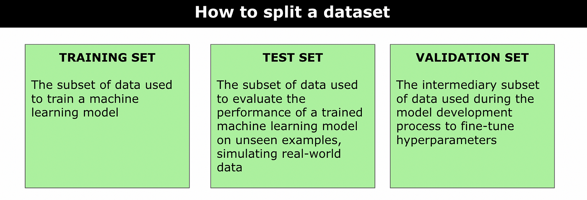

## Table of Contents

## What is a validation set in machine learning?

A validation set in machine learning is a part of the data that is used to check how well a model is doing while it's being built. It's different from the training set, which is used to teach the model, and the test set, which is used to see how the model performs after it's finished. The validation set helps to make sure the model isn't just memorizing the training data but can also work well with new data it hasn't seen before.

Using a validation set is important because it helps to fine-tune the model. For example, if you're trying different settings or parameters, you can use the validation set to see which ones work best. This way, you can make your model better without using the test set, which should only be used at the very end to get a final, unbiased measure of how well the model works.

## Why is a validation set important in the model training process?

A validation set is important in the model training process because it helps to check how well the model is doing while it's being built. It's like a practice test that the model takes to see if it's learning the right things. By using a validation set, you can make sure the model isn't just memorizing the training data but can also handle new data it hasn't seen before. This is important because if a model only memorizes the training data, it won't be useful in real situations where it needs to work with new data.

The validation set also helps to fine-tune the model. When you're trying different settings or parameters, you can use the validation set to see which ones work best. This way, you can improve your model without using the test set, which should only be used at the very end to get a final, unbiased measure of how well the model works. By using the validation set to guide the training process, you can make your model more accurate and reliable before you test it on the test set.

## How does a validation set differ from a training set and a test set?

A validation set is a part of the data that is used to check how well a model is doing while it's being built. It's different from the training set, which is used to teach the model. The training set is where the model learns patterns and relationships in the data. The validation set, on the other hand, helps to make sure the model isn't just memorizing the training data but can also work well with new data it hasn't seen before. By using the validation set, you can fine-tune the model's settings or parameters to improve its performance.

The test set is another part of the data that is used to see how the model performs after it's finished being built and fine-tuned. Unlike the validation set, which is used during the training process, the test set is only used at the very end to get a final, unbiased measure of how well the model works. The test set is important because it gives you an idea of how the model will perform in real-world situations with new data. By keeping the test set separate from the training and validation sets, you can make sure your final evaluation of the model is fair and accurate.

## What is the typical size of a validation set?

The size of a validation set can vary, but a common rule of thumb is to use about 20% to 30% of the total data for the validation set. This means if you have 1000 pieces of data, you might use 200 to 300 of them for the validation set. The rest would be split between the training set and the test set. The exact size can depend on how much data you have and what you're trying to do with your model.

Having a good-sized validation set is important because it needs to be big enough to give you a reliable idea of how well your model is doing. If it's too small, you might not get a good picture of the model's performance. On the other hand, if it's too big, you might not have enough data left for the training set, which could make your model less accurate. Finding the right balance is key to making sure your model works well.

## How do you split a dataset into training, validation, and test sets?

To split a dataset into training, validation, and test sets, you first need to decide on the proportions of your data that will go into each set. A common approach is to use about 60% to 70% of the data for the training set, 20% to 30% for the validation set, and the remaining 10% to 20% for the test set. For example, if you have 1000 pieces of data, you might use 600 for training, 300 for validation, and 100 for testing. The exact split can depend on how much data you have and what you're trying to do with your model.

Once you've decided on the proportions, you can use a random sampling method to split the data. This means you'll randomly pick pieces of data to go into each set, making sure the proportions stay the same. It's important to keep the data in each set as similar as possible to the whole dataset, so the model learns well and is tested fairly. You can use programming tools like Python's `sklearn` library to help you split the data easily and accurately. For example, you might use the `train_test_split` function twice to create your training, validation, and test sets.

## What are the common techniques for using a validation set to improve model performance?

One common technique for using a validation set to improve model performance is called hyperparameter tuning. This means you try different settings or parameters for your model, like the learning rate or the number of layers in a [neural network](/wiki/neural-network), and see which ones work best on the validation set. By changing these settings and checking the results on the validation set, you can find the best combination that makes your model perform better. This helps make sure your model isn't just good at learning the training data but can also work well with new data it hasn't seen before.

Another technique is called cross-validation. This is a way to use your data more efficiently and get a better idea of how well your model is doing. Instead of just splitting your data once into training and validation sets, you split it into several parts and use each part as a validation set one at a time. This way, you can see how your model performs on different parts of the data, which can give you a more reliable picture of its overall performance. Cross-validation helps you make sure your model is stable and works well across different sets of data.

Early stopping is also a useful technique. As you train your model, you keep checking its performance on the validation set. If you see that the performance starts to get worse, you stop the training early. This prevents the model from overfitting, which is when it becomes too focused on the training data and doesn't work well with new data. By stopping the training at the right time, you can make sure your model keeps its ability to generalize and perform well on new data.

## Can you explain how cross-validation relates to the use of a validation set?

Cross-validation is a way to use your data more effectively and get a better idea of how well your model is doing. Instead of just using one validation set, cross-validation splits your data into several parts. You then use each part as a validation set one at a time while the rest of the data is used for training. This means you can see how your model performs on different parts of the data, which can give you a more reliable picture of its overall performance. Cross-validation helps you make sure your model is stable and works well across different sets of data.

A common type of cross-validation is k-fold cross-validation. In k-fold cross-validation, you divide your data into k equal parts, or "folds". You then train your model k times, each time using a different fold as the validation set and the other k-1 folds as the training set. For example, if you use 5-fold cross-validation, you would train your model five times, each time using a different fifth of the data as the validation set. This way, every piece of data gets a chance to be in the validation set, which can help you get a more accurate idea of how well your model will work with new data.

Cross-validation can be especially useful when you don't have a lot of data. By using your data more efficiently, you can get a better idea of how well your model is doing without needing a separate validation set. This can help you fine-tune your model's settings or parameters to improve its performance. By using cross-validation, you can make sure your model isn't just good at learning the training data but can also work well with new data it hasn't seen before.

## What are the potential pitfalls of overfitting to the validation set?

Overfitting to the validation set can be a big problem when you're building a model. It happens when you keep using the same validation set to check and change your model's settings too many times. This can make your model learn the specific details of the validation set instead of learning general patterns that work well with new data. When this happens, your model might seem to do great on the validation set, but it won't work as well when you use it on new data. This is because the model has become too focused on the validation set and can't handle new data well.

To avoid overfitting to the validation set, you can use techniques like cross-validation. Cross-validation splits your data into several parts and uses each part as a validation set one at a time. This way, you get a better idea of how well your model will work with different parts of the data, not just one specific set. By using cross-validation, you can make sure your model is learning general patterns and not just memorizing the details of one validation set. This helps your model perform better when you use it on new data that it hasn't seen before.

## How can you use a validation set to tune hyperparameters?

Using a validation set to tune hyperparameters means you try different settings for your model and see which ones make it work best on the validation set. Hyperparameters are things like the learning rate or the number of layers in a neural network. You change these settings and then check how well your model does on the validation set. By doing this, you can find the best hyperparameters that help your model learn well without just memorizing the training data. This way, your model can work better with new data it hasn't seen before.

One way to do this is by using a method called grid search. With grid search, you pick a few different values for each hyperparameter you want to tune. Then, you try every possible combination of these values and see which one gives the best results on the validation set. For example, if you're tuning the learning rate and the number of layers, you might try different learning rates like 0.01, 0.1, and 0.5, and different numbers of layers like 2, 3, and 4. You would then train your model with each combination and check its performance on the validation set. The combination that works best on the validation set is the one you choose for your model.

## What metrics should be monitored on the validation set?

When you use a validation set to check how well your model is doing, you need to look at certain numbers, or metrics, to see if it's working right. Some important metrics to watch are accuracy, which tells you how often your model gets the right answer, and loss, which shows how wrong your model's guesses are. For example, if your model is trying to guess if an email is spam or not, accuracy would tell you how often it correctly labels emails as spam or not spam. Loss would tell you how far off the model's guesses are from the real answers. You want to see the loss go down and the accuracy go up as you keep training your model.

Other metrics you might want to keep an eye on are precision, recall, and F1 score. Precision tells you how many of the things your model said were true actually were true. Recall tells you how many of the true things your model found. The F1 score is a way to combine precision and recall into one number that shows how well your model is doing overall. For example, if your model is trying to find sick people in a group, precision would tell you how many of the people it said were sick really were sick, and recall would tell you how many of the sick people it found. The F1 score would give you a good idea of how well your model is doing at finding sick people without making too many mistakes. By watching these metrics on the validation set, you can make sure your model is getting better and not just learning the training data by heart.

## How does the choice of validation set affect model generalization?

The choice of validation set can have a big impact on how well your model works with new data, which is called generalization. If the validation set is too similar to the training set, your model might learn to do really well on the validation set but not work as well on new data. This happens because the model might be learning the specific details of the validation set instead of learning general patterns that work for all kinds of data. So, it's important to make sure the validation set is different enough from the training set to test the model's ability to handle new data.

One way to make sure your validation set helps with generalization is to use a technique called cross-validation. With cross-validation, you split your data into several parts and use each part as a validation set one at a time. This way, you can see how your model does on different parts of the data, not just one specific set. By doing this, you can get a better idea of how well your model will work with new data it hasn't seen before. Cross-validation helps make sure your model is learning general patterns and not just memorizing the details of one validation set, which can lead to better generalization.

## What advanced strategies exist for using multiple validation sets?

One advanced strategy for using multiple validation sets is called nested cross-validation. In nested cross-validation, you use two levels of cross-validation at the same time. The outer level splits your data into training and test sets, and the inner level splits the training set into smaller training and validation sets. You use the inner level to tune your model's hyperparameters, and then you use the outer level to see how well your model works on new data. This way, you can make sure your model is good at learning from the data and also good at working with new data it hasn't seen before.

Another strategy is to use multiple validation sets from different sources. This can help your model learn to work well with different kinds of data. For example, if you're building a model to recognize pictures, you might use one validation set from a camera and another from a phone. By testing your model on these different validation sets, you can make sure it can handle different types of pictures. This helps your model be more flexible and work better in real situations where it needs to handle all kinds of data.

## References & Further Reading

[1]: Kohavi, R. (1995). ["A Study of Cross-Validation and Bootstrap for Accuracy Estimation and Model Selection."](https://dl.acm.org/doi/10.5555/1643031.1643047) In Proceedings of the 14th International Joint Conference on Artificial Intelligence (IJCAI).

[2]: Goodfellow, I., Bengio, Y., & Courville, A. (2016). ["Deep Learning"](https://www.deeplearningbook.org/). MIT Press.

[3]: Bergstra, J., & Bengio, Y. (2012). ["Random Search for Hyper-Parameter Optimization."](https://dl.acm.org/doi/10.5555/2188385.2188395) Journal of Machine Learning Research, 13.

[4]: Géron, A. (2019). ["Hands-On Machine Learning with Scikit-Learn, Keras, and TensorFlow: Concepts, Tools, and Techniques to Build Intelligent Systems."](https://www.academia.edu/43840124/Hands_On_Machine_Learning_with_Scikit_Learn_Keras_and_TensorFlow_SECOND_EDITION_Concepts_Tools_and_Techniques_to_Build_Intelligent_Systems) O'Reilly Media.

[5]: Varma, S., & Simon, R. (2006). ["Bias in Error Estimation When Using Cross-Validation for Model Selection."](https://pubmed.ncbi.nlm.nih.gov/16504092/) BMC Bioinformatics, 7.