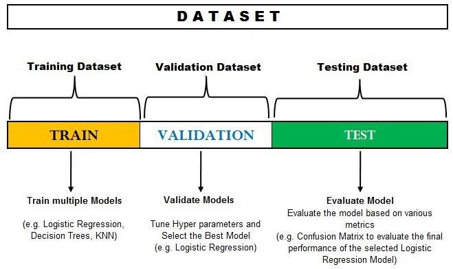

## Table of Contents

## What is validation in machine learning?

Validation in machine learning is a crucial step where we check how well our model works on new, unseen data. This is important because we want our model to be good not just on the data it was trained on, but also on new data it hasn't seen before. To do this, we split our data into two parts: one part for training the model, and another part for testing it. The training data is used to teach the model, while the validation data helps us see if the model can make good predictions on data it hasn't been trained on.

There are different ways to do validation, but one common method is called cross-validation. In cross-validation, we split our data into several smaller parts, or folds. We then train our model on all but one of these folds and test it on the remaining fold. We repeat this process multiple times, each time using a different fold for testing. This helps us get a better idea of how well our model will perform on new data. By using cross-validation, we can make sure our model is robust and reliable, which is essential for making good predictions in real-world situations.

## Why is validation important in machine learning models?

Validation is important in machine learning because it helps us check if our model can make good guesses on new data it hasn't seen before. When we train a model, we use a lot of data to teach it how to predict things. But if we only test it on the same data, we might think it's doing better than it really is. Validation lets us use a different set of data to see how well the model really works. This way, we can be sure our model isn't just memorizing the training data but can actually make useful predictions in the real world.

Using validation helps us avoid a big problem called overfitting. Overfitting happens when a model learns the training data too well, including any mistakes or random patterns in it, and then does poorly on new data. By using validation, we can catch this problem early. For example, if our model does great on the training data but poorly on the validation data, it's a sign that it might be overfitting. This helps us adjust our model to make it better at handling new, unseen data, which is what really matters in practical applications.

## What are the different types of validation methods used in machine learning?

In [machine learning](/wiki/machine-learning), there are several ways to validate a model, and each method helps us check how well our model works on new data. One common method is called holdout validation. In holdout validation, we split our data into two parts: one part for training the model and another part for testing it. We use the training data to teach the model, and then we use the test data to see how well it predicts. This helps us understand if our model can make good guesses on data it hasn't seen before.

Another popular method is k-fold cross-validation. In k-fold cross-validation, we divide our data into k smaller parts, or folds. We then train our model on k-1 of these folds and test it on the remaining fold. We repeat this process k times, each time using a different fold for testing. This way, we get a better idea of how well our model works because it gets tested on all parts of the data. For example, if we use 5-fold cross-validation, we would train on 4 folds and test on the 5th fold, then train on a different 4 folds and test on another fold, and so on.

There's also a method called leave-one-out cross-validation (LOOCV), which is a special case of k-fold cross-validation where k equals the number of data points. In LOOCV, we train our model on all the data except for one point, and then we test it on that one point. We do this for every single data point in our dataset. While this method can be very accurate, it can also take a long time if we have a lot of data. Each of these validation methods helps us make sure our model is good at making predictions on new data, which is really important for using machine learning in the real world.

## How does cross-validation work and why is it used?

Cross-validation is a way to check how well a machine learning model works on new data. It works by splitting the data into smaller parts, called folds. For example, if we use 5-fold cross-validation, we divide our data into 5 parts. We then train our model on 4 of these parts and test it on the 5th part. We do this 5 times, each time using a different part for testing. This way, every piece of data gets a chance to be in the test set, which helps us get a good idea of how well our model works on new data.

Cross-validation is used because it helps us avoid a problem called overfitting. Overfitting happens when a model learns the training data too well, including any mistakes or random patterns, and then does poorly on new data. By using cross-validation, we can see if our model is overfitting because if it does well on the training data but poorly on the validation data, it's a sign that it might be overfitting. This helps us make our model better at handling new, unseen data, which is what really matters in real-world situations.

## What is the difference between training, validation, and test datasets?

In machine learning, we use three types of datasets: training, validation, and test. The training dataset is used to teach the model. We show the model lots of examples from the training data, and it learns to make predictions based on these examples. The goal is for the model to find patterns in the data so it can make good guesses later.

The validation dataset is used to check how well the model is doing while we're still working on it. We don't use the validation data to train the model, but we use it to see if the model is learning the right things. If the model does well on the training data but poorly on the validation data, it might be overfitting, which means it's learning the training data too well and won't work well on new data.

The test dataset is used after we've finished working on the model. We use it to see how well the model works on completely new data that it hasn't seen before. This helps us understand how the model will perform in the real world. By using these three types of datasets, we can make sure our model is good at making predictions on new data, which is what really matters.

## How can overfitting be detected using validation techniques?

Overfitting happens when a model learns the training data too well, including any mistakes or random patterns in it. This makes the model do really well on the training data but poorly on new data it hasn't seen before. We can detect overfitting by using validation techniques like cross-validation. In cross-validation, we split our data into smaller parts, or folds. We train the model on most of the data and test it on the rest. If the model does much better on the training data than on the validation data, it's a sign that it might be overfitting.

For example, let's say we use 5-fold cross-validation. We divide our data into 5 parts and train the model on 4 parts, then test it on the 5th part. We do this 5 times, each time using a different part for testing. If the model's performance on the training data is a lot better than its performance on the validation data, it means the model might be overfitting. This helps us adjust the model to make it better at handling new, unseen data, which is what really matters in the real world.

## What are the common metrics used for validation in classification problems?

In classification problems, we use different ways to check how well our model is doing. One common way is accuracy, which tells us the percentage of correct guesses out of all guesses. If our model gets 90 out of 100 guesses right, its accuracy is 90%. But accuracy can be misleading if our data is not balanced, like if one type of thing we're trying to guess is much more common than others. That's why we also use other ways to check our model, like precision and recall. Precision tells us how many of the things our model said were true actually were true. Recall tells us how many of the true things our model found.

Another important way to check our model is with the F1 score. The F1 score is like a mix of precision and recall. It's good when we want to balance both precision and recall. The formula for the F1 score is $$F1 = 2 \times \frac{precision \times recall}{precision + recall}$$. We also use confusion matrices to see where our model is making mistakes. A confusion matrix shows us how many times our model guessed each type of thing right or wrong. By looking at these different ways to check our model, we can make sure it's doing a good job at guessing new things it hasn't seen before.

## What are the common metrics used for validation in regression problems?

In regression problems, we use different ways to check how well our model is doing. One common way is Mean Squared Error (MSE), which tells us how far off our model's guesses are from the real answers, on average. The formula for MSE is $$MSE = \frac{1}{n} \sum_{i=1}^{n} (y_i - \hat{y}_i)^2$$, where $y_i$ is the real answer, $\hat{y}_i$ is the model's guess, and $n$ is the number of guesses. Another way is Root Mean Squared Error (RMSE), which is just the square root of MSE. RMSE is easier to understand because it's in the same units as the thing we're trying to guess. If we're guessing house prices in dollars, RMSE will also be in dollars.

Another important way to check our model is Mean Absolute Error (MAE). MAE tells us the average size of the mistakes our model makes, but it doesn't care if the mistake is too high or too low. The formula for MAE is $$MAE = \frac{1}{n} \sum_{i=1}^{n} |y_i - \hat{y}_i|$$. MAE is useful because it's not affected as much by really big mistakes as MSE is. We also use R-squared (R²), which tells us how well our model's guesses fit the real answers. R² is a number between 0 and 1, where 1 means our model's guesses are perfect and 0 means our model is no better than just guessing the average. The formula for R² is $$R^2 = 1 - \frac{\sum_{i=1}^{n} (y_i - \hat{y}_i)^2}{\sum_{i=1}^{n} (y_i - \bar{y})^2}$$, where $\bar{y}$ is the average of the real answers. By looking at these different ways to check our model, we can make sure it's doing a good job at guessing new things it hasn't seen before.

## How does k-fold cross-validation improve model performance?

K-fold cross-validation helps make our model better by giving us a more reliable way to check how well it works on new data. When we use k-fold cross-validation, we split our data into k smaller parts, or folds. We train our model on k-1 of these folds and test it on the remaining fold. We do this k times, each time using a different fold for testing. This way, every piece of data gets a chance to be in the test set. By doing this, we get a better idea of how well our model will do on new data because it's tested on all parts of the data. If we use 5-fold cross-validation, we would train on 4 folds and test on the 5th fold, then train on a different 4 folds and test on another fold, and so on.

Using k-fold cross-validation helps us avoid a big problem called overfitting. Overfitting happens when a model learns the training data too well, including any mistakes or random patterns in it, and then does poorly on new data. By using k-fold cross-validation, we can see if our model is overfitting because if it does well on the training data but poorly on the validation data, it's a sign that it might be overfitting. This helps us adjust our model to make it better at handling new, unseen data. For example, if we find that our model's performance on the training data is a lot better than its performance on the validation data, we know we need to change something to make our model more reliable. This way, k-fold cross-validation helps us make sure our model is good at making predictions in the real world.

## What are the challenges and limitations of using validation sets?

Using validation sets can be tricky because they might not always be a good match for the real-world data our model will see. If our validation set is too small, it might not show us how well our model will really do. This can make us think our model is better or worse than it actually is. Also, if our validation set is not picked randomly or is too similar to our training set, our model might look like it's doing great but then do poorly on new data. This is called overfitting, and it happens when a model learns the training data too well, including any mistakes or random patterns in it, and then does badly on new data.

Another challenge is that using validation sets can take a lot of time and computer power. Every time we want to check our model, we need to split our data into training and validation sets, train our model on the training set, and then test it on the validation set. This process can be slow, especially if we have a lot of data or if we're using k-fold cross-validation. In k-fold cross-validation, we split our data into k smaller parts, or folds. We train our model on k-1 of these folds and test it on the remaining fold. We do this k times, each time using a different fold for testing. The formula for the average error in k-fold cross-validation is $$ \text{Average Error} = \frac{1}{k} \sum_{i=1}^{k} \text{Error}_i $$, where $\text{Error}_i$ is the error on the ith fold. This can make the whole process even slower but helps us get a better idea of how well our model will do on new data.

## How can validation be used to tune hyperparameters in machine learning models?

Validation helps us find the best settings, or hyperparameters, for our machine learning models. Hyperparameters are choices we make before training the model, like how fast it should learn or how complex it should be. To tune these hyperparameters, we use validation sets. We try different settings for the hyperparameters, train the model on the training data with these settings, and then see how well it does on the validation data. The settings that make the model do the best on the validation data are the ones we choose to use. This way, we can make sure our model works well not just on the data it was trained on, but also on new data it hasn't seen before.

One common way to do this is called grid search. In grid search, we pick a few different values for each hyperparameter and try every possible combination of these values. We then train the model with each combination and see how it does on the validation data. The combination that gives the best results is the one we use. For example, if we're tuning the learning rate and the number of layers in a [neural network](/wiki/neural-network), we might try different learning rates like 0.01, 0.1, and 1, and different numbers of layers like 1, 2, and 3. We would train the model with all nine combinations (0.01 and 1 layer, 0.01 and 2 layers, etc.) and choose the one that does best on the validation data. By using validation to tune hyperparameters, we can make our model better at making predictions in the real world.

## What advanced validation techniques are used in deep learning and how do they differ from traditional methods?

In [deep learning](/wiki/deep-learning), advanced validation techniques like stratified k-fold cross-validation and time series cross-validation are often used. Stratified k-fold cross-validation is similar to regular k-fold cross-validation, but it makes sure that each fold has the same mix of different types of data as the whole dataset. This is really helpful when we're trying to guess things that have different types, like if we're guessing whether emails are spam or not. Time series cross-validation is used when our data has a time order, like stock prices or weather data. In time series cross-validation, we make sure that the training data comes before the validation data in time, so we can see how well our model predicts future events. By using these advanced techniques, we can get a better idea of how well our model will work in the real world.

Another advanced technique used in deep learning is called early stopping. Early stopping helps us avoid overfitting by stopping the training process before the model learns the training data too well. We do this by watching how the model does on the validation data as it trains. If the model's performance on the validation data starts getting worse, even though it's still doing better on the training data, we stop training. This way, we can make sure our model is good at guessing new things it hasn't seen before. These advanced validation techniques in deep learning help us make our models better at handling different kinds of data and situations, which is important for making good predictions in the real world.

## References & Further Reading

[1]: Kohavi, R., & Longbotham, R. (2017). ["Online Controlled Experiments and A/B Tests."](https://www.researchgate.net/publication/316116834_Online_Controlled_Experiments_and_AB_Testing) Springer Handbook of Model-based Science.

[2]: Dietterich, T. G. (1998). ["Approximate Statistical Tests for Comparing Supervised Classification Learning Algorithms."](https://pubmed.ncbi.nlm.nih.gov/9744903/) Journal of Artificial Intelligence Research, 10, 189-220.

[3]: Stone, M. (1974). ["Cross-Validatory Choice and Assessment of Statistical Predictions."](https://www.jstor.org/stable/2984809) Journal of the Royal Statistical Society: Series B (Methodological), 36(2), 111-147.

[4]: Ron Kohavi. (1995). ["A Study of Cross-Validation and Bootstrap for Accuracy Estimation and Model Selection."](https://www.ijcai.org/Proceedings/95-2/Papers/016.pdf) In Proceedings of the 14th International Joint Conference on Artificial Intelligence (pp. 1137-1143).

[5]: James, G., Witten, D., Hastie, T., & Tibshirani, R. (2013). ["An Introduction to Statistical Learning: with Applications in R"](https://link.springer.com/book/10.1007/978-1-0716-1418-1). Springer.

[6]: Hastie, T., Tibshirani, R., & Friedman, J. (2009). ["The Elements of Statistical Learning: Data Mining, Inference, and Prediction."](https://link.springer.com/book/10.1007/978-0-387-84858-7) Springer.